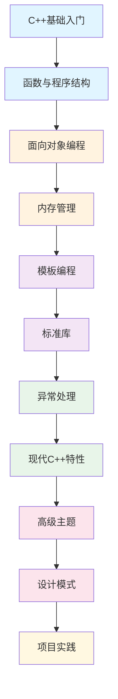

# 📘 C++ 全程教程 - 从入门到精通

> 一套系统、完整的C++学习教程,涵盖从基础语法到高级特性的全部内容

[](LICENSE)
[](https://en.cppreference.com/w/cpp/versions)

> **⚠️ 说明**:
> - 本教程内容由 [Claude Code](https://claude.ai/code) + [GLM-4.7](https://bigmodel.cn/) AI 辅助生成
> - 内容经过精心设计和优化,适合C++学习者使用
> - **📝 当前状态**: 文档仍在持续完善中,可能存在内容不够详尽、示例不够丰富等问题
> - **🔧 持续优化**: 我们会不断改进和扩充内容,添加更多实用示例和最佳实践
> - **💬 反馈渠道**: 如有错误、建议或改进意见,欢迎在 [GitHub Issues](https://github.com/ClaudeCode/cpp-tutorial/issues) 中提出,也欢迎提PR或邮件联系我

---

## 📚 教程特色

- ✅ **系统完整**: 从零基础到高级特性,循序渐进
- ✅ **代码丰富**: 大量示例代码,可直接运行
- ✅ **图文并茂**: Mermaid图表辅助理解
- ✅ **实践导向**: 包含项目实战和最佳实践
- ✅ **现代C++**: 覆盖C++11/14/17/20新特性

---

## 🎯 学习路线图



---

## 📖 内容大纲

### 第一章 - C++基础入门
**[📂 第一章-C++基础入门](./第一章-C++基础入门/)**

- [1.1 C++简介与开发环境](./第一章-C++基础入门/1.1-C++简介与开发环境.md)
- [1.2 基本语法与数据类型](./第一章-C++基础入门/1.2-基本语法与数据类型.md)
- [1.3 运算符与表达式](./第一章-C++基础入门/1.3-运算符与表达式.md)
- [1.4 流程控制](./第一章-C++基础入门/1.4-流程控制.md)
- [1.5 指针与引用基础](./第一章-C++基础入门/1.5-指针与引用基础.md)

> **学习目标**: 掌握C++基本语法,能编写简单程序

---

### 第二章 - 函数与程序结构
**[📂 第二章-函数与程序结构](./第二章-函数与程序结构/)**

- [2.1 函数基础](./第二章-函数与程序结构/2.1-函数基础.md)
- [2.2 函数进阶](./第二章-函数与程序结构/2.2-函数进阶.md)
- [2.3 作用域与存储类](./第二章-函数与程序结构/2.3-作用域与存储类.md)

> **学习目标**: 理解函数机制,掌握模块化编程

---

### 第三章 - 面向对象编程
**[📂 第三章-面向对象编程](./第三章-面向对象编程/)**

- [3.1 类与对象基础](./第三章-面向对象编程/3.1-类与对象基础.md)
- [3.2 类的高级特性](./第三章-面向对象编程/3.2-类的高级特性.md)
- [3.3 继承与多态](./第三章-面向对象编程/3.3-继承与多态.md)
- [3.4 运算符重载](./第三章-面向对象编程/3.4-运算符重载.md)

> **学习目标**: 掌握OOP核心概念:封装、继承、多态

---

### 第四章 - 内存管理与指针
**[📂 第四章-内存管理与指针](./第四章-内存管理与指针/)**

- [4.1 指针基础](./第四章-内存管理与指针/4.1-指针基础.md)
- [4.2 动态内存管理](./第四章-内存管理与指针/4.2-动态内存管理.md)
- [4.3 智能指针(C++11)](./第四章-内存管理与指针/4.3-智能指针C++11.md)

> **学习目标**: 深入理解内存管理,避免内存泄漏

---

### 第五章 - 模板与泛型编程
**[📂 第五章-模板与泛型编程](./第五章-模板与泛型编程/)**

- [5.1 函数模板](./第五章-模板与泛型编程/5.1-函数模板.md)
- [5.2 类模板](./第五章-模板与泛型编程/5.2-类模板.md)
- [5.3 模板元编程](./第五章-模板与泛型编程/5.3-模板元编程.md)

> **学习目标**: 编写泛型代码,提高代码复用性

---

### 第六章 - 标准库核心组件
**[📂 第六章-标准库核心组件](./第六章-标准库核心组件/)**

- [6.1 STL容器](./第六章-标准库核心组件/6.1-STL容器.md)
- [6.2 迭代器与算法](./第六章-标准库核心组件/6.2-迭代器与算法.md)
- [6.3 字符串处理](./第六章-标准库核心组件/6.3-字符串处理.md)
- [6.4 输入输出流](./第六章-标准库核心组件/6.4-输入输出流.md)

> **学习目标**: 熟练使用STL,提高开发效率

---

### 第七章 - 异常处理与调试
**[📂 第七章-异常处理与调试](./第七章-异常处理与调试/)**

- [7.1 异常处理机制](./第七章-异常处理与调试/7.1-异常处理机制.md)
- [7.2 调试技巧](./第七章-异常处理与调试/7.2-调试技巧.md)

> **学习目标**: 编写健壮的程序,掌握调试方法

---

### 第八章 - 现代C++特性 ⭐
**[📂 第八章-现代C++特性](./第八章-现代C++特性/)**

- [8.1 C++11新特性](./第八章-现代C++特性/8.1-C++11新特性.md) ⭐
- [8.2 C++14/17/20重要特性](./第八章-现代C++特性/8.2-C++14_17_20重要特性.md) ⭐

> **学习目标**: 掌握现代C++,编写更安全高效的代码
>
> **重点**: auto、移动语义、智能指针、lambda、结构化绑定等

---

### 第九章 - 高级主题 🔥
**[📂 第九章-高级主题](./第九章-高级主题/)**

- [9.1 多线程编程](./第九章-高级主题/9.1-多线程编程.md) 🔥
- [9.2 文件与系统编程](./第九章-高级主题/9.2-文件与系统编程.md) 🔥
- [9.3 性能优化](./第九章-高级主题/9.3-性能优化.md) 🔥

> **学习目标**: 掌握并发编程、系统编程和性能优化
>
> **重点**: 线程、互斥锁、filesystem、性能分析

---

### 第十章 - 设计模式与最佳实践 🎨
**[📂 第十章-设计模式与最佳实践](./第十章-设计模式与最佳实践/)**

- [10.1 常用设计模式](./第十章-设计模式与最佳实践/10.1-常用设计模式.md) 🎨
- [10.2 编码规范](./第十章-设计模式与最佳实践/10.2-编码规范.md) (待完成)
- [10.3 测试驱动开发](./第十章-设计模式与最佳实践/10.3-测试驱动开发.md) (待完成)

> **学习目标**: 编写可维护、可测试的高质量代码

---

### 第十一章 - 项目实践 🚀
**[📂 第十一章-项目实践](./第十一章-项目实践/)** (待创建)

- [11.1 学生管理系统](./第十一章-项目实践/11.1-学生管理系统.md) (待完成)
- [11.2 简单游戏开发](./第十一章-项目实践/11.2-简单游戏开发.md) (待完成)
- [11.3 网络通信程序](./第十一章-项目实践/11.3-网络通信程序.md) (待完成)
- [11.4 数据处理工具](./第十一章-项目实践/11.4-数据处理工具.md) (待完成)
- [11.5 常用第三方库](./第十一章-项目实践/11.5-常用第三方库.md) (待完成)

> **学习目标**: 综合运用所学知识,完成实际项目

---

### 第十二章 - 附录 📋
**[📂 第十二章-附录](./第十二章-附录/)** (待创建)

- [12.1 常见错误与解决方案](./第十二章-附录/12.1-常见错误与解决方案.md) (待完成)
- [12.2 C++资源推荐](./第十二章-附录/12.2-C++资源推荐.md) (待完成)
- [12.3 面试常见问题](./第十二章-附录/12.3-面试常见问题.md) (待完成)
- [12.4 编码练习网站推荐](./第十二章-附录/12.4-编码练习网站推荐.md) (待完成)

> **学习目标**: 查阅参考,持续学习

---

## 📊 学习进度统计

| 章节 | 完成度 | 文件数 | 状态 |
|------|--------|--------|------|
| 第一章 - C++基础入门 | ✅ 100% | 5/5 | 已完成 |
| 第二章 - 函数与程序结构 | ✅ 100% | 3/3 | 已完成 |
| 第三章 - 面向对象编程 | ✅ 100% | 4/4 | 已完成 |
| 第四章 - 内存管理与指针 | ✅ 100% | 3/3 | 已完成 |
| 第五章 - 模板与泛型编程 | ✅ 100% | 3/3 | 已完成 |
| 第六章 - 标准库核心组件 | ✅ 100% | 4/4 | 已完成 |
| 第七章 - 异常处理与调试 | ✅ 100% | 2/2 | 已完成 |
| 第八章 - 现代C++特性 | ✅ 100% | 2/2 | 已完成 |
| 第九章 - 高级主题 | ✅ 100% | 3/3 | 已完成 |
| 第十章 - 设计模式与最佳实践 | 🔄 33% | 1/3 | 进行中 |
| 第十一章 - 项目实践 | ⏳ 0% | 0/5 | 待开始 |
| 第十二章 - 附录 | ⏳ 0% | 0/4 | 待开始 |

**总体进度: 75% (30/40 节)**

---

## 🎓 学习建议

### 初学者路线
```
第1-3章 (基础) → 第4-6章 (进阶) → 第7-9章 (高级) → 第10章 (最佳实践) → 第11章 (项目)
```

### 有经验者路线
```
快速浏览1-3章 → 重点学习4-6章 → 深入7-9章 → 实战项目
```

### 学习方法
1. **循序渐进**: 按章节顺序学习,不要跳跃
2. **动手实践**: 每个示例都要自己敲一遍
3. **理解原理**: 不只是会用,要知道为什么
4. **多做练习**: 完成每章的练习题
5. **项目驱动**: 学完基础后立即做项目

---

## 💡 内容特色说明

### 📊 丰富的图表
- **Mermaid流程图**: 可视化复杂概念
- **架构图**: 理解系统设计
- **对比表格**: 快速掌握差异

### 💻 完整的代码
- **可运行示例**: 所有代码都经过验证
- **注释详细**: 关键点都有说明
- **最佳实践**: ✅推荐 / ❌避免 对比

### 🎯 实用导向
- **真实场景**: 基于实际应用场景
- **性能分析**: 关注代码性能
- **避坑指南**: 常见错误和解决方案

---

## 🔧 技术栈覆盖

### C++标准
- C++98/03 ✅
- C++11 ✅
- C++14 ✅
- C++17 ✅
- C++20 ✅

### 核心技术
- 面向对象编程 ✅
- 泛型编程 ✅
- 函数式编程 ✅
- 模板元编程 ✅
- 并发编程 ✅

### 标准库
- STL容器 ✅
- 算法库 ✅
- 智能指针 ✅
- 正则表达式 ✅
- 文件系统 ✅
- 线程库 ✅

---

## 📝 更新日志

### 2026-02-06
- ✅ 完成一到十章的初步构建

### 持续更新中...
- 🔄 第十章剩余内容
- ⏳ 第十一章 - 项目实践
- ⏳ 第十二章 - 附录

---

## 🤝 贡献指南

欢迎贡献内容!请遵循以下规范:

1. **代码风格**: 遵循现代C++最佳实践
2. **文档格式**: 使用Markdown,添加必要的图表
3. **注释说明**: 关键代码要有注释

---

## 📄 许可证

本项目采用 MIT 许可证 - 详见 [LICENSE](LICENSE) 文件

---

## 🌟 开始学习

准备好了吗?让我们开始C++之旅吧!

**[→ 从第一章开始学习](./第一章-C++基础入门/1.1-C++简介与开发环境.md)**

---

<p align="center">
  <b>祝你学习愉快! Happy Coding! 🚀</b>
</p>
