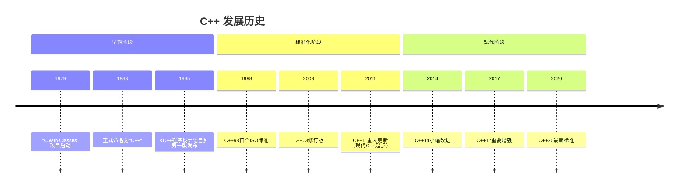
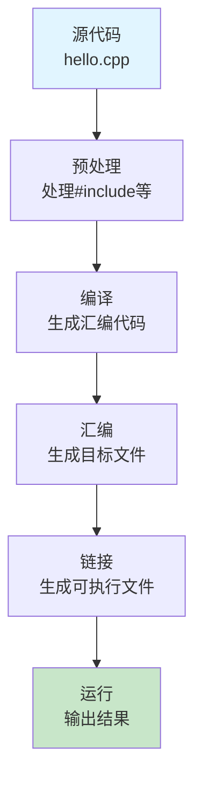
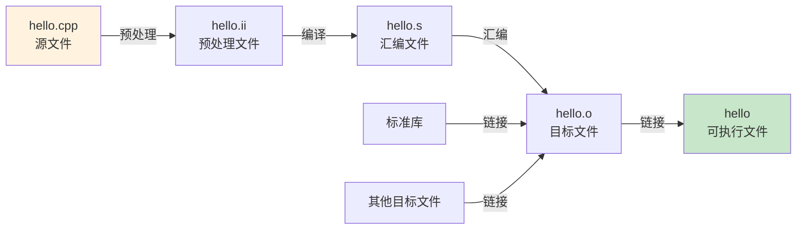

# 1.1 C++简介与开发环境

## 目录
- [C++历史与特点](#c历史与特点)
- [第一个C++程序：Hello World](#第一个c程序hello-world)
- [编译与运行过程](#编译与运行过程)

---

## C++历史与特点

### 起源与发展

C++是由丹麦计算机科学家**Bjarne Stroustrup**（本贾尼·斯特劳斯特卢普）于20世纪80年代初在贝尔实验室创建的。以下是C++发展的重要里程碑：



### 核心特点

#### 1. **面向对象编程（OOP）**
C++支持完整的面向对象特性：
- **封装**：数据和操作数据的方法封装在类中
- **继承**：通过继承实现代码复用和层次化设计
- **多态**：通过虚函数实现运行时多态

```cpp
// 封装示例
class Rectangle {
private:    // 私有成员，外部无法直接访问
    double width;
    double height;

public:     // 公有接口
    Rectangle(double w, double h) : width(w), height(h) {}

    double area() {
        return width * height;
    }
};
```

#### 2. **高性能**
- 接近C语言的执行效率
- 支持底层内存操作
- 编译型语言，无运行时开销

```cpp
// 直接操作内存的例子
int* arr = new int[1000000];  // 分配大内存
// ... 高效处理
delete[] arr;                  // 释放内存
```

#### 3. **泛型编程**
通过模板实现类型无关的代码：

```cpp
template<typename T>
T maximum(T a, T b) {
    return (a > b) ? a : b;
}

// 可以用于不同类型
int maxInt = maximum(5, 10);
double maxDouble = maximum(3.14, 2.71);
```

#### 4. **标准模板库（STL）**
提供丰富的容器、算法和迭代器：
- **容器**：`vector`, `map`, `set`等
- **算法**：`sort`, `find`, `transform`等
- **迭代器**：统一的访问接口

#### 5. **向后兼容**
几乎完全兼容C语言代码：

```cpp
// C代码可以在C++中直接编译
#include <stdio.h>

int main() {
    printf("Hello from C-style code!\n");
    return 0;
}
```

### C++ vs 其他语言

| 特性 | C++ | Java | Python | C |
|------|-----|------|--------|-----|
| 性能 | ⭐⭐⭐⭐⭐ | ⭐⭐⭐ | ⭐⭐ | ⭐⭐⭐⭐⭐ |
| 学习曲线 | 陡峭 | 中等 | 平缓 | 中等 |
| 内存管理 | 手动/智能 | 自动GC | 自动GC | 手动 |
| 适用场景 | 系统/游戏/高性能 | 企业应用 | 脚本/AI | 系统/嵌入式 |
| 编译类型 | 编译型 | 编译型+字节码 | 解释型 | 编译型 |

---

## 第一个C++程序：Hello World

### 标准Hello World程序

```cpp
#include <iostream>  // 输入输出流库

int main() {
    std::cout << "Hello, World!" << std::endl;
    return 0;
}
```

### 代码解析

#### 1. **预处理器指令**
```cpp
#include <iostream>
```
- `#include`是预处理器指令
- `<iostream>`是头文件，包含输入输出功能
- 尖括号`<>`表示系统标准库头文件

#### 2. **主函数**
```cpp
int main() {
    // 函数体
    return 0;
}
```
- `main()`是程序入口点
- `int`表示返回整数类型
- `return 0`表示程序正常退出

#### 3. **输出语句**
```cpp
std::cout << "Hello, World!" << std::endl;
```
- `std::cout`：标准输出流（控制台）
- `<<`：流插入运算符
- `std::endl`：换行并刷新缓冲区

### 程序执行流程



### Hello程序的多种写法

#### 使用using声明（简化代码）

```cpp
#include <iostream>

using namespace std;  // 使用std命名空间

int main() {
    cout << "Hello, World!" << endl;
    return 0;
}
```

#### 使用换行符'\n'

```cpp
#include <iostream>

int main() {
    std::cout << "Hello, World!\n";  // '\n'比endl更快
    return 0;
}
```

#### 多行输出

```cpp
#include <iostream>

int main() {
    std::cout << "Hello, World!\n"
              << "Welcome to C++!\n"
              << "Let's start learning!\n";
    return 0;
}
```

---

## 编译与运行过程

### 四个阶段详解

#### 1. **预处理（Preprocessing）**

处理以`#`开头的指令：

```cpp
// 源文件 hello.cpp
#include <iostream>
#define PI 3.14159

int main() {
    std::cout << PI << std::endl;
    return 0;
}
```

预处理后：
```cpp
// iostream文件的所有内容被插入
// PI被替换为3.14159

int main() {
    std::cout << 3.14159 << std::endl;
    return 0;
}
```

**查看预处理结果：**
```bash
g++ -E hello.cpp -o hello.ii
```

#### 2. **编译（Compilation）**

将预处理后的代码转换为汇编代码：

```bash
# 生成汇编代码
g++ -S hello.cpp -o hello.s
```

汇编代码示例（hello.s）：
```asm
    .file   "hello.cpp"
    .text
    .globl  main
    .type   main, @function
main:
.LFB0:
    ; ... 汇编指令
```

#### 3. **汇编（Assembly）**

将汇编代码转换为机器代码（目标文件）：

```bash
# 生成目标文件
g++ -c hello.cpp -o hello.o
```

#### 4. **链接（Linking）**

将目标文件与库文件链接生成可执行文件：

```bash
# 生成可执行文件
g++ hello.o -o hello
```

### 完整编译命令

```bash
# 一步到位（最常用）
g++ hello.cpp -o hello

# 或使用默认输出文件名
g++ hello.cpp
# 生成 a.out (Linux/Mac) 或 a.exe (Windows)

# 运行程序
./hello  # Linux/Mac
# 或
a.exe   # Windows
```

### 常用编译选项

```bash
# 基础编译
g++ hello.cpp -o hello

# 添加警告信息
g++ -Wall hello.cpp -o hello

# 调试版本（包含调试信息）
g++ -g hello.cpp -o hello

# 优化版本
g++ -O2 hello.cpp -o hello

# C++11标准
g++ -std=c++11 hello.cpp -o hello

# C++17标准
g++ -std=c++17 hello.cpp -o hello

# C++20标准
g++ -std=c++20 hello.cpp -o hello

# 包含多个源文件
g++ file1.cpp file2.cpp -o myprogram
```

### 编译流程图



### 实际示例：多文件编译

假设我们有以下文件结构：

```
project/
├── main.cpp
├── utils.cpp
└── utils.h
```

**utils.h**
```cpp
#ifndef UTILS_H
#define UTILS_H

int add(int a, int b);

#endif
```

**utils.cpp**
```cpp
#include "utils.h"

int add(int a, int b) {
    return a + b;
}
```

**main.cpp**
```cpp
#include <iostream>
#include "utils.h"

int main() {
    int result = add(5, 3);
    std::cout << "5 + 3 = " << result << std::endl;
    return 0;
}
```

**编译并运行：**
```bash
# 方法1：一次性编译
g++ main.cpp utils.cpp -o myprogram
./myprogram

# 方法2：分别编译后链接
g++ -c main.cpp -o main.o
g++ -c utils.cpp -o utils.o
g++ main.o utils.o -o myprogram
./myprogram
```

---

## 小结

本节介绍了C++的历史、特点以及基本的开发环境配置：

1. **C++特点**：
   - 面向对象、高性能、泛型编程
   - 丰富的标准库
   - 兼容C语言

2. **程序结构**：
   - 预处理器指令
   - main函数
   - 输入输出流

3. **编译过程**：
   - 预处理 → 编译 → 汇编 → 链接
   - 使用`g++`命令编译

## 练习

1. ✅ 编写一个输出你名字的程序
2. ✅ 尝试使用不同的编译选项编译程序
3. ✅ 创建一个多文件项目并编译运行

---

## 下一节
[1.2 基本语法与数据类型](./1.2-基本语法与数据类型.md) → 深入学习C++的数据类型和变量。
