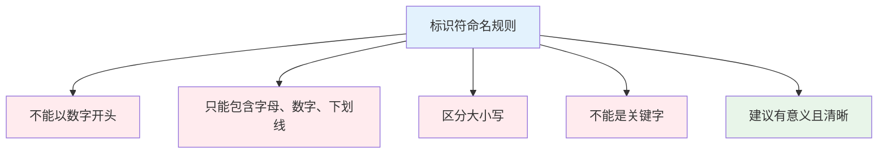
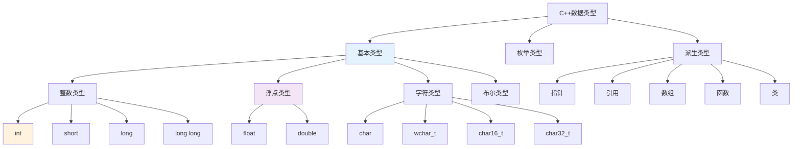

# 1.2 基本语法与数据类型

## 目录
- [标识符与关键字](#标识符与关键字)
- [基本数据类型](#基本数据类型)
- [变量与常量](#变量与常量)
- [类型修饰符与类型转换](#类型修饰符与类型转换)
- [用户自定义类型](#用户自定义类型)

---

## 标识符与关键字

### 标识符命名规则

标识符是变量、函数、类等的名称。C++中标识符必须遵循以下规则：



#### ✅ 合法标识符示例

```cpp
int age;                 // 简单变量
int student_age;         // 使用下划线
int _private_var;        // 以下划线开头
int MAX_SIZE;            // 全大写常量
int value2;              // 包含数字
class MyClass {};        // 类名（大驼峰）
void calculateSum();     // 函数名（小驼峰）
```

#### ❌ 非法标识符示例

```cpp
int 2nd_value;           // 错误：以数字开头
int my-value;            // 错误：包含连字符
int class;               // 错误：使用关键字
int void;                // 错误：使用关键字
int user name;           // 错误：包含空格
```

### 命名约定（最佳实践）

| 类型 | 约定 | 示例 |
|------|------|------|
| 变量/函数 | 小驼峰（lowerCamelCase） | `studentAge`, `calculateSum()` |
| 类/结构体 | 大驼峰（PascalCase） | `MyClass`, `StudentInfo` |
| 常量 | 全大写+下划线 | `MAX_SIZE`, `PI` |
| 私有成员 | 下划线前缀 | `_privateVar` |
| 命名空间 | 小写+下划线 | `my_namespace` |

```cpp
// 推荐的命名示例
class StudentDatabase {
private:
    int _maxStudents;           // 私有成员

public:
    static const int MAX_CONNECTIONS = 100;  // 常量

    void addStudent();          // 公有方法
};

int global_counter = 0;         // 全局变量（下划线）
```

### C++关键字（保留字）

C++有以下关键字，不能用作标识符：

```cpp
// 控制流关键字
if, else, switch, case, default, break, continue, goto, return

// 循环关键字
for, while, do

// 类型关键字
int, float, double, char, bool, void, wchar_t, auto

// 面向对象关键字
class, struct, union, enum, public, private, protected
virtual, friend, template, this, typename

// 类型修饰符
const, static, volatile, extern, register, mutable, inline

// 内存管理
new, delete, sizeof, typedef

// 异常处理
try, catch, throw, noexcept

// C++11及以后
constexpr, nullptr, decltype, override, final, decltype
```

---

## 基本数据类型

### 类型分类体系



### 整数类型

| 类型 | 字节数 | 数值范围 | 用途 |
|------|--------|----------|------|
| `short` (short int) | 2 | -32,768 ~ 32,767 | 小范围整数 |
| `int` | 4 | -2,147,483,648 ~ 2,147,483,647 | 常用整数 |
| `long` | 4或8 | 依赖平台 | 大整数 |
| `long long` | 8 | -9,223,372,036,854,775,808 ~ 9,223,372,036,854,775,807 | 超大整数 |

```cpp
#include <iostream>
#include <climits>  // 用于查看类型范围

int main() {
    short s = 100;
    int i = 100000;
    long l = 1000000;
    long long ll = 10000000000;

    std::cout << "short: " << sizeof(short) << " bytes\n";
    std::cout << "int: " << sizeof(int) << " bytes\n";
    std::cout << "long: " << sizeof(long) << " bytes\n";
    std::cout << "long long: " << sizeof(long long) << " bytes\n";

    // 查看范围
    std::cout << "int min: " << INT_MIN << "\n";
    std::cout << "int max: " << INT_MAX << "\n";

    return 0;
}
```

### 浮点类型

| 类型 | 字节数 | 精度 | 数值范围 |
|------|--------|------|----------|
| `float` | 4 | 6-7位有效数字 | ±3.4E38 |
| `double` | 8 | 15-16位有效数字 | ±1.7E308 |
| `long double` | 8/12/16 | 18-19位有效数字 | 依赖实现 |

```cpp
#include <iostream>

int main() {
    float f = 3.14159f;         // f表示float字面量
    double d = 3.141592653589793;
    long double ld = 3.14159265358979323846L;

    std::cout << "float: " << f << "\n";
    std::cout << "double: " << d << "\n";
    std::cout << "long double: " << ld << "\n";

    // 科学计数法
    double scientific = 1.23e10;  // 1.23 × 10^10
    std::cout << "科学计数法: " << scientific << "\n";

    return 0;
}
```

### 字符类型

| 类型 | 字节数 | 描述 |
|------|--------|------|
| `char` | 1 | 基本字符（ASCII） |
| `wchar_t` | 2或4 | 宽字符 |
| `char16_t` | 2 | Unicode字符（UTF-16） |
| `char32_t` | 4 | Unicode字符（UTF-32） |
| `char8_t` | 1 | UTF-8字符（C++20） |

```cpp
#include <iostream>

int main() {
    char c = 'A';                    // 单引号表示字符
    wchar_t wc = L'你';              // 宽字符
    char16_t c16 = u'\u03B1';        //希腊字母α
    char32_t c32 = U'\U0001F600';    // emoji 😀

    std::cout << "char: " << c << "\n";
    std::cout << "char as int: " << (int)c << "\n";

    return 0;
}
```

### 布尔类型

```cpp
#include <iostream>

int main() {
    bool flag1 = true;      // 真
    bool flag2 = false;     // 假

    // 布尔值输出为1或0
    std::cout << "true = " << flag1 << "\n";
    std::cout << "false = " << flag2 << "\n";

    // 布尔表达式
    int x = 5, y = 10;
    bool result = (x < y);
    std::cout << "x < y is " << result << "\n";

    return 0;
}
```

### 类型尺寸查看

```cpp
#include <iostream>

int main() {
    std::cout << "数据类型大小:\n";
    std::cout << "bool: " << sizeof(bool) << " byte\n";
    std::cout << "char: " << sizeof(char) << " byte\n";
    std::cout << "short: " << sizeof(short) << " bytes\n";
    std::cout << "int: " << sizeof(int) << " bytes\n";
    std::cout << "long: " << sizeof(long) << " bytes\n";
    std::cout << "long long: " << sizeof(long long) << " bytes\n";
    std::cout << "float: " << sizeof(float) << " bytes\n";
    std::cout << "double: " << sizeof(double) << " bytes\n";
    std::cout << "long double: " << sizeof(long double) << " bytes\n";

    return 0;
}
```

---

## 变量与常量

### 变量声明与初始化

```cpp
#include <iostream>

int main() {
    // 声明方式
    int a;                      // 声明（未初始化，包含随机值）
    int b = 10;                 // 声明并初始化
    int c(20);                  // 构造函数初始化
    int d{30};                  // C++11列表初始化（推荐）

    // 输出
    std::cout << "a = " << a << "\n";  // ⚠️ 未初始化行为
    std::cout << "b = " << b << "\n";
    std::cout << "c = " << c << "\n";
    std::cout << "d = " << d << "\n";

    return 0;
}
```

### 初始化的最佳实践

```cpp
// ✅ 推荐的初始化方式
int count{0};              // C++11列表初始化
double price{19.99};
char grade{'A'};
bool isActive{true};

// ⚠️ 避免的写法
int x;                     // 未初始化
int y = 5.9;              // 隐式转换，可能丢失精度
```

### 变量作用域

```cpp
#include <iostream>

int globalVar = 100;  // 全局变量

int main() {
    int localVar = 20;  // 局部变量

    std::cout << "全局: " << globalVar << "\n";
    std::cout << "局部: " << localVar << "\n";

    // 嵌套作用域
    {
        int blockVar = 30;  // 块作用域
        std::cout << "块内: " << blockVar << "\n";
    }

    // std::cout << blockVar;  // ❌ 错误：blockVar不可访问

    return 0;
}
```

### 常量

#### 1. 使用`const`关键字

```cpp
#include <iostream>

int main() {
    const int MAX_SIZE = 100;
    const double PI = 3.14159;
    const char NEWLINE = '\n';

    // MAX_SIZE = 200;  // ❌ 错误：不能修改常量

    std::cout << "MAX_SIZE = " << MAX_SIZE << "\n";
    std::cout << "PI = " << PI << "\n";

    return 0;
}
```

#### 2. 使用`constexpr`（C++11）

```cpp
#include <iostream>

int main() {
    constexpr int ARRAY_SIZE = 10;
    constexpr double PI = 3.14159;

    int arr[ARRAY_SIZE];  // 可用于数组大小

    // constexpr保证编译时计算
    constexpr int square = 5 * 5;

    std::cout << "square = " << square << "\n";

    return 0;
}
```

#### 3. 宏定义（不推荐）

```cpp
#define MAX_SIZE 100  // ⚠️ 宏定义，无类型检查

int main() {
    int arr[MAX_SIZE];
    return 0;
}
```

---

## 类型修饰符与类型转换

### 类型修饰符

#### `signed`和`unsigned`

```cpp
#include <iostream>

int main() {
    // 有符号整数（可正可负）
    signed int temperature = -10;

    // 无符号整数（仅正数）
    unsigned int age = 25;
    // age = -5;  // ❌ 错误：无符号类型不能为负

    unsigned int population = 7900000000U;  // U表示unsigned

    std::cout << "温度: " << temperature << "\n";
    std::cout << "年龄: " << age << "\n";

    return 0;
}
```

#### `long`和`short`

```cpp
#include <iostream>

int main() {
    short int small = 100;          // 等同于 short
    long int large = 100000;        // 等同于 long
    long long int huge = 10000000000;  // 等同于 long long

    std::cout << "small: " << small << "\n";
    std::cout << "large: " << large << "\n";
    std::cout << "huge: " << huge << "\n";

    return 0;
}
```

### 类型转换

#### 1. 隐式类型转换

```cpp
#include <iostream>

int main() {
    int i = 10;
    float f = 3.14f;

    // int转换为float
    float result1 = i + f;  // 13.14

    // float转换为int（丢失小数部分）
    int result2 = i + f;    // 13

    std::cout << "result1 = " << result1 << "\n";
    std::cout << "result2 = " << result2 << "\n";

    return 0;
}
```

#### 2. 显式类型转换（C风格）

```cpp
#include <iostream>

int main() {
    int i = 10;
    double d = 3.14;

    int result = (int)d;  // 3

    std::cout << "result = " << result << "\n";

    return 0;
}
```

#### 3. C++类型转换运算符（推荐）

```cpp
#include <iostream>

int main() {
    double d = 3.14;

    // static_cast：基本类型转换
    int i = static_cast<int>(d);
    std::cout << "i = " << i << "\n";

    // const_cast：移除const属性
    const int ci = 10;
    int& ref = const_cast<int&>(ci);

    // reinterpret_cast：底层重新解释
    int* ip = &i;
    char* cp = reinterpret_cast<char*>(ip);

    return 0;
}
```

### 类型转换示例

```cpp
#include <iostream>
#include <string>

int main() {
    // 数值转字符串
    int num = 42;
    std::string str = std::to_string(num);
    std::cout << "字符串: " << str << "\n";

    // 字符串转数值
    std::string piStr = "3.14159";
    double pi = std::stod(piStr);
    std::cout << "数值: " << pi << "\n";

    return 0;
}
```

---

## 用户自定义类型

### `typedef`别名

```cpp
#include <iostream>

// 使用typedef定义类型别名
typedef unsigned char BYTE;
typedef unsigned int WORD;

int main() {
    BYTE b = 255;
    WORD w = 65535;

    std::cout << "BYTE: " << (int)b << "\n";
    std::cout << "WORD: " << w << "\n";

    return 0;
}
```

### `using`别名（C++11，推荐）

```cpp
#include <iostream>
#include <vector>

// 使用using定义类型别名（更清晰）
using BYTE = unsigned char;
using WORD = unsigned int;
using StringVector = std::vector<std::string>;

int main() {
    BYTE b = 255;
    WORD w = 65535;
    StringVector names = {"Alice", "Bob", "Charlie"};

    std::cout << "BYTE: " << (int)b << "\n";
    std::cout << "WORD: " << w << "\n";

    for (const auto& name : names) {
        std::cout << name << " ";
    }
    std::cout << "\n";

    return 0;
}
```

### `typedef` vs `using`

| 特性 | typedef | using |
|------|---------|-------|
| 引入时间 | C语言 | C++11 |
| 可读性 | 较差 | 更清晰 |
| 模板别名 | ❌ 不支持 | ✅ 支持 |
| 推荐使用 | ⚠️ | ✅ |

```cpp
// typedef不支持模板
// typedef std::vector<int> IntVector;  // OK
// typedef std::vector<T> Vector<T>;    // ❌ 错误

// using支持模板别名
template<typename T>
using Vector = std::vector<T>;

Vector<int> intVec;  // 相当于std::vector<int>
```

---

## 小结

本节介绍了C++的基本语法和数据类型：

1. **标识符规则**：
   - 不能以数字开头
   - 区分大小写
   - 不能使用关键字
   - 遵循命名约定

2. **基本数据类型**：
   - 整数：`short`, `int`, `long`, `long long`
   - 浮点：`float`, `double`, `long double`
   - 字符：`char`, `wchar_t`
   - 布尔：`bool`

3. **变量与常量**：
   - 变量声明与初始化
   - 使用`const`和`constexpr`定义常量

4. **类型转换**：
   - 隐式转换
   - 显式转换（C风格和C++风格）

5. **类型别名**：
   - `typedef`（旧方式）
   - `using`（推荐，支持模板）

## 练习

1. ✅ 声明不同类型的变量并输出其大小
2. ✅ 创建一个程序，演示隐式和显式类型转换
3. ✅ 使用`using`定义常用的类型别名
4. ✅ 编写程序显示各种数据类型的范围

---

## 下一节
[1.3 运算符与表达式](./1.3-运算符与表达式.md) → 学习C++的运算符及其优先级。
