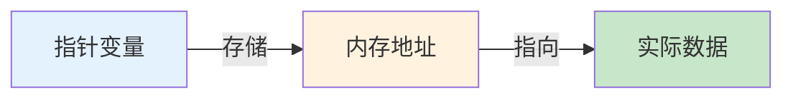
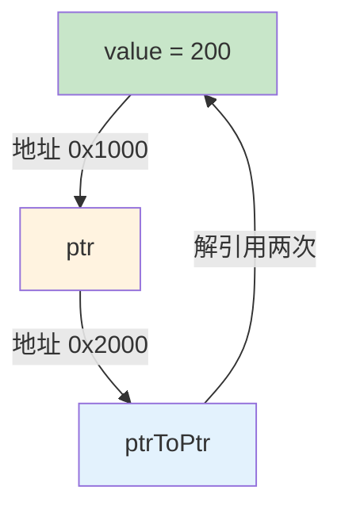
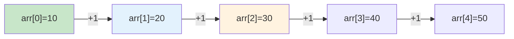
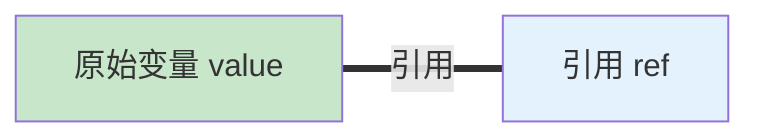

# 1.5 指针与引用基础

## 目录
- [指针的概念与声明](#指针的概念与声明)
- [指针的使用与解引用](#指针的使用与解引用)
- [指针与数组](#指针与数组)
- [指针与const](#指针与const)
- [引用的概念与声明](#引用的概念与声明)
- [引用与指针的区别](#引用与指针的区别)
- [左值引用与右值引用（C++11）](#左值引用与右值引用c11)
- [指针与引用的应用场景](#指针与引用的应用场景)

---

## 指针的概念与声明

### 什么是指针

指针是存储内存地址的变量。通过指针，我们可以直接访问和操作内存中的数据。



### 指针的声明

```cpp
#include <iostream>

int main() {
    int number = 42;       // 整数变量
    int* ptr;              // 声明整数指针
    ptr = &number;         // ptr指向number的地址

    // 或者直接初始化
    int* ptr2 = &number;

    std::cout << "number的值: " << number << "\n";
    std::cout << "number的地址: " << &number << "\n";
    std::cout << "ptr存储的地址: " << ptr << "\n";
    std::cout << "ptr指向的值: " << *ptr << "\n";

    return 0;
}
```

### 指针声明的多种写法

```cpp
#include <iostream>

int main() {
    int value = 100;
    int value2 = 200;

    // 写法1：int* ptr（推荐）
    int* ptr1 = &value;
    int* ptr2;  // ⚠️ 只声明了ptr1为指针

    // 写法2：int *ptr
    int *ptr3 = &value;
    int *ptr4;  // 只声明了ptr3为指针

    // 写法3：int * ptr（不推荐）
    int * ptr5 = &value;

    // 多个指针声明（推荐写法1）
    int* ptrA = &value;
    int* ptrB = &value2;

    std::cout << "*ptrA = " << *ptrA << "\n";
    std::cout << "*ptrB = " << *ptrB << "\n";

    return 0;
}
```

### 不同类型的指针

```cpp
#include <iostream>

int main() {
    int i = 10;
    double d = 3.14;
    char c = 'A';
    bool b = true;

    // 不同类型的指针
    int* intPtr = &i;
    double* doublePtr = &d;
    char* charPtr = &c;
    bool* boolPtr = &b;

    // void指针：可以指向任何类型
    void* voidPtr = &i;
    voidPtr = &d;

    // 指针的大小（在64位系统上都是8字节）
    std::cout << "int* 大小: " << sizeof(int*) << " 字节\n";
    std::cout << "double* 大小: " << sizeof(double*) << " 字节\n";
    std::cout << "char* 大小: " << sizeof(char*) << " 字节\n";

    return 0;
}
```

---

## 指针的使用与解引用

### 解引用操作符 *

```cpp
#include <iostream>

int main() {
    int value = 100;
    int* ptr = &value;

    // * 是解引用操作符，访问指针指向的值
    std::cout << "value = " << value << "\n";      // 100
    std::cout << "*ptr = " << *ptr << "\n";       // 100

    // 通过指针修改值
    *ptr = 200;
    std::cout << "修改后 value = " << value << "\n";  // 200

    return 0;
}
```

### 指针的指针

```cpp
#include <iostream>

int main() {
    int value = 100;
    int* ptr = &value;        // 指向value的指针
    int** ptrToPtr = &ptr;    // 指向ptr的指针

    std::cout << "value = " << value << "\n";
    std::cout << "*ptr = " << *ptr << "\n";
    std::cout << "**ptrToPtr = " << **ptrToPtr << "\n";

    // 通过多级指针修改值
    **ptrToPtr = 200;
    std::cout << "修改后 value = " << value << "\n";

    return 0;
}
```

**多级指针示意图：**



---

## 指针与数组

### 数组名的指针特性

```cpp
#include <iostream>

int main() {
    int arr[5] = {10, 20, 30, 40, 50};

    // 数组名在很多情况下会退化为指向首元素的指针
    int* ptr = arr;  // 等价于 &arr[0]

    std::cout << "arr[0] = " << arr[0] << "\n";
    std::cout << "*ptr = " << *ptr << "\n";

    // 使用指针遍历数组
    std::cout << "使用指针遍历:\n";
    for (int i = 0; i < 5; i++) {
        std::cout << "*(ptr + " << i << ") = " << *(ptr + i) << "\n";
    }

    return 0;
}
```

### 指针算术运算

```cpp
#include <iostream>

int main() {
    int arr[5] = {10, 20, 30, 40, 50};
    int* ptr = arr;

    // 指针加法：移动到下一个元素
    std::cout << "*ptr = " << *ptr << "\n";        // 10
    std::cout << "*(ptr+1) = " << *(ptr + 1) << "\n"; // 20
    std::cout << "*(ptr+2) = " << *(ptr + 2) << "\n"; // 30

    // 指针递增
    ptr++;
    std::cout << "ptr++后: *ptr = " << *ptr << "\n"; // 20

    // 指针减法：移动到上一个元素
    ptr--;
    std::cout << "ptr--后: *ptr = " << *ptr << "\n"; // 10

    // 指针之间的差值
    int* ptr1 = &arr[0];
    int* ptr2 = &arr[4];
    std::cout << "指针差值: " << (ptr2 - ptr1) << "\n"; // 4

    return 0;
}
```

**指针算术运算示意图：**



### 使用指针遍历数组

```cpp
#include <iostream>

int main() {
    int arr[5] = {10, 20, 30, 40, 50};

    // 方法1：使用数组下标
    std::cout << "方法1:\n";
    for (int i = 0; i < 5; i++) {
        std::cout << arr[i] << " ";
    }
    std::cout << "\n";

    // 方法2：使用指针算术
    std::cout << "方法2:\n";
    for (int* ptr = arr; ptr < arr + 5; ptr++) {
        std::cout << *ptr << " ";
    }
    std::cout << "\n";

    // 方法3：使用范围for（C++11）
    std::cout << "方法3:\n";
    for (int num : arr) {
        std::cout << num << " ";
    }
    std::cout << "\n";

    return 0;
}
```

---

## 指针与const

### 指向常量的指针

```cpp
#include <iostream>

int main() {
    const int value = 100;

    // 指向常量的指针：不能通过指针修改值
    const int* ptr = &value;

    std::cout << "*ptr = " << *ptr << "\n";
    // *ptr = 200;  // ❌ 错误：不能修改

    // ptr可以指向其他地址
    int other = 200;
    ptr = &other;  // ✅ 合法

    return 0;
}
```

### 常量指针

```cpp
#include <iostream>

int main() {
    int value1 = 100;
    int value2 = 200;

    // 常量指针：指针本身的值不能改变
    int* const ptr = &value1;

    *ptr = 150;  // ✅ 可以修改指向的值
    std::cout << "*ptr = " << *ptr << "\n";

    // ptr = &value2;  // ❌ 错误：不能改变指针指向

    return 0;
}
```

### 指向常量的常量指针

```cpp
#include <iostream>

int main() {
    const int value = 100;

    // 指向常量的常量指针：既不能修改值，也不能改变指向
    const int* const ptr = &value;

    std::cout << "*ptr = " << *ptr << "\n";
    // *ptr = 200;    // ❌ 不能修改值
    // ptr = &other;  // ❌ 不能改变指向

    return 0;
}
```

### const与指针的位置记忆

```cpp
#include <iostream>

int main() {
    int value = 100;

    // 读法：从右向左读
    const int* ptr1 = &value;      // ptr1是指向const int的指针
    int const* ptr2 = &value;      // ptr2是指向const int的指针（同上）

    int* const ptr3 = &value;      // ptr3是const指针，指向int
    const int* const ptr4 = &value; // ptr4是const指针，指向const int

    return 0;
}
```

**对比表格：**

| 声明 | 指针指向可改 | 指向的值可改 |
|------|------------|------------|
| `int* ptr` | ✅ | ✅ |
| `const int* ptr` | ✅ | ❌ |
| `int* const ptr` | ❌ | ✅ |
| `const int* const ptr` | ❌ | ❌ |

---

## 引用的概念与声明

### 什么是引用

引用是变量的别名，它不是新变量，而是已有变量的另一个名字。



### 引用的声明和使用

```cpp
#include <iostream>

int main() {
    int value = 100;
    int& ref = value;  // ref是value的引用

    std::cout << "value = " << value << "\n";
    std::cout << "ref = " << ref << "\n";

    // 通过引用修改值
    ref = 200;
    std::cout << "修改后:\n";
    std::cout << "value = " << value << "\n";  // 200
    std::cout << "ref = " << ref << "\n";      // 200

    // 验证它们是同一个变量
    std::cout << "&value = " << &value << "\n";
    std::cout << "&ref = " << &ref << "\n";    // 相同的地址

    return 0;
}
```

### 引用的特性

```cpp
#include <iostream>

int main() {
    int value = 100;

    // 1. 引用必须初始化
    int& ref = value;
    // int& ref2;  // ❌ 错误：引用必须初始化

    // 2. 引用不能改变指向
    int other = 200;
    ref = other;  // 这不是改变指向，而是赋值！
    std::cout << "value = " << value << "\n";  // 200

    // 3. 引用与原始变量是同一实体
    std::cout << "value地址: " << &value << "\n";
    std::cout << "ref地址: " << &ref << "\n";  // 相同

    // 4. 可以有const引用
    const int& cref = value;
    // cref = 300;  // ❌ 错误：不能通过const引用修改

    return 0;
}
```

---

## 引用与指针的区别

### 核心区别对比

```cpp
#include <iostream>

int main() {
    int value = 100;

    // 指针
    int* ptr = &value;
    *ptr = 200;       // 解引用后使用

    // 引用
    int& ref = value;
    ref = 300;        // 直接使用，无需解引用

    std::cout << "value = " << value << "\n";

    return 0;
}
```

**详细对比表：**

| 特性 | 指针 | 引用 |
|------|------|------|
| 声明 | `int* ptr` | `int& ref` |
| 初始化 | 可不初始化 | 必须初始化 |
| 空值 | 可以为nullptr | 不能为空 |
| 重新指向 | 可以改变指向 | 不能改变指向 |
| 使用方式 | 需要解引用`*ptr` | 直接使用`ref` |
| 内存 | 占用内存存储地址 | 不占额外内存（别名） |
| 数组 | 可以创建指针数组 | 不能有引用数组 |
| 算术运算 | 支持指针运算 | 不支持 |

### 使用示例对比

```cpp
#include <iostream>

void usingPointer(int* ptr) {
    if (ptr != nullptr) {  // 需要检查空指针
        *ptr = 100;
    }
}

void usingReference(int& ref) {
    ref = 200;  // 无需检查，引用必须绑定到有效对象
}

int main() {
    int value = 0;

    usingPointer(&value);
    std::cout << "指针方式: " << value << "\n";

    usingReference(value);
    std::cout << "引用方式: " << value << "\n";

    // 空指针测试
    usingPointer(nullptr);  // 安全
    // usingReference(nullptr);  // ❌ 编译错误

    return 0;
}
```

---

## 左值引用与右值引用（C++11）

### 左值（lvalue）与右值（rvalue）

```cpp
#include <iostream>

int main() {
    int a = 10;     // a是左值（有名字，有地址）

    int* ptr = &a;  // ✅ 可以取地址
    // int* ptr2 = &(10);  // ❌ 10是右值，不能取地址

    // 左值引用：绑定到左值
    int& lref = a;
    lref = 20;       // 合法

    // 右值引用：绑定到右值（C++11）
    int&& rref = 10; // 绑定到临时值
    rref = 30;       // 合法：可以修改右值引用

    std::cout << "a = " << a << "\n";
    std::cout << "lref = " << lref << "\n";
    std::cout << "rref = " << rref << "\n";

    return 0;
}
```

### 右值引用的应用

```cpp
#include <iostream>
#include <utility>

// 移动构造函数的基础
class Container {
private:
    int* data;
    size_t size;

public:
    // 构造函数
    Container(size_t s) : size(s) {
        data = new int[size];
        std::cout << "构造函数\n";
    }

    // 拷贝构造函数（深拷贝）
    Container(const Container& other) : size(other.size) {
        data = new int[size];
        for (size_t i = 0; i < size; i++) {
            data[i] = other.data[i];
        }
        std::cout << "拷贝构造函数\n";
    }

    // 移动构造函数（C++11）
    Container(Container&& other) noexcept : data(other.data), size(other.size) {
        other.data = nullptr;  // 置空源对象
        other.size = 0;
        std::cout << "移动构造函数\n";
    }

    ~Container() {
        delete[] data;
        std::cout << "析构函数\n";
    }
};

Container createContainer() {
    Container temp(1000);
    return temp;  // 返回临时对象（右值）
}

int main() {
    // 调用移动构造函数（更高效）
    Container c = createContainer();

    return 0;
}
```

### std::move

```cpp
#include <iostream>
#include <utility>
#include <string>

int main() {
    std::string str1 = "Hello";
    std::string str2;

    // 拷贝赋值（str1保持不变）
    str2 = str1;
    std::cout << "拷贝后: str1 = " << str1 << ", str2 = " << str2 << "\n";

    // 移动赋值（str1被清空）
    str2 = std::move(str1);
    std::cout << "移动后: str1 = \"" << str1 << "\", str2 = " << str2 << "\n";

    return 0;
}
```

---

## 指针与引用的应用场景

### 1. 函数参数传递

```cpp
#include <iostream>
#include <string>

// 值传递：有拷贝开销
void byValue(std::string s) {
    s[0] = 'X';
}

// 指针传递：需要检查空指针
void byPointer(std::string* s) {
    if (s != nullptr) {
        (*s)[0] = 'X';
    }
}

// 引用传递：推荐方式
void byReference(std::string& s) {
    s[0] = 'X';
}

// const引用：只读，无拷贝开销
void byConstReference(const std::string& s) {
    std::cout << s << "\n";
    // s[0] = 'X';  // ❌ 错误
}

int main() {
    std::string str = "Hello";

    byValue(str);
    std::cout << "byValue后: " << str << "\n";  // "Hello"

    byPointer(&str);
    std::cout << "byPointer后: " << str << "\n"; // "Xello"

    str = "Hello";
    byReference(str);
    std::cout << "byReference后: " << str << "\n"; // "Xello"

    return 0;
}
```

### 2. 函数返回值

```cpp
#include <iostream>

// ⚠️ 危险：返回局部变量的引用或指针
int& badReference() {
    int local = 100;
    return local;  // ❌ 未定义行为
}

int* badPointer() {
    int local = 100;
    return &local;  // ❌ 未定义行为
}

// ✅ 正确：返回静态变量的引用
int& goodReference() {
    static int value = 100;
    return value;
}

// ✅ 正确：返回参数的引用
int& max(int& a, int& b) {
    return (a > b) ? a : b;
}

int main() {
    int x = 10, y = 20;

    max(x, y) = 100;  // 通过返回的引用修改
    std::cout << "x = " << x << ", y = " << y << "\n";  // x=10, y=100

    return 0;
}
```

### 3. 动态数组访问

```cpp
#include <iostream>

void processArray(int* arr, size_t size) {
    for (size_t i = 0; i < size; i++) {
        std::cout << arr[i] << " ";
    }
    std::cout << "\n";
}

int main() {
    int arr[5] = {1, 2, 3, 4, 5};
    processArray(arr, 5);

    return 0;
}
```

### 4. 多返回值（使用引用参数）

```cpp
#include <iostream>
#include <tuple>

// 方法1：使用引用参数
void divide(int a, int b, int& quotient, int& remainder) {
    quotient = a / b;
    remainder = a % b;
}

// 方法2：使用tuple（C++11）
std::tuple<int, int> divide2(int a, int b) {
    return {a / b, a % b};
}

int main() {
    int q, r;
    divide(10, 3, q, r);
    std::cout << "商: " << q << ", 余数: " << r << "\n";

    auto [q2, r2] = divide2(10, 3);  // C++17结构化绑定
    std::cout << "商: " << q2 << ", 余数: " << r2 << "\n";

    return 0;
}
```

---

## 小结

本节介绍了C++中指针与引用的基础知识：

1. **指针基础**：
   - 指针是存储地址的变量
   - 使用`*`声明和`&`取地址
   - 支持指针算术运算
   - 多级指针

2. **指针与数组**：
   - 数组名退化为指针
   - 指针遍历数组
   - 指针算术运算

3. **指针与const**：
   - 指向常量的指针
   - 常量指针
   - 指向常量的常量指针

4. **引用基础**：
   - 引用是变量的别名
   - 必须初始化
   - 不能改变指向

5. **引用与指针的区别**：
   - 引用更安全、更直观
   - 指针更灵活（可空、可重定向）

6. **左值与右值引用**：
   - 左值引用绑定到有名对象
   - 右值引用绑定到临时对象
   - 移动语义的基础

7. **应用场景**：
   - 函数参数传递
   - 函数返回值
   - 动态数组访问
   - 多返回值

## 最佳实践

1. ✅ 优先使用引用，避免指针的复杂性
2. ✅ 使用const引用保护数据
3. ✅ 使用nullptr而非NULL
4. ✅ 理解右值引用和移动语义
5. ❌ 避免返回局部变量的引用或指针

## 练习

1. ✅ 编写程序交换两个数的值（使用指针和引用）
2. ✅ 使用指针遍历数组并找出最大值
3. ✅ 实现一个函数，同时返回商和余数
4. ✅ 比较左值引用和右值引用的区别

---

## 下一节
[第二章 函数与程序结构](../第二章-函数与程序结构/README.md) → 学习如何使用指针和引用进行函数参数传递。
