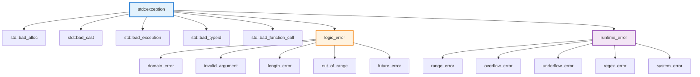

# 7.1 异常处理机制

> 构建健壮的程序，优雅地处理运行时错误

## 目录

- [异常处理基础](#异常处理基础)
- [异常类层次结构](#异常类层次结构)
- [自定义异常类](#自定义异常类)
- [noexcept说明符](#noexcept说明符)
- [异常安全保证](#异常安全保证)
- [本节小结](#本节小结)

---

## 异常处理基础

### 什么是异常

异常（Exception）是程序在运行时发生的特殊情况，如除零错误、内存不足等。C++异常处理机制提供了一种结构化且类型安全的方式来处理这些错误。

**异常与错误码的区别：**
- **错误码**：需要显式检查，容易忽略
- **异常**：自动传播，不能被忽略，类型安全

### try-catch语句

```cpp
#include <iostream>
#include <stdexcept>
#include <vector>

void basicException() {
    try {
        // 可能抛出异常的代码
        std::vector<int> vec;
        vec.at(10); // 越界访问，抛出std::out_of_range
    }
    catch (const std::out_of_range& e) {
        // 捕获特定异常
        std::cerr << "越界错误: " << e.what() << "\n";
    }
    catch (const std::exception& e) {
        // 捕获所有标准异常
        std::cerr << "标准异常: " << e.what() << "\n";
    }
    catch (...) {
        // 捕获所有异常
        std::cerr << "未知异常\n";
    }
}
```

### throw表达式

```cpp
void throwingExample() {
    // 抛出预定义异常
    throw std::runtime_error("发生错误");

    // 抛出自定义类型
    class MyException {};
    throw MyException();

    // 抛出整数或其他类型（不推荐）
    // throw 42;  // 避免：应该抛出异常类
}
```

### 异常传播

```cpp
void functionC() {
    throw std::runtime_error("C中的错误");
}

void functionB() {
    std::cout << "B开始\n";
    functionC(); // 异常向上传播
    std::cout << "B结束\n"; // 不会执行
}

void functionA() {
    try {
        std::cout << "A开始\n";
        functionB();
        std::cout << "A结束\n";
    }
    catch (const std::exception& e) {
        std::cout << "A捕获: " << e.what() << "\n";
    }
}

void propagationDemo() {
    functionA();
    // 输出：
    // A开始
    // B开始
    // A捕获: C中的错误
}
```

### 栈展开

```cpp
void stackUnwind() {
    class Resource {
    public:
        Resource(const char* n) : name(n) {
            std::cout << name << " 构造\n";
        }
        ~Resource() {
            std::cout << name << " 析构\n";
        }
    };

    try {
        Resource r1("r1");
        Resource r2("r2");
        throw std::runtime_error("错误");

        Resource r3("r3"); // 不会执行
    }
    catch (...) {
        std::cout << "捕获异常\n";
    }
    // 输出：
    // r1 构造
    // r2 构造
    // r2 析构
    // r1 析构
    // 捕获异常
}
```

---

## 异常类层次结构

### 标准异常层次



### 常用标准异常

```cpp
#include <stdexcept>
#include <vector>
#include <string>

void standardExceptions() {
    // 1. logic_error：逻辑错误（可预防）
    try {
        throw std::logic_error("逻辑错误");
    }
    catch (const std::logic_error& e) {
        std::cerr << e.what() << "\n";
    }

    // 2. domain_error：域错误（数学定义域）
    try {
        throw std::domain_error("数学域错误");
    }
    catch (const std::domain_error& e) {
        std::cerr << e.what() << "\n";
    }

    // 3. invalid_argument：无效参数
    try {
        throw std::invalid_argument("参数无效");
    }
    catch (const std::invalid_argument& e) {
        std::cerr << e.what() << "\n";
    }

    // 4. length_error：长度错误
    try {
        throw std::length_error("长度超出限制");
    }
    catch (const std::length_error& e) {
        std::cerr << e.what() << "\n";
    }

    // 5. out_of_range：越界
    try {
        std::vector<int> vec(5);
        vec.at(10); // 抛出out_of_range
    }
    catch (const std::out_of_range& e) {
        std::cerr << "越界: " << e.what() << "\n";
    }

    // 6. runtime_error：运行时错误（难以预防）
    try {
        throw std::runtime_error("运行时错误");
    }
    catch (const std::runtime_error& e) {
        std::cerr << e.what() << "\n";
    }

    // 7. range_error：范围错误
    try {
        throw std::range_error("超出范围");
    }
    catch (const std::range_error& e) {
        std::cerr << e.what() << "\n";
    }

    // 8. overflow_error：上溢
    try {
        throw std::overflow_error("上溢");
    }
    catch (const std::overflow_error& e) {
        std::cerr << e.what() << "\n";
    }

    // 9. underflow_error：下溢
    try {
        throw std::underflow_error("下溢");
    }
    catch (const std::underflow_error& e) {
        std::cerr << e.what() << "\n";
    }

    // 10. bad_alloc：内存分配失败
    try {
        int* p = new int[1000000000000]; // 可能抛出
        delete[] p;
    }
    catch (const std::bad_alloc& e) {
        std::cerr << "内存不足: " << e.what() << "\n";
    }
}
```

---

## 自定义异常类

### 基本自定义异常

```cpp
#include <stdexcept>
#include <string>

// 自定义异常类：继承标准异常
class MyException : public std::exception {
private:
    std::string message;

public:
    explicit MyException(const std::string& msg)
        : message(msg) {}

    // what()方法：返回错误信息
    const char* what() const noexcept override {
        return message.c_str();
    }
};

void customExceptionDemo() {
    try {
        throw MyException("自定义错误");
    }
    catch (const MyException& e) {
        std::cerr << "捕获: " << e.what() << "\n";
    }
}
```

### 带数据的异常类

```cpp
class FileException : public std::runtime_error {
private:
    std::string filename;
    int errorCode;

public:
    FileException(const std::string& file, int code)
        : std::runtime_error("文件错误"),
          filename(file),
          errorCode(code) {}

    std::string getFilename() const noexcept {
        return filename;
    }

    int getErrorCode() const noexcept {
        return errorCode;
    }

    const char* what() const noexcept override {
        return (std::string("文件: ") + filename +
                ", 错误码: " + std::to_string(errorCode)).c_str();
    }
};

void richExceptionDemo() {
    try {
        throw FileException("data.txt", 404);
    }
    catch (const FileException& e) {
        std::cerr << "文件: " << e.getFilename() << "\n";
        std::cerr << "错误码: " << e.getErrorCode() << "\n";
        std::cerr << "信息: " << e.what() << "\n";
    }
}
```

### 异常类模板

```cpp
// 通用网络异常模板
template<int ErrorCode>
class NetworkException : public std::runtime_error {
public:
    explicit NetworkException(const std::string& msg)
        : std::runtime_error(msg) {}

    int getErrorCode() const noexcept {
        return ErrorCode;
    }
};

void templateExceptionDemo() {
    try {
        throw NetworkException<404>("资源未找到");
    }
    catch (const NetworkException<404>& e) {
        std::cerr << "404错误: " << e.what() << "\n";
    }
}
```

---

## noexcept说明符

### noexcept基础

`noexcept`说明符（C++11）告诉编译器函数不会抛出异常。

```cpp
// noexcept：保证不抛出异常
void safeFunction() noexcept {
    // 不抛出异常的代码
    std::cout << "安全函数\n";
}

// noexcept(false)或noexcept：可能抛出异常（默认）
void unsafeFunction() {
    throw std::runtime_error("错误");
}

// 条件noexcept
void conditionalNoexcept() noexcept(noexcept(std::string())) {
    std::string s; // 如果string的构造函数可能抛出异常
}
```

### noexcept的作用

```cpp
void noexceptBenefits() {
    // 1. 性能优化
    void func1() noexcept {
        // 编译器可能生成更优化的代码
        // 不需要异常处理机制
    }

    // 2. 标准库优化
    std::vector<int> vec;
    vec.push_back(42); // 如果移动构造函数是noexcept，
                    // 会优先使用移动而非拷贝

    // 3. 明确接口契约
    void func2() noexcept;
    // 告诉调用者：这个函数不会抛出异常
}
```

### noexcept与std::terminate

```cpp
void noexceptViolation() {
    void throwingFunc() noexcept {
        throw std::runtime_error("错误"); // 未定义行为！
    }

    // 如果noexcept函数抛出异常
    // 会调用std::terminate()，程序立即终止
    try {
        throwingFunc();
    }
    catch (...) {
        std::cout << "不会被捕获\n";
    }
}
```

### 条件noexcept

```cpp
template<typename T>
void process(T t) noexcept(noexcept(t.toString())) {
    // 只有当T::toString()不抛异常时
    // 这个函数才是noexcept
    t.toString();
}

class MyClass {
public:
    std::string toString() const noexcept {
        return "hello";
    }
};

void conditionalDemo() {
    MyClass obj;
    process(obj); // OK，toString()是noexcept

    std::string str;
    // process(str); // 编译错误，string可能抛异常
}
```

---

## 异常安全保证

### 异常安全级别

```cpp
class ExceptionSafe {
private:
    int* data;
    size_t size;

public:
    // 无保证（No guarantee）：可能泄漏资源
    void noGuarantee() {
        data = new int[100];
        throw std::runtime_error("错误");
        // 内存泄漏！
    }

    // 基本异常安全（Basic exception safety）
    // 保证不泄漏资源，但状态可能改变
    void basicExceptionSafe() {
        int* temp = new int[100];
        try {
            // 可能抛异常的操作
            throw std::runtime_error("错误");
        }
        catch (...) {
            delete[] temp; // 清理资源
            throw;         // 重新抛出
        }
    }

    // 强异常安全（Strong exception safety）
    // 操作成功则成功，失败则状态不变
    void strongExceptionSafe(std::vector<int>& vec) {
        std::vector<int> temp = vec; // 拷贝原状态
        try {
            vec.push_back(42);
            // 其他修改操作
        }
        catch (...) {
            vec = temp; // 恢复原状态
            throw;
        }
    }

    // 不抛异常（No throw）
    // noexcept，保证不抛异常
    void noThrow() noexcept {
        // 不抛出任何异常
    }
};
```

### RAII与异常安全

```cpp
class ResourceManager {
private:
    void* resource;

public:
    ResourceManager() : resource(nullptr) {
        resource = acquireResource();
        if (!resource) {
            throw std::runtime_error("资源获取失败");
        }
    }

    ~ResourceManager() noexcept {
        releaseResource(resource); // 析构函数不应抛异常
    }

    // 禁止拷贝
    ResourceManager(const ResourceManager&) = delete;
    ResourceManager& operator=(const ResourceManager&) = delete;

    // 支持移动（noexcept）
    ResourceManager(ResourceManager&& other) noexcept
        : resource(other.resource) {
        other.resource = nullptr;
    }

private:
    void* acquireResource() {
        // 资源获取逻辑
        return reinterpret_cast<void*>(0x1234);
    }

    void releaseResource(void* res) noexcept {
        // 资源释放逻辑
    }
};

void raiiDemo() {
    try {
        ResourceManager rm;
        // 使用资源
        throw std::runtime_error("错误");
        // rm的析构函数自动调用，资源释放
    }
    catch (...) {
        std::cout << "资源已正确释放\n";
    }
}
```

### 构造函数异常安全

```cpp
class ExceptionSafeConstructor {
private:
    std::unique_ptr<int[]> data;
    size_t size;

public:
    ExceptionSafeConstructor(size_t sz) : size(sz) {
        // 先分配资源
        data.reset(new int[size]);

        // 再执行可能抛异常的操作
        // 如果异常，data的析构函数会自动清理
        if (sz > 1000) {
            throw std::invalid_argument("大小过大");
        }

        // 初始化
        for (size_t i = 0; i < size; ++i) {
            data[i] = 0;
        }
    }

    // 委托构造函数（C++11）
    ExceptionSafeConstructor()
        : ExceptionSafeConstructor(10) {} // 委托给主构造函数
};
```

---

## 本节小结

### 知识点回顾

1. **异常处理基础**：
   - try-catch语句
   - throw表达式
   - 异常传播和栈展开

2. **异常类层次**：
   - std::exception基类
   - logic_error及其子类
   - runtime_error及其子类
   - 标准异常类型

3. **自定义异常**：
   - 继承标准异常类
   - 重写what()方法
   - 添加额外信息

4. **noexcept**：
   - 不抛异常保证
   - 性能优化
   - 条件noexcept

5. **异常安全**：
   - 基本保证：不泄漏
   - 强保证：原子操作
   - 不抛保证：noexcept

### 最佳实践

```cpp
// ✅ 推荐做法
void goodCode() noexcept {
    // 简单操作标记noexcept
}

void goodCode2() {
    try {
        riskyOperation();
    }
    catch (const std::exception& e) {
        // 记录日志
        throw; // 重新抛出
    }
}

// 按值捕获异常
catch (std::exception) {
    // ...
}

// ❌ 避免
void badCode() {
    throw 42;  // 抛出非标准异常类型
}

catch (char*) {
    // 不要按指针捕获
}

catch (...) {
    // 捕获所有异常但忽略
}
```

### 学习建议

1. **优先使用标准异常**：继承std::exception
2. **异常按值传递**：按const引用捕获
3. **析构函数noexcept**：避免析构时抛异常
4. **提供what()信息**：帮助调试
5. **保证异常安全**：使用RAII管理资源

### 练习

1. 实现一个文件操作类，使用异常处理错误
2. 编写自定义数据库异常类层次结构
3. 实现强异常安全的vector类
4. 对比异常处理与错误码的性能差异

---

**下一节：7.2-调试技巧** - 掌握调试工具和方法
