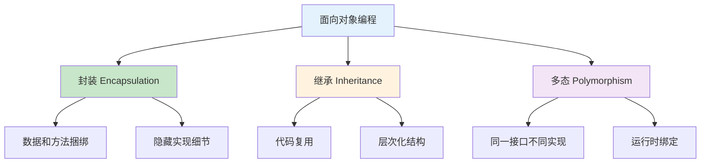
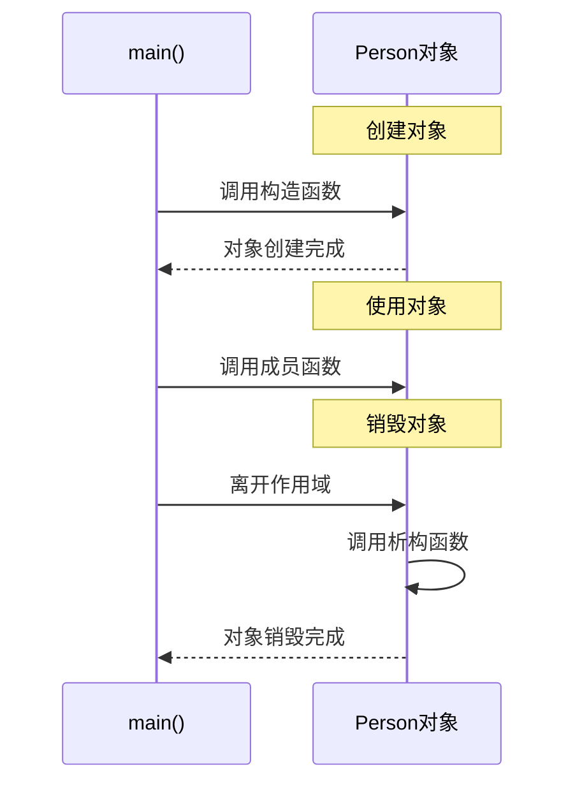
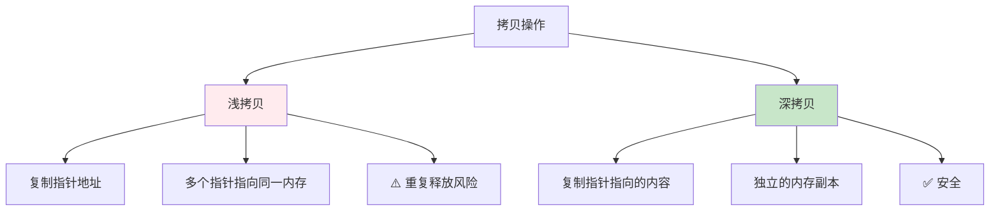

# 3.1 类与对象基础

## 目录
- [类定义与对象创建](#类定义与对象创建)
- [访问修饰符（public, private, protected）](#访问修饰符public-private-protected)
- [构造函数与析构函数](#构造函数与析构函数)
- [拷贝构造函数与拷贝赋值](#拷贝构造函数与拷贝赋值)
- [this指针](#this指针)

---

## 类定义与对象创建

### 面向对象编程的基本概念



### 类的基本定义

```cpp
#include <iostream>
#include <string>

// 类的定义
class Student {
private:    // 私有成员：只能在类内访问
    std::string name;
    int age;
    double score;

public:     // 公有成员：可以从外部访问
    // 构造函数
    Student(const std::string& n, int a, double s) {
        name = n;
        age = a;
        score = s;
    }

    // 成员函数
    void display() {
        std::cout << "姓名: " << name << "\n";
        std::cout << "年龄: " << age << "\n";
        std::cout << "分数: " << score << "\n";
    }

    // Setter方法
    void setScore(double s) {
        if (s >= 0 && s <= 100) {
            score = s;
        }
    }

    // Getter方法
    double getScore() const {
        return score;
    }
};

int main() {
    // 创建对象
    Student student1("张三", 18, 95.5);

    // 访问公有成员
    student1.display();

    student1.setScore(98.0);
    std::cout << "更新后分数: " << student1.getScore() << "\n";

    // student1.name;  // ❌ 错误：name是私有成员

    return 0;
}
```

### 类的声明与实现分离

```cpp
// Student.h - 头文件
#ifndef STUDENT_H
#define STUDENT_H

#include <string>

class Student {
private:
    std::string name;
    int age;
    double score;

public:
    // 构造函数声明
    Student(const std::string& name, int age, double score);

    // 成员函数声明
    void display();
    void setScore(double score);
    double getScore() const;
};

#endif

// Student.cpp - 实现文件
#include "Student.h"
#include <iostream>

// 构造函数实现
Student::Student(const std::string& n, int a, double s)
    : name(n), age(a), score(s) {
    // 初始化列表
}

void Student::display() {
    std::cout << "姓名: " << name << "\n";
    std::cout << "年龄: " << age << "\n";
    std::cout << "分数: " << score << "\n";
}

void Student::setScore(double s) {
    if (s >= 0 && s <= 100) {
        score = s;
    }
}

double Student::getScore() const {
    return score;
}

// main.cpp
#include "Student.h"

int main() {
    Student s("李四", 20, 88.5);
    s.display();

    return 0;
}
```

### 对象的创建与使用

```cpp
#include <iostream>

class Rectangle {
public:
    double width;
    double height;

    double area() {
        return width * height;
    }
};

int main() {
    // 方式1：默认构造
    Rectangle rect1;
    rect1.width = 5.0;
    rect1.height = 3.0;

    // 方式2：使用初始化列表（C++11）
    Rectangle rect2{10.0, 20.0};

    // 方式3：动态创建
    Rectangle* rect3 = new Rectangle();
    rect3->width = 7.0;
    rect3->height = 4.0;

    std::cout << "rect1面积: " << rect1.area() << "\n";
    std::cout << "rect2面积: " << rect2.area() << "\n";
    std::cout << "rect3面积: " << rect3->area() << "\n";

    delete rect3;  // 释放动态内存

    return 0;
}
```

---

## 访问修饰符（public, private, protected）

### 三种访问级别

```cpp
#include <iostream>

class AccessDemo {
public:     // 公有：任何地方都可访问
    int publicVar;

    void publicMethod() {
        std::cout << "公有方法\n";
    }

private:    // 私有：仅类内可访问
    int privateVar;

    void privateMethod() {
        std::cout << "私有方法\n";
    }

protected:  // 保护：类内和派生类可访问
    int protectedVar;

    void protectedMethod() {
        std::cout << "保护方法\n";
    }

public:
    // 提供访问私有成员的接口
    void setPrivateVar(int value) {
        privateVar = value;
    }

    int getPrivateVar() const {
        return privateVar;
    }

    // 演示访问权限
    void demoAccess() {
        publicVar = 1;       // ✅ 可以访问
        privateVar = 2;      // ✅ 可以访问
        protectedVar = 3;    // ✅ 可以访问

        publicMethod();      // ✅ 可以调用
        privateMethod();     // ✅ 可以调用
        protectedMethod();   // ✅ 可以调用
    }
};

int main() {
    AccessDemo obj;

    obj.publicVar = 10;      // ✅ 可以访问
    obj.publicMethod();      // ✅ 可以调用

    // obj.privateVar = 20;   // ❌ 错误：不能访问私有成员
    // obj.privateMethod();   // ❌ 错误

    // obj.protectedVar = 30; // ❌ 错误：不能访问保护成员
    // obj.protectedMethod(); // ❌ 错误

    // 通过公有接口访问私有成员
    obj.setPrivateVar(20);
    std::cout << "privateVar = " << obj.getPrivateVar() << "\n";

    return 0;
}
```

### 访问修饰符对比表

| 访问级别 | 类内 | 派生类 | 外部 | 使用场景 |
|----------|------|--------|------|----------|
| `public` | ✅ | ✅ | ✅ | 对外接口 |
| `private` | ✅ | ❌ | ❌ | 内部实现细节 |
| `protected` | ✅ | ✅ | ❌ | 派生类需要访问 |

### 封装的最佳实践

```cpp
#include <iostream>
#include <string>

class BankAccount {
private:    // 数据成员应该私有
    std::string owner;
    double balance;

    // 私有辅助函数
    bool validateAmount(double amount) const {
        return amount > 0;
    }

public:     // 通过公有接口访问
    BankAccount(const std::string& name, double initialBalance)
        : owner(name), balance(initialBalance) {
        if (balance < 0) balance = 0;
    }

    // 只读访问
    std::string getOwner() const {
        return owner;
    }

    double getBalance() const {
        return balance;
    }

    // 受控制的写入
    bool deposit(double amount) {
        if (!validateAmount(amount)) return false;
        balance += amount;
        return true;
    }

    bool withdraw(double amount) {
        if (!validateAmount(amount) || amount > balance) {
            return false;
        }
        balance -= amount;
        return true;
    }

    void display() const {
        std::cout << "账户: " << owner << "\n";
        std::cout << "余额: " << balance << "元\n";
    }
};

int main() {
    BankAccount account("张三", 1000.0);
    account.display();

    account.deposit(500.0);
    std::cout << "存款后余额: " << account.getBalance() << "\n";

    account.withdraw(200.0);
    std::cout << "取款后余额: " << account.getBalance() << "\n";

    return 0;
}
```

---

## 构造函数与析构函数

### 构造函数

构造函数在对象创建时自动调用，用于初始化对象。

```cpp
#include <iostream>
#include <string>

class Person {
private:
    std::string name;
    int age;

public:
    // 1. 默认构造函数
    Person() : name("未知"), age(0) {
        std::cout << "默认构造函数调用\n";
    }

    // 2. 带参数的构造函数
    Person(const std::string& n, int a) : name(n), age(a) {
        std::cout << "带参构造函数调用: " << name << "\n";
    }

    // 3. 委托构造函数（C++11）
    Person(int a) : Person("未知", a) {
        std::cout << "委托构造函数调用\n";
    }

    void display() const {
        std::cout << "姓名: " << name << ", 年龄: " << age << "\n";
    }

    // 析构函数
    ~Person() {
        std::cout << "析构函数调用: " << name << "\n";
    }
};

int main() {
    std::cout << "创建p1:\n";
    Person p1;  // 调用默认构造函数

    std::cout << "\n创建p2:\n";
    Person p2("李四", 25);  // 调用带参构造函数

    std::cout << "\n创建p3:\n";
    Person p3(30);  // 调用委托构造函数

    std::cout << "\n程序结束:\n";
    return 0;
    // 离开作用域时自动调用析构函数
}
```

**对象生命周期示意图：**



### 初始化列表

```cpp
#include <iostream>
#include <string>

class Student {
private:
    const int id;          // const成员
    std::string name;      // 对象成员
    int& ref;              // 引用成员

public:
    // ✅ 正确：使用初始化列表
    Student(int i, const std::string& n, int& r)
        : id(i), name(n), ref(r) {
        std::cout << "使用初始化列表\n";
    }

    // ❌ 错误：const、引用必须在初始化列表中初始化
    /*
    Student(int i, const std::string& n, int& r) {
        id = i;      // 错误
        name = n;
        ref = r;     // 错误
    }
    */

    void display() const {
        std::cout << "ID: " << id << ", 姓名: " << name << "\n";
    }
};

int main() {
    int value = 100;
    Student s(1, "张三", value);
    s.display();

    return 0;
}
```

### 构造函数的执行顺序

```cpp
#include <iostream>

class A {
public:
    A() { std::cout << "A构造\n"; }
    ~A() { std::cout << "A析构\n"; }
};

class B {
public:
    B() { std::cout << "B构造\n"; }
    ~B() { std::cout << "B析构\n"; }
};

class C {
private:
    A a;
    B b;

public:
    C() {
        std::cout << "C构造\n";
    }

    ~C() {
        std::cout << "C析构\n";
    }
};

int main() {
    std::cout << "创建对象:\n";
    C obj;

    std::cout << "\n销毁对象:\n";
    return 0;
}

/* 输出:
创建对象:
A构造
B构造
C构造

销毁对象:
C析构
B析构
A析构
*/
```

### 析构函数的应用

```cpp
#include <iostream>
#include <cstring>

class DynamicArray {
private:
    int* data;
    size_t size;

public:
    // 构造函数：分配内存
    DynamicArray(size_t s) : size(s) {
        data = new int[size];
        std::cout << "构造:分配" << size << "个整数\n";
    }

    // 析构函数：释放内存
    ~DynamicArray() {
        delete[] data;
        std::cout << "析构:释放内存\n";
    }

    void set(size_t index, int value) {
        if (index < size) {
            data[index] = value;
        }
    }

    int get(size_t index) const {
        if (index < size) {
            return data[index];
        }
        return 0;
    }
};

int main() {
    DynamicArray arr(5);

    for (size_t i = 0; i < 5; i++) {
        arr.set(i, (i + 1) * 10);
    }

    for (size_t i = 0; i < 5; i++) {
        std::cout << arr.get(i) << " ";
    }
    std::cout << "\n";

    return 0;
    // 离开作用域时自动调用析构函数释放内存
}
```

---

## 拷贝构造函数与拷贝赋值

### 浅拷贝 vs 深拷贝



### 拷贝构造函数

```cpp
#include <iostream>
#include <cstring>

class MyString {
private:
    char* data;
    size_t length;

public:
    // 构造函数
    MyString(const char* str) {
        length = strlen(str);
        data = new char[length + 1];
        strcpy(data, str);
        std::cout << "构造: " << data << "\n";
    }

    // 拷贝构造函数（深拷贝）
    MyString(const MyString& other) : length(other.length) {
        data = new char[length + 1];
        strcpy(data, other.data);
        std::cout << "拷贝构造: " << data << "\n";
    }

    // 析构函数
    ~MyString() {
        std::cout << "析构: " << data << "\n";
        delete[] data;
    }

    void display() const {
        std::cout << "字符串: " << data << "\n";
    }
};

void passByValue(MyString str) {
    std::cout << "函数内: ";
    str.display();
}

int main() {
    MyString str1("Hello");
    std::cout << "\n";

    // 调用拷贝构造函数
    MyString str2 = str1;
    std::cout << "\n";

    // 传递参数时调用拷贝构造函数
    passByValue(str1);
    std::cout << "\n";

    return 0;
}
```

### 拷贝赋值运算符

```cpp
#include <iostream>
#include <cstring>

class MyString {
private:
    char* data;
    size_t length;

public:
    // 构造函数
    MyString(const char* str = "") {
        if (str) {
            length = strlen(str);
            data = new char[length + 1];
            strcpy(data, str);
        } else {
            length = 0;
            data = new char[1];
            data[0] = '\0';
        }
        std::cout << "构造: " << data << "\n";
    }

    // 拷贝构造函数
    MyString(const MyString& other) : length(other.length) {
        data = new char[length + 1];
        strcpy(data, other.data);
        std::cout << "拷贝构造: " << data << "\n";
    }

    // 拷贝赋值运算符
    MyString& operator=(const MyString& other) {
        std::cout << "拷贝赋值\n";

        // 防止自赋值
        if (this == &other) {
            return *this;
        }

        // 释放旧内存
        delete[] data;

        // 分配新内存并复制
        length = other.length;
        data = new char[length + 1];
        strcpy(data, other.data);

        return *this;
    }

    // 析构函数
    ~MyString() {
        std::cout << "析构: " << data << "\n";
        delete[] data;
    }

    void display() const {
        std::cout << "字符串: " << data << "\n";
    }
};

int main() {
    MyString str1("Hello");
    MyString str2("World");

    std::cout << "\n赋值操作:\n";
    str2 = str1;  // 调用拷贝赋值运算符

    str1.display();
    str2.display();

    std::cout << "\n程序结束:\n";
    return 0;
}
```

### 三法则/五法则

如果需要定义以下任何一个，则需要定义全部：

```cpp
class RuleOfFive {
private:
    int* resource;

public:
    // 1. 析构函数
    ~RuleOfFive() {
        delete[] resource;
    }

    // 2. 拷贝构造函数
    RuleOfFive(const RuleOfFive& other) {
        resource = new int[/*...*/];
        // 深拷贝
    }

    // 3. 拷贝赋值运算符
    RuleOfFive& operator=(const RuleOfFive& other) {
        if (this != &other) {
            delete[] resource;
            resource = new int[/*...*/];
            // 深拷贝
        }
        return *this;
    }

    // 4. 移动构造函数（C++11）
    RuleOfFive(RuleOfFive&& other) noexcept : resource(other.resource) {
        other.resource = nullptr;
    }

    // 5. 移动赋值运算符（C++11）
    RuleOfFive& operator=(RuleOfFive&& other) noexcept {
        if (this != &other) {
            delete[] resource;
            resource = other.resource;
            other.resource = nullptr;
        }
        return *this;
    }
};
```

### 禁用拷贝

```cpp
#include <iostream>

class NonCopyable {
private:
    int data;

public:
    NonCopyable(int d) : data(d) {}

    // C++11方式：禁用拷贝构造和拷贝赋值
    NonCopyable(const NonCopyable&) = delete;
    NonCopyable& operator=(const NonCopyable&) = delete;

    // 旧方式（C++03）：声明为private
    /*
private:
    NonCopyable(const NonCopyable&);
    NonCopyable& operator=(const NonCopyable&);
    */
};

int main() {
    NonCopyable obj1(42);

    // NonCopyable obj2 = obj1;  // ❌ 错误：拷贝构造已删除
    // obj2 = obj1;              // ❌ 错误：拷贝赋值已删除

    return 0;
}
```

---

## this指针

### this指针的概念

每个成员函数都有一个隐含的参数：`this`指针，指向调用该函数的对象。

```cpp
#include <iostream>
#include <string>

class Student {
private:
    std::string name;
    int age;

public:
    Student(const std::string& n, int a) : name(n), age(a) {}

    // 显式使用this指针
    void display() {
        std::cout << "this->name: " << this->name << "\n";
        std::cout << "this->age: " << this->age << "\n";
    }

    // 返回对象的引用（支持链式调用）
    Student& setName(const std::string& n) {
        this->name = n;
        return *this;  // 返回当前对象
    }

    Student& setAge(int a) {
        this->age = a;
        return *this;
    }

    void print() const {
        std::cout << "姓名: " << name << ", 年龄: " << age << "\n";
    }
};

int main() {
    Student s("张三", 20);

    s.display();

    // 链式调用
    s.setName("李四").setAge(22).print();

    return 0;
}
```

### this指针的用途

```cpp
#include <iostream>

class Number {
private:
    int value;

public:
    Number(int v) : value(v) {}

    // 1. 区分成员变量和参数
    void setValue(int value) {
        this->value = value;  // this->value是成员，value是参数
    }

    // 2. 返回对象的引用
    Number& add(int n) {
        value += n;
        return *this;
    }

    // 3. 实现运算符重载
    Number operator+(const Number& other) {
        return Number(this->value + other.value);
    }

    // 4. 避免自赋值
    Number& operator=(const Number& other) {
        if (this != &other) {  // 检查是否是同一个对象
            this->value = other.value;
        }
        return *this;
    }

    void display() const {
        std::cout << "value = " << value << "\n";
    }
};

int main() {
    Number n1(10);
    Number n2(20);

    n1.setValue(100);
    n1.display();

    n1.add(5).add(3).display();  // 链式调用

    Number n3 = n1 + n2;
    n3.display();

    return 0;
}
```

### const成员函数中的this

```cpp
#include <iostream>

class MyClass {
private:
    int value;

public:
    MyClass(int v) : value(v) {}

    // const成员函数：this指针是const类型
    void display() const {
        std::cout << "value = " << value << "\n";
        // this->value = 10;  // ❌ 错误：不能修改成员
        // const MyClass* const this;  // this的实际类型
    }

    void setValue(int v) {
        // MyClass* const this;  // 非const成员函数的this类型
        this->value = v;  // ✅ 可以修改
    }
};

int main() {
    MyClass obj(42);
    obj.display();

    return 0;
}
```

---

## 类与对象综合示例

### 示例：银行账户类

```cpp
#include <iostream>
#include <string>
#include <vector>
#include <ctime>

class BankAccount {
private:
    std::string accountNumber;
    std::string owner;
    double balance;
    std::vector<std::string> transactionHistory;

    // 私有辅助函数
    void recordTransaction(const std::string& type, double amount) {
        time_t now = time(0);
        char* dt = ctime(&now);
        transactionHistory.push_back(std::string(dt) + " " + type +
                                    ": " + std::to_string(amount));
    }

public:
    // 构造函数
    BankAccount(const std::string& num, const std::string& name, double initialBalance = 0.0)
        : accountNumber(num), owner(name), balance(initialBalance) {
        if (balance > 0) {
            recordTransaction("开户", balance);
        }
    }

    // 拷贝构造（禁用）
    BankAccount(const BankAccount&) = delete;

    // 拷贝赋值（禁用）
    BankAccount& operator=(const BankAccount&) = delete;

    // 存款
    bool deposit(double amount) {
        if (amount <= 0) return false;
        balance += amount;
        recordTransaction("存款", amount);
        return true;
    }

    // 取款
    bool withdraw(double amount) {
        if (amount <= 0 || amount > balance) return false;
        balance -= amount;
        recordTransaction("取款", amount);
        return true;
    }

    // 转账
    bool transfer(BankAccount& to, double amount) {
        if (withdraw(amount)) {
            if (to.deposit(amount)) {
                recordTransaction("转账转出", amount);
                return true;
            } else {
                // 失败，回滚
                deposit(amount);
                return false;
            }
        }
        return false;
    }

    // 查询余额
    double getBalance() const {
        return balance;
    }

    // 打印交易历史
    void printHistory() const {
        std::cout << "=== 交易历史 ===\n";
        std::cout << "账户: " << accountNumber << "\n";
        std::cout << "户主: " << owner << "\n";
        std::cout << "当前余额: " << balance << "\n\n";

        for (const auto& record : transactionHistory) {
            std::cout << record << "\n";
        }
        std::cout << "==================\n";
    }

    // 析构函数
    ~BankAccount() {
        std::cout << "账户 " << accountNumber << " 已销户\n";
    }
};

int main() {
    BankAccount account1("001", "张三", 1000.0);
    BankAccount account2("002", "李四", 500.0);

    account1.deposit(500.0);
    account1.withdraw(200.0);

    account1.transfer(account2, 300.0);

    std::cout << "账户1余额: " << account1.getBalance() << "\n";
    std::cout << "账户2余额: " << account2.getBalance() << "\n";

    account1.printHistory();

    return 0;
}
```

---

## 小结

本节介绍了C++中类与对象的基础知识：

1. **类定义与对象创建**：
   - 类的基本语法
   - 声明与实现分离
   - 对象的多种创建方式

2. **访问修饰符**：
   - `public`：对外接口
   - `private`：内部实现
   - `protected`：派生类访问
   - 封装的重要性

3. **构造函数与析构函数**：
   - 多种构造函数
   - 初始化列表
   - 对象生命周期
   - 资源管理

4. **拷贝控制**：
   - 拷贝构造函数
   - 拷贝赋值运算符
   - 深拷贝vs浅拷贝
   - 三/五法则

5. **this指针**：
   - 隐含参数
   - 链式调用
   - 区分成员和参数
   - const成员函数

## 最佳实践

1. ✅ 使用封装隐藏实现细节
2. ✅ 成员变量私有，提供公有接口
3. ✅ 使用初始化列表初始化成员
4. ✅ 遵循三/五法则
5. ✅ 考虑禁用不需要的拷贝操作

## 练习

1. ✅ 实现一个Rectangle类，支持计算面积和周长
2. ✅ 编写带动态内存的类，正确实现拷贝控制
3. ✅ 使用this指针实现链式调用
4. ✅ 实现一个简单的学生管理系统类

---

## 下一节
[3.2 类的高级特性](./3.2-类的高级特性.md) → 学习静态成员、友元函数和常量成员函数。
