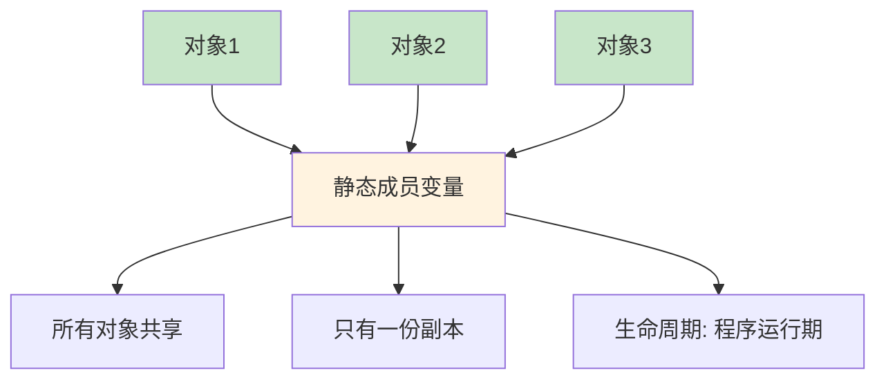

# 3.2 类的高级特性

## 目录
- [静态成员](#静态成员)
- [友元函数与友元类](#友元函数与友元类)
- [常量成员函数](#常量成员函数)
- [对象数组与对象指针](#对象数组与对象指针)

---

## 静态成员

### 静态成员变量

静态成员变量被类的所有对象共享，只有一份副本。

```cpp
#include <iostream>
#include <string>

class Student {
private:
    std::string name;
    static int count;  // 静态成员变量声明

public:
    Student(const std::string& n) : name(n) {
        count++;  // 每创建一个对象，计数增加
    }

    ~Student() {
        count--;  // 对象销毁时计数减少
    }

    // 静态成员函数
    static int getCount() {
        return count;  // 只能访问静态成员
    }

    void display() const {
        std::cout << "姓名: " << name << "\n";
        std::cout << "当前学生数: " << count << "\n";
    }
};

// 静态成员变量定义（必须在类外）
int Student::count = 0;

int main() {
    std::cout << "初始学生数: " << Student::getCount() << "\n";

    {
        Student s1("张三");
        Student s2("李四");

        s1.display();
        s2.display();

        std::cout << "学生总数: " << Student::getCount() << "\n";
    }

    std::cout << "离开作用域后: " << Student::getCount() << "\n";

    return 0;
}
```

**静态成员示意图：**



### 静态成员函数

```cpp
#include <iostream>
class Calculator {
public:
    // 静态成员函数：不需要对象就可以调用
    static int add(int a, int b) {
        return a + b;
    }

    static int multiply(int a, int b) {
        return a * b;
    }

    // 普通成员函数
    void display() {
        std::cout << "3 + 5 = " << add(3, 5) << "\n";
    }
};

int main() {
    // 通过类名调用静态函数
    std::cout << "10 + 20 = " << Calculator::add(10, 20) << "\n";
    std::cout << "5 * 6 = " << Calculator::multiply(5, 6) << "\n";

    // 也可以通过对象调用（但不推荐）
    Calculator calc;
    calc.display();

    return 0;
}
```

### 静态成员的特性

```cpp
#include <iostream>

class Demo {
private:
    int instanceVar;       // 实例成员
    static int staticVar;  // 静态成员

public:
    Demo(int v) : instanceVar(v) {}

    // 普通成员函数
    void instanceMethod() {
        instanceVar = 10;  // ✅ 可以访问实例成员
        staticVar = 20;    // ✅ 可以访问静态成员
    }

    // 静态成员函数
    static void staticMethod() {
        // instanceVar = 10;  // ❌ 错误：不能访问实例成员
        staticVar = 20;      // ✅ 只能访问静态成员
    }

    void display() const {
        std::cout << "实例成员: " << instanceVar << "\n";
        std::cout << "静态成员: " << staticVar << "\n";
    }
};

int Demo::staticVar = 0;

int main() {
    Demo obj1(100);
    Demo obj2(200);

    obj1.display();
    obj2.display();

    // 静态成员被所有对象共享
    Demo::staticMethod();

    obj1.display();
    obj2.display();

    return 0;
}
```

### 静态成员的应用场景

```cpp
#include <iostream>
#include <string>

class Config {
private:
    // 静态成员：全局配置
    static std::string appName;
    static std::string version;
    static bool debugMode;

public:
    // 静态方法：访问配置
    static void setAppName(const std::string& name) {
        appName = name;
    }

    static std::string getAppName() {
        return appName;
    }

    static void setDebugMode(bool mode) {
        debugMode = mode;
    }

    static bool isDebugMode() {
        return debugMode;
    }

    static void displayConfig() {
        std::cout << "=== 配置信息 ===\n";
        std::cout << "应用名: " << appName << "\n";
        std::cout << "版本: " << version << "\n";
        std::cout << "调试模式: " << (debugMode ? "开启" : "关闭") << "\n";
        std::cout << "================\n";
    }
};

// 静态成员初始化
std::string Config::appName = "MyApp";
std::string Config::version = "1.0.0";
bool Config::debugMode = false;

int main() {
    Config::displayConfig();

    Config::setAppName("超级应用");
    Config::setDebugMode(true);

    Config::displayConfig();

    return 0;
}
```

---

## 友元函数与友元类

### 友元函数的概念

友元函数可以访问类的私有和保护成员，破坏了封装性，但有时很必要。

```cpp
#include <iostream>

class Box {
private:
    double width;

public:
    Box(double w) : width(w) {}

    // 声明友元函数
    friend void printWidth(const Box& box);
};

// 友元函数定义（不是成员函数）
void printWidth(const Box& box) {
    // 可以直接访问私有成员
    std::cout << "宽度: " << box.width << "\n";
}

int main() {
    Box box(10.5);
    printWidth(box);  // 调用友元函数

    return 0;
}
```

### 为什么需要友元函数

```cpp
#include <iostream>

class Complex {
private:
    double real;
    double imag;

public:
    Complex(double r = 0, double i = 0) : real(r), imag(i) {}

    void display() const {
        std::cout << real << " + " << imag << "i\n";
    }

    // 方式1：成员函数（只能 obj + 2.5，不能 2.5 + obj）
    Complex operator+(double d) const {
        return Complex(real + d, imag);
    }

    // 方式2：友元函数（支持 2.5 + obj）
    friend Complex operator+(double d, const Complex& c) {
        return Complex(c.real + d, c.imag);
    }

    // 友元函数：重载输出运算符
    friend std::ostream& operator<<(std::ostream& os, const Complex& c) {
        os << c.real << " + " << c.imag << "i";
        return os;
    }
};

int main() {
    Complex c1(3.0, 4.0);

    Complex c2 = c1 + 2.5;  // 成员函数
    c2.display();

    Complex c3 = 2.5 + c1;  // 友元函数
    c3.display();

    // 使用友元函数重载的<<
    std::cout << "c1 = " << c1 << "\n";

    return 0;
}
```

### 友元类

```cpp
#include <iostream>

class A {
private:
    int privateValue;

    // 声明友元类
    friend class B;

public:
    A(int v) : privateValue(v) {}

    void display() const {
        std::cout << "A的私有成员: " << privateValue << "\n";
    }
};

class B {
public:
    void accessA(A& obj) {
        // B可以访问A的私有成员
        obj.privateValue = 100;
        std::cout << "B修改了A的私有成员为: " << obj.privateValue << "\n";
    }
};

int main() {
    A objA(50);
    B objB;

    objA.display();
    objB.accessA(objA);
    objA.display();

    return 0;
}
```

### 友元的单向性

```cpp
#include <iostream>

class A {
    friend class B;  // B是A的友元

private:
    void privateMethodA() {
        std::cout << "A的私有方法\n";
    }
};

class B {
public:
    void accessA(A& obj) {
        obj.privateMethodA();  // ✅ B可以访问A的私有成员
    }

private:
    void privateMethodB() {
        std::cout << "B的私有方法\n";
    }

    friend class A;  // 如果A要访问B，需要单独声明
};

int main() {
    A objA;
    B objB;

    objB.accessA(objA);

    return 0;
}
```

### 友元的最佳实践

```cpp
#include <iostream>
#include <vector>

class Matrix;

// 友元函数：实现矩阵乘法
Matrix multiply(const Matrix& m1, const Matrix& m2);

class Matrix {
private:
    std::vector<std::vector<int>> data;
    int rows;
    int cols;

public:
    Matrix(int r, int c) : rows(r), cols(c), data(r, std::vector<int>(c)) {}

    void set(int i, int j, int value) {
        data[i][j] = value;
    }

    void display() const {
        for (int i = 0; i < rows; i++) {
            for (int j = 0; j < cols; j++) {
                std::cout << data[i][j] << " ";
            }
            std::cout << "\n";
        }
    }

    int getRows() const { return rows; }
    int getCols() const { return cols; }
    int getData(int i, int j) const { return data[i][j]; }

    // 声明友元函数
    friend Matrix multiply(const Matrix& m1, const Matrix& m2);
};

// 友元函数定义
Matrix multiply(const Matrix& m1, const Matrix& m2) {
    if (m1.getCols() != m2.getRows()) {
        std::cout << "矩阵维度不匹配\n";
        return Matrix(0, 0);
    }

    Matrix result(m1.getRows(), m2.getCols());

    for (int i = 0; i < m1.getRows(); i++) {
        for (int j = 0; j < m2.getCols(); j++) {
            int sum = 0;
            for (int k = 0; k < m1.getCols(); k++) {
                sum += m1.getData(i, k) * m2.getData(k, j);
            }
            result.set(i, j, sum);
        }
    }

    return result;
}

int main() {
    Matrix m1(2, 3);
    Matrix m2(3, 2);

    // 初始化矩阵
    int count = 1;
    for (int i = 0; i < 2; i++)
        for (int j = 0; j < 3; j++)
            m1.set(i, j, count++);

    count = 1;
    for (int i = 0; i < 3; i++)
        for (int j = 0; j < 2; j++)
            m2.set(i, j, count++);

    std::cout << "矩阵1:\n";
    m1.display();

    std::cout << "\n矩阵2:\n";
    m2.display();

    std::cout << "\n乘积:\n";
    Matrix result = multiply(m1, m2);
    result.display();

    return 0;
}
```

---

## 常量成员函数

### const成员函数的基本概念

const成员函数承诺不修改对象的状态。

```cpp
#include <iostream>
#include <string>

class Student {
private:
    std::string name;
    int age;

public:
    Student(const std::string& n, int a) : name(n), age(a) {}

    // const成员函数：不会修改对象
    void display() const {
        std::cout << "姓名: " << name << ", 年龄: " << age << "\n";
        // age = 20;  // ❌ 错误：不能修改成员
    }

    // 非const成员函数：可以修改对象
    void setAge(int a) {
        age = a;  // ✅ 可以修改
    }

    // const成员函数可以重载
    std::string getName() const {
        return name;
    }

    std::string& getName() {
        return name;  // 返回非const引用
    }
};

int main() {
    Student s("张三", 20);

    s.display();        // 任何对象都可以调用

    const Student cs("李四", 22);
    cs.display();       // const对象只能调用const成员函数

    // cs.setAge(23);   // ❌ 错误：const对象不能调用非const成员

    return 0;
}
```

### const成员函数的this指针

```cpp
#include <iostream>

class Demo {
private:
    int value;

public:
    Demo(int v) : value(v) {}

    // const成员函数
    void display() const {
        // const Demo* const this;
        std::cout << "value = " << value << "\n";
        // this->value = 10;  // ❌ 错误
    }

    // 非const成员函数
    void setValue(int v) {
        // Demo* const this;
        this->value = v;  // ✅ 正确
    }
};

int main() {
    Demo obj(42);
    obj.display();

    return 0;
}
```

### mutable关键字

```cpp
#include <iostream>
#include <string>

class Cache {
private:
    mutable int accessCount;  // mutable：即使在const函数中也能修改
    std::string data;

public:
    Cache(const std::string& d) : data(d), accessCount(0) {}

    // const成员函数
    void display() const {
        accessCount++;  // ✅ mutable成员可以在const函数中修改
        std::cout << "数据: " << data << "\n";
        std::cout << "访问次数: " << accessCount << "\n";
    }
};

int main() {
    const Cache cache("重要数据");

    cache.display();  // 第一次访问
    cache.display();  // 第二次访问
    cache.display();  // 第三次访问

    return 0;
}
```

### const成员函数的应用

```cpp
#include <iostream>
#include <vector>

class Vector {
private:
    std::vector<int> data;

public:
    Vector(const std::vector<int>& d) : data(d) {}

    // const版本：只读访问
    int operator[](size_t index) const {
        if (index >= data.size()) {
            throw std::out_of_range("索引越界");
        }
        return data[index];  // 返回副本
    }

    // 非const版本：可写访问
    int& operator[](size_t index) {
        if (index >= data.size()) {
            throw std::out_of_range("索引越界");
        }
        return data[index];  // 返回引用
    }

    void display() const {
        for (size_t i = 0; i < data.size(); i++) {
            std::cout << data[i] << " ";
        }
        std::cout << "\n";
    }
};

void processVector(const Vector& v) {
    // 只能调用const成员函数
    v.display();
    int value = v[0];  // 调用const版本
    std::cout << "第一个元素: " << value << "\n";
}

int main() {
    std::vector<int> vecData = {1, 2, 3, 4, 5};
    Vector vec(vecData);

    vec.display();

    vec[0] = 10;  // 调用非const版本
    vec.display();

    processVector(vec);

    return 0;
}
```

---

## 对象数组与对象指针

### 对象数组

```cpp
#include <iostream>
#include <string>

class Student {
private:
    std::string name;
    int score;

public:
    Student() : name("未知"), score(0) {
        std::cout << "默认构造\n";
    }

    Student(const std::string& n, int s) : name(n), score(s) {
        std::cout << "构造: " << name << "\n";
    }

    ~Student() {
        std::cout << "析构: " << name << "\n";
    }

    void display() const {
        std::cout << "姓名: " << name << ", 分数: " << score << "\n";
    }

    void setScore(int s) {
        score = s;
    }
};

int main() {
    // 方式1：数组初始化
    Student students[3] = {
        Student("张三", 90),
        Student("李四", 85),
        Student("王五", 95)
    };

    std::cout << "\n遍历数组:\n";
    for (int i = 0; i < 3; i++) {
        students[i].display();
    }

    // 方式2：动态数组
    std::cout << "\n动态数组:\n";
    Student* dynamicStudents = new Student[2];

    dynamicStudents[0].setScore(80);
    dynamicStudents[1].setScore(88);

    for (int i = 0; i < 2; i++) {
        dynamicStudents[i].display();
    }

    delete[] dynamicStudents;  // 释放动态数组

    std::cout << "\n程序结束:\n";
    return 0;
}
```

### 对象指针

```cpp
#include <iostream>
#include <string>

class Point {
private:
    int x, y;

public:
    Point(int x = 0, int y = 0) : x(x), y(y) {}

    void setX(int newX) {
        x = newX;
    }

    void setY(int newY) {
        y = newY;
    }

    void display() const {
        std::cout << "(" << x << ", " << y << ")\n";
    }

    Point* getPointer() {
        return this;  // 返回指向当前对象的指针
    }
};

int main() {
    Point p1(10, 20);

    // 对象指针
    Point* ptr = &p1;

    // 使用箭头运算符访问成员
    ptr->display();

    ptr->setX(30);
    ptr->setY(40);
    ptr->display();

    // this指针的使用
    Point* p2 = p1.getPointer();
    p2->display();

    return 0;
}
```

### 对象指针数组

```cpp
#include <iostream>
#include <string>

class Animal {
private:
    std::string name;

public:
    Animal(const std::string& n) : name(n) {}

    virtual void speak() {
        std::cout << name << "发出声音\n";
    }

    virtual ~Animal() {
        std::cout << name << "离开了\n";
    }
};

class Dog : public Animal {
public:
    Dog(const std::string& n) : Animal(n) {}

    void speak() override {
        std::cout << getName() << "汪汪叫\n";
    }

    std::string getName() const {
        return "狗狗";  // 简化版
    }
};

class Cat : public Animal {
public:
    Cat(const std::string& n) : Animal(n) {}

    void speak() override {
        std::cout << "猫咪" << "喵喵叫\n";
    }
};

int main() {
    // 对象指针数组
    Animal* zoo[3];

    zoo[0] = new Dog("旺财");
    zoo[1] = new Cat("咪咪");
    zoo[2] = new Dog("来福");

    // 多态调用
    for (int i = 0; i < 3; i++) {
        zoo[i]->speak();
    }

    // 释放内存
    for (int i = 0; i < 3; i++) {
        delete zoo[i];
    }

    return 0;
}
```

### std::vector存储对象

```cpp
#include <iostream>
#include <vector>
#include <string>

class Student {
private:
    std::string name;
    int score;

public:
    Student(const std::string& n, int s) : name(n), score(s) {}

    void display() const {
        std::cout << "姓名: " << name << ", 分数: " << score << "\n";
    }

    void setScore(int s) {
        score = s;
    }
};

int main() {
    // vector存储对象
    std::vector<Student> students;

    students.emplace_back("张三", 90);
    students.emplace_back("李四", 85);
    students.emplace_back("王五", 95);

    std::cout << "所有学生:\n";
    for (const auto& s : students) {
        s.display();
    }

    // vector存储指针
    std::vector<Student*> studentPtrs;

    studentPtrs.push_back(new Student("赵六", 88));
    studentPtrs.push_back(new Student("钱七", 92));

    std::cout << "\n使用指针:\n";
    for (const auto* ptr : studentPtrs) {
        ptr->display();
    }

    // 释放指针
    for (auto* ptr : studentPtrs) {
        delete ptr;
    }

    return 0;
}
```

---

## 类的高级特性综合示例

### 示例：单例模式

```cpp
#include <iostream>
#include <string>

class Database {
private:
    static Database* instance;  // 静态成员：唯一实例
    std::string connectionString;

    // 私有构造函数：防止外部创建
    Database(const std::string& conn) : connectionString(conn) {
        std::cout << "数据库连接创建\n";
    }

public:
    // 禁用拷贝
    Database(const Database&) = delete;
    Database& operator=(const Database&) = delete;

    // 静态方法：获取唯一实例
    static Database* getInstance(const std::string& conn = "") {
        if (instance == nullptr) {
            instance = new Database(conn);
        }
        return instance;
    }

    void query(const std::string& sql) {
        std::cout << "执行查询: " << sql << "\n";
        std::cout << "连接: " << connectionString << "\n";
    }

    ~Database() {
        std::cout << "数据库连接关闭\n";
    }
};

// 静态成员初始化
Database* Database::instance = nullptr;

int main() {
    // 获取单例实例
    Database* db1 = Database::getInstance("localhost:3306");
    Database* db2 = Database::getInstance("localhost:3306");

    std::cout << "db1地址: " << db1 << "\n";
    std::cout << "db2地址: " << db2 << "\n";
    std::cout << "相同吗? " << (db1 == db2 ? "是" : "否") << "\n";

    db1->query("SELECT * FROM users");

    return 0;
}
```

---

## 小结

本节介绍了C++类的高级特性：

1. **静态成员**：
   - 静态成员变量：所有对象共享
   - 静态成员函数：不依赖对象
   - 类级别的配置和状态

2. **友元函数与友元类**：
   - 访问私有成员
   - 运算符重载中的应用
   - 破坏封装但有时必要

3. **常量成员函数**：
   - const对象只能调用const函数
   - 函数重载（const/非const）
   - mutable关键字

4. **对象数组与对象指针**：
   - 对象数组的创建和销毁
   - 对象指针的使用
   - 多态与指针数组

## 最佳实践

1. ✅ 静态成员用于类级别的共享数据
2. ✅ 谨慎使用友元，优先使用公有接口
3. ✅ 成员函数尽可能声明为const
4. ✅ 使用智能指针管理动态对象数组
5. ✅ 理解单例模式的实现

## 练习

1. ✅ 实现一个单例类
2. ✅ 编写一个可配置的静态配置类
3. ✅ 重载<<运算符（使用友元函数）
4. ✅ 创建对象数组并实现多态

---

## 下一节
[3.3 继承与多态](./3.3-继承与多态.md) → 学习C++的继承机制和运行时多态。
