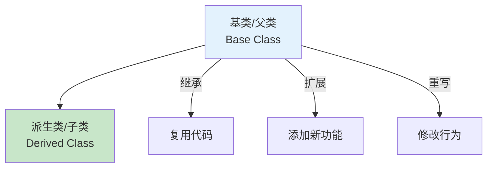
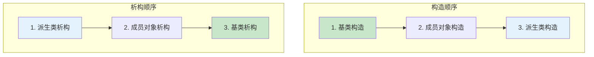
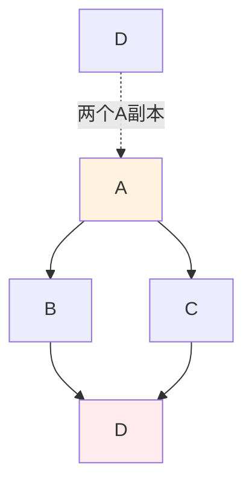
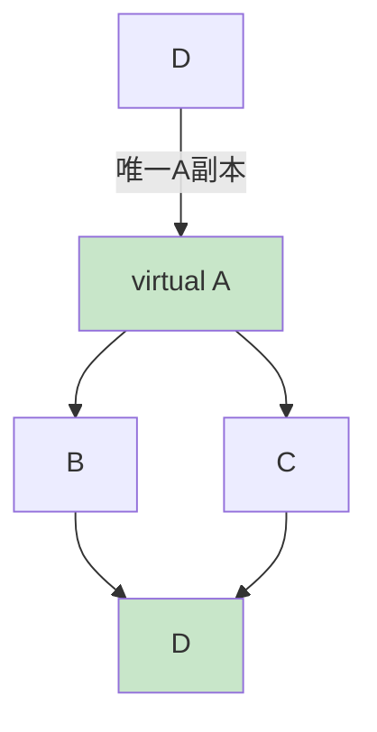
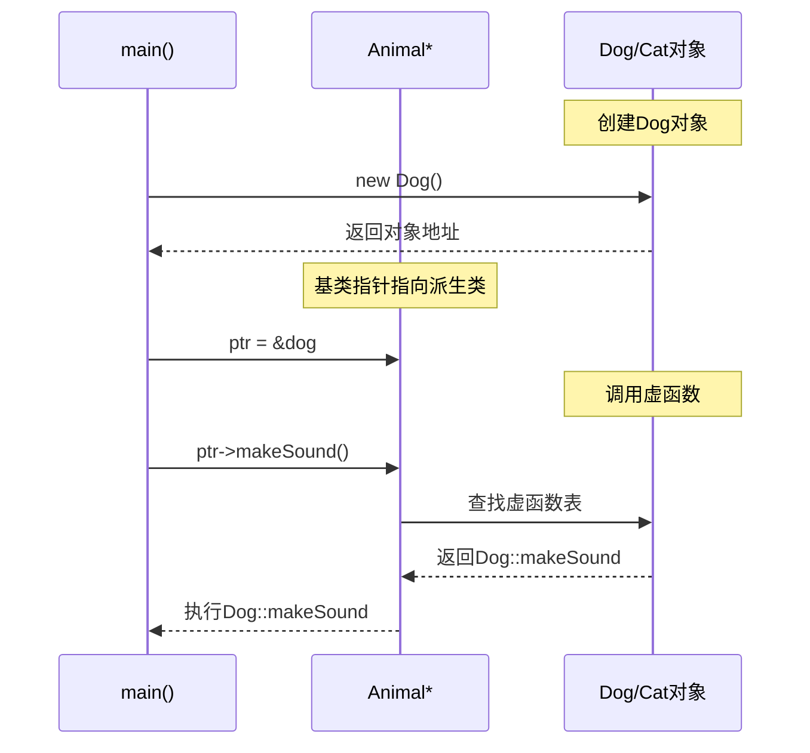

# 3.3 继承与多态

## 目录
- [继承的基本概念](#继承的基本概念)
- [派生类构造与析构](#派生类构造与析构)
- [访问控制与继承类型](#访问控制与继承类型)
- [多继承与菱形继承](#多继承与菱形继承)
- [虚函数与动态绑定](#虚函数与动态绑定)
- [抽象类与纯虚函数](#抽象类与纯虚函数)

---

## 继承的基本概念

### 什么是继承

继承允许新类从现有类派生,自动获得现有类的属性和方法。



### 基本继承语法

```cpp
#include <iostream>
#include <string>

// 基类
class Animal {
private:
    std::string name;
    int age;

public:
    Animal(const std::string& n, int a) : name(n), age(a) {
        std::cout << "Animal构造\n";
    }

    void eat() {
        std::cout << name << " 在吃东西\n";
    }

    void sleep() {
        std::cout << name << " 在睡觉\n";
    }

    void display() const {
        std::cout << "姓名: " << name << ", 年龄: " << age << "\n";
    }

    ~Animal() {
        std::cout << "Animal析构\n";
    }
};

// 派生类
class Dog : public Animal {  // public继承
private:
    std::string breed;

public:
    Dog(const std::string& n, int a, const std::string& b)
        : Animal(n, a), breed(b) {  // 初始化基类
        std::cout << "Dog构造\n";
    }

    void bark() {
        std::cout << "汪汪叫!\n";
    }

    void displayDog() const {
        display();  // 调用基类的public方法
        std::cout << "品种: " << breed << "\n";
    }

    ~Dog() {
        std::cout << "Dog析构\n";
    }
};

int main() {
    Dog dog("旺财", 3, "金毛");

    dog.eat();      // 继承的方法
    dog.sleep();    // 继承的方法
    dog.bark();     // 自己的方法

    dog.displayDog();

    return 0;
}
```

### 继承的类型

```cpp
#include <iostream>

class Base {
public:
    int publicVar;
    void publicMethod() { std::cout << "公有方法\n"; }

protected:
    int protectedVar;
    void protectedMethod() { std::cout << "保护方法\n"; }

private:
    int privateVar;
    void privateMethod() { std::cout << "私有方法\n"; }
};

// public继承
class PublicDerived : public Base {
public:
    void accessBase() {
        publicVar = 1;       // ✅ 仍是public
        protectedVar = 2;    // ✅ 仍是protected
        // privateVar = 3;    // ❌ 不可访问
    }
};

// protected继承
class ProtectedDerived : protected Base {
public:
    void accessBase() {
        publicVar = 1;       // ✅ 变为protected
        protectedVar = 2;    // ✅ 仍是protected
        // privateVar = 3;    // ❌ 不可访问
    }
};

// private继承
class PrivateDerived : private Base {
public:
    void accessBase() {
        publicVar = 1;       // ✅ 变为private
        protectedVar = 2;    // ✅ 变为private
        // privateVar = 3;    // ❌ 不可访问
    }
};
```

### 继承访问级别总结

| 基类成员 | public继承 | protected继承 | private继承 |
|---------|-----------|--------------|------------|
| public成员 | public | protected | private |
| protected成员 | protected | protected | private |
| private成员 | 不可访问 | 不可访问 | 不可访问 |

---

## 派生类构造与析构

### 构造和析构顺序

```cpp
#include <iostream>

class A {
public:
    A() { std::cout << "A构造\n"; }
    ~A() { std::cout << "A析构\n"; }
};

class B {
public:
    B() { std::cout << "B构造\n"; }
    ~B() { std::cout << "B析构\n"; }
};

class C : public A {
private:
    B b;  // 成员对象

public:
    C() {
        std::cout << "C构造\n";
    }

    ~C() {
        std::cout << "C析构\n";
    }
};

int main() {
    std::cout << "创建对象:\n";
    C obj;

    std::cout << "\n销毁对象:\n";
    return 0;
}

/* 输出:
创建对象:
A构造        // 1. 先构造基类
B构造        // 2. 再构造成员对象
C构造        // 3. 最后构造派生类

销毁对象:
C析构        // 1. 先析构派生类
B析构        // 2. 再析构成员对象
A析构        // 3. 最后析构基类
*/
```

**构造/析构顺序图：**



### 初始化列表

```cpp
#include <iostream>
#include <string>

class Person {
protected:
    std::string name;
    int age;

public:
    Person(const std::string& n, int a) : name(n), age(a) {
        std::cout << "Person构造: " << name << "\n";
    }

    ~Person() {
        std::cout << "Person析构: " << name << "\n";
    }
};

class Student : public Person {
private:
    std::string school;

public:
    // 必须在初始化列表中初始化基类
    Student(const std::string& n, int a, const std::string& s)
        : Person(n, a), school(s) {
        std::cout << "Student构造: " << school << "\n";
    }

    void display() const {
        std::cout << "姓名: " << name << "\n";
        std::cout << "年龄: " << age << "\n";
        std::cout << "学校: " << school << "\n";
    }

    ~Student() {
        std::cout << "Student析构: " << school << "\n";
    }
};

int main() {
    Student student("张三", 18, "清华大学");
    student.display();

    return 0;
}
```

---

## 访问控制与继承类型

### protected成员的作用

```cpp
#include <iostream>

class Base {
protected:
    int protectedData;  // 派生类可以访问

public:
    Base() : protectedData(100) {}

    void showProtected() {
        std::cout << "基类中: protectedData = " << protectedData << "\n";
    }
};

class Derived : public Base {
public:
    void accessProtected() {
        protectedData = 200;  // ✅ 派生类可以访问
        std::cout << "派生类中: protectedData = " << protectedData << "\n";
    }
};

int main() {
    Base base;
    Derived derived;

    base.showProtected();
    derived.accessProtected();

    // base.protectedData;  // ❌ 外部不能访问protected成员

    return 0;
}
```

### 向上转型

```cpp
#include <iostream>
#include <string>

class Animal {
public:
    void eat() {
        std::cout << "动物吃东西\n";
    }
};

class Dog : public Animal {
public:
    void bark() {
        std::cout << "狗叫\n";
    }
};

int main() {
    Dog dog;

    // 向上转型：派生类 → 基类（安全）
    Animal* animalPtr = &dog;
    Animal& animalRef = dog;

    animalPtr->eat();  // ✅ 可以调用基类方法
    // animalPtr->bark();  // ❌ 不能调用派生类特有方法

    return 0;
}
```

---

## 多继承与菱形继承

### 多继承的基本概念

```cpp
#include <iostream>

class Teacher {
private:
    std::string subject;

public:
    Teacher(const std::string& s) : subject(s) {
        std::cout << "Teacher构造\n";
    }

    void teach() {
        std::cout << "教授" << subject << "\n";
    }
};

class Student {
private:
    std::string major;

public:
    Student(const std::string& m) : major(m) {
        std::cout << "Student构造\n";
    }

    void study() {
        std::cout << "学习" << major << "\n";
    }
};

// 多继承
class TeachingAssistant : public Teacher, public Student {
public:
    TeachingAssistant(const std::string& subject, const std::string& major)
        : Teacher(subject), Student(major) {
        std::cout << "TeachingAssistant构造\n";
    }

    void work() {
        teach();
        study();
    }
};

int main() {
    TeachingAssistant ta("数学", "计算机");
    ta.work();

    return 0;
}
```

### 菱形继承问题

```cpp
#include <iostream>

class A {
public:
    int value;
    A() : value(0) {
        std::cout << "A构造\n";
    }
};

class B : public A {
public:
    B() {
        std::cout << "B构造\n";
    }
};

class C : public A {
public:
    C() {
        std::cout << "C构造\n";
    }
};

// 菱形继承：D有两个A的副本
class D : public B, public C {
public:
    D() {
        std::cout << "D构造\n";
    }
};

int main() {
    D obj;

    // obj.value = 10;  // ❌ 歧义：B::value 还是 C::value?

    obj.B::value = 10;
    obj.C::value = 20;

    std::cout << "B::value = " << obj.B::value << "\n";
    std::cout << "C::value = " << obj.C::value << "\n";

    return 0;
}
```

**菱形继承示意图：**



### 虚继承解决菱形问题

```cpp
#include <iostream>

class A {
public:
    int value;
    A() : value(0) {
        std::cout << "A构造\n";
    }
};

// 虚继承
class B : virtual public A {
public:
    B() {
        std::cout << "B构造\n";
    }
};

// 虚继承
class C : virtual public A {
public:
    C() {
        std::cout << "C构造\n";
    }
};

// 只有一个A的副本
class D : public B, public C {
public:
    D() {
        std::cout << "D构造\n";
    }
};

int main() {
    D obj;

    obj.value = 10;  // ✅ 不再有歧义
    std::cout << "value = " << obj.value << "\n";

    return 0;
}

/* 输出:
A构造    // 虚基类最先构造
B构造
C构造
D构造
*/
```

**虚继承示意图：**



---

## 虚函数与动态绑定

### 静态绑定 vs 动态绑定

```cpp
#include <iostream>
#include <string>

class Animal {
public:
    // 普通成员函数：静态绑定
    void eat() {
        std::cout << "动物吃东西\n";
    }

    // 虚函数：动态绑定
    virtual void makeSound() {
        std::cout << "动物发出声音\n";
    }

    virtual ~Animal() {
        std::cout << "Animal析构\n";
    }
};

class Dog : public Animal {
public:
    void eat() {  // 隐藏基类的eat
        std::cout << "狗吃骨头\n";
    }

    void makeSound() override {  // 重写虚函数
        std::cout << "汪汪叫\n";
    }

    ~Dog() {
        std::cout << "Dog析构\n";
    }
};

class Cat : public Animal {
public:
    void makeSound() override {
        std::cout << "喵喵叫\n";
    }

    ~Cat() {
        std::cout << "Cat析构\n";
    }
};

int main() {
    Dog dog;
    Cat cat;

    Animal* ptr = nullptr;

    // 测试静态绑定
    ptr = &dog;
    ptr->eat();  // 调用Animal::eat（静态绑定）

    // 测试动态绑定
    std::cout << "\n动态绑定:\n";
    ptr = &dog;
    ptr->makeSound();  // 调用Dog::makeSound（动态绑定）

    ptr = &cat;
    ptr->makeSound();  // 调用Cat::makeSound（动态绑定）

    return 0;
}
```

### 虚函数的工作原理



### 虚析构函数

```cpp
#include <iostream>

class Base {
public:
    Base() {
        std::cout << "Base构造\n";
    }

    // 虚析构函数：确保正确调用派生类析构
    virtual ~Base() {
        std::cout << "Base析构\n";
    }
};

class Derived : public Base {
private:
    int* data;

public:
    Derived() : data(new int[100]) {
        std::cout << "Derived构造\n";
    }

    ~Derived() {
        delete[] data;
        std::cout << "Derived析构\n";
    }
};

int main() {
    std::cout << "使用基类指针:\n";
    Base* ptr = new Derived();

    delete ptr;  // 如果Base的析构函数不是虚函数，只会调用~Base()

    std::cout << "\n程序结束\n";
    return 0;
}

/* 输出（虚析构）:
Base构造
Derived构造
Derived析构  // ✅ 正确调用
Base析构

/* 输出（非虚析构）:
Base构造
Derived构造
Base析构      // ❌ 内存泄漏！
*/
```

### final关键字（C++11）

```cpp
#include <iostream>

class Base {
public:
    virtual void func1() {
        std::cout << "Base::func1\n";
    }

    // final：禁止被重写
    virtual void func2() final {
        std::cout << "Base::func2 (final)\n";
    }
};

class Derived : public Base {
public:
    void func1() override {
        std::cout << "Derived::func1\n";
    }

    // void func2() override;  // ❌ 错误：func2是final
};

// final类：不能被继承
class FinalClass final {
    // ...
};

// class Derived2 : public FinalClass {  // ❌ 错误
// };
```

---

## 抽象类与纯虚函数

### 纯虚函数

```cpp
#include <iostream>
#include <string>
#include <vector>

// 抽象类：至少包含一个纯虚函数
class Shape {
protected:
    std::string color;

public:
    Shape(const std::string& c) : color(c) {}

    // 纯虚函数：没有实现
    virtual double area() const = 0;
    virtual double perimeter() const = 0;

    virtual void display() const {
        std::cout << "颜色: " << color << "\n";
    }

    virtual ~Shape() {
        std::cout << "Shape析构\n";
    }
};

class Circle : public Shape {
private:
    double radius;

public:
    Circle(double r, const std::string& c = "red")
        : Shape(c), radius(r) {}

    double area() const override {
        return 3.14159 * radius * radius;
    }

    double perimeter() const override {
        return 2 * 3.14159 * radius;
    }

    void display() const override {
        Shape::display();
        std::cout << "圆形，半径: " << radius << "\n";
    }
};

class Rectangle : public Shape {
private:
    double width, height;

public:
    Rectangle(double w, double h, const std::string& c = "blue")
        : Shape(c), width(w), height(h) {}

    double area() const override {
        return width * height;
    }

    double perimeter() const override {
        return 2 * (width + height);
    }

    void display() const override {
        Shape::display();
        std::cout << "矩形，宽: " << width << "，高: " << height << "\n";
    }
};

int main() {
    // Shape shape;  // ❌ 错误：不能实例化抽象类

    Circle circle(5.0, "red");
    Rectangle rect(4.0, 6.0, "blue");

    circle.display();
    std::cout << "面积: " << circle.area() << "\n";
    std::cout << "周长: " << circle.perimeter() << "\n\n";

    rect.display();
    std::cout << "面积: " << rect.area() << "\n";
    std::cout << "周长: " << rect.perimeter() << "\n\n";

    // 多态：使用基类指针
    std::vector<Shape*> shapes;
    shapes.push_back(new Circle(3.0));
    shapes.push_back(new Rectangle(5.0, 4.0));
    shapes.push_back(new Circle(2.5));

    std::cout << "多态遍历:\n";
    for (const auto* shape : shapes) {
        shape->display();
        std::cout << "面积: " << shape->area() << "\n\n";
    }

    // 释放内存
    for (auto* shape : shapes) {
        delete shape;
    }

    return 0;
}
```

### 抽象类的应用

```cpp
#include <iostream>
#include <vector>

// 抽象类：定义接口
class ILogger {
public:
    virtual ~ILogger() = default;

    // 纯虚函数：必须实现
    virtual void log(const std::string& message) = 0;
    virtual void error(const std::string& message) = 0;
};

// 控制台日志器
class ConsoleLogger : public ILogger {
public:
    void log(const std::string& message) override {
        std::cout << "[LOG] " << message << "\n";
    }

    void error(const std::string& message) override {
        std::cout << "[ERROR] " << message << "\n";
    }
};

// 文件日志器
class FileLogger : public ILogger {
private:
    std::string filename;

public:
    FileLogger(const std::string& f) : filename(f) {}

    void log(const std::string& message) override {
        std::cout << "[FILE:" << filename << "] " << message << "\n";
    }

    void error(const std::string& message) override {
        std::cout << "[FILE:" << filename << " ERROR] " << message << "\n";
    }
};

// 使用抽象类接口
class Application {
private:
    ILogger* logger;

public:
    Application(ILogger* l) : logger(l) {}

    void run() {
        logger->log("应用程序启动");
        logger->error("发生错误");
    }
};

int main() {
    ConsoleLogger consoleLogger;
    FileLogger fileLogger("app.log");

    Application app1(&consoleLogger);
    app1.run();

    Application app2(&fileLogger);
    app2.run();

    return 0;
}
```

### 接口类

```cpp
#include <iostream>

// 纯接口类：只有纯虚函数
class IDrawable {
public:
    virtual ~IDrawable() = default;

    virtual void draw() = 0;
    virtual void resize(int w, int h) = 0;
};

class IResizable {
public:
    virtual ~IResizable() = default;

    virtual void resize(int w, int h) = 0;
};

// 实现多个接口
class Shape : public IDrawable, public IResizable {
private:
    int width, height;

public:
    Shape(int w, int h) : width(w), height(h) {}

    void draw() override {
        std::cout << "绘制形状 " << width << "x" << height << "\n";
    }

    void resize(int w, int h) override {
        width = w;
        height = h;
        std::cout << "调整大小为 " << w << "x" << h << "\n";
    }
};

int main() {
    Shape shape(100, 100);

    IDrawable* drawable = &shape;
    drawable->draw();

    IResizable* resizable = &shape;
    resizable->resize(200, 200);

    return 0;
}
```

---

## 继承与多态综合示例

### 示例：员工管理系统

```cpp
#include <iostream>
#include <string>
#include <vector>
#include <memory>

// 抽象基类
class Employee {
protected:
    std::string name;
    int id;

public:
    Employee(const std::string& n, int i) : name(n), id(i) {}

    // 纯虚函数
    virtual double calculateSalary() const = 0;
    virtual void display() const {
        std::cout << "ID: " << id << ", 姓名: " << name;
    }

    virtual ~Employee() {
        std::cout << "员工 " << name << " 离职\n";
    }
};

// 全职员工
class FullTimeEmployee : public Employee {
private:
    double monthlySalary;

public:
    FullTimeEmployee(const std::string& n, int i, double salary)
        : Employee(n, i), monthlySalary(salary) {}

    double calculateSalary() const override {
        return monthlySalary;
    }

    void display() const override {
        Employee::display();
        std::cout << " (全职)\n";
        std::cout << "月薪: " << monthlySalary << "\n";
    }
};

// 兼职员工
class PartTimeEmployee : public Employee {
private:
    double hourlyRate;
    int hoursWorked;

public:
    PartTimeEmployee(const std::string& n, int i, double rate, int hours)
        : Employee(n, i), hourlyRate(rate), hoursWorked(hours) {}

    double calculateSalary() const override {
        return hourlyRate * hoursWorked;
    }

    void display() const override {
        Employee::display();
        std::cout << " (兼职)\n";
        std::cout << "时薪: " << hourlyRate << ", 工时: " << hoursWorked << "\n";
    }
};

// 销售员工
class SalesEmployee : public FullTimeEmployee {
private:
    double commission;
    double salesAmount;

public:
    SalesEmployee(const std::string& n, int i, double salary,
                  double comm, double sales)
        : FullTimeEmployee(n, i, salary), commission(comm), salesAmount(sales) {}

    double calculateSalary() const override {
        return FullTimeEmployee::calculateSalary() +
               commission * salesAmount / 100.0;
    }

    void display() const override {
        FullTimeEmployee::display();
        std::cout << "提成: " << commission << "%, 销售额: " << salesAmount << "\n";
    }
};

// 管理类
class PayrollSystem {
private:
    std::vector<std::unique_ptr<Employee>> employees;

public:
    void addEmployee(std::unique_ptr<Employee> emp) {
        employees.push_back(std::move(emp));
    }

    void processPayroll() {
        double total = 0.0;

        std::cout << "=== 工资单 ===\n";
        for (const auto& emp : employees) {
            emp->display();
            double salary = emp->calculateSalary();
            std::cout << "应付工资: " << salary << "\n\n";
            total += salary;
        }
        std::cout << "总计: " << total << "\n";
        std::cout << "==============\n";
    }
};

int main() {
    PayrollSystem system;

    // 添加各种员工
    system.addEmployee(std::make_unique<FullTimeEmployee>("张三", 1001, 5000.0));
    system.addEmployee(std::make_unique<PartTimeEmployee>("李四", 1002, 50.0, 80));
    system.addEmployee(std::make_unique<SalesEmployee>("王五", 1003, 3000.0, 5.0, 50000.0));

    // 处理工资
    system.processPayroll();

    return 0;
}
```

---

## 小结

本节介绍了C++的继承与多态：

1. **继承的基本概念**：
   - 代码复用和扩展
   - public/protected/private继承
   - 访问级别控制

2. **派生类构造与析构**：
   - 构造顺序：基类→成员→派生类
   - 析构顺序：派生类→成员→基类
   - 初始化列表

3. **多继承与菱形继承**：
   - 多继承语法
   - 菱形继承问题
   - 虚继承解决方案

4. **虚函数与动态绑定**：
   - 虚函数实现多态
   - 虚函数表(vtable)
   - 虚析构函数的重要性
   - override和final关键字

5. **抽象类与纯虚函数**：
   - 定义接口
   - 强制派生类实现
   - 不能实例化

## 最佳实践

1. ✅ 优先使用组合而非继承
2. ✅ 将析构函数声明为virtual
3. ✅ 使用override明确重写虚函数
4. ✅ 抽象类用于定义接口
5. ✅ 谨慎使用多继承

## 练习

1. ✅ 实现一个图形类层次结构
2. ✅ 编写抽象接口并实现多个版本
3. ✅ 解决菱形继承问题
4. ✅ 使用虚函数实现多态

---

## 下一节
[3.4 运算符重载](./3.4-运算符重载.md) → 学习如何为自定义类型重载运算符。
