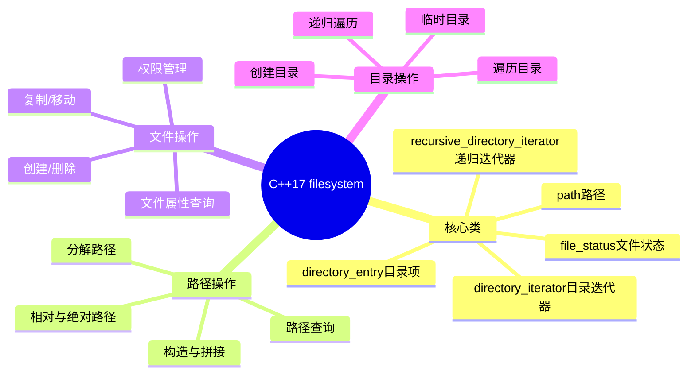
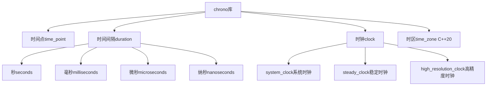

# 9.2 文件与系统编程

> C++17引入了`<filesystem>`库,使文件操作更加跨平台和便捷

## 目录

- [文件系统操作(C++17)](#文件系统操作c17)
- [时间与日期库](#时间与日期库)
- [环境变量与命令行参数](#环境变量与命令行参数)
- [本节小结](#本节小结)

---

## 文件系统操作(C++17)

### 为什么需要`<filesystem>`?

在C++17之前,文件操作主要依赖C标准库或平台特定的API:
- **C标准库**: 功能有限,缺乏现代C++特性
- **POSIX API**: Linux/Unix专用,不可移植
- **Windows API**: Windows专用,不可移植

`<filesystem>`库提供了:
- ✅ 跨平台统一接口
- ✅ 类型安全
- ✅ 异常安全
- ✅ 支持路径操作、文件属性、目录遍历等

### filesystem库概览



### path路径操作

```cpp
#include <filesystem>
#include <iostream>

namespace fs = std::filesystem;

void pathBasics() {
    // 1. 路径构造
    fs::path p1 = "/home/user/documents/file.txt";
    fs::path p2 = "C:\\Users\\user\\file.txt";  // Windows路径
    fs::path p3 = "relative/path/file.txt";

    // 2. 路径拼接
    fs::path base = "/home/user";
    fs::path full = base / "documents" / "file.txt";
    // full = "/home/user/documents/file.txt"

    // 3. 路径分解
    fs::path file = "/home/user/documents/file.txt";

    std::cout << "Root name: " << file.root_name() << "\n";      // (空或"C:")
    std::cout << "Root directory: " << file.root_directory() << "\n";  // "/"
    std::cout << "Root path: " << file.root_path() << "\n";      // "/"
    std::cout << "Relative path: " << file.relative_path() << "\n"; // "home/user/documents/file.txt"
    std::cout << "Parent path: " << file.parent_path() << "\n";   // "/home/user/documents"
    std::cout << "Filename: " << file.filename() << "\n";         // "file.txt"
    std::cout << "Stem: " << file.stem() << "\n";                 // "file"
    std::cout << "Extension: " << file.extension() << "\n";       // ".txt"

    // 4. 路径查询
    std::cout << "Is absolute: " << file.is_absolute() << "\n";   // true
    std::cout << "Is relative: " << file.is_relative() << "\n";   // false
    std::cout << "Empty: " << file.empty() << "\n";               // false

    // 5. 路径转换
    std::string str = file.string();              // 转为字符串
    std::wstring wstr = file.wstring();           // 转为宽字符串
    std::cout << "Native string: " << file.native() << "\n";

    // 6. 路径比较
    fs::path p4 = "/home/user/documents/../user/file.txt";
    fs::path p5 = "/home/user/file.txt";
    std::cout << "Equivalent: " << p4.equivalent(p5) << "\n";    // true
}
```

### 文件状态查询

```cpp
void fileStatusQueries() {
    fs::path file = "example.txt";

    // 1. 文件类型检查
    if (fs::exists(file)) {
        std::cout << "File exists\n";

        if (fs::is_regular_file(file)) {
            std::cout << "It's a regular file\n";
        }

        if (fs::is_directory(file)) {
            std::cout << "It's a directory\n";
        }

        if (fs::is_symlink(file)) {
            std::cout << "It's a symbolic link\n";
        }

        if (fs::is_block_file(file)) {
            std::cout << "It's a block device\n";
        }

        if (fs::is_character_file(file)) {
            std::cout << "It's a character device\n";
        }

        if (fs::is_fifo(file)) {
            std::cout << "It's a named pipe\n";
        }

        if (fs::is_socket(file)) {
            std::cout << "It's a socket\n";
        }

        if (fs::is_other(file)) {
            std::cout << "It's another type of file\n";
        }
    }

    // 2. 文件权限查询
    auto perms = fs::status(file).permissions();

    std::cout << "Owner read: "
              << ((perms & fs::perms::owner_read) != fs::perms::none) << "\n";
    std::cout << "Owner write: "
              << ((perms & fs::perms::owner_write) != fs::perms::none) << "\n";
    std::cout << "Owner exec: "
              << ((perms & fs::perms::owner_exec) != fs::perms::none) << "\n";

    // 3. 文件大小
    if (fs::is_regular_file(file)) {
        std::cout << "File size: "
                  << fs::file_size(file) << " bytes\n";
    }

    // 4. 文件时间
    auto ftime = fs::last_write_time(file);
    std::time_t cftime = decltype(ftime)::clock::to_time_t(ftime);
    std::cout << "Last modified: "
              << std::asctime(std::localtime(&cftime));

    // 5. 硬链接计数
    std::cout << "Hard link count: "
              << fs::hard_link_count(file) << "\n";
}
```

### 文件操作

```cpp
void fileOperations() {
    // 1. 创建文件
    std::ofstream("new_file.txt").put('a');  // 创建空文件
    fs::path file = "new_file.txt";

    // 2. 复制文件
    fs::copy_file(file, "copied_file.txt",
                  fs::copy_options::overwrite_existing);

    // 3. 重命名/移动文件
    fs::rename("old_name.txt", "new_name.txt");

    // 4. 删除文件
    if (fs::remove("to_delete.txt")) {
        std::cout << "File deleted successfully\n";
    }

    // 5. 批量删除
    std::uintmax_t n = fs::remove_all("directory_to_delete");
    std::cout << "Deleted " << n << " files or directories\n";

    // 6. 修改权限
    fs::permissions(file,
                    fs::perms::owner_all |
                    fs::perms::group_read |
                    fs::perms::others_read);

    // 7. 修改文件时间
    auto newTime = fs::file_time_type::clock::now();
    fs::last_write_time(file, newTime);

    // 8. 创建符号链接
    fs::create_symlink("target.txt", "link_to_target");

    // 9. 创建硬链接(Unix-like系统)
    fs::create_hard_link("original.txt", "hard_link.txt");

    // 10. 创建目录链接
    fs::create_directory_symlink("target_dir", "dir_link");
}
```

### 目录操作

```cpp
void directoryOperations() {
    fs::path dir = "my_directory";

    // 1. 创建目录
    fs::create_directory(dir);              // 创建单级目录
    fs::create_directories("a/b/c");        // 创建多级目录

    // 2. 遍历目录(非递归)
    std::cout << "Directory contents:\n";
    for (const auto& entry : fs::directory_iterator(dir)) {
        std::cout << "  " << entry.path().filename() << "\n";
    }

    // 3. 遍历目录(递归)
    std::cout << "Recursive directory contents:\n";
    for (const auto& entry :
         fs::recursive_directory_iterator(dir)) {
        std::cout << "  " << entry.path() << "\n";
    }

    // 4. 带选项的目录遍历
    auto options = fs::directory_options::skip_permission_denied;
    for (const auto& entry :
         fs::recursive_directory_iterator(dir, options)) {
        // 处理每个条目
    }

    // 5. 获取目录项
    fs::directory_entry entry = *fs::directory_iterator(dir).begin();
    std::cout << "Entry: " << entry.path() << "\n";
    std::cout << "Is directory: " << entry.is_directory() << "\n";
    std::cout << "File size: " << entry.file_size() << "\n";

    // 6. 复制目录
    fs::copy("source_dir", "dest_dir",
             fs::copy_options::recursive |
             fs::copy_options::overwrite_existing);

    // 7. 删除空目录
    fs::remove("empty_dir");

    // 8. 临时目录
    fs::path temp_dir = fs::temp_directory_path();
    std::cout << "Temp directory: " << temp_dir << "\n";

    // 9. 当前目录
    fs::path current = fs::current_path();
    std::cout << "Current directory: " << current << "\n";
    fs::current_path("/home/user");  // 改变当前目录

    // 10. 磁盘空间
    auto space = fs::space("/home");
    std::cout << "Capacity: " << space.capacity << "\n";
    std::cout << "Free: " << space.free << "\n";
    std::cout << "Available: " << space.available << "\n";
}
```

### 实用示例:文件查找工具

```cpp
#include <vector>
#include <regex>

class FileFinder {
private:
    std::vector<fs::path> results;

public:
    // 按扩展名查找
    std::vector<fs::path> findByExtension(
        const fs::path& dir,
        const std::string& extension) {

        results.clear();

        for (const auto& entry :
             fs::recursive_directory_iterator(dir)) {
            if (entry.path().extension() == extension) {
                results.push_back(entry.path());
            }
        }

        return results;
    }

    // 按名称模式查找
    std::vector<fs::path> findByPattern(
        const fs::path& dir,
        const std::string& pattern) {

        results.clear();
        std::regex regex(pattern);

        for (const auto& entry :
             fs::recursive_directory_iterator(dir)) {
            std::string filename = entry.path().filename().string();
            if (std::regex_match(filename, regex)) {
                results.push_back(entry.path());
            }
        }

        return results;
    }

    // 按大小查找
    std::vector<fs::path> findBySize(
        const fs::path& dir,
        std::uintmax_t minSize,
        std::uintmax_t maxSize = UINT64_MAX) {

        results.clear();

        for (const auto& entry :
             fs::recursive_directory_iterator(dir)) {
            if (fs::is_regular_file(entry)) {
                std::uintmax_t size = entry.file_size();
                if (size >= minSize && size <= maxSize) {
                    results.push_back(entry.path());
                }
            }
        }

        return results;
    }

    // 按修改时间查找
    std::vector<fs::path> findByTime(
        const fs::path& dir,
        fs::file_time_type after,
        fs::file_time_type before = fs::file_time_type::max()) {

        results.clear();

        for (const auto& entry :
             fs::recursive_directory_iterator(dir)) {
            auto lastWrite = entry.last_write_time();
            if (lastWrite >= after && lastWrite <= before) {
                results.push_back(entry.path());
            }
        }

        return results;
    }
};

void fileFinderDemo() {
    FileFinder finder;

    // 查找所有.cpp文件
    auto cppFiles = finder.findByExtension(
        "/home/user/project",
        ".cpp"
    );

    // 查找匹配模式"test_*.txt"的文件
    auto testFiles = finder.findByPattern(
        "/home/user/project",
        "test_.*\\.txt"
    );

    // 查找大于1MB的文件
    auto largeFiles = finder.findBySize(
        "/home/user/project",
        1024 * 1024
    );

    // 查找最近7天修改的文件
    auto now = fs::file_time_type::clock::now();
    auto weekAgo = now - std::chrono::hours(24 * 7);
    auto recentFiles = finder.findByTime(
        "/home/user/project",
        weekAgo,
        now
    );
}
```

### 路径操作对比

| 操作 | C风格 | C++17 filesystem | 优势 |
|------|-------|------------------|------|
| 路径拼接 | `strcat` | `operator/` | 类型安全,自动处理分隔符 |
| 获取文件名 | `strrchr` | `filename()` | 简洁直观 |
| 获取扩展名 | 手动解析 | `extension()` | 可靠准确 |
| 检查存在 | `stat` | `exists()` | 跨平台 |
| 遍历目录 | `opendir`/`readdir` | `directory_iterator` | RAII风格 |
| 复制文件 | `CopyFile`/`cp` | `copy_file()` | 统一接口 |
| 获取大小 | `stat` | `file_size()` | 直接返回 |

### 错误处理

```cpp
void filesystemErrorHandling() {
    fs::path file = "nonexistent.txt";

    // 1. 使用异常
    try {
        fs::copy_file(file, "backup.txt");
    } catch (const fs::filesystem_error& e) {
        std::cerr << "Filesystem error: " << e.what() << "\n";
        std::cerr << "Path1: " << e.path1() << "\n";
        std::cerr << "Path2: " << e.path2() << "\n";
        std::cerr << "Error code: " << e.code() << "\n";
    }

    // 2. 使用错误码(不抛异常)
    std::error_code ec;
    fs::copy_file(file, "backup.txt", ec);

    if (ec) {
        std::cerr << "Copy failed: " << ec.message() << "\n";
    }

    // 3. 检查操作结果
    bool success = fs::create_directory("new_dir", ec);
    if (!success && ec) {
        std::cerr << "Failed to create directory: "
                  << ec.message() << "\n";
    }
}
```

### 最佳实践

```cpp
// ✅ 推荐做法

// 1. 使用filesystem代替平台API
fs::path configFile = getConfigPath();
std::ifstream config(configFile);  // 自动转换

// 2. 使用路径拼接而不是字符串拼接
fs::path fullPath = baseDir / "subdir" / "file.txt";

// 3. 检查路径存在性
if (fs::exists(file)) {
    // 处理文件
}

// 4. 使用异常处理保证安全
try {
    fs::remove_all(dir);
} catch (const fs::filesystem_error& e) {
    std::cerr << "Error: " << e.what() << "\n";
}

// 5. 使用RAII确保资源释放
{
    std::ofstream file(path);
    // 自动关闭
}

// ❌ 避免

// 1. 硬编码路径分隔符
// fs::path p = "dir/subdir/file";  // Linux
// fs::path p = "dir\\subdir\\file"; // Windows

// 2. 假设路径格式
// if (path.string().find("\\") != std::string::npos) {}

// 3. 忽略错误处理
// fs::remove_all(dir);  // 可能失败

// 4. 竞态条件
// if (fs::exists("file")) {
//     fs::remove("file");  // 文件可能被其他进程删除
// }
```

---

## 时间与日期库

### 为什么需要`<chrono>`?

C++11引入的`<chrono>`库提供了:
- 类型安全的时间表示
- 高精度时钟
- 时间间隔计算
- 时区支持(C++20)

### chrono库概览



### duration时间间隔

```cpp
#include <chrono>
#include <iostream>

void durationBasics() {
    using namespace std::chrono;

    // 1. 预定义时间单位
    seconds sec(5);                      // 5秒
    milliseconds ms(1000);               // 1000毫秒
    microseconds us(1000000);            // 1000000微秒
    nanoseconds ns(1000000000);          // 1000000000纳秒

    // 2. 时间间隔字面量(C++14)
    auto sec2 = 5s;                      // 5秒
    auto ms2 = 100ms;                    // 100毫秒
    auto us2 = 50us;                     // 50微秒
    auto ns2 = 100ns;                    // 100纳秒

    // 3. 时间间隔转换
    milliseconds ms3(1000);
    seconds sec3 = duration_cast<seconds>(ms3);  // 1秒
    milliseconds ms4 = sec3;                     // 隐式转换:1000毫秒

    // 4. 时间间隔运算
    seconds a = 10s;
    seconds b = 5s;

    seconds sum = a + b;                 // 15秒
    seconds diff = a - b;                // 5秒
    seconds product = a * 2;             // 20秒
    seconds division = a / 2;            // 5秒

    // 5. 浮点时间间隔
    duration<double> fsec(3.5);          // 3.5秒
    duration<double, std::milli> fms(fsec);  // 3500毫秒

    // 6. 自定义时间单位
    using days = duration<int, std::ratio<86400>>;
    using weeks = duration<int, std::ratio<604800>>;
    using years = duration<double, std::ratio<31556952>>;

    days d(7);
    weeks w = duration_cast<weeks>(d);   // 1周

    // 7. 时间间隔比较
    if (a > b) {
        std::cout << "a is greater than b\n";
    }

    // 8. 最小/最大值
    constexpr auto max_duration = seconds::max();
    constexpr auto min_duration = nanoseconds::zero();

    std::cout << "Max seconds: " << max_duration.count() << "\n";
}
```

### time_point时间点

```cpp
void timePointBasics() {
    using namespace std::chrono;

    // 1. 获取当前时间
    auto now = system_clock::now();
    auto steady_now = steady_clock::now();

    // 2. 时间点运算
    auto future = now + seconds(10);
    auto past = now - hours(1);

    // 3. 计算时间差
    auto diff = future - now;
    auto seconds_diff = duration_cast<seconds>(diff);

    // 4. 时间点转换
    auto time_since_epoch = now.time_since_epoch();
    auto seconds_since_epoch =
        duration_cast<seconds>(time_since_epoch);

    std::cout << "Seconds since epoch: "
              << seconds_since_epoch.count() << "\n";

    // 5. 转换为C风格时间
    std::time_t tt = system_clock::to_time_t(now);
    std::tm* local_tm = std::localtime(&tt);

    std::cout << "Local time: "
              << std::put_time(local_tm, "%Y-%m-%d %H:%M:%S") << "\n";

    // 6. 从C风格时间构造
    std::tm tm = {};
    tm.tm_year = 124;  // 2024年
    tm.tm_mon = 0;     // 1月
    tm.tm_mday = 1;    // 1日
    tm.tm_hour = 0;
    tm.tm_min = 0;
    tm.tm_sec = 0;

    std::time_t tt2 = std::mktime(&tm);
    auto time_point =
        system_clock::from_time_t(tt2);
}
```

### 时钟类型对比

| 时钟类型 | 特点 | 适用场景 | 单调性 | 精度 |
|---------|------|----------|--------|------|
| `system_clock` | 系统实时时钟,可能被调整 | 获取当前时间,时间戳 | 否 | 中等 |
| `steady_clock` | 单调时钟,保证不会倒退 | 性能测量,超时计算 | 是 | 高 |
| `high_resolution_clock` | 可能是最小精度的时钟别名 | 高精度计时 | 取决于实现 | 最高 |

### 时钟使用示例

```cpp
void clockExamples() {
    using namespace std::chrono;

    // 1. 使用steady_clock测量执行时间
    auto start = steady_clock::now();

    // 执行一些操作
    std::vector<int> v(1000000);
    std::sort(v.begin(), v.end());

    auto end = steady_clock::now();
    auto duration = duration_cast<milliseconds>(end - start);

    std::cout << "Sorting took: " << duration.count() << "ms\n";

    // 2. 使用system_clock获取当前日期
    auto now = system_clock::now();
    std::time_t now_time = system_clock::to_time_t(now);
    std::cout << "Current date: "
              << std::ctime(&now_time);

    // 3. 计算未来时间点
    auto deadline = steady_clock::now() + seconds(30);

    // 4. 睡眠指定时间
    std::this_thread::sleep_for(milliseconds(100));

    // 5. 睡眠直到指定时间点
    std::this_thread::sleep_until(deadline);

    // 6. 高精度计时
    auto t1 = high_resolution_clock::now();
    // 待测代码
    auto t2 = high_resolution_clock::now();
    auto duration_ns =
        duration_cast<nanoseconds>(t2 - t1);
}
```

### 格式化输出时间

```cpp
#include <iomanip>
#include <sstream>

void formatTime() {
    using namespace std::chrono;

    auto now = system_clock::now();
    std::time_t tt = system_clock::to_time_t(now);
    std::tm* local_tm = std::localtime(&tt);

    // 1. 使用put_time格式化
    std::cout << std::put_time(local_tm,
                                "%Y-%m-%d %H:%M:%S") << "\n";
    std::cout << std::put_time(local_tm,
                                "%A, %B %d, %Y") << "\n";

    // 2. 常用格式说明符
    // %Y: 四位年份 (2024)
    // %m: 月份 (01-12)
    // %d: 日期 (01-31)
    // %H: 小时 (00-23)
    // %M: 分钟 (00-59)
    // %S: 秒 (00-60)
    // %A: 星期名称
    // %B: 月份名称

    // 3. ISO 8601格式
    std::ostringstream oss;
    oss << std::put_time(local_tm, "%FT%T");
    std::cout << "ISO 8601: " << oss.str() << "\n";

    // 4. 自定义格式化函数
    auto formatTimePoint = [](const system_clock::time_point& tp,
                              const std::string& format) -> std::string {
        std::time_t tt = system_clock::to_time_t(tp);
        std::tm* local_tm = std::localtime(&tt);
        std::ostringstream oss;
        oss << std::put_time(local_tm, format.c_str());
        return oss.str();
    };

    std::string formatted =
        formatTimePoint(now, "%Y年%m月%d日 %H时%M分%S秒");
    std::cout << formatted << "\n";
}
```

### 时间计算示例

```cpp
void timeCalculations() {
    using namespace std::chrono;

    // 1. 计算两个时间点之间的间隔
    auto birth = system_clock::time_point{} +
                 hours(24 * 365 * 30);  // 约30年
    auto now = system_clock::now();

    auto age = now - birth;
    auto age_days = duration_cast<days>(age);

    std::cout << "Age: " << age_days.count() << " days\n";

    // 2. 计算未来日期
    auto today = system_clock::now();
    auto next_week = today + days(7);

    std::time_t next_week_time =
        system_clock::to_time_t(next_week);
    std::cout << "Next week: "
              << std::ctime(&next_week_time);

    // 3. 计算工作日(简化版)
    auto addBusinessDays = [](system_clock::time_point start,
                              int days) {
        auto current = start;
        int added = 0;

        while (added < days) {
            current += days(1);
            std::time_t tt = system_clock::to_time_t(current);
            std::tm* local_tm = std::localtime(&tt);

            // 周六(6)和周日(0)不是工作日
            if (local_tm->tm_wday != 0 && local_tm->tm_wday != 6) {
                ++added;
            }
        }

        return current;
    };

    auto deadline = addBusinessDays(today, 5);

    // 4. 计算时间段内的日期
    auto start_date = system_clock::now();
    auto end_date = start_date + days(30);

    for (auto date = start_date; date < end_date;
         date += days(1)) {
        std::time_t tt = system_clock::to_time_t(date);
        std::tm* local_tm = std::localtime(&tt);
        std::cout << std::put_time(local_tm, "%Y-%m-%d") << "\n";
    }
}
```

### 性能测量工具

```cpp
class Timer {
private:
    std::chrono::steady_clock::time_point start_time;
    std::string name;

public:
    explicit Timer(const std::string& n)
        : name(n) {
        start_time = std::chrono::steady_clock::now();
    }

    ~Timer() {
        auto end_time = std::chrono::steady_clock::now();
        auto duration = std::chrono::duration_cast<
            std::chrono::milliseconds>(
            end_time - start_time);

        std::cout << name << " took: "
                  << duration.count() << "ms\n";
    }

    void elapsed() {
        auto now = std::chrono::steady_clock::now();
        auto duration = std::chrono::duration_cast<
            std::chrono::milliseconds>(now - start_time);

        std::cout << name << " elapsed: "
                  << duration.count() << "ms\n";
    }
};

void performanceMeasurement() {
    Timer timer("Sorting operation");

    std::vector<int> v(1000000);
    std::generate(v.begin(), v.end(),
                  []() { return rand(); });

    std::sort(v.begin(), v.end());

    timer.elapsed();  // 打印已过时间
}  // 析构时打印总时间
```

### 最佳实践

```cpp
// ✅ 推荐做法

// 1. 使用steady_clock测量时间间隔
auto start = std::chrono::steady_clock::now();
// ...
auto end = std::chrono::steady_clock::now();

// 2. 使用system_clock获取日历时间
auto now = std::chrono::system_clock::now();

// 3. 使用时间字面量提高可读性
std::this_thread::sleep_for(100ms);
auto timeout = 5s;

// 4. 使用duration_cast显式转换
auto ms = std::chrono::duration_cast<
    std::chrono::milliseconds>(seconds);

// 5. 使用RAII模式管理计时
Timer t("operation");

// ❌ 避免

// 1. 使用time(nullptr)获取高精度时间
// auto t = time(nullptr);  // 精度低

// 2. 假设时钟是单调的
// auto t = system_clock::now();  // 可能被调整

// 3. 忽略时钟类型差异
// 所有时钟可以互换使用

// 4. 硬编码时间单位
// std::this_thread::sleep_for(
//     std::chrono::milliseconds(100));
```

---

## 环境变量与命令行参数

### 命令行参数

```cpp
#include <iostream>
#include <vector>
#include <string>

int main(int argc, char* argv[]) {
    // 1. 基本参数访问
    std::cout << "Program name: " << argv[0] << "\n";

    for (int i = 1; i < argc; ++i) {
        std::cout << "Arg " << i << ": " << argv[i] << "\n";
    }

    // 2. 收集参数到容器
    std::vector<std::string> args(argv, argv + argc);

    // 3. 解析命名参数
    // 格式: program --input file.txt --output result.txt
    std::string inputFile, outputFile;

    for (int i = 1; i < argc; ++i) {
        std::string arg = argv[i];

        if (arg == "--input" && i + 1 < argc) {
            inputFile = argv[++i];
        } else if (arg == "--output" && i + 1 < argc) {
            outputFile = argv[++i];
        }
    }

    std::cout << "Input: " << inputFile << "\n";
    std::cout << "Output: " << outputFile << "\n";

    // 4. 解析标志参数
    bool verbose = false;
    bool debug = false;

    for (int i = 1; i < argc; ++i) {
        std::string arg = argv[i];

        if (arg == "-v" || arg == "--verbose") {
            verbose = true;
        } else if (arg == "-d" || arg == "--debug") {
            debug = true;
        }
    }

    // 5. 解析键值对
    // 格式: program key1=value1 key2=value2
    std::map<std::string, std::string> params;

    for (int i = 1; i < argc; ++i) {
        std::string arg = argv[i];
        auto pos = arg.find('=');

        if (pos != std::string::npos) {
            std::string key = arg.substr(0, pos);
            std::string value = arg.substr(pos + 1);
            params[key] = value;
        }
    }

    return 0;
}
```

### 参数解析类

```cpp
#include <map>
#include <sstream>
#include <algorithm>

class ArgumentParser {
private:
    std::map<std::string, std::string> values;
    std::map<std::string, std::string> defaults;
    std::map<std::string, std::string> descriptions;
    std::vector<std::string> flags;
    std::string programName;

public:
    ArgumentParser(const std::string& name)
        : programName(name) {}

    // 添加命名参数
    void addArgument(const std::string& name,
                     const std::string& defaultValue = "",
                     const std::string& description = "") {
        defaults[name] = defaultValue;
        descriptions[name] = description;
    }

    // 添加标志参数
    void addFlag(const std::string& name,
                 const std::string& description = "") {
        flags.push_back(name);
        descriptions[name] = description;
    }

    // 解析参数
    void parse(int argc, char* argv[]) {
        for (int i = 1; i < argc; ++i) {
            std::string arg = argv[i];

            // 检查是否为命名参数
            if (arg.find("--") == 0) {
                std::string name = arg.substr(2);

                // 检查是否为标志
                if (std::find(flags.begin(), flags.end(), name)
                    != flags.end()) {
                    values[name] = "true";
                } else if (i + 1 < argc) {
                    // 命名参数
                    values[name] = argv[++i];
                }
            }
        }

        // 应用默认值
        for (const auto& [name, value] : defaults) {
            if (values.find(name) == values.end()) {
                values[name] = value;
            }
        }
    }

    // 获取参数值
    template<typename T>
    T get(const std::string& name) const {
        auto it = values.find(name);
        if (it != values.end()) {
            std::istringstream iss(it->second);
            T value;
            iss >> value;
            return value;
        }
        return T{};
    }

    // 获取字符串参数
    std::string getString(const std::string& name) const {
        return get<std::string>(name);
    }

    // 获取整数参数
    int getInt(const std::string& name) const {
        return get<int>(name);
    }

    // 检查标志是否设置
    bool hasFlag(const std::string& name) const {
        auto it = values.find(name);
        return it != values.end() && it->second == "true";
    }

    // 打印帮助信息
    void printHelp() const {
        std::cout << "Usage: " << programName << " [options]\n\n";

        std::cout << "Named arguments:\n";
        for (const auto& [name, description] : descriptions) {
            if (std::find(flags.begin(), flags.end(), name)
                == flags.end()) {
                std::cout << "  --" << name;
                auto it = defaults.find(name);
                if (it != defaults.end() && !it->second.empty()) {
                    std::cout << " (default: " << it->second << ")";
                }
                std::cout << "\n    " << description << "\n\n";
            }
        }

        std::cout << "Flags:\n";
        for (const auto& flag : flags) {
            auto it = descriptions.find(flag);
            std::cout << "  --" << flag << "\n";
            if (it != descriptions.end()) {
                std::cout << "    " << it->second << "\n";
            }
            std::cout << "\n";
        }
    }
};

void argumentParserDemo(int argc, char* argv[]) {
    ArgumentParser parser(argv[0]);

    parser.addArgument("input", "", "Input file path");
    parser.addArgument("output", "result.txt", "Output file path");
    parser.addArgument("count", "10", "Number of iterations");
    parser.addFlag("verbose", "Enable verbose output");
    parser.addFlag("help", "Show this help message");

    parser.parse(argc, argv);

    if (parser.hasFlag("help")) {
        parser.printHelp();
        return;
    }

    auto input = parser.getString("input");
    auto output = parser.getString("output");
    auto count = parser.getInt("count");
    bool verbose = parser.hasFlag("verbose");

    std::cout << "Input: " << input << "\n";
    std::cout << "Output: " << output << "\n";
    std::cout << "Count: " << count << "\n";
    std::cout << "Verbose: " << std::boolalpha << verbose << "\n";
}
```

### 环境变量

```cpp
#include <cstdlib>
#include <string>

void environmentVariables() {
    // 1. 获取环境变量
    char* path = std::getenv("PATH");
    if (path) {
        std::cout << "PATH: " << path << "\n";
    }

    // 2. 安全的获取方式
    auto getEnv = [](const std::string& name) -> std::string {
        char* value = std::getenv(name.c_str());
        return value ? value : "";
    };

    std::string home = getEnv("HOME");
    std::string user = getEnv("USER");

    // 3. 设置环境变量
    // 注意:这只影响当前进程和子进程
    std::setenv("MY_VAR", "my_value", 1);  // 1表示覆盖

    // 4. 删除环境变量
    std::unsetenv("MY_VAR");

    // 5. 检查环境变量是否存在
    if (std::getenv("MY_VAR") != nullptr) {
        std::cout << "MY_VAR exists\n";
    }

    // 6. 环境变量辅助类
    class Environment {
    public:
        static std::string get(const std::string& name,
                               const std::string& defaultValue = "") {
            char* value = std::getenv(name.c_str());
            return value ? value : defaultValue;
        }

        static void set(const std::string& name,
                       const std::string& value,
                       bool overwrite = true) {
            std::setenv(name.c_str(), value.c_str(), overwrite ? 1 : 0);
        }

        static void unset(const std::string& name) {
            std::unsetenv(name.c_str());
        }

        static bool exists(const std::string& name) {
            return std::getenv(name.c_str()) != nullptr;
        }
    };

    // 使用示例
    std::string path2 = Environment::get("PATH", "");
    Environment::set("MY_APP_DIR", "/opt/myapp");
}
```

### 配置文件管理

```cpp
#include <fstream>
#include <sstream>

class ConfigManager {
private:
    std::map<std::string, std::string> config;

public:
    // 从文件加载配置
    bool loadFromFile(const std::string& filename) {
        std::ifstream file(filename);
        if (!file.is_open()) {
            return false;
        }

        std::string line;
        while (std::getline(file, line)) {
            // 跳过空行和注释
            if (line.empty() || line[0] == '#') {
                continue;
            }

            // 解析key=value格式
            auto pos = line.find('=');
            if (pos != std::string::npos) {
                std::string key = line.substr(0, pos);
                std::string value = line.substr(pos + 1);

                // 去除空格
                key.erase(0, key.find_first_not_of(" \t"));
                key.erase(key.find_last_not_of(" \t") + 1);
                value.erase(0, value.find_first_not_of(" \t"));
                value.erase(value.find_last_not_of(" \t") + 1);

                config[key] = value;
            }
        }

        return true;
    }

    // 保存配置到文件
    bool saveToFile(const std::string& filename) {
        std::ofstream file(filename);
        if (!file.is_open()) {
            return false;
        }

        for (const auto& [key, value] : config) {
            file << key << "=" << value << "\n";
        }

        return true;
    }

    // 获取配置值
    template<typename T>
    T get(const std::string& key,
          const T& defaultValue = T{}) const {
        auto it = config.find(key);
        if (it != config.end()) {
            std::istringstream iss(it->second);
            T value;
            iss >> value;
            return value;
        }
        return defaultValue;
    }

    // 设置配置值
    template<typename T>
    void set(const std::string& key, const T& value) {
        std::ostringstream oss;
        oss << value;
        config[key] = oss.str();
    }

    // 检查配置是否存在
    bool has(const std::string& key) const {
        return config.find(key) != config.end();
    }
};

void configManagerDemo() {
    ConfigManager config;

    // 加载配置
    if (!config.loadFromFile("app.conf")) {
        std::cerr << "Failed to load config file\n";
    }

    // 获取配置值
    std::string server = config.get<std::string>("server", "localhost");
    int port = config.get<int>("port", 8080);
    bool debug = config.get<bool>("debug", false);

    std::cout << "Server: " << server << "\n";
    std::cout << "Port: " << port << "\n";
    std::cout << "Debug: " << std::boolalpha << debug << "\n";

    // 修改配置
    config.set("port", 9090);

    // 保存配置
    config.saveToFile("app.conf");
}
```

### 综合示例:应用程序配置

```cpp
class AppSettings {
private:
    ConfigManager fileConfig;
    ArgumentParser argParser;
    std::string configFile = "app.conf";

public:
    AppSettings(int argc, char* argv[])
        : argParser(argv[0]) {

        // 定义命令行参数
        argParser.addArgument("config", "app.conf", "Config file path");
        argParser.addArgument("verbose", "false", "Verbose output");
        argParser.addArgument("log-level", "INFO", "Log level");
        argParser.addFlag("help", "Show help");
        argParser.addFlag("version", "Show version");

        argParser.parse(argc, argv);
    }

    // 初始化配置
    bool initialize() {
        if (argParser.hasFlag("help")) {
            argParser.printHelp();
            return false;
        }

        if (argParser.hasFlag("version")) {
            std::cout << "Application version 1.0.0\n";
            return false;
        }

        // 加载配置文件
        configFile = argParser.getString("config");
        if (!fileConfig.loadFromFile(configFile)) {
            std::cerr << "Warning: Failed to load config file: "
                      << configFile << "\n";
        }

        return true;
    }

    // 获取配置(优先级:命令行 > 配置文件 > 默认值)
    template<typename T>
    T get(const std::string& name,
          const T& defaultValue = T{}) const {
        // 先检查命令行参数
        if (argParser.has(name)) {
            return argParser.get<T>(name);
        }

        // 再检查配置文件
        if (fileConfig.has(name)) {
            return fileConfig.get<T>(name, defaultValue);
        }

        // 返回默认值
        return defaultValue;
    }

    // 字符串配置
    std::string getString(const std::string& name,
                          const std::string& defaultValue = "") const {
        return get<std::string>(name, defaultValue);
    }

    // 整数配置
    int getInt(const std::string& name,
               int defaultValue = 0) const {
        return get<int>(name, defaultValue);
    }

    // 布尔配置
    bool getBool(const std::string& name,
                 bool defaultValue = false) const {
        std::string value = getString(name, defaultValue ? "true" : "false");
        return value == "true" || value == "1";
    }

    // 显示当前配置
    void display() const {
        std::cout << "Configuration:\n";
        std::cout << "  Config file: " << configFile << "\n";
        std::cout << "  Verbose: " << getBool("verbose") << "\n";
        std::cout << "  Log level: " << getString("log-level") << "\n";
    }
};

int main(int argc, char* argv[]) {
    AppSettings settings(argc, argv);

    if (!settings.initialize()) {
        return 0;
    }

    settings.display();

    return 0;
}
```

### 参数来源优先级

| 来源 | 优先级 | 持久性 | 典型用途 |
|------|--------|--------|----------|
| 命令行参数 | 最高 | 否 | 临时覆盖,调试 |
| 配置文件 | 中 | 是 | 应用程序设置 |
| 环境变量 | 中 | 会话级 | 部署配置 |
| 代码默认值 | 最低 | - | 合理默认值 |

### 最佳实践

```cpp
// ✅ 推荐做法

// 1. 优先使用专门的参数解析库
// 如: getopt, program_options

// 2. 提供清晰的错误信息
if (argParser.hasFlag("help")) {
    argParser.printHelp();
    return 0;
}

// 3. 使用合理的默认值
int port = getPortFromConfig(8080);

// 4. 验证参数有效性
int port = argParser.getInt("port");
if (port < 1 || port > 65535) {
    std::cerr << "Invalid port number\n";
    return 1;
}

// 5. 支持多种配置来源
// 优先级:命令行 > 配置文件 > 环境变量 > 默认值

// 6. 记录配置加载过程
if (verbose) {
    std::cout << "Loaded config from: " << configFile << "\n";
}

// ❌ 避免

// 1. 直接访问argv
// if (argc > 1 && strcmp(argv[1], "-v") == 0) {}

// 2. 不提供帮助信息
// 用户不知道如何使用程序

// 3. 硬编码配置
// const char* server = "localhost";

// 4. 忽略参数验证
// 任何用户输入都应验证

// 5. 混淆配置来源
// 用户不清楚哪个配置生效
```

---

## 本节小结

### 知识点回顾

1. **文件系统操作**:
   - `std::filesystem`路径操作
   - 文件状态查询
   - 文件和目录操作
   - 错误处理

2. **时间与日期**:
   - `std::chrono`时间间隔和时间点
   - 时钟类型
   - 时间计算
   - 格式化输出

3. **环境与参数**:
   - 命令行参数解析
   - 环境变量操作
   - 配置文件管理
   - 多源配置优先级

### 文件系统操作速查表

| 操作 | 函数 | 说明 |
|------|------|------|
| 路径拼接 | `p1 / p2` | 连接路径 |
| 检查存在 | `exists(p)` | 文件/目录是否存在 |
| 复制文件 | `copy_file(src, dst)` | 复制文件 |
| 删除文件 | `remove(p)` | 删除单个文件 |
| 删除目录 | `remove_all(p)` | 递归删除 |
| 遍历目录 | `directory_iterator(p)` | 非递归遍历 |
| 递归遍历 | `recursive_directory_iterator(p)` | 递归遍历 |
| 获取大小 | `file_size(p)` | 文件字节数 |
| 修改时间 | `last_write_time(p)` | 最后修改时间 |

### 时间操作速查表

| 操作 | 代码 | 说明 |
|------|------|------|
| 当前时间 | `system_clock::now()` | 获取当前时间点 |
| 时间间隔 | `100ms`, `5s` | 时间字面量 |
| 时间差 | `end - start` | 计算时间差 |
| 时间转换 | `duration_cast<T>()` | 转换时间单位 |
| 高精度计时 | `steady_clock::now()` | 性能测量 |
| 格式化 | `put_time(tm, format)` | 格式化输出 |

### 最佳实践总结

```cpp
// ✅ 推荐做法

// 1. 使用filesystem代替平台API
fs::copy_file(src, dst);

// 2. 使用chrono代替time.h
auto now = std::chrono::system_clock::now();

// 3. 使用参数解析库
ArgumentParser parser(argc, argv);

// 4. 提供清晰的错误信息
try {
    fs::remove_all(dir);
} catch (const fs::filesystem_error& e) {
    std::cerr << "Error: " << e.what() << "\n";
}

// 5. 验证所有输入
if (port < 1 || port > 65535) {
    // 处理错误
}

// ❌ 避免

// 1. 使用C风格文件API
// FILE* file = fopen("file.txt", "r");

// 2. 硬编码路径
// fs::path p = "/home/user/file.txt";

// 3. 忽略错误处理
// fs::remove_all(dir);  // 可能失败

// 4. 不提供配置选项
// 所有配置硬编码
```

### 学习建议

1. **掌握filesystem**: 替代传统文件操作,提高可移植性
2. **学习chrono**: 类型安全的时间处理
3. **实现配置系统**: 命令行+配置文件+环境变量
4. **跨平台开发**: 注意不同平台的差异
5. **错误处理**: 使用异常或错误码处理失败

### 常用库推荐

1. **文件系统**: `std::filesystem` (C++17)
2. **时间处理**: `std::chrono`
3. **参数解析**:
   - `getopt` (POSIX)
   - Boost.Program_options
4. **配置文件**:
   - JSON: nlohmann/json
   - YAML: yaml-cpp
   - INI: SimpleIni

### 练习

1. 实现一个文件查找工具,支持按名称、大小、时间查找
2. 编写一个程序计算并显示代码库的统计信息
3. 实现一个支持多配置源的配置管理系统
4. 编写一个性能测试工具,使用chrono测量执行时间

---

**下一节:9.3-性能优化** - 提升程序性能的技巧
