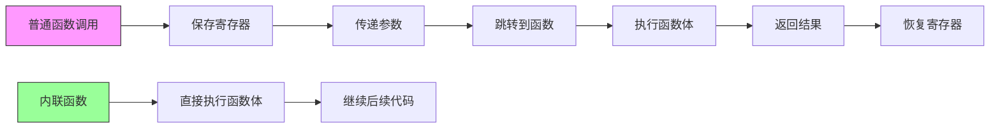
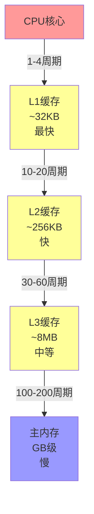
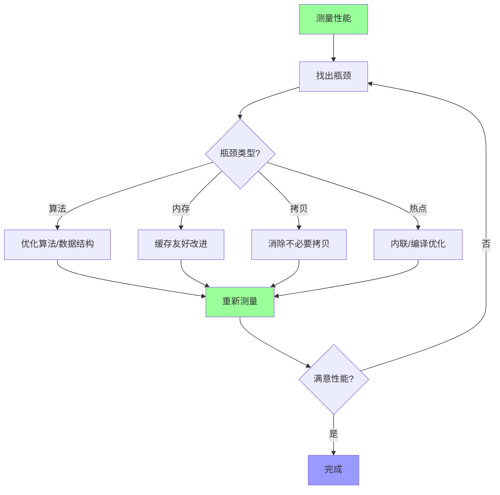

# 9.3 性能优化

> 性能优化是一个系统工程,需要理解编译器、CPU和内存的工作原理

## 目录

- [内联优化](#内联优化)
- [缓存友好编程](#缓存友好编程)
- [避免不必要的拷贝](#避免不必要的拷贝)
- [编译器优化选项](#编译器优化选项)
- [本节小结](#本节小结)

---

## 内联优化

### 什么是内联函数?

内联函数是一种编译器优化技术,它将函数调用替换为函数体本身,消除函数调用的开销。



### 内联函数基础

```cpp
// 1. 使用inline关键字建议编译器内联
inline int add(int a, int b) {
    return a + b;
}

// 2. 在类定义内定义成员函数默认为inline
class Calculator {
public:
    // 隐式inline
    int multiply(int a, int b) {
        return a * b;
    }

    // 显式inline
    inline int divide(int a, int b);
};

// 3. 在类外定义也需要inline
inline int Calculator::divide(int a, int b) {
    return a / b;
}

// 4. 内联函数与宏的对比
// ❌ 宏:不安全,无类型检查
#define SQUARE(x) ((x) * (x))

// ✅ 内联函数:类型安全,可调试
inline int square(int x) {
    return x * x;
}

void inlineDemo() {
    // 宏的问题
    int result = SQUARE(2 + 3);  // 展开为 ((2+3)*(2+3))=25,正确
    // 但 SQUARE(++x) 会有副作用

    // 内联函数安全
    result = square(2 + 3);      // 结果为25
}
```

### 内联函数的优势与劣势

| 方面 | 优势 | 劣势 |
|------|------|------|
| 性能 | 消除调用开销 | 可能增加代码大小 |
| 优化 | 启用更多优化机会 | 指令缓存不友好 |
| 调试 | 更容易单步调试 | 调试信息可能混乱 |
| 维护 | 代码结构清晰 | 可能导致代码膨胀 |
| 编译 | 需要看到函数定义 | 增加编译时间 |

### 内联函数使用场景

```cpp
// 1. 简单的getter/setter
class Person {
private:
    std::string name;
    int age;

public:
    // 适合内联:简单操作
    inline const std::string& getName() const {
        return name;
    }

    inline void setName(const std::string& n) {
        name = n;
    }

    inline int getAge() const {
        return age;
    }

    inline void setAge(int a) {
        age = a;
    }
};

// 2. 小型工具函数
inline int clamp(int value, int min, int max) {
    return value < min ? min : (value > max ? max : value);
}

inline bool isEven(int n) {
    return n % 2 == 0;
}

// 3. 模板函数(通常在头文件中)
template<typename T>
inline const T& max(const T& a, const T& b) {
    return a < b ? b : a;
}

template<typename T>
inline void swap(T& a, T& b) {
    T temp = a;
    a = b;
    b = temp;
}

// 4. 不适合内联的函数
// ❌ 大型函数
void processLargeData(std::vector<int>& data);

// ❌ 包含循环的函数
void bubbleSort(int arr[], int n);

// ❌ 递归函数
int fibonacci(int n);
```

### 内联与代码膨胀

```cpp
// 代码膨胀示例
class String {
private:
    char* data;
    size_t size;

public:
    // 内联这个简单函数是合理的
    inline size_t length() const {
        return size;
    }

    // 内联这个复杂函数可能导致代码膨胀
    inline String substring(size_t start, size_t end) const {
        // 复杂逻辑...
        return *this;
    }
};

// 编译器的内联决策
void compilerInliningDecision() {
    // 编译器可能决定内联
    for (int i = 0; i < 100; ++i) {
        int x = add(i, i + 1);  // 可能内联
    }

    // 编译器可能拒绝内联(过大或复杂)
    for (int i = 0; i < 100; ++i) {
        complexOperation(i);    // 可能不内联
    }
}
```

### 强制内联与禁止内联

```cpp
// 1. 强制内联(编译器可能忽略)
// GCC/Clang
__attribute__((always_inline)) int forceInline1(int x) {
    return x * 2;
}

// MSVC
__forceinline int forceInline2(int x) {
    return x * 2;
}

// 2. 禁止内联
// GCC/Clang
__attribute__((noinline)) int noInline1(int x) {
    return x * 2;
}

// MSVC
__declspec(noinline) int noInline2(int x) {
    return x * 2;
}

// 3. 使用场景
void usageExample() {
    // 强制内联热路径代码
    __attribute__((always_inline))
    int hotPath(int x) {
        return x * x;
    }

    // 禁止内联以便调试或分析
    __attribute__((noinline))
    int debugTarget(int x) {
        // 这个函数的调用容易定位
        return x * 2;
    }
}
```

### 内联与链接

```cpp
// 头文件 inline_functions.h
#ifndef INLINE_FUNCTIONS_H
#define INLINE_FUNCTIONS_H

// inline函数必须在每个使用它的编译单元中可见
// 因此inline函数通常定义在头文件中

inline int square(int x) {
    return x * x;
}

// 如果在.cpp文件中定义inline函数
// 链接器会报错(除非使用internal linkage)

#endif // INLINE_FUNCTIONS_H
```

### 内联函数最佳实践

```cpp
// ✅ 推荐做法

// 1. 对小型、频繁调用的函数使用inline
class Point {
    int x_, y_;
public:
    inline int x() const { return x_; }
    inline int y() const { return y_; }
    inline void setX(int x) { x_ = x; }
    inline void setY(int y) { y_ = y; }
};

// 2. 将inline函数定义在头文件中
// point.h
class Point {
    inline int x() const;
};

inline int Point::x() const {
    return x_;
}

// 3. 信任编译器的优化
// 大多数现代编译器能自动做出好的决策

// ❌ 避免

// 1. 对大型函数使用inline
// inline void processLargeArray(int* arr, size_t size);

// 2. 过度使用inline导致代码膨胀
// 所有函数都inline

// 3. 在.cpp文件中定义inline函数
// 链接错误

// 4. 忽略编译器的优化建议
// 强制inline所有函数
```

---

## 缓存友好编程

### CPU缓存原理

现代CPU有多级缓存(L1, L2, L3),缓存速度远快于主内存。



### 缓存行(Cache Line)

```cpp
// 缓存行:CPU缓存的最小单位
// 通常为64字节

struct CacheLine {
    int data[16];  // 16个int = 64字节,一个缓存行
};

// 缓存行对齐
struct alignas(64) AlignedData {
    int values[16];
};

void cacheLineDemo() {
    std::cout << "Cache line size: "
              << std::hardware_constructive_interference_size << "\n";
}
```

### 空间局部性(Spatial Locality)

```cpp
// ✅ 缓存友好:连续内存访问
void sumArrayCacheFriendly(const std::vector<int>& data) {
    int sum = 0;

    // 顺序访问:利用空间局部性
    for (size_t i = 0; i < data.size(); ++i) {
        sum += data[i];  // 相邻元素在同一缓存行
    }

    std::cout << "Sum: " << sum << "\n";
}

// ❌ 缓存不友好:随机访问
void sumArrayCacheUnfriendly(const std::vector<int>& data,
                             const std::vector<size_t>& indices) {
    int sum = 0;

    // 跳跃访问:缓存未命中
    for (size_t i = 0; i < indices.size(); ++i) {
        sum += data[indices[i]];  // 每次访问可能缓存未命中
    }

    std::cout << "Sum: " << sum << "\n";
}

// 性能对比
void cacheFriendlyComparison() {
    std::vector<int> data(1000000);
    std::vector<size_t> indices(1000000);

    // 填充数据
    for (size_t i = 0; i < data.size(); ++i) {
        data[i] = i;
        indices[i] = i;
    }

    // 缓存友好版本
    auto start1 = std::chrono::high_resolution_clock::now();
    sumArrayCacheFriendly(data);
    auto end1 = std::chrono::high_resolution_clock::now();

    // 缓存不友好版本
    auto start2 = std::chrono::high_resolution_clock::now();
    sumArrayCacheUnfriendly(data, indices);
    auto end2 = std::chrono::high_resolution_clock::now();

    auto duration1 = std::chrono::duration_cast<
        std::chrono::microseconds>(end1 - start1);
    auto duration2 = std::chrono::duration_cast<
        std::chrono::microseconds>(end2 - start2);

    std::cout << "Cache friendly: " << duration1.count() << "μs\n";
    std::cout << "Cache unfriendly: " << duration2.count() << "μs\n";
}
```

### 时间局部性(Temporal Locality)

```cpp
// ✅ 利用时间局部性:重复使用相同数据
void matrixMultiplyCacheFriendly(
    const std::vector<std::vector<int>>& A,
    const std::vector<std::vector<int>>& B,
    std::vector<std::vector<int>>& C) {

    const int N = A.size();

    // 分块矩阵乘法,提高缓存利用率
    const int blockSize = 64;  // 接近L1缓存大小

    for (int ii = 0; ii < N; ii += blockSize) {
        for (int jj = 0; jj < N; jj += blockSize) {
            for (int kk = 0; kk < N; kk += blockSize) {
                // 处理一个块
                for (int i = ii; i < std::min(ii + blockSize, N); ++i) {
                    for (int k = kk; k < std::min(kk + blockSize, N); ++k) {
                        int temp = A[i][k];
                        for (int j = jj; j < std::min(jj + blockSize, N); ++j) {
                            C[i][j] += temp * B[k][j];
                        }
                    }
                }
            }
        }
    }
}

// ❌ 未利用时间局部性
void matrixMultiplyCacheUnfriendly(
    const std::vector<std::vector<int>>& A,
    const std::vector<std::vector<int>>& B,
    std::vector<std::vector<int>>& C) {

    const int N = A.size();

    // 简单的三重循环
    for (int i = 0; i < N; ++i) {
        for (int j = 0; j < N; ++j) {
            for (int k = 0; k < N; ++k) {
                C[i][j] += A[i][k] * B[k][j];
            }
        }
    }
}
```

### 数据结构设计

```cpp
// ❌ 缓存不友好的数据结构
struct NodeUnfriendly {
    int data;
    NodeUnfriendly* next;
    char padding[60];  // 浪费缓存行空间
};

// ✅ 缓存友好的数据结构
struct NodeFriendly {
    int data;
    NodeFriendly* next;
    // 紧凑排列,多个节点可能在同一缓存行
};

// ✅ 结构体成员按访问频率排列
struct CacheFriendlyStruct {
    // 频繁访问的成员放在一起
    int frequentlyUsed1;
    int frequentlyUsed2;
    int frequentlyUsed3;

    // 较少访问的成员
    double lessFrequentlyUsed;

    // 很少访问的成员
    char rarelyUsed[100];
};

// ❌ 缓存不友好的结构体
struct CacheUnfriendlyStruct {
    // 成员分散,导致缓存未命中
    int frequentlyUsed1;
    char rarelyUsed1[100];
    int frequentlyUsed2;
    double lessFrequentlyUsed;
    char rarelyUsed2[100];
    int frequentlyUsed3;
};
```

### 数组结构 vs 结构数组

```cpp
// 结构数组(Array of Structures, AoS)
struct Point3D {
    float x, y, z;
};

void processAoS(const std::vector<Point3D>& points) {
    for (const auto& p : points) {
        // 每次访问x,y,z,但缓存行包含不需要的数据
        float sum = p.x + p.y + p.z;
    }
}

// 数组结构(Structure of Arrays, SoA)
struct Points3D {
    std::vector<float> x;
    std::vector<float> y;
    std::vector<float> z;
};

void processSoA(const Points3D& points) {
    size_t n = points.x.size();

    // 连续访问x向量,缓存友好
    for (size_t i = 0; i < n; ++i) {
        float sum = points.x[i] + points.y[i] + points.z[i];
    }
}

// SoA特别适合SIMD优化
// SIMD(Single Instruction, Multiple Data)
// 可以同时处理多个数据
```

### 预取(Prefetching)

```cpp
#include <xmmintrin.h>  // SSE预取指令

void prefetchDemo(const std::vector<int>& data) {
    const size_t prefetchDistance = 8;

    for (size_t i = 0; i < data.size(); ++i) {
        // 预取未来需要的数据
        if (i + prefetchDistance < data.size()) {
            _mm_prefetch(&data[i + prefetchDistance],
                        _MM_HINT_T0);
        }

        // 处理当前数据
        int value = data[i];
        // ...处理value...
    }
}

// 编译器也可能自动预取
// 编译选项: -fprefetch-loop-arrays (GCC/Clang)
```

### 缓存一致性协议

```cpp
// 缓存一致性:多核CPU间的缓存同步问题

struct FalseSharing {
    // 不同CPU核心的变量在同一缓存行
    // 导致缓存行频繁失效
    std::atomic<int> x;
    std::atomic<int> y;
};

struct AvoidFalseSharing {
    alignas(64) std::atomic<int> x;  // 独占缓存行
    char padding1[64 - sizeof(std::atomic<int>)];

    alignas(64) std::atomic<int> y;  // 独占缓存行
    char padding2[64 - sizeof(std::atomic<int>)];
};

void falseSharingDemo() {
    AvoidFalseSharing data;
    data.x = 0;
    data.y = 0;

    // 线程1修改x
    std::thread t1([&data] {
        for (int i = 0; i < 1000000; ++i) {
            data.x.fetch_add(1);
        }
    });

    // 线程2修改y
    std::thread t2([&data] {
        for (int i = 0; i < 1000000; ++i) {
            data.y.fetch_add(1);
        }
    });

    t1.join();
    t2.join();
}
```

### 缓存友好编程最佳实践

```cpp
// ✅ 推荐做法

// 1. 使用连续内存容器
std::vector<int> data;  // 缓存友好
// std::list<int> data;  // 缓存不友好

// 2. 顺序访问数据
for (size_t i = 0; i < data.size(); ++i) {
    process(data[i]);
}

// 3. 紧凑的数据结构
struct Compact {
    int a;
    int b;
    // 避免不必要的填充
};

// 4. 分块处理大型数据集
const int blockSize = 64;
for (int i = 0; i < N; i += blockSize) {
    // 处理一个块
}

// 5. 考虑SoA而非AoS
struct SoA {
    std::vector<float> x;
    std::vector<float> y;
};

// ❌ 避免

// 1. 频繁的指针跳转
// node->next->next->data

// 2. 链式数据结构(除非必要)
// std::list, std::map

// 3. 随机内存访问
// data[random_index]

// 4. 松散的数据结构
// 结构体中有大量padding
```

---

## 避免不必要的拷贝

### 值传递 vs 引用传递

```cpp
// ❌ 值传递:创建副本
void processByValue(std::string str) {  // 拷贝构造
    str += " processed";
}

// ✅ 引用传递:无拷贝
void processByReference(const std::string& str) {
    // str += " processed";  // 编译错误,const引用
}

// ✅ 可修改的引用传递
void processByMutableReference(std::string& str) {
    str += " processed";
}

void passingDemo() {
    std::string text = "Hello";

    processByValue(text);           // 拷贝
    processByReference(text);       // 无拷贝
    processByMutableReference(text); // 无拷贝,可修改

    std::cout << text << "\n";  // "Hello processed"
}
```

### 返回值优化(RVO)

```cpp
// ✅ 编译器优化:命名返回值优化(NRVO)
std::vector<int> createVector() {
    std::vector<int> result;
    result.push_back(1);
    result.push_back(2);
    return result;  // 无拷贝,编译器优化
}

// ✅ 编译器优化:返回值优化(RVO)
std::string createString() {
    return "Hello";  // 无拷贝,直接构造
}

// ❌ 阻止优化
std::vector<int> createVectorNoNRVO() {
    std::vector<int> result;
    result.push_back(1);
    result.push_back(2);

    if (someCondition) {
        return std::vector<int>();  // 阻止NRVO
    }

    return result;  // 可能仍有RVO
}

void rvoDemo() {
    // 无拷贝发生
    std::vector<int> v1 = createVector();

    // 无拷贝发生
    std::string s1 = createString();
}
```

### 移动语义

```cpp
// ✅ 使用移动语义避免拷贝
std::vector<int> createLargeVector() {
    std::vector<int> result(1000000);
    // 填充数据...
    return result;  // 移动,无拷贝
}

void moveSemanticsDemo() {
    // 移动构造,无拷贝
    std::vector<int> v1 = createLargeVector();

    // 移动赋值,无拷贝
    std::vector<int> v2 = std::move(v1);

    // v1现在为空,数据已移动到v2
    std::cout << "v1 size: " << v1.size() << "\n";   // 0
    std::cout << "v2 size: " << v2.size() << "\n";   // 1000000

    // 在函数参数中使用移动语义
    void processVector(std::vector<int>&& vec);
    processVector(std::move(v2));  // 移动,无拷贝
}
```

### 拷贝与移动对比

| 操作 | 拷贝 | 移动 |
|------|------|------|
| 性能 | 慢(深拷贝) | 快(转移资源) |
| 原对象 | 保持不变 | 状态未定义 |
| 使用场景 | 需要保留原数据 | 原数据不再需要 |
| 容器 | `std::vector`, `std::string` | 所有用标准库类型 |

### emplace_back vs push_back

```cpp
struct Point {
    int x, y;

    Point(int x_, int y_) : x(x_), y(y_) {
        std::cout << "Constructor\n";
    }

    Point(const Point& other) : x(other.x), y(other.y) {
        std::cout << "Copy constructor\n";
    }

    Point(Point&& other) noexcept : x(other.x), y(other.y) {
        std::cout << "Move constructor\n";
    }
};

void emplaceDemo() {
    std::vector<Point> points;

    // ❌ push_back:先构造,再移动
    points.push_back(Point(1, 2));
    // 输出:
    // Constructor
    // Move constructor

    // ✅ emplace_back:就地构造
    points.emplace_back(3, 4);
    // 输出:
    // Constructor

    // 性能提升:避免临时对象的构造和移动
}
```

### 字符串视图(std::string_view)

```cpp
#include <string_view>

// ❌ 按值传递:拷贝字符串
void processStringByValue(std::string str) {
    std::cout << str << "\n";
}

// ✅ 按引用传递:无拷贝
void processStringByRef(const std::string& str) {
    std::cout << str << "\n";
}

// ✅ 使用string_view:无拷贝,更灵活(C++17)
void processStringView(std::string_view sv) {
    std::cout << sv << "\n";
}

void stringViewDemo() {
    std::string str = "Hello";
    const char* cstr = "World";

    processStringByValue(str);      // 拷贝
    processStringByRef(str);        // 无拷贝
    processStringView(str);         // 无拷贝

    processStringView(cstr);        // 接受C字符串
    processStringView("Literal");   // 接受字符串字面量
}
```

### 避免隐式转换

```cpp
// ❌ 隐式转换创建临时对象
void printString(const std::string& str) {
    std::cout << str << "\n";
}

void implicitConversion() {
    printString("Hello");  // 创建临时string对象
}

// ✅ 避免临时对象
void printStringView(std::string_view sv) {
    std::cout << sv << "\n";
}

void avoidImplicitConversion() {
    printStringView("Hello");  // 无临时对象
}
```

### 容器优化

```cpp
void containerOptimization() {
    // 1. 预分配容量
    std::vector<int> v;
    v.reserve(1000);  // 避免重新分配

    // 2. 使用emplace系列函数
    std::vector<std::pair<int, int>> pairs;
    pairs.emplace_back(1, 2);  // 就地构造

    // 3. 批量插入
    std::vector<int> src = {1, 2, 3};
    std::vector<int> dst;
    dst.insert(dst.end(), src.begin(), src.end());

    // 4. 移动而非拷贝
    std::vector<std::string> strings;
    std::string str = "Hello";
    strings.push_back(std::move(str));  // 移动

    // 5. 避免不必要的清空
    std::vector<int> data;
    data.clear();
    data.shrink_to_fit();  // 释放容量
}
```

### 拷贝消除(C++17)

```cpp
// C++17保证的拷贝消除
class MyClass {
public:
    MyClass() { std::cout << "Constructor\n"; }
    MyClass(const MyClass&) { std::cout << "Copy constructor\n"; }
    MyClass(MyClass&&) noexcept { std::cout << "Move constructor\n"; }
};

MyClass createObject() {
    return MyClass();  // C++17保证无拷贝/移动
}

void copyElisionDemo() {
    // C++17之前:可能调用移动构造函数
    // C++17之后:保证无拷贝/移动,直接构造

    MyClass obj = createObject();
    // 只输出: Constructor

    // 即使没有移动构造函数也能工作
}
```

### 最佳实践

```cpp
// ✅ 推荐做法

// 1. 传递大型对象使用const引用
void process(const LargeObject& obj);

// 2. 使用string_view代替const string&
void func(std::string_view sv);

// 3. 返回局部对象使用移动语义
std::vector<int> createVector();

// 4. 使用emplace_back代替push_back
vec.emplace_back(args...);

// 5. 预分配容器容量
vec.reserve(1000);

// 6. 使用移动语义转移所有权
obj = std::move(other);

// ❌ 避免

// 1. 按值传递大型对象
// void process(std::string str);

// 2. 不必要的拷贝
// std::string copy = original;

// 3. 返回const值
// const std::string func();  // 阻止移动

// 4. 忽略预分配
// 在循环中不断push_back而不reserve
```

---

## 编译器优化选项

### GCC/Clang优化选项

```bash
# 1. 优化级别
-O0        # 无优化(默认),最快编译速度
-O1        # 基本优化
-O2        # 推荐的优化级别
-O3        # 最大优化,可能增加代码大小
-Os        # 优化代码大小
-Oz        # Clang:更激进的大小优化
-Og        # 为调试优化

# 2. 特定优化
-finline-functions       # 内联函数
-funroll-loops          # 循环展开
-fomit-frame-pointer    # 省略帧指针
-ffast-math             # 激进的浮点优化(可能影响精度)
-fwhole-program         # 全程序优化
-flto                   # 链接时优化(Link Time Optimization)

# 3. 向量化
-ftree-vectorize        # 自动向量化
-msse4.2                # 启用SSE4.2指令集
-mavx2                  # 启用AVX2指令集

# 4. 示例
g++ -O2 -march=native -flto program.cpp -o program
```

### MSVC优化选项

```bash
# 优化级别
/Od        # 禁用优化(默认)
/O1        # 最小化代码大小
/O2        # 最大化速度(推荐)
/Ox        # 最大优化

# 特定优化
/Oi        # 启用内联函数
/Og        # 全局优化
/GL        # 全程序优化
/LTCG      # 链接时代码生成
/Ob2       # 内联函数扩展
/Ot        # 优化速度
/Os        # 优化大小

# 示例
cl /O2 /GL /Oi program.cpp
```

### 优化级别对比

| 级别 | 编译时间 | 运行速度 | 代码大小 | 调试友好性 | 使用场景 |
|------|---------|---------|---------|-----------|---------|
| `-O0` | 最快 | 最慢 | 最小 | 最佳 | 开发调试 |
| `-O1` | 快 | 中等 | 中等 | 良好 | 日常开发 |
| `-O2` | 中等 | 快 | 较大 | 一般 | 生产环境 |
| `-O3` | 慢 | 最快 | 最大 | 差 | 性能关键 |
| `-Os` | 中等 | 中等 | 最小 | 一般 | 嵌入式系统 |

### 链接时优化(LTO)

```bash
# LTO允许编译器在链接时进行跨编译单元优化

# GCC/Clang
g++ -O2 -flto -c file1.cpp -o file1.o
g++ -O2 -flto -c file2.cpp -o file2.o
g++ -O2 -flto file1.o file2.o -o program

# 或一步完成
g++ -O2 -flto file1.cpp file2.cpp -o program

# MSVC
cl /O2 /GL file1.cpp
cl /O2 /GL file2.cpp
link /LTCG file1.obj file2.obj
```

### Profile-Guided Optimization(PGO)

```bash
# PGO基于实际运行 profile数据进行优化

# 1. 第一步:生成 profile 数据
g++ -O2 -fprofile-generate program.cpp -o program
./program  # 运行程序生成 profile

# 2. 第二步:使用 profile 数据重新编译
g++ -O2 -fprofile-use program.cpp -o program

# MSVC
# 第一步:生成 profile
cl /O2 /GL file1.cpp
link /LTCG /GENPROFILE file1.obj
program.exe

# 第二步:使用 profile
link /LTCG /USEPROFILE file1.obj
```

### 特定架构优化

```bash
# 1. 指定目标架构
-march=native         # 针对当前CPU优化(可移植性差)
-march=x86-64-v3      # 针对特定微架构级别
-mtune=generic        # 通用优化

# 2. SIMD指令集
-msse                  # SSE
-msse2                 # SSE2
-msse4.2               # SSE4.2
-mavx                  # AVX
-mavx2                 # AVX2
-mavx512f              # AVX-512
-mneon                 # ARM NEON

# 3. 示例:针对当前CPU优化
g++ -O3 -march=native -mtune=native program.cpp -o program
```

### 自动向量化

```cpp
void vectorizationDemo() {
    std::vector<int> a(1000), b(1000), c(1000);

    // 编译器可能自动向量化此循环
    for (size_t i = 0; i < 1000; ++i) {
        c[i] = a[i] + b[i];
    }

    // 启用自动向量化
    // g++ -O3 -ftree-vectorize -mavx2 program.cpp

    // 检查向量化结果
    // g++ -O3 -ftree-vectorize -fopt-info program.cpp
}
```

### 内联汇编

```cpp
// 使用内联汇编进行特定优化

void inlineAssemblyDemo() {
    int result = 0;

    // GCC/Clang内联汇编
    __asm__(
        "movl $1, %0\n"       // 将1移动到result
        : "=r"(result)        // 输出操作数
        :                     // 输入操作数
        : "%eax"              // 破坏的寄存器
    );

    // MSVC内联汇编
    __asm {
        mov eax, 1
        mov result, eax
    }
}

// 使用intrinsics代替内联汇编(更可移植)
#include <immintrin.h>

void intrinsicsDemo() {
    // 使用AVX2指令集
    __m256i a = _mm256_set_epi32(7, 6, 5, 4, 3, 2, 1, 0);
    __m256i b = _mm256_set_epi32(8, 7, 6, 5, 4, 3, 2, 1);
    __m256i result = _mm256_add_epi32(a, b);  // 并行加法
}
```

### 编译时优化检查

```bash
# 1. 查看优化报告
# GCC/Clang
g++ -O2 -fopt-info-all program.cpp

# 2. 查看生成的汇编
g++ -O2 -S program.cpp -o program.s

# 3. 反汇编目标文件
objdump -d program.o

# 4. 性能分析
perf record ./program
perf report

# 5. 分析代码大小
size program
```

### 优化选项建议

```bash
# 开发调试
g++ -g -O0 -Wall -Wextra program.cpp

# 日常构建
g++ -O2 -Wall -Wextra program.cpp

# 性能关键代码
g++ -O3 -march=native -flto -DNDEBUG program.cpp

# 嵌入式系统(代码大小限制)
g++ -Os -ffunction-sections -fdata-sections program.cpp
```

### 最佳实践

```cpp
// ✅ 推荐做法

// 1. 使用编译器优化选项
// -O2 for production

// 2. 启用链接时优化
// -flto

// 3. 针对目标架构优化
// -march=native

// 4. 使用PGO优化关键代码
// -fprofile-generate/use

// 5. 配合assert使用NDEBUG
// #ifdef NDEBUG
//     assert(...);
// #endif

// ❌ 避免

// 1. 过早优化
// 开发阶段使用-O0

// 2. 不测试优化版本
// -O3可能引入bug

// 3. 忽略性能分析
// 使用perf分析热点

// 4. 手动优化所有代码
// 让编译器做基础优化
```

---

## 本节小结

### 知识点回顾

1. **内联优化**:
   - 消除函数调用开销
   - 适合小型、频繁调用的函数
   - 注意代码膨胀问题

2. **缓存友好编程**:
   - 空间局部性:连续内存访问
   - 时间局部性:重复使用数据
   - 避免缓存行冲突

3. **避免拷贝**:
   - 使用const引用传递
   - 利用移动语义
   - 使用string_view

4. **编译器优化**:
   - 选择合适的优化级别
   - 使用LTO和PGO
   - 针对特定架构优化

### 性能优化清单

| 优化类型 | 检查项 | 影响 |
|---------|--------|------|
| 算法 | 时间复杂度 | 高 |
| 数据结构 | 选择合适的容器 | 高 |
| 内存 | 缓存友好 | 高 |
| 拷贝 | 避免不必要的拷贝 | 中 |
| 内联 | 关键路径函数 | 中 |
| 编译选项 | -O2/-O3优化 | 低-中 |

### 优化流程



### 最佳实践总结

```cpp
// ✅ 推荐做法

// 1. 先测量,后优化
auto start = std::chrono::high_resolution_clock::now();
// ...代码...
auto end = std::chrono::high_resolution_clock::now();

// 2. 优化热点代码
// 80/20法则:20%的代码占用80%的时间

// 3. 使用性能分析工具
// perf, valgrind, profiler

// 4. 缓存友好的数据结构
std::vector<int> data;

// 5. 避免不必要的拷贝
void func(const LargeType& obj);

// 6. 信任编译器优化
// -O2 + inline关键字

// ❌ 避免

// 1. 过早优化
// "Premature optimization is the root of all evil"

// 2. 微优化忽略算法
// 选择O(n log n)而非O(n²)的算法更重要

// 3. 过度优化
// 可读性 > 微小的性能提升

// 4. 忽略可维护性
// 清晰的代码 > 难懂的优化

// 5. 假设而非测量
// "我认为这里慢" != "这里确实慢"
```

### 学习建议

1. **理解性能分析**:学习使用profiler工具
2. **算法优先**:选择正确的数据结构和算法
3. **测量驱动**:基于实际数据优化
4. **权衡考虑**:性能 vs 可读性 vs 可维护性
5. **持续学习**:CPU架构和编译器技术在发展

### 性能分析工具

1. **Linux**:
   - `perf`:性能计数器
   - `valgrind`:内存分析
   - `gprof`:函数级profile

2. **跨平台**:
   - `Google Benchmark`:微基准测试
   - `Chromium Trace Viewer`:性能可视化

3. **IDE集成**:
   - Visual Studio Profiler
   - CLion Profiler
   - Valgrind集成

### 练习

1. 使用profiler找出程序中的热点代码
2. 对比不同容器的性能差异
3. 实现缓存友好的矩阵乘法
4. 使用PGO优化实际项目

---

**第九章完成! 下一章:设计模式与最佳实践**
