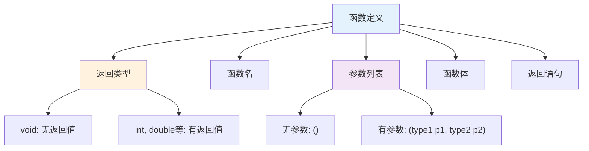
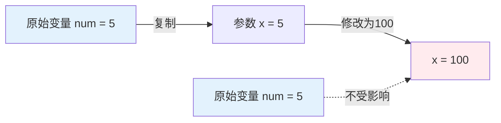
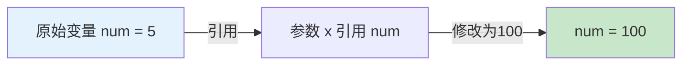

# 2.1 函数基础

## 目录
- [函数定义与声明](#函数定义与声明)
- [函数参数传递](#函数参数传递)
- [函数返回值](#函数返回值)
- [函数重载](#函数重载)
- [默认参数](#默认参数)

---

## 函数定义与声明

### 函数的基本结构

```cpp
返回类型 函数名(参数列表) {
    // 函数体
    // 执行语句
    return 返回值;
}
```

### 函数的组成部分



### 基本函数示例

```cpp
#include <iostream>

// 函数声明（函数原型）
int add(int a, int b);
void greet(const std::string& name);
double calculateArea(double radius);

int main() {
    // 调用函数
    int sum = add(5, 3);
    std::cout << "5 + 3 = " << sum << "\n";

    greet("张三");

    double area = calculateArea(5.0);
    std::cout << "圆面积: " << area << "\n";

    return 0;
}

// 函数定义：加法
int add(int a, int b) {
    return a + b;
}

// 函数定义：问候（无返回值）
void greet(const std::string& name) {
    std::cout << "你好, " << name << "!\n";
}

// 函数定义：计算圆面积
double calculateArea(double radius) {
    const double PI = 3.14159;
    return PI * radius * radius;
}
```

### 函数声明 vs 定义

```cpp
// 函数声明（Declaration）
// 告诉编译器函数的存在，不包含实现
int multiply(int x, int y);

// 函数定义（Definition）
// 包含完整的函数实现
int multiply(int x, int y) {
    return x * y;
}

// 使用场景
int main() {
    // 如果函数定义在main之后，必须先声明
    int result = multiply(3, 4);
    return 0;
}
```

### 分文件编写

```cpp
// math_utils.h - 头文件（函数声明）
#ifndef MATH_UTILS_H
#define MATH_UTILS_H

int add(int a, int b);
int subtract(int a, int b);
double multiply(double a, double b);

#endif

// math_utils.cpp - 实现文件（函数定义）
#include "math_utils.h"

int add(int a, int b) {
    return a + b;
}

int subtract(int a, int b) {
    return a - b;
}

double multiply(double a, double b) {
    return a * b;
}

// main.cpp - 主程序
#include <iostream>
#include "math_utils.h"

int main() {
    std::cout << "3 + 5 = " << add(3, 5) << "\n";
    std::cout << "10 - 4 = " << subtract(10, 4) << "\n";
    return 0;
}
```

---

## 函数参数传递

### 值传递（Pass by Value）

```cpp
#include <iostream>

// 值传递：传递参数的副本
void modifyValue(int x) {
    x = 100;  // 只修改副本，不影响原始值
    std::cout << "函数内: x = " << x << "\n";
}

int main() {
    int num = 5;
    std::cout << "调用前: num = " << num << "\n";

    modifyValue(num);

    std::cout << "调用后: num = " << num << "\n";  // num仍为5
    return 0;
}
```

**值传递示意图：**



### 引用传递（Pass by Reference）

```cpp
#include <iostream>

// 引用传递：直接操作原始变量
void modifyReference(int& x) {
    x = 100;  // 修改原始值
    std::cout << "函数内: x = " << x << "\n";
}

int main() {
    int num = 5;
    std::cout << "调用前: num = " << num << "\n";

    modifyReference(num);

    std::cout << "调用后: num = " << num << "\n";  // num变为100
    return 0;
}
```

**引用传递示意图：**



### 指针传递（Pass by Pointer）

```cpp
#include <iostream>

// 指针传递：传递变量的地址
void modifyPointer(int* x) {
    *x = 100;  // 通过指针修改原始值
    std::cout << "函数内: *x = " << *x << "\n";
}

int main() {
    int num = 5;
    std::cout << "调用前: num = " << num << "\n";

    modifyPointer(&num);  // 传递地址

    std::cout << "调用后: num = " << num << "\n";  // num变为100
    return 0;
}
```

### 传递方式对比

```cpp
#include <iostream>
#include <string>

void byValue(std::string s) {
    s[0] = 'X';  // 修改副本
}

void byReference(std::string& s) {
    s[0] = 'X';  // 修改原始值
}

void byPointer(std::string* s) {
    (*s)[0] = 'X';  // 通过指针修改原始值
}

void byConstReference(const std::string& s) {
    // s[0] = 'X';  // ❌ 错误：不能修改
    std::cout << "只读访问: " << s << "\n";
}

int main() {
    std::string str = "Hello";

    byValue(str);
    std::cout << "值传递后: " << str << "\n";  // "Hello"

    byReference(str);
    std::cout << "引用传递后: " << str << "\n";  // "Xello"

    str = "Hello";  // 重置
    byPointer(&str);
    std::cout << "指针传递后: " << str << "\n";  // "Xello"

    str = "Hello";  // 重置
    byConstReference(str);
    std::cout << "常量引用后: " << str << "\n";  // "Hello"

    return 0;
}
```

### 何时使用每种传递方式

| 传递方式 | 使用场景 | 性能 | 是否可修改 |
|----------|----------|------|------------|
| 值传递 | 小对象、需要保护原始值 | 较低（拷贝开销） | ❌ |
| 引用传递 | 大对象、需要修改原值 | 高 | ✅ |
| 常量引用 | 大对象、只读访问 | 高 | ❌ |
| 指针传递 | 需要处理空值、数组 | 高 | ✅ |

```cpp
// ✅ 推荐：使用const引用传递大对象
void processString(const std::string& str) {
    std::cout << str << "\n";  // 只读，无拷贝开销
}

// ✅ 推荐：需要修改时使用普通引用
void modifyString(std::string& str) {
    str += " world";  // 修改原始对象
}

// ✅ 使用指针：可能为空的情况
void safePrint(const std::string* str) {
    if (str != nullptr) {
        std::cout << *str << "\n";
    }
}
```

---

## 函数返回值

### 基本返回值

```cpp
#include <iostream>

// 返回整数
int add(int a, int b) {
    return a + b;
}

// 返回浮点数
double divide(int a, int b) {
    if (b == 0) {
        return 0.0;  // 错误处理
    }
    return static_cast<double>(a) / b;
}

// 返回布尔值
bool isPositive(int num) {
    return num > 0;
}

// 返回字符串
std::string getStatus(int code) {
    switch (code) {
        case 200: return "OK";
        case 404: return "Not Found";
        case 500: return "Internal Error";
        default: return "Unknown";
    }
}

int main() {
    int sum = add(3, 5);
    std::cout << "3 + 5 = " << sum << "\n";

    double result = divide(10, 3);
    std::cout << "10 / 3 = " << result << "\n";

    bool positive = isPositive(-5);
    std::cout << "-5是正数吗? " << std::boolalpha << positive << "\n";

    std::cout << "状态码200: " << getStatus(200) << "\n";

    return 0;
}
```

### 无返回值函数

```cpp
#include <iostream>

// void函数：无返回值
void printMessage(const std::string& msg) {
    std::cout << "消息: " << msg << "\n";
    // 不需要return语句
}

void printCount(int n) {
    for (int i = 1; i <= n; i++) {
        std::cout << i << " ";
    }
    std::cout << "\n";
    // 可以使用return提前退出
    if (n <= 0) {
        return;
    }
}

int main() {
    printMessage("欢迎使用C++");
    printCount(5);
    return 0;
}
```

### 返回引用

```cpp
#include <iostream>

int globalValue = 0;

// 返回引用：可以修改返回的变量
int& getReference() {
    return globalValue;  // ⚠️ 不要返回局部变量的引用！
}

// 正确示例：返回类成员的引用
class Counter {
private:
    int count;

public:
    Counter() : count(0) {}

    // 返回引用，允许修改
    int& getCount() {
        return count;
    }

    // 返回const引用，只读访问
    const int& getCount() const {
        return count;
    }
};

int main() {
    getReference() = 100;  // 通过返回的引用修改
    std::cout << "globalValue = " << globalValue << "\n";

    Counter c;
    c.getCount() = 50;
    std::cout << "count = " << c.getCount() << "\n";

    return 0;
}
```

### 返回指针

```cpp
#include <iostream>

int* createArray(int size) {
    // ⚠️ 动态分配内存
    int* arr = new int[size];
    for (int i = 0; i < size; i++) {
        arr[i] = i * 10;
    }
    return arr;  // 返回指针
}

// ❌ 错误：不要返回局部变量的指针！
int* badExample() {
    int local = 10;
    return &local;  // 未定义行为！
}

int main() {
    int* arr = createArray(5);
    for (int i = 0; i < 5; i++) {
        std::cout << arr[i] << " ";
    }
    std::cout << "\n";

    delete[] arr;  // 记得释放内存
    arr = nullptr;

    return 0;
}
```

---

## 函数重载

### 重载的基本概念

函数重载允许同名函数具有不同的参数列表：

```cpp
#include <iostream>
#include <string>

// 重载：打印整数
void print(int x) {
    std::cout << "整数: " << x << "\n";
}

// 重载：打印浮点数
void print(double x) {
    std::cout << "浮点数: " << x << "\n";
}

// 重载：打印字符串
void print(const std::string& x) {
    std::cout << "字符串: " << x << "\n";
}

// 重载：打印多个参数
void print(int x, int y) {
    std::cout << "两个整数: " << x << ", " << y << "\n";
}

int main() {
    print(42);           // 调用 print(int)
    print(3.14);         // 调用 print(double)
    print("Hello");      // 调用 print(string)
    print(10, 20);       // 调用 print(int, int)

    return 0;
}
```

### 重载匹配规则

```cpp
#include <iostream>

void func(int x) {
    std::cout << "func(int)\n";
}

void func(double x) {
    std::cout << "func(double)\n";
}

void func(int x, int y = 0) {
    std::cout << "func(int, int)\n";
}

int main() {
    func(10);        // 精确匹配：func(int)
    func(10.5);      // 精确匹配：func(double)
    func(10, 20);    // 精确匹配：func(int, int)

    // func(10.5f);   // ⚠️ 歧义：float可以转换为int或double

    return 0;
}
```

### 实际应用示例

```cpp
#include <iostream>
#include <string>

// 计算最大值的重载函数
int max(int a, int b) {
    return (a > b) ? a : b;
}

double max(double a, double b) {
    return (a > b) ? a : b;
}

int max(int a, int b, int c) {
    return max(max(a, b), c);  // 重用已有的max函数
}

// 字符串比较大小（按长度）
std::string max(const std::string& a, const std::string& b) {
    return (a.length() > b.length()) ? a : b;
}

int main() {
    std::cout << "max(3, 5) = " << max(3, 5) << "\n";
    std::cout << "max(3.14, 2.71) = " << max(3.14, 2.71) << "\n";
    std::cout << "max(1, 5, 3) = " << max(1, 5, 3) << "\n";
    std::cout << "max(\"hello\", \"hi\") = " << max("hello", "hi") << "\n";

    return 0;
}
```

---

## 默认参数

### 基本用法

```cpp
#include <iostream>

// 带默认参数的函数
void greet(std::string name = "用户", int age = 0) {
    if (age > 0) {
        std::cout << "你好, " << name << "! 你今年" << age << "岁。\n";
    } else {
        std::cout << "你好, " << name << "!\n";
    }
}

int main() {
    greet();                      // 使用所有默认参数
    greet("张三");                // name="张三", age使用默认值
    greet("李四", 25);            // 不使用默认参数

    return 0;
}
```

### 默认参数规则

```cpp
#include <iostream>

// ✅ 正确：默认参数必须在参数列表末尾
void func1(int a, int b = 10, int c = 20) {
    std::cout << a << ", " << b << ", " << c << "\n";
}

// ❌ 错误：默认参数不能在前
// void func2(int a = 10, int b) { }

// ✅ 正确：声明和定义中只需一处指定默认参数
void func3(int a = 5, int b = 10);  // 声明

int main() {
    func1(1);        // 1, 10, 20
    func1(1, 2);     // 1, 2, 20
    func1(1, 2, 3);  // 1, 2, 3

    func3();         // 5, 10
    func3(100);      // 100, 10

    return 0;
}

void func3(int a, int b) {  // 定义中不再指定默认参数
    std::cout << a << ", " << b << "\n";
}
```

### 默认参数与函数重载

```cpp
#include <iostream>

void display(int x) {
    std::cout << "display(int): " << x << "\n";
}

void display(int x, int y = 0) {
    std::cout << "display(int, int): " << x << ", " << y << "\n";
}

int main() {
    display(10);    // ⚠️ 歧义！两个函数都匹配

    return 0;
}
```

### 实际应用示例

```cpp
#include <iostream>
#include <string>

// 文件操作函数，带默认参数
bool saveFile(const std::string& content,
              const std::string& filename = "default.txt",
              bool append = false) {
    std::cout << "保存内容到 " << filename;
    std::cout << (append ? " (追加模式)" : " (覆盖模式)") << "\n";
    std::cout << "内容: " << content << "\n";
    return true;
}

int main() {
    // 使用所有默认参数
    saveFile("Hello World");

    // 指定文件名
    saveFile("你好", "greeting.txt");

    // 指定所有参数
    saveFile("追加内容", "log.txt", true);

    return 0;
}
```

---

## 函数综合示例

### 示例：学生成绩管理系统

```cpp
#include <iostream>
#include <string>
#include <vector>

// 计算平均分
double calculateAverage(const std::vector<int>& scores) {
    if (scores.empty()) return 0.0;

    int sum = 0;
    for (int score : scores) {
        sum += score;
    }
    return static_cast<double>(sum) / scores.size();
}

// 获取等级（重载）
char getGrade(double average) {
    if (average >= 90) return 'A';
    if (average >= 80) return 'B';
    if (average >= 70) return 'C';
    if (average >= 60) return 'D';
    return 'F';
}

std::string getGrade(char grade) {
    switch (grade) {
        case 'A': return "优秀";
        case 'B': return "良好";
        case 'C': return "中等";
        case 'D': return "及格";
        case 'F': return "不及格";
        default: return "未知";
    }
}

// 打印学生信息（带默认参数）
void printStudent(const std::string& name,
                  const std::vector<int>& scores,
                  bool detailed = false) {
    double avg = calculateAverage(scores);
    char grade = getGrade(avg);

    std::cout << "学生: " << name << "\n";
    std::cout << "平均分: " << avg << "\n";
    std::cout << "等级: " << grade << " (" << getGrade(grade) << ")\n";

    if (detailed) {
        std::cout << "各科成绩: ";
        for (int score : scores) {
            std::cout << score << " ";
        }
        std::cout << "\n";
    }
    std::cout << "------------------------\n";
}

int main() {
    // 学生数据
    std::vector<int> scores1 = {85, 90, 78, 92, 88};
    std::vector<int> scores2 = {65, 70, 72, 68, 75};

    // 打印学生信息
    printStudent("张三", scores1, true);
    printStudent("李四", scores2);  // 使用默认参数detailed=false

    return 0;
}
```

---

## 小结

本节介绍了C++函数的基础知识：

1. **函数定义与声明**：
   - 函数的组成部分
   - 声明与定义的区别
   - 分文件编写组织

2. **函数参数传递**：
   - 值传递：拷贝数据，保护原始值
   - 引用传递：直接操作原始值
   - 指针传递：灵活的地址操作
   - const引用：高效只读访问

3. **函数返回值**：
   - 基本类型返回
   - void函数
   - 返回引用和指针

4. **函数重载**：
   - 同名不同参数的多个函数
   - 编译器自动匹配最合适的版本

5. **默认参数**：
   - 参数的默认值
   - 必须在参数列表末尾
   - 与重载的相互作用

## 练习

1. ✅ 编写一个计算器程序，实现加减乘除（使用函数重载）
2. ✅ 实现一个字符串处理函数，使用引用传递避免不必要的拷贝
3. ✅ 编写带默认参数的打印函数
4. ✅ 练习分文件编写，创建一个math工具库

---

## 下一节
[2.2 函数进阶](./2.2-函数进阶.md) → 学习内联函数、递归、函数指针和lambda表达式。
