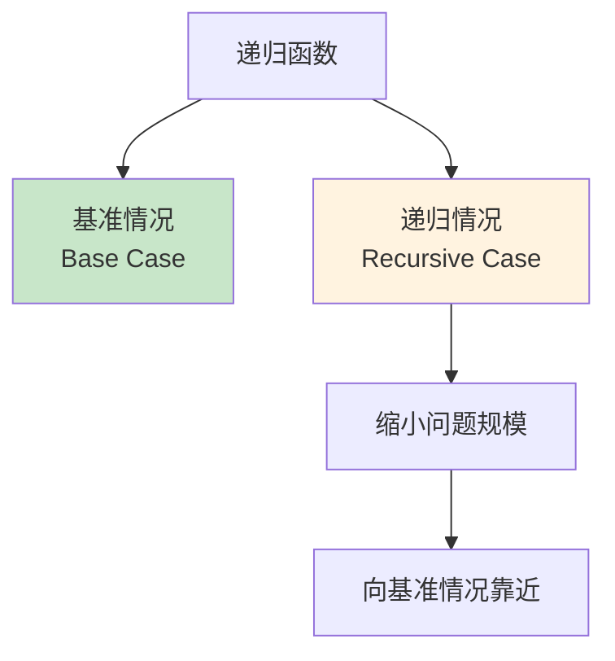
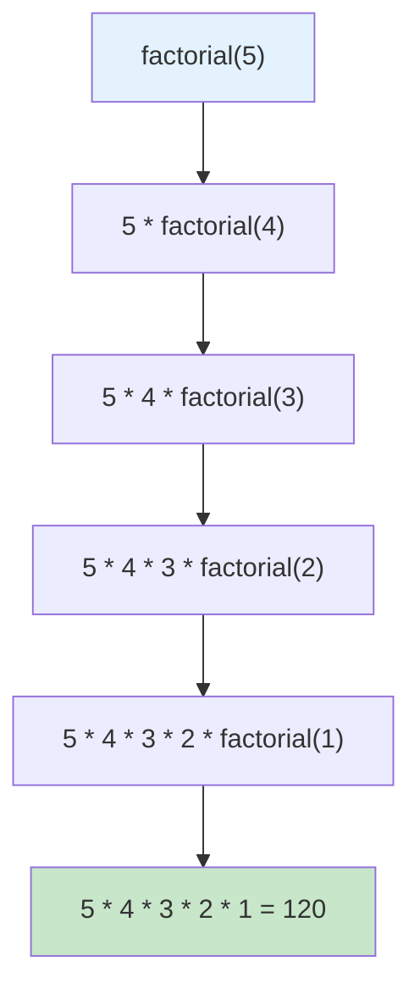

# 2.2 函数进阶

## 目录
- [内联函数](#内联函数)
- [递归函数](#递归函数)
- [函数指针](#函数指针)
- [lambda表达式（C++11）](#lambda表达式c11)
- [constexpr函数](#constexpr函数)

---

## 内联函数

### 内联函数的概念

内联函数是一种请求编译器在调用处展开函数体的机制，可以减少函数调用的开销。

```cpp
#include <iostream>

// 普通函数
int add(int a, int b) {
    return a + b;
}

// 内联函数
inline int inlineAdd(int a, int b) {
    return a + b;
}

int main() {
    int result1 = add(3, 5);      // 正常函数调用
    int result2 = inlineAdd(3, 5); // 可能被内联展开

    std::cout << "result1 = " << result1 << "\n";
    std::cout << "result2 = " << result2 << "\n";

    return 0;
}
```

### 内联函数 vs 宏定义

```cpp
#include <iostream>

// ❌ 宏定义：不安全
#define SQUARE(x) ((x) * (x))

// ✅ 内联函数：类型安全，有调试信息
inline int square(int x) {
    return x * x;
}

int main() {
    int a = 5;

    // 宏的问题：SQUARE(a++) 会展开为 ((a++) * (a++))
    std::cout << "宏 SQUARE(a++): " << SQUARE(a++) << "\n";  // 未定义行为

    a = 5;
    // 内联函数：安全
    std::cout << "内联 square(a): " << square(a) << "\n";  // 25

    return 0;
}
```

### 内联函数的特点

```cpp
#include <iostream>

// 小函数适合内联
inline int max(int a, int b) {
    return (a > b) ? a : b;
}

// 复杂函数不适合内联（编译器可能忽略inline请求）
inline void complexFunction() {
    // 大量代码...
    for (int i = 0; i < 1000; i++) {
        // 复杂逻辑
    }
}

// 类内的成员函数默认为内联函数
class Calculator {
public:
    // 类内定义的函数自动内联
    int add(int a, int b) {
        return a + b;
    }

    // 类外定义的函数（不内联）
    int subtract(int a, int b);
};

int Calculator::subtract(int a, int b) {
    return a - b;
}

int main() {
    Calculator calc;
    std::cout << "10 + 20 = " << calc.add(10, 20) << "\n";

    return 0;
}
```

### 何时使用内联函数

| 场景 | 是否适合 | 原因 |
|------|----------|------|
| 函数体很小（1-5行） | ✅ | 减少调用开销 |
| 频繁调用的函数 | ✅ | 提高性能 |
| 函数体很大或复杂 | ❌ | 代码膨胀，可能降低性能 |
| 包含循环或递归 | ❌ | 编译器通常忽略内联 |
| 虚函数 | ❌ | 动态绑定无法内联（除非devirtualize） |

---

## 递归函数

### 递归的基本概念

递归函数是直接或间接调用自身的函数。



### 基本递归示例

```cpp
#include <iostream>

// 计算阶乘
int factorial(int n) {
    // 基准情况
    if (n <= 1) {
        return 1;
    }
    // 递归情况
    return n * factorial(n - 1);
}

int main() {
    std::cout << "5! = " << factorial(5) << "\n";  // 120
    return 0;
}
```

**递归执行过程：**



### 递归 vs 迭代

```cpp
#include <iostream>

// 递归版本
int factorialRecursive(int n) {
    if (n <= 1) return 1;
    return n * factorialRecursive(n - 1);
}

// 迭代版本
int factorialIterative(int n) {
    int result = 1;
    for (int i = 2; i <= n; i++) {
        result *= i;
    }
    return result;
}

int main() {
    std::cout << "递归: " << factorialRecursive(5) << "\n";
    std::cout << "迭代: " << factorialIterative(5) << "\n";

    return 0;
}
```

### 常见递归示例

#### 1. 斐波那契数列

```cpp
#include <iostream>

// 低效的递归（重复计算）
int fibRecursive(int n) {
    if (n <= 1) return n;
    return fibRecursive(n - 1) + fibRecursive(n - 2);
}

// 优化的递归（使用备忘录）
#include <vector>
int fibMemo(int n, std::vector<int>& memo) {
    if (n <= 1) return n;
    if (memo[n] != -1) return memo[n];
    memo[n] = fibMemo(n - 1, memo) + fibMemo(n - 2, memo);
    return memo[n];
}

// 迭代版本（最优）
int fibIterative(int n) {
    if (n <= 1) return n;
    int a = 0, b = 1;
    for (int i = 2; i <= n; i++) {
        int temp = a + b;
        a = b;
        b = temp;
    }
    return b;
}

int main() {
    std::cout << "斐波那契(10): " << fibIterative(10) << "\n";

    std::vector<int> memo(20, -1);
    std::cout << "备忘录版本: " << fibMemo(10, memo) << "\n";

    return 0;
}
```

#### 2. 汉诺塔问题

```cpp
#include <iostream>

void hanoi(int n, char from, char to, char aux) {
    if (n == 1) {
        std::cout << "将盘子 1 从 " << from << " 移到 " << to << "\n";
        return;
    }

    // 将 n-1 个盘子从 from 移到 aux
    hanoi(n - 1, from, aux, to);

    // 将第 n 个盘子从 from 移到 to
    std::cout << "将盘子 " << n << " 从 " << from << " 移到 " << to << "\n";

    // 将 n-1 个盘子从 aux 移到 to
    hanoi(n - 1, aux, to, from);
}

int main() {
    int n = 3;
    std::cout << n << " 个盘子的汉诺塔解法:\n";
    hanoi(n, 'A', 'C', 'B');

    return 0;
}
```

### 尾递归优化

```cpp
#include <iostream>

// 普通递归
int factorialNormal(int n) {
    if (n <= 1) return 1;
    return n * factorialNormal(n - 1);  // 递归调用后有乘法操作
}

// 尾递归
int factorialTail(int n, int accumulator = 1) {
    if (n <= 1) return accumulator;
    return factorialTail(n - 1, n * accumulator);  // 递归调用是最后操作
}

int main() {
    std::cout << "普通递归: " << factorialNormal(5) << "\n";
    std::cout << "尾递归: " << factorialTail(5) << "\n";

    return 0;
}
```

### 递归的优缺点

| 优点 | 缺点 |
|------|------|
| 代码简洁、易理解 | 可能栈溢出 |
| 自然表达分治思想 | 性能可能较低 |
| 适合树形结构问题 | 调试困难 |

---

## 函数指针

### 函数指针的基本概念

函数指针是指向函数的指针变量，可以像普通函数一样调用。

```cpp
#include <iostream>

// 普通函数
int add(int a, int b) {
    return a + b;
}

int subtract(int a, int b) {
    return a - b;
}

int main() {
    // 声明函数指针
    int (*funcPtr)(int, int);

    // 指向add函数
    funcPtr = add;
    std::cout << "10 + 20 = " << funcPtr(10, 20) << "\n";

    // 指向subtract函数
    funcPtr = subtract;
    std::cout << "10 - 20 = " << funcPtr(10, 20) << "\n";

    return 0;
}
```

### 函数指针的声明语法

```cpp
#include <iostream>

int operation(int a, int b) {
    return a + b;
}

int main() {
    // 方式1：完整声明
    int (*ptr1)(int, int) = operation;

    // 方式2：使用decltype
    decltype(operation)* ptr2 = operation;

    // 方式3：使用using（C++11）
    using FuncType = int(*)(int, int);
    FuncType ptr3 = operation;

    std::cout << ptr1(5, 3) << "\n";
    std::cout << ptr2(5, 3) << "\n";
    std::cout << ptr3(5, 3) << "\n";

    return 0;
}
```

### 函数指针的应用

#### 1. 回调函数

```cpp
#include <iostream>
#include <vector>

// 排序比较函数
bool compareAsc(int a, int b) {
    return a < b;
}

bool compareDesc(int a, int b) {
    return a > b;
}

// 接受函数指针的排序函数
void sortArray(std::vector<int>& arr, bool (*compare)(int, int)) {
    for (size_t i = 0; i < arr.size(); i++) {
        for (size_t j = i + 1; j < arr.size(); j++) {
            if (compare(arr[j], arr[i])) {
                std::swap(arr[i], arr[j]);
            }
        }
    }
}

int main() {
    std::vector<int> nums = {5, 2, 8, 1, 9};

    // 升序排序
    sortArray(nums, compareAsc);
    std::cout << "升序: ";
    for (int n : nums) std::cout << n << " ";
    std::cout << "\n";

    // 降序排序
    sortArray(nums, compareDesc);
    std::cout << "降序: ";
    for (int n : nums) std::cout << n << " ";
    std::cout << "\n";

    return 0;
}
```

#### 2. 函数指针数组

```cpp
#include <iostream>

int add(int a, int b) { return a + b; }
int subtract(int a, int b) { return a - b; }
int multiply(int a, int b) { return a * b; }
int divide(int a, int b) { return b != 0 ? a / b : 0; }

int main() {
    // 函数指针数组
    int (*operations[])(int, int) = {add, subtract, multiply, divide};

    int choice = 0, x = 10, y = 5;

    if (choice >= 0 && choice < 4) {
        int result = operations[choice](x, y);
        std::cout << "结果: " << result << "\n";
    }

    return 0;
}
```

---

## lambda表达式（C++11）

### lambda表达式的基本语法

```cpp
[capture list](parameters) -> return_type {
    // 函数体
}
```

### 基本lambda表达式

```cpp
#include <iostream>
#include <vector>
#include <algorithm>

int main() {
    // 简单的lambda表达式
    auto greet = []() {
        std::cout << "Hello, Lambda!\n";
    };
    greet();

    // 带参数的lambda
    auto add = [](int a, int b) -> int {
        return a + b;
    };
    std::cout << "3 + 5 = " << add(3, 5) << "\n";

    // 返回类型可省略（自动推导）
    auto multiply = [](int a, int b) {
        return a * b;
    };

    return 0;
}
```

### 捕获列表

```cpp
#include <iostream>

int main() {
    int x = 10, y = 20;

    // 值捕获
    auto func1 = [x]() {
        std::cout << "x = " << x << "\n";  // x的副本
        // x++;  // ❌ 错误：x是只读的
    };

    // 引用捕获
    auto func2 = [&x]() {
        x++;  // ✅ 可以修改
        std::cout << "x = " << x << "\n";
    };

    // 混合捕获
    auto func3 = [x, &y]() {
        std::cout << "x = " << x << ", y = " << y << "\n";
        y++;  // 可以修改y
    };

    // 捕获所有（值）
    auto func4 = [=]() {
        std::cout << "x = " << x << ", y = " << y << "\n";
    };

    // 捕获所有（引用）
    auto func5 = [&]() {
        x++;
        y++;
    };

    // mutable：允许修改值捕获的变量
    auto func6 = [x]() mutable {
        x++;  // 修改副本
        std::cout << "副本 x = " << x << "\n";
    };

    func1();
    func2();
    func3();
    func4();
    func5();
    func6();

    std::cout << "原始 x = " << x << ", y = " << y << "\n";

    return 0;
}
```

### lambda表达式的应用

#### 1. 与STL算法结合

```cpp
#include <iostream>
#include <vector>
#include <algorithm>

int main() {
    std::vector<int> nums = {5, 2, 8, 1, 9, 3};

    // 排序
    std::sort(nums.begin(), nums.end(), [](int a, int b) {
        return a < b;  // 升序
    });

    // 查找
    auto it = std::find_if(nums.begin(), nums.end(), [](int n) {
        return n > 5;
    });

    // 遍历
    std::for_each(nums.begin(), nums.end(), [](int n) {
        std::cout << n << " ";
    });
    std::cout << "\n";

    return 0;
}
```

#### 2. 作为函数参数

```cpp
#include <iostream>
#include <vector>
#include <functional>

// 接受lambda表达式
void applyOperation(const std::vector<int>& nums,
                    std::function<int(int)> operation) {
    for (int n : nums) {
        std::cout << operation(n) << " ";
    }
    std::cout << "\n";
}

int main() {
    std::vector<int> nums = {1, 2, 3, 4, 5};

    // 平方
    applyOperation(nums, [](int n) { return n * n; });

    // 加10
    applyOperation(nums, [](int n) { return n + 10; });

    return 0;
}
```

### lambda表达式 vs 函数指针

| 特性 | lambda表达式 | 函数指针 |
|------|-------------|----------|
| 语法 | 简洁 | 复杂 |
| 捕获变量 | ✅ 支持 | ❌ 不支持 |
| 类型安全 | ✅ 强类型 | ⚠️ 较弱 |
| 性能 | 优化良好 | 可能有开销 |
| 可读性 | 内联逻辑 | 需要跳转 |

---

## constexpr函数

### constexpr的基本概念

constexpr函数可以在编译时求值。

```cpp
#include <iostream>

// constexpr函数
constexpr int square(int x) {
    return x * x;
}

// constexpr函数可以用于常量表达式
constexpr int ARRAY_SIZE = square(5);  // 编译时计算

int main() {
    int arr[ARRAY_SIZE];  // ✅ 合法：ARRAY_SIZE是常量表达式

    // 运行时调用
    int x = 10;
    std::cout << "square(10) = " << square(x) << "\n";

    // 编译时调用
    constexpr int result = square(3);  // 编译时计算
    std::cout << "square(3) = " << result << "\n";

    return 0;
}
```

### constexpr的限制

```cpp
#include <iostream>

// ✅ 合法的constexpr
constexpr int add(int a, int b) {
    return a + b;
}

// ❌ 非法的constexpr：包含循环
/*
constexpr int sum(int n) {
    int total = 0;
    for (int i = 1; i <= n; i++) {  // C++14之前不允许
        total += i;
    }
    return total;
}
*/

// ✅ C++14允许更复杂的constexpr
constexpr int sum(int n) {
    int total = 0;
    for (int i = 1; i <= n; ++i) {
        total += i;
    }
    return total;
}

// ❌ 非法：不能有静态变量
/*
constexpr int func() {
    static int x = 0;  // 错误
    return ++x;
}
*/

int main() {
    constexpr int s = sum(5);  // 编译时计算
    std::cout << "sum(5) = " << s << "\n";

    return 0;
}
```

### constexpr vs const

```cpp
#include <iostream>

constexpr int compileTimeCalculation(int x) {
    return x * 2;
}

const int runtimeCalculation(int x) {
    return x * 2;
}

int main() {
    // constexpr：编译时确定
    constexpr int a = compileTimeCalculation(5);
    int arr1[a];  // ✅ 合法

    // const：运行时确定
    int x = 10;
    const int b = runtimeCalculation(x);
    // int arr2[b];  // ❌ 非法：b不是常量表达式

    return 0;
}
```

---

## 函数进阶综合示例

### 示例：事件处理系统

```cpp
#include <iostream>
#include <vector>
#include <functional>
#include <string>

// 事件处理系统
class EventEmitter {
private:
    using EventHandler = std::function<void()>;
    std::vector<EventHandler> handlers;

public:
    // 注册事件处理器
    void on(EventHandler handler) {
        handlers.push_back(handler);
    }

    // 触发所有事件
    void emit() {
        for (auto& handler : handlers) {
            handler();
        }
    }
};

// 辅助函数
void logMessage(const std::string& msg) {
    std::cout << "[LOG] " << msg << "\n";
}

int main() {
    EventEmitter emitter;

    // 使用lambda注册事件
    emitter.on([]() {
        std::cout << "事件1触发\n";
    });

    // 使用捕获的lambda
    int counter = 0;
    emitter.on([&counter]() {
        counter++;
        std::cout << "事件触发次数: " << counter << "\n";
    });

    // 使用函数指针
    emitter.on([]() {
        logMessage("来自函数指针的消息");
    });

    // 触发事件
    emitter.emit();
    emitter.emit();

    return 0;
}
```

---

## 小结

本节介绍了C++函数的进阶特性：

1. **内联函数**：
   - 减少函数调用开销
   - 适合小而频繁调用的函数
   - 优于宏定义

2. **递归函数**：
   - 基准情况和递归情况
   - 适用于分治问题
   - 注意栈溢出风险

3. **函数指针**：
   - 指向函数的指针
   - 用于回调和策略模式
   - 支持函数指针数组

4. **lambda表达式（C++11）**：
   - 匿名函数
   - 捕获列表灵活
   - 与STL算法结合使用

5. **constexpr函数**：
   - 编译时求值
   - 提高性能
   - C++14限制放宽

## 练习

1. ✅ 使用递归实现二分查找
2. ✅ 编写一个接受函数指针的通用排序函数
3. ✅ 使用lambda表达式和STL算法处理数据
4. ✅ 比较内联函数和普通函数的性能

---

## 下一节
[2.3 作用域与存储类](./2.3-作用域与存储类.md) → 学习变量的作用域、存储类和命名空间。
