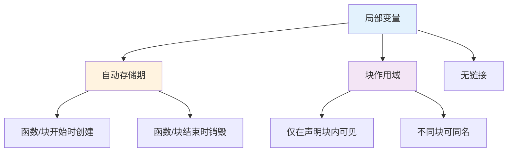
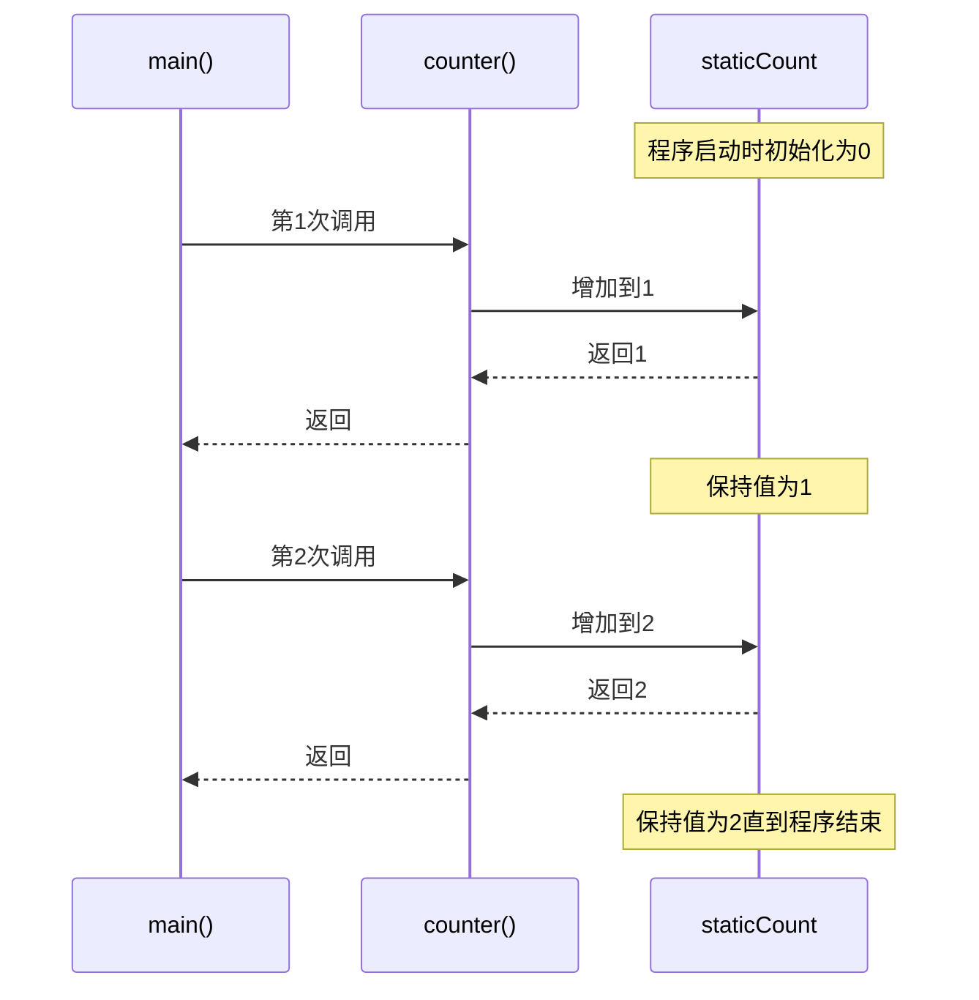

# 2.3 作用域与存储类

## 目录
- [局部变量与全局变量](#局部变量与全局变量)
- [静态变量](#静态变量)
- [命名空间](#命名空间)
- [链接属性](#链接属性)

---

## 局部变量与全局变量

### 局部变量

局部变量是在代码块内声明的变量，只在声明它的块内可见。

```cpp
#include <iostream>

void function1() {
    int localVar = 10;  // 局部变量
    std::cout << "function1: localVar = " << localVar << "\n";
}

void function2() {
    int localVar = 20;  // 不同的局部变量
    std::cout << "function2: localVar = " << localVar << "\n";
}

int main() {
    function1();
    function2();

    {
        int blockVar = 30;  // 块作用域
        std::cout << "块内: blockVar = " << blockVar << "\n";
    }

    // std::cout << blockVar;  // ❌ 错误：blockVar不可访问

    return 0;
}
```

**局部变量特性：**



### 全局变量

全局变量在所有函数外部声明，可被程序的任何部分访问。

```cpp
#include <iostream>

int globalVar = 100;  // 全局变量

void displayGlobal() {
    std::cout << "函数中访问: " << globalVar << "\n";
}

int main() {
    std::cout << "main中访问: " << globalVar << "\n";

    globalVar = 200;  // 修改全局变量
    displayGlobal();  // 输出200

    return 0;
}
```

### 全局变量 vs 局部变量

```cpp
#include <iostream>

int value = 100;  // 全局变量

int main() {
    int value = 200;  // 局部变量（遮蔽全局变量）

    std::cout << "局部变量: " << value << "\n";          // 200
    std::cout << "全局变量: " << ::value << "\n";       // 100（使用::访问）

    {
        int value = 300;  // 嵌套块中的局部变量
        std::cout << "嵌套块: " << value << "\n";       // 300
        std::cout << "全局变量: " << ::value << "\n";   // 100
    }

    return 0;
}
```

### 变量作用域规则

```cpp
#include <iostream>

int global = 1;

void func() {
    // int local = global;  // ✅ 可以访问全局变量

    int global = 2;  // 局部变量遮蔽全局变量
    std::cout << "局部 global = " << global << "\n";     // 2
    std::cout << "全局 global = " << ::global << "\n";  // 1
}

int main() {
    func();

    // 不同块中的同名变量
    {
        int x = 10;
        std::cout << "外层: x = " << x << "\n";

        {
            // int x = 20;  // ❌ 错误：不能在同一作用域重复声明
            int y = 20;
            std::cout << "内层: x = " << x << ", y = " << y << "\n";
        }

        // std::cout << y;  // ❌ 错误：y不可访问
    }

    return 0;
}
```

---

## 静态变量

### 局部静态变量

局部静态变量在函数调用之间保持其值。

```cpp
#include <iostream>

void counter() {
    int count = 0;          // 普通局部变量
    static int staticCount = 0;  // 静态局部变量

    count++;
    staticCount++;

    std::cout << "普通计数: " << count << ", 静态计数: " << staticCount << "\n";
}

int main() {
    std::cout << "第一次调用:\n";
    counter();  // 普通: 1, 静态: 1

    std::cout << "\n第二次调用:\n";
    counter();  // 普通: 1, 静态: 2

    std::cout << "\n第三次调用:\n";
    counter();  // 普通: 1, 静态: 3

    return 0;
}
```

**静态局部变量生命周期：**



### 全局静态变量

全局静态变量限制在当前文件内可见。

```cpp
// file1.cpp
static int fileStaticVar = 100;  // 仅在当前文件可见

void function1() {
    fileStaticVar++;
    std::cout << "file1: " << fileStaticVar << "\n";
}

// file2.cpp
// extern int fileStaticVar;  // ❌ 错误：无法访问其他文件的静态变量

int fileStaticVar = 200;  // ✅ 这是不同的变量

void function2() {
    fileStaticVar++;
    std::cout << "file2: " << fileStaticVar << "\n";
}
```

### 静态成员变量

类的静态成员变量被所有对象共享。

```cpp
#include <iostream>

class Counter {
private:
    static int count;  // 静态成员声明

public:
    Counter() {
        count++;  // 每创建一个对象，计数增加
    }

    ~Counter() {
        count--;  // 对象销毁时计数减少
    }

    static int getCount() {
        return count;  // 静态成员函数
    }
};

// 静态成员定义（必须在类外）
int Counter::count = 0;

int main() {
    std::cout << "初始计数: " << Counter::getCount() << "\n";  // 0

    {
        Counter c1;
        Counter c2;
        std::cout << "创建2个对象后: " << Counter::getCount() << "\n";  // 2
    }

    std::cout << "离开作用域后: " << Counter::getCount() << "\n";  // 0

    return 0;
}
```

### 静态变量使用场景

| 类型 | 生命周期 | 作用域 | 使用场景 |
|------|----------|--------|----------|
| 局部静态变量 | 程序运行期 | 函数/块内 | 计数器、缓存 |
| 全局静态变量 | 程序运行期 | 文件内 | 内部状态、辅助函数 |
| 静态成员 | 程序运行期 | 类内 | 类级别的共享数据 |

---

## 命名空间

### 命名空间的基本概念

命名空间用于组织代码，避免命名冲突。

```cpp
#include <iostream>

// 定义命名空间
namespace MyMath {
    int add(int a, int b) {
        return a + b;
    }

    double PI = 3.14159;
}

namespace YourMath {
    int add(int a, int b) {
        return a + b + 100;  // 不同的实现
    }

    double PI = 3.14;
}

int main() {
    // 使用完全限定名
    std::cout << "MyMath::add(3, 5) = " << MyMath::add(3, 5) << "\n";      // 8
    std::cout << "YourMath::add(3, 5) = " << YourMath::add(3, 5) << "\n";  // 108

    // 使用using声明
    using MyMath::add;
    std::cout << "add(3, 5) = " << add(3, 5) << "\n";  // 调用MyMath::add

    // 使用using指令
    using namespace MyMath;
    std::cout << "PI = " << PI << "\n";  // MyMath::PI

    return 0;
}
```

### 嵌套命名空间

```cpp
#include <iostream>

namespace Company {
    namespace Product {
        namespace Version {
            const char* version = "1.0.0";

            void print() {
                std::cout << "版本: " << version << "\n";
            }
        }
    }
}

// C++17简化的嵌套命名空间语法
namespace Company::Product::Version {
    const char* author = "张三";
}

int main() {
    // 访问嵌套命名空间
    std::cout << Company::Product::Version::version << "\n";
    Company::Product::Version::print();

    // 使用using简化访问
    namespace Ver = Company::Product::Version;
    std::cout << "作者: " << Ver::author << "\n";

    return 0;
}
```

### 命名空间别名

```cpp
#include <iostream>

namespace VeryLongNamespaceName {
    void func() {
        std::cout << "来自很长的命名空间\n";
    }
}

int main() {
    // 创建别名
    namespace VLNN = VeryLongNamespaceName;

    // 使用别名
    VLNN::func();

    return 0;
}
```

### 匿名命名空间

```cpp
#include <iostream>

namespace {
    // 匿名命名空间：限制在当前文件
    void internalHelper() {
        std::cout << "内部辅助函数\n";
    }

    int internalValue = 100;
}

void publicFunction() {
    internalHelper();  // ✅ 可以访问
    std::cout << "internalValue = " << internalValue << "\n";
}

int main() {
    publicFunction();
    // internalHelper();  // ⚠️ 可访问但不推荐

    return 0;
}
```

### 命名空间最佳实践

```cpp
#include <iostream>

// 头文件中
namespace MyLibrary {
    class MyClass {
    public:
        void doSomething();
    };

    void helperFunction();
}

// 实现文件中
namespace MyLibrary {
    void MyClass::doSomething() {
        std::cout << "做某事\n";
    }

    void helperFunction() {
        std::cout << "辅助函数\n";
    }
}

// ✅ 推荐：在函数中使用using声明
void myFunction() {
    using MyLibrary::MyClass;
    MyClass obj;
    obj.doSomething();
}

// ❌ 不推荐：在头文件中使用using指令
// using namespace MyLibrary;  // 可能污染命名空间

int main() {
    MyLibrary::MyClass obj;
    obj.doSomething();

    return 0;
}
```

---

## 链接属性

### 内部链接 vs 外部链接

```cpp
// internal.cpp
static int internalVar = 10;  // 内部链接：仅当前文件

namespace {
    int anotherInternal = 20;  // 匿名命名空间：内部链接
}

void internalFunction() {
    // 函数默认为外部链接
    // static使其变为内部链接
}

// external.cpp
extern int internalVar;  // ❌ 错误：无法访问其他文件的静态变量

extern int globalVar;   // ✅ 可以访问外部链接的变量
```

### extern关键字

```cpp
// file1.cpp
int globalVar = 100;  // 定义

void function1() {
    std::cout << "file1: " << globalVar << "\n";
}

// file2.cpp
extern int globalVar;  // 声明：告诉编译器变量在其他地方定义

void function2() {
    globalVar = 200;   // 访问file1中的变量
}

// main.cpp
extern int globalVar;  // 声明

extern void function1();
extern void function2();

int main() {
    function1();  // 输出100
    function2();  // 修改为200
    std::cout << globalVar << "\n";  // 输出200

    return 0;
}
```

### const变量的链接

```cpp
// file1.cpp
const int MAX_SIZE = 100;  // C++中const默认为内部链接

// file2.cpp
// extern const int MAX_SIZE;  // ❌ 无法访问

// 要使const具有外部链接，需要显式声明
extern const int MAX_SIZE = 100;  // file1.cpp中
extern const int MAX_SIZE;         // file2.cpp中
```

### 链接属性总结

| 声明方式 | 链接属性 | 可见范围 |
|----------|----------|----------|
| 全局变量/函数 | 外部链接 | 整个程序 |
| static全局变量/函数 | 内部链接 | 当前文件 |
| const变量 | 内部链接 | 当前文件（C++） |
| 匿名命名空间 | 内部链接 | 当前文件 |
| 类成员 | 外部链接 | 整个程序 |

---

## 作用域与存储类综合示例

### 示例：配置管理系统

```cpp
#include <iostream>
#include <string>

// 命名空间：组织配置系统
namespace Config {
    // 静态变量：持久化配置
    static std::string appName = "MyApp";
    static int logLevel = 1;

    // 内部函数：仅命名空间内可见
    namespace {
        void validateLogLevel(int& level) {
            if (level < 0) level = 0;
            if (level > 3) level = 3;
        }
    }

    // 公共接口
    void setLogLevel(int level) {
        validateLogLevel(level);
        logLevel = level;
    }

    int getLogLevel() {
        return logLevel;
    }
}

// 全局变量：应用状态
int globalState = 0;

// 函数：演示不同作用域
void demonstrateScope() {
    // 局部变量
    int local = 10;

    // 静态局部变量：保持状态
    static int callCount = 0;
    callCount++;

    std::cout << "调用次数: " << callCount << "\n";
    std::cout << "局部变量: " << local << "\n";
    std::cout << "配置日志级别: " << Config::getLogLevel() << "\n";
    std::cout << "全局状态: " << globalState << "\n";
}

int main() {
    using namespace Config;

    std::cout << "应用程序: " << appName << "\n";

    setLogLevel(2);
    demonstrateScope();

    globalState = 100;
    demonstrateScope();

    return 0;
}
```

---

## 小结

本节介绍了C++的作用域和存储类：

1. **局部变量与全局变量**：
   - 局部变量：块作用域，自动生命周期
   - 全局变量：文件作用域，程序生命周期
   - 变量遮蔽和作用域规则

2. **静态变量**：
   - 局部静态：保持值，函数调用间持久
   - 全局静态：限制在文件内
   - 静态成员：类级别共享

3. **命名空间**：
   - 避免命名冲突
   - 嵌套命名空间
   - using声明和using指令
   - 匿名命名空间

4. **链接属性**：
   - 内部链接：仅当前文件
   - 外部链接：整个程序
   - extern关键字

## 最佳实践

1. ✅ 优先使用局部变量，减少全局变量
2. ✅ 使用命名空间组织代码
3. ✅ 头文件中避免using指令
4. ✅ 使用匿名命名空间替代static
5. ✅ 理解const的链接属性

## 练习

1. ✅ 编写程序演示局部静态变量的生命周期
2. ✅ 创建嵌套命名空间并访问其成员
3. ✅ 比较全局变量和静态变量的区别
4. ✅ 实现一个简单的配置管理类

---

## 下一章
[第三章 面向对象编程](../第三章-面向对象编程/README.md) → 学习C++的类、对象、继承和多态。
