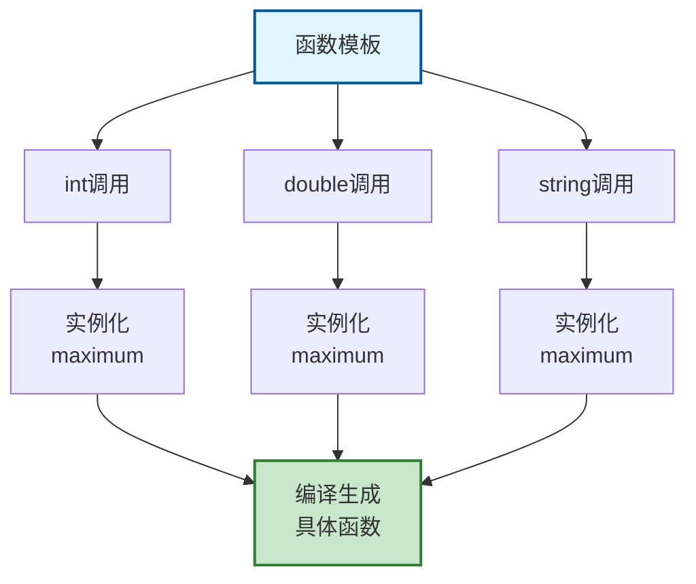
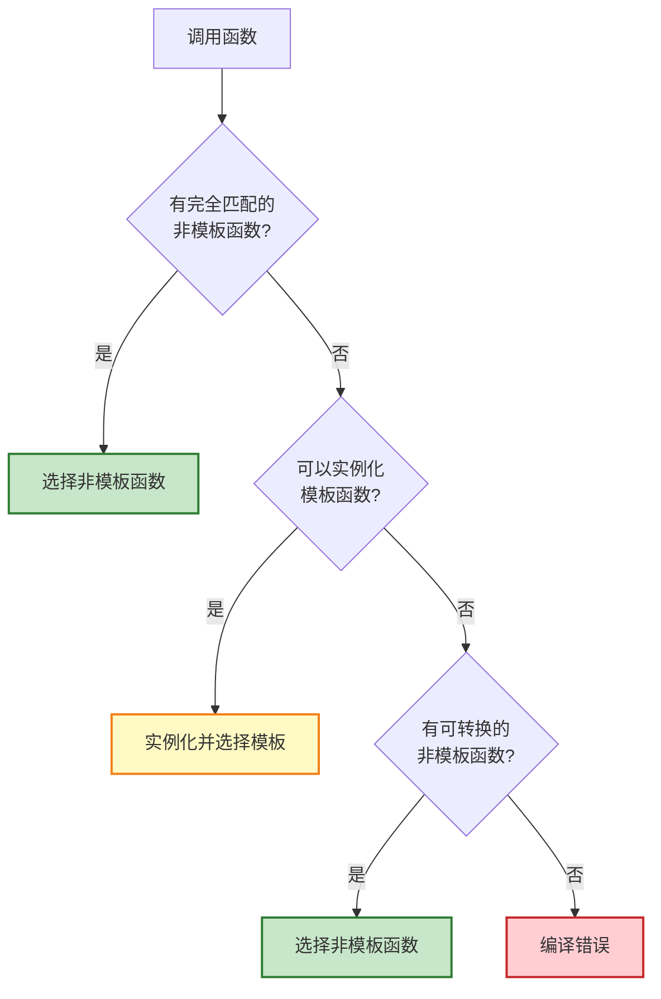
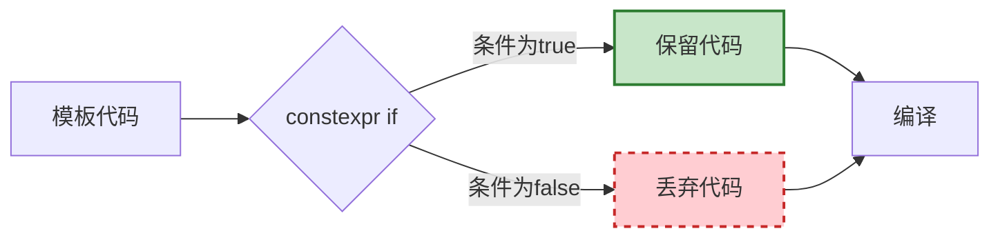

# 5.1 函数模板

> 编写一次，到处运行——泛型编程的基础

## 目录

- [函数模板基础](#函数模板基础)
- [模板参数推导](#模板参数推导)
- [模板特化](#模板特化)
- [非类型模板参数](#非类型模板参数)
- [模板函数重载](#模板函数重载)
- [constexpr if（C++17）](#constexpr-ifc17)
- [本节小结](#本节小结)

---

## 函数模板基础

### 基本概念

函数模板允许我们编写与类型无关的函数，通过类型参数化实现代码复用。

**核心术语：**
- **模板参数**：函数模板中的类型占位符（如 `T`），代表一种类型
- **类型参数**：使用 `typename` 或 `class` 声明的模板参数
- **模板实例化**：编译器根据具体使用类型生成对应函数的过程
- **模板实参**：调用模板时提供的具体类型（如 `int`、`double`）

```cpp
// 基本语法
template <typename T>  // T是模板参数（类型参数）
T maximum(T a, T b) {
    return (a > b) ? a : b;
}


// 使用
int main() {
    int a = 10, b = 20;
    std::cout << maximum(a, b) << "\n"; // 20

    double x = 3.14, y = 2.71;
    std::cout << maximum(x, y) << "\n"; // 3.14

    // 显式指定类型
    std::cout << maximum<double>(a, x) << "\n"; // 10.0
}
```

### 模板实例化

模板实例化（Template Instantiation）是指编译器根据使用的具体类型，从模板生成对应的函数或类代码的过程。

- **隐式实例化**：编译器自动根据调用时的参数类型推导并实例化
- **显式实例化**：程序员明确指定模板参数类型
- **两阶段编译**：第一阶段检查模板语法，第二阶段在实例化时检查类型相关错误



```cpp
template <typename T>
void print(T value) {
    std::cout << value << "\n";
}

void instantiationDemo() {
    // 隐式实例化
    print(42);       // 实例化 print<int>
    print(3.14);     // 实例化 print<double>
    print("Hello");  // 实例化 print<const char*>

    // 显式实例化
    print<long>(12345678900);

    // 编译器会为每种类型生成对应的函数
}
```

### 多类型参数

```cpp
// 两个类型参数
template <typename T, typename U>
void pairPrint(T first, U second) {
    std::cout << "First: " << first
              << ", Second: " << second << "\n";
}

void multiTypeDemo() {
    pairPrint(10, 3.14);          // int, double
    pairPrint("Hello", 100);      // const char*, int
    pairPrint(3.14, "World");     // double, const char*
}

// 返回类型与参数类型不同
template <typename T, typename U>
auto add(T a, U b) -> decltype(a + b) {
    return a + b;
}

// C++14: 简化的返回类型推导
template <typename T, typename U>
auto add2(T a, U b) {
    return a + b;
}
```

### 实际应用示例

```cpp
#include <iostream>
#include <algorithm>

// 交换任意类型的值
template <typename T>
void mySwap(T& a, T& b) {
    T temp = a;
    a = b;
    b = temp;
}

// 查找数组中的最大值
template <typename T, size_t N>
T findMax(T (&arr)[N]) {
    T maxVal = arr[0];
    for (size_t i = 1; i < N; ++i) {
        if (arr[i] > maxVal) {
            maxVal = arr[i];
        }
    }
    return maxVal;
}

// 排序数组
template <typename T, size_t N>
void bubbleSort(T (&arr)[N]) {
    for (size_t i = 0; i < N - 1; ++i) {
        for (size_t j = 0; j < N - i - 1; ++j) {
            if (arr[j] > arr[j + 1]) {
                mySwap(arr[j], arr[j + 1]);
            }
        }
    }
}

void algorithmDemo() {
    // 测试swap
    int a = 10, b = 20;
    mySwap(a, b);
    std::cout << "a: " << a << ", b: " << b << "\n";

    // 测试findMax
    int nums[] = {3, 1, 4, 1, 5, 9, 2, 6};
    std::cout << "Max: " << findMax(nums) << "\n";

    // 测试排序
    double vals[] = {3.14, 2.71, 1.41, 1.73};
    bubbleSort(vals);
    std::cout << "Sorted: ";
    for (auto v : vals) {
        std::cout << v << " ";
    }
    std::cout << "\n";
}
```

---

## 模板参数推导

模板参数推导（Template Argument Deduction）是编译器根据函数调用时的实参类型，自动确定模板参数类型的过程，无需显式指定。

### 推导规则

```cpp
template <typename T>
void process(T value, T* ptr) {
    std::cout << "Value: " << value
              << ", Pointed: " << *ptr << "\n";
}

void deductionDemo() {
    int x = 10;
    process(x, &x); // OK: T推导为int

    // process(10, &x); // 错误: int和int*类型不匹配
}
```

### 引用与const推导

**类型退化（Type Decay）规则：**
- 传值时，数组退化为指针，函数退化为函数指针
- 顶层const和引用会被移除
- 传引用时保留const和引用属性

```cpp
template <typename T>
void deduceType(T param) {
    std::cout << "Type decay\n";
}

template <typename T>
void deduceRef(T& param) {
    std::cout << "Reference preserved\n";
}

template <typename T>
void deduceConstRef(const T& param) {
    std::cout << "Const reference\n";
}

void referenceDemo() {
    int x = 10;
    const int cx = x;
    const int& rx = x;

    deduceType(x);  // T: int
    deduceType(cx); // T: int (const被移除)
    deduceType(rx); // T: int (引用和const被移除)

    deduceRef(x);   // T: int
    deduceRef(cx);  // T: const int (const保留)
    // deduceRef(10); // 错误: 不能绑定右值

    deduceConstRef(x);   // T: int
    deduceConstRef(cx);  // T: int
    deduceConstRef(10);  // T: int (可以绑定右值)
}
```

### 完美转发（Perfect Forwarding）

完美转发能够将函数参数连同其值类别（左值/右值）和const/volatile限定符一起转发给其他函数，保持原始参数的所有特性。

**核心概念：**
- **左值（lvalue）**：有名字的对象，可以取地址（如变量）
- **右值（rvalue）**：临时对象，字面量，或即将销毁的对象
- **万能引用（Universal Reference）**：`T&&` 在推导时可以绑定左值或右值
- **std::forward**：条件性地转换为右值引用，保持参数的值类别

```cpp
#include <utility>

template <typename T>
void forwardValue(T&& arg) {
    // std::forward保持值类别
    process(std::forward<T>(arg));
}

void forwardingDemo() {
    int a = 10;
    const int b = 20;

    forwardValue(a);       // T: int&, 左值引用
    forwardValue(b);       // T: const int&, const左值引用
    forwardValue(30);      // T: int, 右值
}

// 实际应用：工厂函数
template <typename T, typename... Args>
std::unique_ptr<T> createUnique(Args&&... args) {
    return std::make_unique<T>(std::forward<Args>(args)...);
}

class Widget {
public:
    Widget(int x, double y) {
        std::cout << "Widget constructed\n";
    }
};

void factoryDemo() {
    auto w1 = createUnique<Widget>(10, 3.14);
}
```

---

## 模板特化

模板特化（Template Specialization）是为特定类型或类型组合提供定制实现的机制。当通用模板不适合某些类型时，可以为这些类型编写专门的版本。

**两种特化方式：**
- **全特化（Full Specialization）**：所有模板参数都指定为具体类型
- **偏特化（Partial Specialization）**：仅部分模板参数指定（仅类模板支持）

### 全特化

```cpp
// 通用模板
template <typename T>
bool isEqual(T a, T b) {
    std::cout << "通用版本\n";
    return a == b;
}

// 为const char*全特化
template <>
bool isEqual<const char*>(const char* a, const char* b) {
    std::cout << "const char*特化版本\n";
    return strcmp(a, b) == 0;
}

void specializationDemo() {
    isEqual(10, 20);        // 使用通用版本
    isEqual(3.14, 2.71);    // 使用通用版本
    isEqual("hello", "world"); // 使用特化版本
}
```

### 偏特化（类模板特化）

虽然函数模板不支持偏特化，但可以通过函数重载实现类似效果：

```cpp
// 主模板
template <typename T>
void processPointer(T* ptr) {
    std::cout << "通用指针版本\n";
}

// 为const char*特化
void processPointer(const char* str) {
    std::cout << "const char*特化版本: " << str << "\n";
}

void partialDemo() {
    int x = 10;
    processPointer(&x);       // 通用版本
    processPointer("hello");  // 特化版本
}
```

### SFINAE原则

SFINAE（Substitution Failure Is Not An Error，替换失败不是错误）是C++模板编程的核心原则：当模板参数替换失败时，不会直接报错，而是会从候选函数集中移除该模板。

**工作原理：**
- 编译器尝试用给定类型实例化模板
- 如果替换失败（如类型不匹配、成员不存在），不会立即报错
- 编译器继续尝试其他重载版本
- 只有所有尝试都失败时才报错

**常用工具：**
- `std::enable_if`：根据条件启用或禁用函数
- `std::enable_if_t`：C++14简化的类型别名
- 类型特征（type_traits）：提供编译时类型查询

```cpp
#include <type_traits>

// 只对数值类型有效
template <typename T>
typename std::enable_if<std::is_arithmetic<T>::value, T>::type
multiply(T a, T b) {
    return a * b;
}

// C++14: 使用enable_if_t
template <typename T>
std::enable_if_t<std::is_arithmetic<T>::value, T>
multiply2(T a, T b) {
    return a * b;
}

// C++17: 使用if constexpr
template <typename T>
T multiply3(T a, T b) {
    if constexpr (std::is_arithmetic_v<T>) {
        return a * b;
    } else {
        static_assert(std::is_arithmetic_v<T>, "必须是数值类型");
        return T{};
    }
}

void sfinaeDemo() {
    multiply(10, 20);     // OK
    multiply(3.14, 2.0);  // OK
    // multiply("hello", "world"); // 编译错误
}
```

---

## 非类型模板参数

### 基本用法

```cpp
// 大小作为模板参数
template <typename T, size_t N>
void printArray(T (&arr)[N]) {
    for (size_t i = 0; i < N; ++i) {
        std::cout << arr[i] << " ";
    }
    std::cout << "\n";
}

void nontypeDemo() {
    int nums[] = {1, 2, 3, 4, 5};
    double vals[] = {1.1, 2.2, 3.3};

    printArray(nums); // N自动推导为5
    printArray(vals); // N自动推导为3
}
```

### 非类型参数的限制

```cpp
// 允许的非类型模板参数类型
template <int N>           // 整型
void func1() {}

template <size_t N>        // size_t
void func2() {}

template <bool B>          // bool
void func3() {}

template <char C>          // 字符
void func4() {}

template <const char* P>   // 指针/引用（有限制）
void func5() {}

// ❌ 不允许
// template <double D>   // 浮点数
// template <std::string S>  // 类类型
```

### 实际应用：编译时计算

```cpp
// 编译时阶乘计算
template <int N>
struct Factorial {
    static constexpr int value = N * Factorial<N - 1>::value;
};

// 特化：终止条件
template <>
struct Factorial<0> {
    static constexpr int value = 1;
};

void compileTimeDemo() {
    constexpr int result = Factorial<5>::value;
    std::cout << "5! = " << result << "\n"; // 120
}

// 编译时幂计算
template <int Base, int Exponent>
struct Power {
    static constexpr int value = Base * Power<Base, Exponent - 1>::value;
};

template <int Base>
struct Power<Base, 0> {
    static constexpr int value = 1;
};

void powerDemo() {
    constexpr int result = Power<2, 10>::value;
    std::cout << "2^10 = " << result << "\n"; // 1024
}
```

### 使用constexpr简化（C++11/14）

```cpp
// 更简洁的写法
constexpr int factorial(int n) {
    return (n <= 1) ? 1 : n * factorial(n - 1);
}

constexpr int power(int base, int exp) {
    return (exp == 0) ? 1 : base * power(base, exp - 1);
}

void constexprDemo() {
    constexpr int f5 = factorial(5);  // 编译时计算
    constexpr int p210 = power(2, 10); // 编译时计算

    std::cout << f5 << "\n";    // 120
    std::cout << p210 << "\n";  // 1024
}
```

---

## 模板函数重载

### 重载解析

```cpp
template <typename T>
void func(T value) {
    std::cout << "模板版本\n";
}

void func(int value) {
    std::cout << "非模板版本(int)\n";
}

void func(double value) {
    std::cout << "非模板版本(double)\n";
}

void overloadDemo() {
    func(10);      // 优先选择非模板版本(int)
    func(3.14);    // 优先选择非模板版本(double)
    func("hello"); // 使用模板版本
}
```

### 重载决议流程



### 实际示例

```cpp
// 通用版本
template <typename T>
void print(const T& value) {
    std::cout << "通用: " << value << "\n";
}

// 指针特化版本
template <typename T>
void print(T* value) {
    std::cout << "指针: " << *value << "\n";
}

// const char*特化
void print(const char* value) {
    std::cout << "字符串: " << value << "\n";
}

// 容器版本
template <typename T>
void print(const std::vector<T>& vec) {
    std::cout << "向量: ";
    for (const auto& item : vec) {
        std::cout << item << " ";
    }
    std::cout << "\n";
}

void overloadResolutionDemo() {
    int x = 10;
    print(x);         // 通用版本
    print(&x);        // 指针版本
    print("hello");   // const char*版本

    std::vector<int> nums = {1, 2, 3};
    print(nums);      // 容器版本
}
```

---

## constexpr if（C++17）

### 基本语法

```cpp
template <typename T>
void processValue(T value) {
    if constexpr (std::is_integral_v<T>) {
        std::cout << "整型: " << value << "\n";
    } else if constexpr (std::is_floating_point_v<T>) {
        std::cout << "浮点型: " << value << "\n";
    } else {
        std::cout << "其他类型\n";
    }
}

void constexprIfDemo() {
    processValue(42);      // 整型分支
    processValue(3.14);    // 浮点型分支
    processValue("hello"); // 其他分支
}
```

### 编译时分支选择



### 实际应用

```cpp
#include <vector>
#include <string>

template <typename T>
auto getContainerSize(const T& container) {
    if constexpr (requires { container.size(); }) {
        // 有size()成员函数
        return container.size();
    } else {
        // 使用其他方式
        return std::size(container);
    }
}

// 序列化不同类型
template <typename T>
std::string serialize(const T& value) {
    if constexpr (std::is_same_v<T, std::string>) {
        return value;
    } else if constexpr (std::is_arithmetic_v<T>) {
        return std::to_string(value);
    } else if constexpr (std::is_same_v<T, bool>) {
        return value ? "true" : "false";
    } else {
        return "unsupported";
    }
}

void constexprIfDemo() {
    std::cout << serialize(42) << "\n";        // "42"
    std::cout << serialize(3.14) << "\n";      // "3.140000"
    std::cout << serialize(true) << "\n";      // "true"
    std::cout << serialize("hello") << "\n";   // "hello"
}

// 优化算法
template <typename T>
void processContainer(T& container) {
    if constexpr (has_random_access_iterator_v<T>) {
        // 使用随机访问迭代器优化
        for (size_t i = 0; i < container.size(); ++i) {
            // 处理container[i]
        }
    } else {
        // 使用通用迭代器
        for (auto& item : container) {
            // 处理item
        }
    }
}
```

### 与传统模板元编程对比

```cpp
// ❌ 传统方法（复杂）
template <typename T>
struct Serializer {
    static std::string serialize(const T& value) {
        return "unsupported";
    }
};

template <>
struct Serializer<int> {
    static std::string serialize(const int& value) {
        return std::to_string(value);
    }
};

template <>
struct Serializer<std::string> {
    static std::string serialize(const std::string& value) {
        return value;
    }
};

// ✅ constexpr if（简洁）
template <typename T>
std::string serializeNew(const T& value) {
    if constexpr (std::is_same_v<T, int>) {
        return std::to_string(value);
    } else if constexpr (std::is_same_v<T, std::string>) {
        return value;
    } else {
        return "unsupported";
    }
}
```

---

## 本节小结

### 知识点回顾

1. **函数模板基础**：
   - 使用 `template <typename T>` 声明
   - 支持多个类型参数
   - 编译时实例化

2. **模板参数推导**：
   - 自动推导类型
   - 引用和const处理
   - 完美转发

3. **模板特化**：
   - 全特化：为特定类型定制
   - SFINAE：替换失败不是错误
   - 类型特征（type traits）

4. **非类型模板参数**：
   - 编译时常量
   - 编译时计算
   - `constexpr`函数

5. **函数重载**：
   - 非模板函数优先
   - 模板函数重载
   - 重载决议规则

6. **constexpr if**：
   - 编译时分支
   - 简化模板元编程
   - 提高代码可读性

### 最佳实践

```cpp
// ✅ 推荐做法
template <typename T>
void goodTemplate(const T& value) {
    if constexpr (std::is_arithmetic_v<T>) {
        // 数值类型处理
    } else {
        // 其他类型处理
    }
}

// ❌ 避免
template <typename T>
void badTemplate(T value) {  // 不要传值（除非有特殊需求）
    // 复杂的类型判断
}
```

### 学习建议

1. **从简单开始**：先掌握基本模板语法
2. **理解实例化**：知道编译器如何生成代码
3. **善用类型特征**：使用 `<type_traits>` 工具
4. **避免过度复杂**：不是所有问题都需要模板
5. **阅读STL源码**：学习标准库的实现方式

### 练习

1. 实现一个通用的 `clamp(value, min, max)` 函数
2. 编写一个能够序列化多种类型的 `serialize()` 函数
3. 实现编译时计算的斐波那契数列
4. 使用 `constexpr if` 实现类型安全的 `print()` 函数

---

**下一节：5.2-类模板** - 创建泛型类和容器