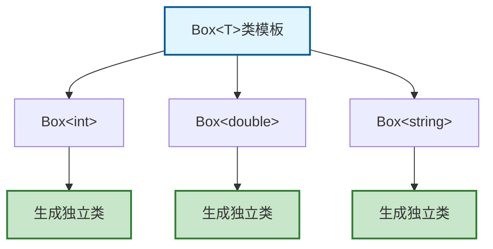
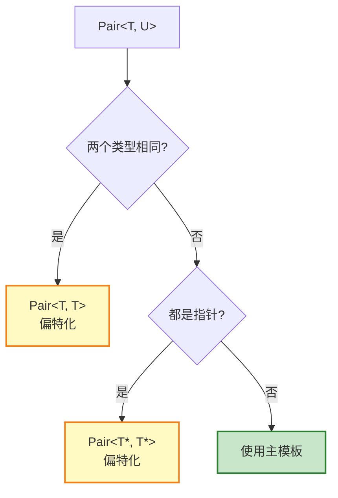

# 5.2 类模板

> 构建灵活的泛型类，实现高度可复用的组件

## 目录

- [类模板基础](#类模板基础)
- [模板成员函数](#模板成员函数)
- [类模板特化](#类模板特化)
- [模板参数默认值](#模板参数默认值)
- [友元与静态成员](#友元与静态成员)
- [变参模板（C++11）](#变参模板c11)
- [本节小结](#本节小结)

---

## 类模板基础

类模板（Class Template）是用于生成类类型的蓝图，通过类型参数化实现数据结构的通用性。与函数模板类似，类模板在使用时需要实例化为具体的类。

**核心概念：**
- **模板参数列表**：类模板中声明的类型或非类型参数
- **模板实例化**：为具体类型生成实际类代码的过程
- **模板实参**：实例化时提供的具体类型或值
- **显式指定**：类模板必须显式指定模板参数（不能像函数模板那样推导）

### 基本语法

```cpp
template <typename T>
class Box {
private:
    T value;

public:
    Box(T v) : value(v) {}

    T getValue() const {
        return value;
    }

    void setValue(T v) {
        value = v;
    }
};

void basicDemo() {
    Box<int> intBox(42);
    Box<double> doubleBox(3.14);
    Box<std::string> strBox("Hello");

    std::cout << intBox.getValue() << "\n";
    std::cout << doubleBox.getValue() << "\n";
    std::cout << strBox.getValue() << "\n";
}
```

### 类模板实例化



```cpp
// 模板声明与实现可以分离
template <typename T>
class Array {
private:
    T* data;
    size_t size;

public:
    explicit Array(size_t s);
    ~Array();
    T& operator[](size_t index);
    const T& operator[](size_t index) const;
    size_t getSize() const;
};

// 成员函数实现
template <typename T>
Array<T>::Array(size_t s) : size(s) {
    data = new T[s];
}

template <typename T>
Array<T>::~Array() {
    delete[] data;
}

template <typename T>
T& Array<T>::operator[](size_t index) {
    return data[index];
}

template <typename T>
const T& Array<T>::operator[](size_t index) const {
    return data[index];
}

template <typename T>
size_t Array<T>::getSize() const {
    return size;
}

void arrayDemo() {
    Array<int> nums(5);
    for (size_t i = 0; i < 5; ++i) {
        nums[i] = i * 10;
    }

    for (size_t i = 0; i < nums.getSize(); ++i) {
        std::cout << nums[i] << " ";
    }
    std::cout << "\n";
}
```

### 多类型参数

```cpp
template <typename Key, typename Value>
class KeyValuePair {
private:
    Key key;
    Value value;

public:
    KeyValuePair(const Key& k, const Value& v)
        : key(k), value(v) {}

    Key getKey() const { return key; }
    Value getValue() const { return value; }

    void setValue(const Value& v) { value = v; }
};

void multiTypeDemo() {
    KeyValuePair<int, std::string> pair1(1, "One");
    KeyValuePair<std::string, int> pair2("Two", 2);

    std::cout << pair1.getKey() << ": " << pair1.getValue() << "\n";
    std::cout << pair2.getKey() << ": " << pair2.getValue() << "\n";
}
```

### 实际应用：智能栈

```cpp
#include <stdexcept>

template <typename T, size_t Capacity = 10>
class Stack {
private:
    T data[Capacity];
    size_t top;

public:
    Stack() : top(0) {}

    void push(const T& item) {
        if (top >= Capacity) {
            throw std::overflow_error("Stack overflow");
        }
        data[top++] = item;
    }

    T pop() {
        if (top == 0) {
            throw std::underflow_error("Stack underflow");
        }
        return data[--top];
    }

    const T& peek() const {
        if (top == 0) {
            throw std::underflow_error("Stack is empty");
        }
        return data[top - 1];
    }

    bool isEmpty() const {
        return top == 0;
    }

    bool isFull() const {
        return top >= Capacity;
    }

    size_t size() const {
        return top;
    }
};

void stackDemo() {
    Stack<int, 5> intStack;

    for (int i = 1; i <= 5; ++i) {
        intStack.push(i * 10);
    }

    while (!intStack.isEmpty()) {
        std::cout << intStack.pop() << " ";
    }
    std::cout << "\n";

    Stack<std::string, 3> strStack;
    strStack.push("Hello");
    strStack.push("World");

    std::cout << "Top: " << strStack.peek() << "\n";
}
```

---

## 模板成员函数

成员函数模板（Member Function Template）是类内部定义为模板的成员函数。即使类本身不是模板，也可以有模板成员函数。这允许成员函数独立于类的类型参数进行泛化。

**特点：**
- 成员函数模板不能是虚函数
- 成员函数模板不能有默认参数（C++11前）
- 模板成员函数在类外定义时需要同时提供类和函数的模板参数

### 成员函数模板

```cpp
template <typename T>
class MyClass {
private:
    T value;

public:
    MyClass(T v) : value(v) {}

    // 普通成员函数
    T getValue() const {
        return value;
    }

    // 成员函数模板
    template <typename U>
    void setValue(U newValue) {
        value = static_cast<T>(newValue);
    }

    // 比较不同类型
    template <typename U>
    bool equals(U other) const {
        return value == static_cast<T>(other);
    }
};

void memberTemplateDemo() {
    MyClass<int> obj(42);

    obj.setValue(3.14);    // double -> int
    obj.setValue(100L);    // long -> int

    std::cout << obj.equals(42.0) << "\n";  // true
    std::cout << obj.equals(50) << "\n";    // false
}
```

### 构造函数模板

```cpp
template <typename T>
class Pair {
private:
    T first;
    T second;

public:
    // 普通构造函数
    Pair(const T& f, const T& s) : first(f), second(s) {}

    // 构造函数模板：接受不同类型
    template <typename U>
    Pair(const Pair<U>& other)
        : first(static_cast<T>(other.first)),
          second(static_cast<T>(other.second)) {}

    // 转换构造函数
    template <typename U, typename V>
    Pair(U f, V s) : first(static_cast<T>(f)),
                     second(static_cast<T>(s)) {}

    void print() const {
        std::cout << "(" << first << ", " << second << ")\n";
    }
};

void constructorDemo() {
    Pair<int> p1(10, 20);
    p1.print();

    Pair<double> p2(3.14, 2.71);
    p2.print();

    // 从Pair<int>构造Pair<double>
    Pair<double> p3(p1);
    p3.print();

    // 使用转换构造函数
    Pair<int> p4(3.14, 2.71f); // double, float -> int
    p4.print();
}
```

### 实际应用：类型转换

```cpp
template <typename T>
class Numeric {
private:
    T value;

public:
    explicit Numeric(T v) : value(v) {}

    // 转换为其他类型
    template <typename U>
    explicit operator Numeric<U>() const {
        return Numeric<U>(static_cast<U>(value));
    }

    // 运算符重载（成员函数模板）
    template <typename U>
    auto add(U other) const -> Numeric<decltype(value + other)> {
        return Numeric<decltype(value + other)>(value + other);
    }

    T getValue() const { return value; }
};

void numericDemo() {
    Numeric<int> num1(10);
    Numeric<double> num2(3.14);

    auto result = num1.add(num2); // Numeric<double>
    std::cout << result.getValue() << "\n"; // 13.14

    auto result2 = num1.add(5.5f); // Numeric<double>
    std::cout << result2.getValue() << "\n"; // 15.5
}
```

---

## 类模板特化

类模板特化允许为特定类型或类型组合提供定制实现。与函数模板不同，类模板支持**偏特化**（部分特化）。

**三种特化级别：**
1. **主模板**（Primary Template）：最通用的模板定义
2. **全特化**（Full Specialization）：所有模板参数都指定
3. **偏特化**（Partial Specialization）：部分模板参数指定（仅类模板支持）

**特化的作用：**
- 为特定类型优化性能
- 修正某些类型的特殊行为
- 利用类型的特殊特性

### 全特化

```cpp
// 主模板
template <typename T>
class Container {
public:
    void store(const T& value) {
        std::cout << "通用存储: " << value << "\n";
    }
};

// 为int全特化
template <>
class Container<int> {
public:
    void store(int value) {
        std::cout << "整数存储: " << value << " (优化)\n";
    }

    void optimizedMethod() {
        std::cout << "整数专用方法\n";
    }
};

void fullSpecializationDemo() {
    Container<double> c1;
    c1.store(3.14);

    Container<int> c2;
    c2.store(42);
    c2.optimizedMethod(); // 只有特化版本才有
}
```

### 偏特化

```cpp
// 主模板：两个类型参数
template <typename T, typename U>
class Pair {
private:
    T first;
    U second;

public:
    Pair(T f, U s) : first(f), second(s) {}

    void print() const {
        std::cout << "通用Pair: " << first << ", " << second << "\n";
    }
};

// 偏特化：两个类型相同
template <typename T>
class Pair<T, T> {
private:
    T first;
    T second;

public:
    Pair(T f, T s) : first(f), second(s) {}

    void print() const {
        std::cout << "同类型Pair: " << first << ", " << second << "\n";
    }

    void sameTypeMethod() {
        std::cout << "两个类型相同时可用\n";
    }
};

// 偏特化：一个类型是指针
template <typename T>
class Pair<T*, T*> {
private:
    T* first;
    T* second;

public:
    Pair(T* f, T* s) : first(f), second(s) {}

    void print() const {
        std::cout << "指针Pair: " << *first << ", " << *second << "\n";
    }
};

void partialSpecializationDemo() {
    Pair<int, double> p1(10, 3.14);
    p1.print(); // 通用版本

    Pair<int, int> p2(10, 20);
    p2.print(); // 同类型特化版本
    p2.sameTypeMethod();

    int a = 1, b = 2;
    Pair<int*, int*> p3(&a, &b);
    p3.print(); // 指针特化版本
}
```

### 特化决策树



### 实际应用：智能指针特化

```cpp
template <typename T>
class SmartPtr {
private:
    T* ptr;

public:
    explicit SmartPtr(T* p = nullptr) : ptr(p) {}

    ~SmartPtr() {
        delete ptr;
    }

    T* operator->() const {
        return ptr;
    }

    T& operator*() const {
        return *ptr;
    }
};

// 为数组类型特化
template <typename T>
class SmartPtr<T[]> {
private:
    T* ptr;

public:
    explicit SmartPtr(T* p = nullptr) : ptr(p) {}

    ~SmartPtr() {
        delete[] ptr;
    }

    T& operator[](size_t index) const {
        return ptr[index];
    }
};

void smartPtrDemo() {
    SmartPtr<int> ptr1(new int(42));
    std::cout << *ptr1 << "\n";

    SmartPtr<int[]> arrPtr(new int[5]{1, 2, 3, 4, 5});
    std::cout << arrPtr[2] << "\n";
}
```

---

## 模板参数默认值

### 基本用法

```cpp
template <typename T = int, size_t N = 10>
class Buffer {
private:
    T data[N];

public:
    T& operator[](size_t index) {
        return data[index];
    }

    const T& operator[](size_t index) const {
        return data[index];
    }

    size_t size() const {
        return N;
    }
};

void defaultParamDemo() {
    Buffer<int> buf1;           // T=int, N=10
    Buffer<double> buf2;        // T=double, N=10
    Buffer<int, 20> buf3;       // T=int, N=20
    Buffer<float, 15> buf4;     // T=float, N=15

    for (size_t i = 0; i < buf1.size(); ++i) {
        buf1[i] = i;
    }
}
```

### 函数对象默认参数

```cpp
template <typename T, typename Comparator = std::less<T>>
class SortedArray {
private:
    std::vector<T> data;
    Comparator comp;

public:
    void insert(const T& item) {
        data.push_back(item);
        // 简单的冒泡排序
        for (size_t i = data.size() - 1; i > 0; --i) {
            if (comp(data[i], data[i - 1])) {
                std::swap(data[i], data[i - 1]);
            }
        }
    }

    void print() const {
        for (const auto& item : data) {
            std::cout << item << " ";
        }
        std::cout << "\n";
    }
};

void comparatorDemo() {
    SortedArray<int, std::less<int>> ascending;
    ascending.insert(3);
    ascending.insert(1);
    ascending.insert(2);
    std::cout << "升序: ";
    ascending.print();

    SortedArray<int, std::greater<int>> descending;
    descending.insert(3);
    descending.insert(1);
    descending.insert(2);
    std::cout << "降序: ";
    descending.print();
}
```

### 内存分配器示例

```cpp
template <typename T, typename Allocator = std::allocator<T>>
class CustomContainer {
private:
    T* data;
    size_t size;
    Allocator allocator;

public:
    explicit CustomContainer(size_t s)
        : size(s), allocator() {
        data = allocator.allocate(size);
    }

    ~CustomContainer() {
        for (size_t i = 0; i < size; ++i) {
            std::destroy_at(data + i);
        }
        allocator.deallocate(data, size);
    }

    T& operator[](size_t index) {
        return data[index];
    }

    const T& operator[](size_t index) const {
        return data[index];
    }
};

void allocatorDemo() {
    CustomContainer<int> container(10);
    // 使用默认分配器
}
```

---

## 友元与静态成员

### 友元函数

```cpp
template <typename T>
class Box;

// 非模板友元函数
template <typename T>
std::ostream& operator<<(std::ostream& os, const Box<T>& box);

template <typename T>
class Box {
private:
    T value;

public:
    explicit Box(T v) : value(v) {}

    // 友元函数声明
    friend std::ostream& operator<<<T>(std::ostream& os, const Box& box);
};

template <typename T>
std::ostream& operator<<(std::ostream& os, const Box<T>& box) {
    os << "Box[" << box.value << "]";
    return os;
}

void friendDemo() {
    Box<int> intBox(42);
    Box<double> doubleBox(3.14);

    std::cout << intBox << "\n";
    std::cout << doubleBox << "\n";
}
```

### 友元类

```cpp
template <typename T>
class MyClass;

// 友元类模板
template <typename T>
class FriendClass {
public:
    void accessPrivate(const MyClass<T>& obj);
};

template <typename T>
class MyClass {
private:
    T secret;

    // 声明友元类
    friend class FriendClass<T>;

public:
    explicit MyClass(T s) : secret(s) {}
};

template <typename T>
void FriendClass<T>::accessPrivate(const MyClass<T>& obj) {
    std::cout << "访问私有成员: " << obj.secret << "\n";
}

void friendClassDemo() {
    MyClass<int> obj(42);
    FriendClass<int> fc;
    fc.accessPrivate(obj);
}
```

### 静态成员

```cpp
template <typename T>
class Counter {
private:
    static size_t count;  // 声明

public:
    Counter() {
        ++count;
    }

    ~Counter() {
        --count;
    }

    static size_t getCount() {
        return count;
    }
};

// 为每种类型定义静态成员
template <typename T>
size_t Counter<T>::count = 0;

void staticDemo() {
    std::cout << "Initial: " << Counter<int>::getCount() << "\n";

    {
        Counter<int> c1;
        Counter<int> c2;
        Counter<double> c3;

        std::cout << "With objects: "
                  << Counter<int>::getCount() << " ints, "
                  << Counter<double>::getCount() << " doubles\n";
    }

    std::cout << "After scope: "
              << Counter<int>::getCount() << " ints, "
              << Counter<double>::getCount() << " doubles\n";
}
```

### 静态成员函数

```cpp
template <typename T>
class MathUtils {
public:
    static T add(T a, T b) {
        return a + b;
    }

    static T multiply(T a, T b) {
        return a * b;
    }

    static T max(T a, T b) {
        return (a > b) ? a : b;
    }
};

void staticFunctionDemo() {
    auto sum = MathUtils<int>::add(10, 20);
    auto product = MathUtils<double>::multiply(3.14, 2.0);

    std::cout << "Sum: " << sum << "\n";
    std::cout << "Product: " << product << "\n";
}
```

---

## 变参模板（C++11）

变参模板（Variadic Template）是C++11引入的特性，允许模板接受可变数量的参数。这使得编写能够处理任意数量参数的函数和类成为可能。

**核心概念：**
- **参数包（Parameter Pack）**：表示零个或多个模板参数或函数参数
- **模式`...`**：扩展参数包的语法
- **折叠表达式（Fold Expression）**：C++17引入，用于简化参数包的展开
- **递归实例化**：处理参数包的传统方式（C++11/14）

**两种参数包：**
- **模板参数包**：`template<typename... Args>` 表示零个或多个类型
- **函数参数包**：`void func(Args... args)` 表示零个或多个函数参数

### 基本语法

```cpp
// 变参函数模板
template <typename... Args>
void printAll(Args... args) {
    (std::cout << ... << args) << "\n"; // C++17折叠表达式
}

void variadicDemo() {
    printAll(1);                    // 1
    printAll(1, 2, 3);             // 123
    printAll("Hello", 42, 3.14);   // Hello423.14
}

// 递归展开（C++11/14）
template <typename T>
void printOne(T value) {
    std::cout << value << " ";
}

template <typename T, typename... Args>
void printRecursive(T first, Args... rest) {
    printOne(first);
    printRecursive(rest...);
}

template <>
void printRecursive<>(...) {
    std::cout << "\n";
}

void recursiveDemo() {
    printRecursive(1, 2.0, "three");
}
```

### 变参类模板

```cpp
// 变参类模板
template <typename... Types>
class Tuple;

// 递归终止
template <>
class Tuple<> {
public:
    void print() const {
        std::cout << "Empty tuple\n";
    }
};

// 递归定义
template <typename Head, typename... Tail>
class Tuple<Head, Tail...> {
private:
    Head head;
    Tuple<Tail...> tail;

public:
    Tuple(Head h, Tail... t) : head(h), tail(t...) {}

    void print() const {
        std::cout << "[" << head << "]";
        tail.print();
    }
};

void tupleDemo() {
    Tuple<int, double, std::string> t(42, 3.14, "Hello");
    t.print();
}
```

### 完美转发

```cpp
template <typename... Args>
void forwardAll(Args&&... args) {
    processAll(std::forward<Args>(args)...);
}

void processAll() {
    // 终止条件
}

template <typename T, typename... Args>
void processAll(T&& first, Args&&... rest) {
    handle(std::forward<T>(first));
    processAll(std::forward<Args>(rest)...);
}

void handle(int& value) {
    std::cout << "左值引用: " << value << "\n";
}

void handle(int&& value) {
    std::cout << "右值引用: " << value << "\n";
}

void perfectForwardDemo() {
    int x = 10;
    forwardAll(x, 20, 30);    // 左值, 右值, 右值
}
```

### 实际应用：类型安全的printf

```cpp
template <typename T>
std::string formatOne(T value) {
    if constexpr (std::is_same_v<T, std::string>) {
        return value;
    } else if constexpr (std::is_arithmetic_v<T>) {
        return std::to_string(value);
    } else {
        return std::string(value);
    }
}

template <typename... Args>
std::string format(const std::string& fmt, Args... args) {
    std::vector<std::string> replacements = {formatOne(args)...};

    std::string result = fmt;
    size_t pos = 0;
    for (const auto& repl : replacements) {
        size_t found = result.find("{}", pos);
        if (found != std::string::npos) {
            result.replace(found, 2, repl);
            pos = found + repl.length();
        }
    }

    return result;
}

void formatDemo() {
    std::cout << format("Name: {}, Age: {}", "Alice", 30) << "\n";
    std::cout << format("Value: {}, Ratio: {}", 42, 3.14) << "\n";
}
```

---

## 本节小结

### 知识点回顾

1. **类模板基础**：
   - 使用 `template <typename T>` 声明
   - 支持多个类型参数
   - 实例化时必须明确指定类型

2. **成员函数模板**：
   - 成员函数可以是模板
   - 构造函数可以是模板
   - 支持类型转换

3. **模板特化**：
   - 全特化：所有参数都指定
   - 偏特化：部分参数指定（仅类模板）
   - 特化版本优先于主模板

4. **模板参数默认值**：
   - 为类型参数提供默认值
   - 为非类型参数提供默认值
   - 简化模板使用

5. **友元与静态成员**：
   - 友元函数和类可以声明
   - 静态成员每种类型独立
   - 静态成员函数不需要实例化

6. **变参模板**：
   - 接受可变数量参数
   - 折叠表达式（C++17）
   - 完美转发

### 最佳实践

```cpp
// ✅ 使用类型别名简化
using IntStack = Stack<int, 100>;
using StringVector = std::vector<std::string>;

// ✅ 为常用类型提供特化
template <>
class MyClass<std::string> {
    // 字符串专用优化
};

// ✅ 使用enable_if限制类型
template <typename T,
          typename = std::enable_if_t<std::is_arithmetic_v<T>>>
class NumericContainer {
    // 只接受数值类型
};
```

### 学习建议

1. **循序渐进**：从简单模板开始
2. **理解实例化**：知道编译器如何处理
3. **善用STL**：学习标准库的实现
4. **避免过度**：不是所有情况都需要模板
5. **性能考虑**：注意代码膨胀问题

### 练习

1. 实现一个通用的 `Matrix<T, Rows, Cols>` 类
2. 编写一个类型安全的 `Variant` 类（类似 `std::variant`）
3. 实现一个支持链式操作的 `Builder<T>` 类
4. 使用变参模板实现一个线程池

---

**下一节：5.3-模板元编程** - 在编译时进行计算和类型操作