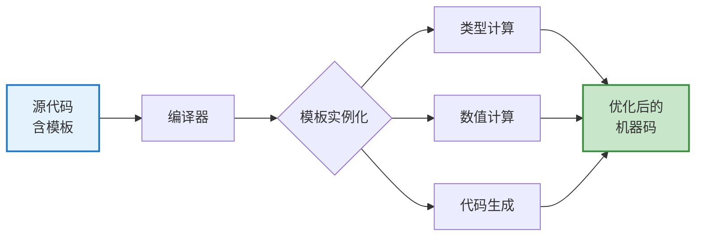

# 5.3 模板元编程

> 在编译时进行计算和类型操作，将运行时开销转移到编译时

## 目录

- [什么是模板元编程](#什么是模板元编程)
- [类型特征（Type Traits）](#类型特征type-traits)
- [编译时计算](#编译时计算)
- [类型推导与sfinae](#类型推导与sfinae)
- [策略模式与标签分发](#策略模式与标签分发)
- [constexpr模板编程](#constexpr模板编程)
- [本节小结](#本节小结)

---

## 什么是模板元编程

### 核心概念

**模板元编程（Template Metaprogramming, TMP）**是一种特殊的元编程技术，利用C++模板系统在**编译时**执行计算和类型操作。

**主要特点：**
- **编译时计算**：在编译阶段完成工作，运行时零开销
- **类型操作**：对类型进行查询、转换和判断
- **代码生成**：根据类型特性生成优化代码

**与传统编程的区别：**
| 方面 | 传统编程 | 模板元编程 |
|------|---------|-----------|
| 执行时间 | 运行时 | 编译时 |
| 性能 | 有运行时开销 | 零运行时开销 |
| 调试难度 | 容易调试 | 错误信息复杂 |
| 适用场景 | 动态问题 | 静态可确定的问题 |

**模板元编程的三大技术：**
1. **模板递归**：利用模板特化实现递归计算
2. **类型萃取**：编译时查询和操作类型属性
3. **SFINAE**：替换失败不是错误，实现编译时条件判断



### 简单示例：编译时阶乘

```cpp
// 传统运行时计算
int factorial_runtime(int n) {
    return (n <= 1) ? 1 : n * factorial_runtime(n - 1);
}

// 编译时计算（递归模板）
template <int N>
struct Factorial {
    static constexpr int value = N * Factorial<N - 1>::value;
};

// 特化：终止条件
template <>
struct Factorial<0> {
    static constexpr int value = 1;
};

void demo() {
    // 运行时：每次调用都计算
    int f1 = factorial_runtime(5);

    // 编译时：编译时已计算出结果
    constexpr int f2 = Factorial<5>::value; // 编译时替换为120

    std::cout << f1 << "\n"; // 120
    std::cout << f2 << "\n"; // 120
}
```

### constexpr vs 模板元编程

```cpp
// C++11: constexpr函数
constexpr int factorial_constexpr(int n) {
    return (n <= 1) ? 1 : n * factorial_constexpr(n - 1);
}

void comparison() {
    constexpr int f1 = factorial_constexpr(5);    // 简洁
    constexpr int f2 = Factorial<5>::value;       // 复杂但更灵活

    std::cout << f1 << "\n";
    std::cout << f2 << "\n";
}
```

---

## 类型特征（Type Traits）

类型特征（Type Traits）是C++标准库提供的一套编译时类型查询和操作工具，定义在`<type_traits>`头文件中。它们允许在编译时获取类型的属性、进行类型转换和类型比较。

**类型特征的作用：**
- **类型分类**：判断类型是否属于某类别（如整数、浮点、指针等）
- **类型关系**：判断两个类型之间的关系（如相同、基类-派生类等）
- **类型转换**：添加或移除类型的修饰符（const、引用、指针等）
- **类型属性**：查询类型的特定属性（如是否有默认构造函数）

**命名规则：**
- 以`is_`开头：返回bool值的类型特征
- 以`_v`结尾（C++14）：直接访问值，无需`::value`
- 以`_t`结尾（C++14）：类型别名，无需`typename`
- 以`add_`/`remove_`开头：类型转换特征

### 基本类型特征

`<type_traits>` 头文件提供了丰富的类型查询和操作工具。

```cpp
#include <type_traits>

void typeTraitsDemo() {
    // 类型分类
    std::cout << std::is_integral_v<int> << "\n";           // true
    std::cout << std::is_floating_point_v<double> << "\n";  // true
    std::cout << std::is_pointer_v<int*> << "\n";           // true
    std::cout << std::is_reference_v<int&> << "\n";         // true
    std::cout << std::is_const_v<const int> << "\n";        // true

    // 类型关系
    std::cout << std::is_same_v<int, int> << "\n";          // true
    std::cout << std::is_base_of_v<std::iostream,
                                    std::ostream> << "\n";  // true
    std::cout << std::is_convertible_v<int, double> << "\n"; // true

    // 类型属性
    std::cout << std::is_arithmetic_v<int> << "\n";         // true
    std::cout << std::is_signed_v<int> << "\n";             // true
    std::cout << std::is_unsigned_v<unsigned int> << "\n";  // true
}
```

### 类型修改

```cpp
void typeModificationDemo() {
    // 移除引用
    using T1 = std::remove_reference_t<int&>;  // int
    using T2 = std::remove_reference_t<int&&>; // int

    // 添加引用
    using T3 = std::add_lvalue_reference_t<int>;   // int&
    using T4 = std::add_rvalue_reference_t<int>;   // int&&

    // 移除const
    using T5 = std::remove_const_t<const int>;     // int

    // 移除指针
    using T6 = std::remove_pointer_t<int*>;        // int

    // 获取元素类型
    using T7 = std::remove_extent_t<int[10]>;      // int

    // 条件选择
    using T8 = std::conditional_t<true, int, double>;   // int
    using T9 = std::conditional_t<false, int, double>;  // double

    // 公共类型
    using T10 = std::common_type_t<int, double>;    // double
}
```

### 类型转换特征

```cpp
void conversionTraitsDemo() {
    // 检查转换是否可能
    constexpr bool can_convert = std::is_convertible_v<int, double>;
    std::cout << "Can convert int to double: " << can_convert << "\n";

    // 检查隐式转换
    constexpr bool can_implicit = std::is_convertible_v<double, int>;
    std::cout << "Can implicitly convert double to int: "
              << can_implicit << "\n";

    // 检查是否可以构造
    constexpr bool can_construct = std::is_constructible_v<std::string, const char*>;
    std::cout << "Can construct string from const char*: "
              << can_construct << "\n";
}
```

### 实际应用：类型安全的容器

```cpp
template <typename T>
class NumericVector {
    static_assert(std::is_arithmetic_v<T>,
                  "NumericVector只接受数值类型");

private:
    std::vector<T> data;

public:
    void add(T value) {
        data.push_back(value);
    }

    T sum() const {
        T result = 0;
        for (auto v : data) {
            result += v;
        }
        return result;
    }
};

void numericVectorDemo() {
    NumericVector<int> ints;
    ints.add(10);
    ints.add(20);

    std::cout << "Sum: " << ints.sum() << "\n";

    // NumericVector<std::string> strings; // 编译错误！
}
```

---

## 编译时计算

### 数值计算

```cpp
// 编译时幂运算
template <int Base, int Exp>
struct Power {
    static constexpr int value = Base * Power<Base, Exp - 1>::value;
};

template <int Base>
struct Power<Base, 0> {
    static constexpr int value = 1;
};

// 编译时斐波那契数列
template <int N>
struct Fibonacci {
    static constexpr int value = Fibonacci<N - 1>::value +
                                Fibonacci<N - 2>::value;
};

template <>
struct Fibonacci<0> {
    static constexpr int value = 0;
};

template <>
struct Fibonacci<1> {
    static constexpr int value = 1;
};

// 编译时最大公约数
template <int M, int N>
struct GCD {
    static constexpr int value = GCD<N, M % N>::value;
};

template <int M>
struct GCD<M, 0> {
    static constexpr int value = M;
};

void compileTimeCalcDemo() {
    constexpr int power = Power<2, 10>::value;
    constexpr int fib = Fibonacci<10>::value;
    constexpr int gcd = GCD<48, 18>::value;

    std::cout << "2^10 = " << power << "\n";      // 1024
    std::cout << "Fib(10) = " << fib << "\n";     // 55
    std::cout << "GCD(48, 18) = " << gcd << "\n"; // 6
}
```

### 类型列表操作

```cpp
// 类型列表基础
template <typename... Ts>
struct TypeList {
    static constexpr size_t size = sizeof...(Ts);
};

// 获取第N个类型
template <size_t N, typename... Ts>
struct GetTypeImpl;

template <size_t N, typename Head, typename... Tail>
struct GetTypeImpl<N, Head, Tail...> {
    using type = typename GetTypeImpl<N - 1, Tail...>::type;
};

template <typename Head, typename... Tail>
struct GetTypeImpl<0, Head, Tail...> {
    using type = Head;
};

template <size_t N, typename... Ts>
using GetType = typename GetTypeImpl<N, Ts...>::type;

// 添加类型到列表
template <typename List, typename T>
struct PushFrontImpl;

template <typename... Ts, typename T>
struct PushFrontImpl<TypeList<Ts...>, T> {
    using type = TypeList<T, Ts...>;
};

template <typename List, typename T>
using PushFront = typename PushFrontImpl<List, T>::type;

void typeListDemo() {
    using MyTypes = TypeList<int, double, char>;

    using First = GetType<0, MyTypes>;   // int
    using Second = GetType<1, MyTypes>;  // double

    using NewTypes = PushFront<MyTypes, std::string>;
    // TypeList<std::string, int, double, char>
}
```

### 编译时字符串处理

```cpp
template <size_t N>
struct ConstexprString {
    constexpr ConstexprString(const char (&str)[N]) {
        for (size_t i = 0; i < N; ++i) {
            data[i] = str[i];
        }
    }

    constexpr size_t size() const {
        return N - 1;
    }

    constexpr char operator[](size_t i) const {
        return data[i];
    }

    char data[N];
};

// 编译时字符串长度
template <size_t N>
constexpr size_t strlen_ct(const char (&str)[N]) {
    return N - 1;
}

// 编译时字符串比较
template <size_t N1, size_t N2>
constexpr bool strcmp_ct(const char (&s1)[N1], const char (&s2)[N2]) {
    static_assert(N1 == N2, "字符串长度不同");

    for (size_t i = 0; i < N1; ++i) {
        if (s1[i] != s2[i]) {
            return false;
        }
    }

    return true;
}

void compileTimeStringDemo() {
    constexpr ConstexprString str("Hello");
    constexpr size_t len = strlen_ct("World");

    static_assert(strcmp_ct("hello", "hello"), "字符串不相等");
    // static_assert(strcmp_ct("hello", "world"), "不相等");

    std::cout << len << "\n";
}
```

---

## 类型推导与SFINAE

### SFINAE原则

SFINAE (Substitution Failure Is Not An Error) 是模板元编程的核心原则：**替换失败不是错误**。

```cpp
// 主模板
template <typename T>
struct HasTypedef {
    static constexpr bool value = false;
};

// 特化：检查是否有value_type类型成员
template <typename T>
struct HasTypedef<typename T::value_type> {
    static constexpr bool value = true;
};

struct MyStruct {
    using value_type = int;
};

void sfinaeDemo() {
    std::cout << HasTypedef<int>::value << "\n";       // false
    std::cout << HasTypedef<MyStruct>::value << "\n";  // true
}
```

### enable_if用法

```cpp
// 只对整数类型启用
template <typename T,
          typename = std::enable_if_t<std::is_integral_v<T>>>
T onlyIntegers(T value) {
    return value * 2;
}

// 返回类型SFINAE
template <typename T>
std::enable_if_t<std::is_arithmetic_v<T>, T>
square(T value) {
    return value * value;
}

// 函数参数SFINAE
template <typename T>
void process(T value,
             std::enable_if_t<std::is_pointer_v<T>>* = nullptr) {
    std::cout << "是指针类型\n";
}

template <typename T>
void process(T value,
             std::enable_if_t<!std::is_pointer_v<T>>* = nullptr) {
    std::cout << "不是指针类型\n";
}

void enableIfDemo() {
    onlyIntegers(42);    // OK
    // onlyIntegers(3.14); // 编译错误

    std::cout << square(5) << "\n";    // 25
    std::cout << square(2.5) << "\n";  // 6.25

    int x = 10;
    int* ptr = &x;

    process(x);   // 不是指针类型
    process(ptr); // 是指针类型
}
```

### void_t技巧

```cpp
template <typename... Ts>
using void_t = void;

// 检测是否有size_type类型成员
template <typename, typename = void>
struct HasSizeType : std::false_type {};

template <typename T>
struct HasSizeType<T, void_t<typename T::size_type>> : std::true_type {};

struct WithSize {
    using size_type = size_t;
};

struct WithoutSize {};

void voidTDemo() {
    std::cout << HasSizeType<WithSize>::value << "\n";      // true
    std::cout << HasSizeType<WithoutSize>::value << "\n";   // false
}
```

### 检测成员函数

```cpp
template <typename, typename = void>
struct HasSerializeMethod : std::false_type {};

template <typename T>
struct HasSerializeMethod<T,
    void_t<decltype(std::declval<T>().serialize())>>
    : std::true_type {};

class Serializable {
public:
    std::string serialize() const {
        return "serialized";
    }
};

class NotSerializable {};

void detectionDemo() {
    std::cout << HasSerializeMethod<Serializable>::value << "\n";    // true
    std::cout << HasSerializeMethod<NotSerializable>::value << "\n"; // false
}
```

---

## 策略模式与标签分发

标签分发（Tag Dispatching）是一种编译时算法选择技术，通过定义不同的标签类型（Tag Types）并在编译时根据类型特征选择对应的实现。这是C++标准库广泛使用的优化技术。

**核心思想：**
1. 定义一组标签类型（如`random_access_iterator_tag`）
2. 编写不同的实现函数，每个接受不同的标签
3. 编写分发函数，根据类型特征选择合适的标签
4. 编译器在编译时选择正确的实现

**与策略模式的区别：**
- **传统策略模式**：运行时多态，使用虚函数
- **标签分发**：编译时多态，零运行时开销

### 标签分发

使用标签类型在编译时选择最优实现。

```cpp
// 优化策略标签
struct SequentialAccessTag {};
struct RandomAccessTag {};

// 检测迭代器类型
template <typename Iterator>
using IteratorCategory = typename std::iterator_traits<Iterator>::iterator_category;

// 随机访问实现
template <typename Iterator>
void advance_impl(Iterator& it, size_t n, RandomAccessTag) {
    std::cout << "使用随机访问优化 (O(1))\n";
    it += n;
}

// 顺序访问实现
template <typename Iterator>
void advance_impl(Iterator& it, size_t n, SequentialAccessTag) {
    std::cout << "使用顺序访问 (O(n))\n";
    for (size_t i = 0; i < n; ++i) {
        ++it;
    }
}

// 分发函数
template <typename Iterator>
void myAdvance(Iterator& it, size_t n) {
    using Category = IteratorCategory<Iterator>;
    advance_impl(it, n, Category{});
}

void tagDispatchDemo() {
    std::vector<int> vec = {1, 2, 3, 4, 5};
    auto vecIt = vec.begin();
    myAdvance(vecIt, 3); // 随机访问

    std::list<int> lst = {1, 2, 3, 4, 5};
    auto listIt = lst.begin();
    myAdvance(listIt, 3); // 顺序访问
}
```

### 策略模式

```cpp
// 排序策略
struct BubbleSortStrategy {
    template <typename Iterator>
    static void sort(Iterator begin, Iterator end) {
        std::cout << "使用冒泡排序\n";
        // 实现略
    }
};

struct QuickSortStrategy {
    template <typename Iterator>
    static void sort(Iterator begin, Iterator end) {
        std::cout << "使用快速排序\n";
        // 实现略
    }
};

// 默认策略：根据类型选择
template <typename Iterator>
void sortContainer(Iterator begin, Iterator end) {
    using Category = IteratorCategory<Iterator>;

    if constexpr (std::is_same_v<Category, std::random_access_iterator_tag>) {
        QuickSortStrategy::sort(begin, end);
    } else {
        BubbleSortStrategy::sort(begin, end);
    }
}

void strategyDemo() {
    std::vector<int> vec = {5, 2, 8, 1, 9};
    sortContainer(vec.begin(), vec.end());

    std::list<int> lst = {5, 2, 8, 1, 9};
    sortContainer(lst.begin(), lst.end());
}
```

### 类型萃取（Type Extraction）

```cpp
// 提取值类型
template <typename Container>
using ValueType = typename Container::value_type;

// 提取迭代器类型
template <typename Container>
using IteratorType = typename Container::iterator;

// 通用处理函数
template <typename Container>
void processContainer(Container& container) {
    using Value = ValueType<Container>;

    for (Value& item : container) {
        // 处理item
        std::cout << item << " ";
    }
    std::cout << "\n";
}

void extractionDemo() {
    std::vector<int> nums = {1, 2, 3, 4, 5};
    processContainer(nums);

    std::list<std::string> words = {"hello", "world"};
    processContainer(words);
}
```

---

## constexpr模板编程

### constexpr if（C++17）

```cpp
template <typename T>
auto get_value(T t) {
    if constexpr (std::is_pointer_v<T>) {
        return *t;  // 返回指向的值
    } else {
        return t;   // 返回值本身
    }
}

void constexprIfDemo() {
    int x = 42;
    int* ptr = &x;

    std::cout << get_value(x) << "\n";    // 42
    std::cout << get_value(ptr) << "\n";  // 42
}
```

### 编译时算法选择

```cpp
template <typename Iterator>
auto distance(Iterator first, Iterator last) {
    if constexpr (std::is_same_v<
                    typename std::iterator_traits<Iterator>::iterator_category,
                    std::random_access_iterator_tag>) {
        // O(1)
        return last - first;
    } else {
        // O(n)
        size_t count = 0;
        for (auto it = first; it != last; ++it) {
            ++count;
        }
        return count;
    }
}

void algorithmSelectionDemo() {
    std::vector<int> vec(100);
    auto d1 = distance(vec.begin(), vec.end());

    std::list<int> lst(100);
    auto d2 = distance(lst.begin(), lst.end());
}
```

### fold表达式（C++17）

```cpp
// 一元折叠
template <typename... Args>
auto sum(Args... args) {
    return (args + ...);  // ((arg1 + arg2) + arg3) + ...
}

template <typename... Args>
auto sumLeft(Args... args) {
    return (args + ... + 0);  // 带初始值
}

template <typename... Args>
void printAll(Args... args) {
    (std::cout << ... << args) << "\n";
}

template <typename... Args>
bool allTrue(Args... args) {
    return (args && ...);  // 逻辑与折叠
}

void foldDemo() {
    auto s = sum(1, 2, 3, 4, 5);
    std::cout << "Sum: " << s << "\n";

    printAll("Hello", " ", "World", "!", "\n");

    bool result = allTrue(true, true, false);
    std::cout << "All true: " << result << "\n";
}
```

### 编译时反射（C++20 Concepts）

```cpp
// C++20: Concepts（概念）
template <typename T>
concept Numeric = std::is_arithmetic_v<T>;

template <Numeric T>
auto multiply(T a, T b) {
    return a * b;
}

void conceptDemo() {
    multiply(10, 20);    // OK
    multiply(3.14, 2.0); // OK
    // multiply("hello", "world"); // 编译错误
}

// 复杂概念
template <typename T>
concept Container = requires(T container) {
    typename T::value_type;
    { container.begin() } -> std::same_as<typename T::iterator>;
    { container.end() } -> std::same_as<typename T::iterator>;
    { container.size() } -> std::convertible_to<size_t>;
};

template <Container C>
void process(C& container) {
    for (auto& item : container) {
        std::cout << item << " ";
    }
    std::cout << "\n";
}

void complexConceptDemo() {
    std::vector<int> vec = {1, 2, 3};
    process(vec);

    std::list<double> lst = {1.1, 2.2, 3.3};
    process(lst);
}
```

---

## 本节小结

### 知识点回顾

1. **模板元编程基础**：
   - 编译时计算，零运行时开销
   - 利用模板递归和特化
   - `constexpr`函数简化元编程

2. **类型特征**：
   - 类型分类、关系、属性
   - 类型修改和转换
   - `std::enable_if`和SFINAE

3. **编译时计算**：
   - 数值计算（阶乘、幂运算等）
   - 类型列表操作
   - 编译时字符串处理

4. **SFINAE**：
   - 替换失败不是错误
   - `std::enable_if`用法
   - `void_t`技巧
   - 成员检测

5. **标签分发与策略模式**：
   - 编译时算法选择
   - 类型萃取
   - 优化策略

6. **现代特性**：
   - `constexpr if`
   - fold表达式
   - Concepts（C++20）

### 实际应用场景

```cpp
// 1. 类型约束
template <typename T>
concept Sortable = requires(T a, T b) {
    a < b;
};

// 2. 性能优化
template <typename T>
void optimizedCopy(T* dest, const T* src, size_t count) {
    if constexpr (std::is_trivially_copyable_v<T>) {
        memcpy(dest, src, count * sizeof(T));
    } else {
        for (size_t i = 0; i < count; ++i) {
            dest[i] = src[i];
        }
    }
}

// 3. API设计
template <typename T>
class Optional {
    static_assert(std::is_copy_constructible_v<T>,
                  "T必须是可拷贝构造的");
    // ...
};
```

### 最佳实践

1. **优先使用constexpr**：比模板元编程更简洁
2. **善用type_traits**：标准库工具完善
3. **合理使用SFINAE**：注意可读性
4. **C++17优先**：使用`if constexpr`替代复杂的元编程
5. **性能权衡**：代码膨胀vs运行时性能

### 学习建议

1. **从简单开始**：理解基本模板和`constexpr`
2. **学习STL**：标准库大量使用元编程
3. **实践项目**：在项目中应用元编程
4. **保持克制**：不是所有问题都需要元编程
5. **关注可读性**：清晰的代码比巧妙的代码更重要

### 练习

1. 实现一个编译时计算π的模板
2. 编写一个类型安全的`print()`函数，支持多种类型
3. 实现一个`Variant`类型（类似`std::variant`）
4. 使用Concepts改进现有模板代码

### 推荐资源

- **书籍**：《C++ Templates: The Complete Guide》
- **标准库**：研究`<type_traits>`和STL源码
- **实践**：阅读Boost.MPL、Boost.Hana等库

---

**下一节：6.1-STL容器** - 深入理解标准模板库的容器组件