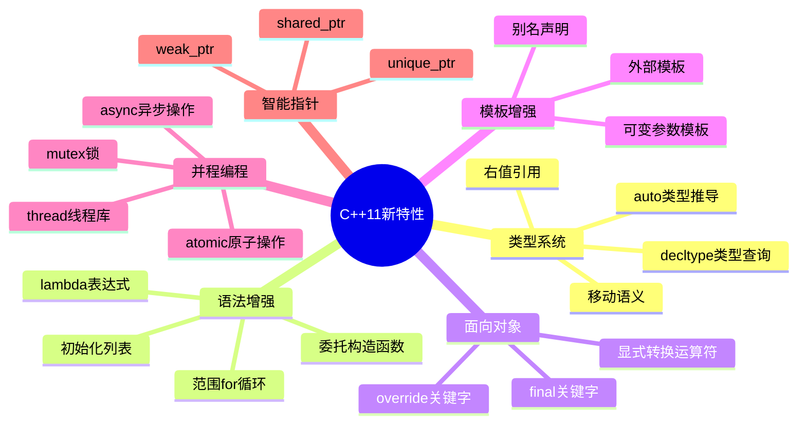
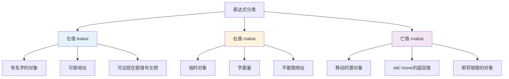
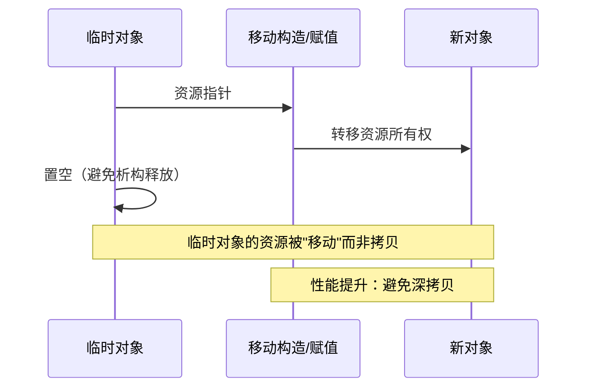
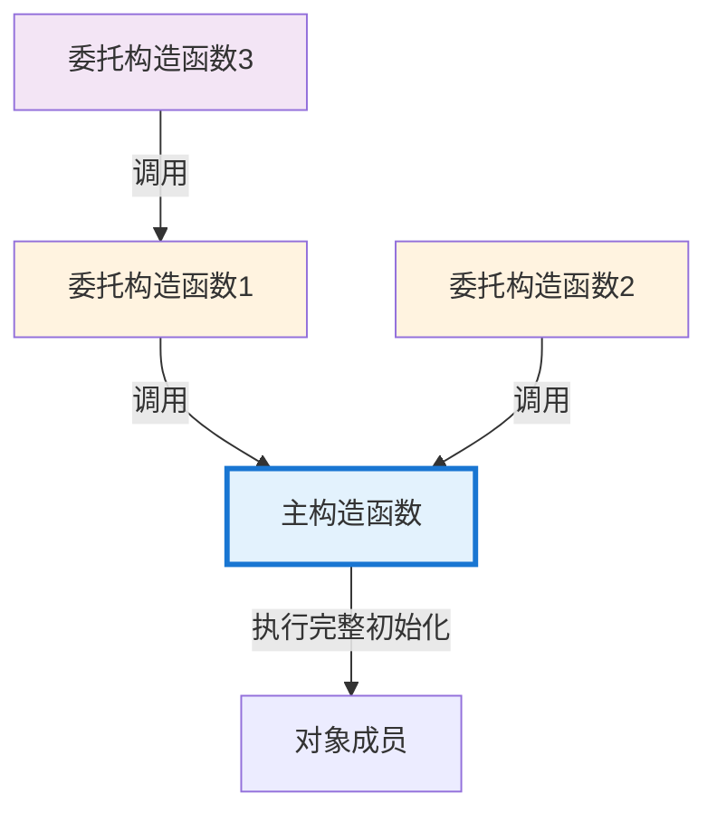
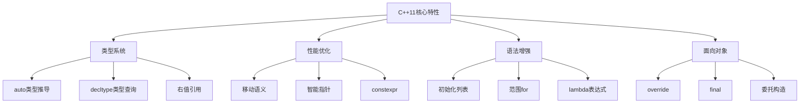
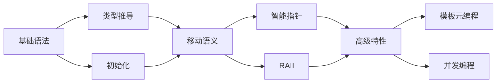

# 8.1 C++11新特性

> C++11是C++历史上最重要的更新之一，引入了众多革命性特性，使C++更加现代、安全和高效

## 目录

- [C++11概述](#c11概述)
- [自动类型推导](#自动类型推导)
- [右值引用与移动语义](#右值引用与移动语义)
- [初始化列表](#初始化列表)
- [委托构造函数](#委托构造函数)
- [final与override关键字](#final与override关键字)
- [本节小结](#本节小结)

---

## C++11概述

C++11（曾称C++0x）是C++标准的第三次重大修订，于2011年发布。这次更新引入了大量新特性，极大地改变了C++的编程方式。

### C++11核心改进



### C++11带来的价值

| 方面 | C++11之前 | C++11之后 | 改进效果 |
|------|----------|-----------|---------|
| **代码简洁性** | 需要写完整类型名 | 使用auto自动推导 | 减少30-50%类型声明 |
| **性能优化** | 大对象拷贝开销大 | 移动语义避免拷贝 | 性能提升2-10倍 |
| **开发效率** | 手动管理资源 | RAII+智能指针 | 内存泄漏减少90% |
| **类型安全** | 宏定义类型不安全 | constexpr和概念 | 编译期错误检测 |
| **并发支持** | 依赖平台API | 标准线程库 | 跨平台统一接口 |

---

## 自动类型推导

### 为什么需要自动类型推导

在C++11之前，编写复杂类型的代码非常繁琐：

```cpp
// C++11之前：冗长的类型声明
std::map<std::string, std::vector<int>>::iterator it = myMap.begin();
std::vector<std::string>::iterator it2 = vec.begin();

// C++11：简洁的自动推导
auto it3 = myMap.begin();   // 编译器自动推导类型
auto it4 = vec.begin();
```

**自动类型推导的好处：**
- ✅ 简化代码，提高可读性
- ✅ 减少类型拼写错误
- ✅ 让代码更专注于逻辑而非类型
- ✅ 便于重构（类型改变时无需修改多处）

### auto关键字

`auto`关键字告诉编译器根据初始化表达式自动推导变量类型。

```cpp
#include <vector>
#include <map>
#include <iostream>

void autoBasic() {
    // 基本类型推导
    auto i = 42;              // 推导为：int
    auto d = 3.14;            // 推导为：double
    auto c = 'a';             // 推导为：char
    auto s = "hello";         // 推导为：const char*
    auto b = true;            // 推导为：bool

    // 复杂类型推导
    std::vector<int> vec = {1, 2, 3, 4, 5};

    // 传统写法 vs auto
    std::vector<int>::iterator it1 = vec.begin();  // 冗长
    auto it2 = vec.begin();                        // 简洁

    // 范围for循环（C++11特性）
    for (auto& elem : vec) {   // auto&：引用避免拷贝
        elem *= 2;
    }

    for (const auto& elem : vec) {  // const auto&：只读引用
        std::cout << elem << " ";
    }
}
```

### auto推导规则

`auto`的推导遵循特定规则，理解这些规则很重要：

| 初始化表达式 | 推导结果 | 说明 |
|------------|---------|------|
| `auto x = 42;` | `int` | 基本类型直接推导 |
| `auto x = 3.14;` | `double` | 浮点类型 |
| `auto x = "hello";` | `const char*` | 字符串字面量 |
| `auto& x = ref;` | 引用类型 | 需要显式指定`&` |
| `const auto x = 42;` | `const int` | 可添加const限定 |
| `auto* x = &val;` | 指针类型 | 需要显式指定`*` |

```cpp
void autoRules() {
    int x = 10;
    const int& cref = x;

    // 必须初始化
    auto a = 10;      // ✅ OK
    // auto b;        // ❌ 错误：auto必须初始化

    // const和volatile限定符
    const auto ca = 10;        // const int
    volatile auto va = 10;     // volatile int

    // 引用与指针
    auto& rx = x;              // int&：引用
    auto* px = &x;             // int*：指针
    const auto& crx = cref;    // const int&：const引用

    // ⚠️ 重要：auto默认丢弃引用和顶层const
    auto val1 = cref;          // int（丢弃const和引用）
    auto val2 = x;             // int（非引用）

    // 保留引用和const需要显式声明
    auto& ref = x;             // int&
    const auto& cref2 = x;     // const int&
}
```

### auto vs 传统类型声明

```cpp
// 场景对比

// 1. 迭代器类型
void iteratorComparison() {
    std::map<std::string, std::vector<int>> complexMap;

    // 传统方式：类型冗长
    std::map<std::string, std::vector<int>>::iterator it1 =
        complexMap.begin();

    // 使用auto：简洁清晰
    auto it2 = complexMap.begin();
}

// 2. 模板函数返回值
template<typename T>
void processTemplate(const T& container) {
    // 传统方式：难以写出类型
    // typename T::const_iterator it = container.begin();

    // 使用auto：自动推导
    auto it = container.begin();
}

// 3. lambda表达式类型
void lambdaType() {
    auto lambda = [](int x) { return x * 2; };

    // lambda的类型是唯一的，无法直接写出
    // 只能使用auto或std::function
}
```

### decltype关键字

`decltype`（declare type）用于查询表达式的类型，与`auto`形成互补。

```cpp
void decltypeBasic() {
    int x = 42;
    const int& cref = x;

    // decltype推导表达式的类型
    decltype(x) y = 10;              // int
    decltype(cref) r = y;            // const int&：保留const和引用
    decltype(x + 1) z = 0;           // int：表达式的值类型

    // decltype与auto的区别
    auto a = x;                      // int
    decltype(auto) b = x;            // int（相同）

    auto& c = x;                     // int&
    decltype(auto)& d = x;           // int&（相同）

    // 关键区别：decltype保留引用和const
    decltype(cref) e = x;            // const int&：保留const
    auto f = cref;                   // int：丢弃const和引用
}
```

### auto与decltype对比

| 特性 | auto | decltype |
|-----|------|----------|
| **推导依据** | 根据初始化值 | 根据表达式类型 |
| **引用/const** | 默认丢弃 | 保留 |
| **未计算表达式** | 不支持 | 支持 |
| **典型用途** | 变量声明 | 模板元编程 |
| **语法形式** | `auto x = value;` | `decltype(expr) x;` |

```cpp
// 对比示例
void comparisonDemo() {
    int x = 10;

    // auto：推导初始化值的类型
    auto a = x;              // int

    // decltype：推导表达式的类型
    decltype(x) b = x;       // int（相同）

    const int& cref = x;

    auto c = cref;           // int（丢弃const和引用）
    decltype(cref) d = cref; // const int&（保留）
}
```

### 函数返回类型推导

C++11引入了尾置返回类型语法，C++14进一步扩展了auto的用途。

```cpp
// C++11：尾置返回类型
template<typename T, typename U>
auto add(T t, U u) -> decltype(t + u) {
    return t + u;
}

// C++14：直接推导返回类型
auto multiply(int a, int b) {
    return a * b;  // 推导为int
}

// C++14：decltype(auto)保留引用类型
decltype(auto) getRef(int& x) {
    return x;  // 返回int&
}

auto getVal(int x) {
    return x;  // 返回int（非引用）
}
```

### auto使用建议

```cpp
// ✅ 推荐使用auto的场景

// 1. 类型明显时
auto count = 10;  // 一眼看出是int
auto name = "Alice";  // 明显是字符串

// 2. 类型冗长复杂
std::map<std::string, std::vector<int>>::iterator it =
    data.begin();  // 太长

auto it2 = data.begin();  // 简洁

// 3. lambda表达式
auto lambda = [](int x) { return x * x; };

// 4. 范围for循环
for (const auto& [key, value] : map) {  // C++17
    // 使用key和value
}

// ❌ 避免使用auto的场景

// 1. 类型不明确时降低可读性
auto result = compute();  // 读者无法知道result的类型

// 2. 需要特定类型时
auto x = 3.14;  // double
double y = 3.14;  // 更明确

// 3. 类型转换时
auto z = static_cast<int>(3.14);  // 应直接声明类型
```

---

## 右值引用与移动语义

### 左值与右值的概念

理解左值（lvalue）和右值（rvalue）是掌握移动语义的基础。



**左值特征：**
- ✅ 有名字，可以取地址
- ✅ 可以出现在赋值号左侧或右侧
- ✅ 代表持久的对象

**右值特征：**
- ✅ 临时对象或字面量
- ✅ 不能取地址
- ✅ 只能出现在赋值号右侧
- ✅ 代表即将销毁的对象

```cpp
void lvalueRvalue() {
    // 左值示例
    int x = 10;
    &x;                    // ✅ OK：可以取地址
    x = 20;                // ✅ OK：可以赋值
    int& lref = x;         // ✅ OK：左值引用

    // 右值示例
    42;                    // ❌ 字面量
    x + 1;                 // ❌ 临时表达式结果
    std::string("hello");  // ❌ 临时对象
    int&& rref = 42;       // ✅ OK：右值引用
    int&& rref2 = x + 1;   // ✅ OK：右值引用绑定右值

    // 重要的区别
    // int& lref2 = 42;    // ❌ 左值引用不能绑定右值
    const int& lref3 = 42; // ✅ const左值引用可以绑定右值
}
```

### 右值引用

C++11引入了右值引用（T&&），用于识别和利用临时对象。

```cpp
void rvalueReference() {
    // 左值引用：&
    int x = 10;
    int& lref = x;          // 绑定左值
    // int& lref2 = 10;     // ❌ 不能绑定右值

    // 右值引用：&&
    int&& rref1 = 10;       // 绑定右值（字面量）
    int&& rref2 = x + 1;    // 绑定右值（表达式）
    // int&& rref3 = x;     // ❌ 不能直接绑定左值

    // std::move：将左值转换为右值引用
    int&& rref4 = std::move(x);  // OK：显式转换

    // 右值引用延长临时对象生命周期
    std::string&& rref5 = std::string("hello");
    rref5 += " world";       // 可以修改
    std::cout << rref5 << "\n";
}
```

### 移动语义的本质

移动语义允许"窃取"临时对象的资源，避免昂贵的深拷贝操作。



**拷贝 vs 移动：**

| 操作 | 拷贝语义 | 移动语义 |
|------|---------|---------|
| **资源处理** | 复制资源 | 转移资源所有权 |
| **性能开销** | 高（深拷贝） | 低（仅指针操作） |
| **源对象状态** | 保持不变 | 有效但未定义状态 |
| **典型场景** | 需要保留原对象 | 临时对象 |

```cpp
#include <vector>
#include <string>

class MyString {
private:
    char* data;
    size_t size;

public:
    // 构造函数
    explicit MyString(const char* str = "") {
        size = strlen(str);
        data = new char[size + 1];
        strcpy(data, str);
        std::cout << "构造 [" << data << "]\n";
    }

    // 析构函数
    ~MyString() {
        std::cout << "析构 [" << (data ? data : "空") << "]\n";
        delete[] data;
    }

    // 拷贝构造函数（深拷贝）
    MyString(const MyString& other) : size(other.size) {
        data = new char[size + 1];
        strcpy(data, other.data);
        std::cout << "拷贝构造 [" << data << "]\n";
    }

    // 移动构造函数（C++11）
    MyString(MyString&& other) noexcept
        : data(other.data), size(other.size) {
        other.data = nullptr;  // 置空，避免析构时释放
        other.size = 0;
        std::cout << "移动构造\n";
    }

    // 拷贝赋值运算符
    MyString& operator=(const MyString& other) {
        if (this != &other) {
            delete[] data;
            size = other.size;
            data = new char[size + 1];
            strcpy(data, other.data);
            std::cout << "拷贝赋值\n";
        }
        return *this;
    }

    // 移动赋值运算符（C++11）
    MyString& operator=(MyString&& other) noexcept {
        if (this != &other) {
            delete[] data;
            data = other.data;     // 窃取资源
            size = other.size;
            other.data = nullptr;  // 置空
            other.size = 0;
            std::cout << "移动赋值\n";
        }
        return *this;
    }

    void print() const {
        if (data) {
            std::cout << data << "\n";
        } else {
            std::cout << "[已移动]\n";
        }
    }
};
```

### 移动语义的性能优势

```cpp
void performanceDemo() {
    std::vector<MyString> vec;

    std::cout << "=== 使用拷贝语义 ===\n";
    vec.clear();
    vec.reserve(2);

    MyString str1("Hello");
    vec.push_back(str1);  // 拷贝：深拷贝字符串

    std::cout << "\n=== 使用移动语义 ===\n";
    vec.clear();
    vec.reserve(2);

    MyString str2("World");
    vec.push_back(std::move(str2));  // 移动：仅转移指针
    str2.print();  // str2已被移走
}
```

**输出：**
```
=== 使用拷贝语义 ===
构造 [Hello]
拷贝构造 [Hello]
析构 [Hello]

=== 使用移动语义 ===
构造 [World]
移动构造
析构 [World]
[已移动]
```

### std::move与std::forward

这两个工具函数是实现移动语义和完美转发的关键。

```cpp
#include <utility>

void moveAndForward() {
    // std::move：无条件转换为右值引用
    std::string str1 = "Hello";

    // 移动后，str1处于有效但未定义的状态
    std::string str2 = std::move(str1);

    std::cout << "str2: " << str2 << "\n";
    std::cout << "str1: " << str1 << "\n";  // 未定义但有效

    // std::forward：完美转发
    template<typename T>
    void wrapper(T&& arg) {
        // std::forward保持arg的值类别
        target(std::forward<T>(arg));
    }

    void target(std::string& str) {
        std::cout << "左值引用\n";
    }

    void target(std::string&& str) {
        std::cout << "右值引用\n";
    }

    std::string str = "test";
    wrapper(str);                  // 调用target(string&)
    wrapper(std::string("temp"));  // 调用target(string&&)
}
```

### 移动语义最佳实践

```cpp
// ✅ 推荐做法

// 1. 为移动操作标记noexcept
class MyClass {
public:
    MyClass(MyClass&& other) noexcept {
        // 移动构造
    }

    MyClass& operator=(MyClass&& other) noexcept {
        // 移动赋值
        return *this;
    }
};

// 2. 遵循五法则（Rule of Five）
class RuleOfFive {
    char* data;

public:
    ~RuleOfFive() { delete[] data; }                          // 析构
    RuleOfFive(const RuleOfFive& other);                      // 拷贝构造
    RuleOfFive(RuleOfFive&& other) noexcept;                  // 移动构造
    RuleOfFive& operator=(const RuleOfFive& other);           // 拷贝赋值
    RuleOfFive& operator=(RuleOfFive&& other) noexcept;      // 移动赋值
};

// 3. 使用std::exchange实现移动赋值
class BetterMove {
    int* data;

public:
    BetterMove& operator=(BetterMove&& other) noexcept {
        if (this != &other) {
            delete[] data;
            data = std::exchange(other.data, nullptr);
        }
        return *this;
    }
};

// ❌ 避免的做法

// 1. 移动后继续使用源对象
std::string str = "hello";
std::string str2 = std::move(str);
std::cout << str << "\n";  // ❌ 未定义行为

// 2. 对const对象使用move
const std::string cstr = "hello";
std::string str3 = std::move(cstr);  // ❌ 实际是拷贝而非移动
```

---

## 初始化列表

### 统一初始化语法

C++11引入了花括号初始化列表，提供统一的初始化方式。

```cpp
void uniformInitialization() {
    // 基本类型
    int a{5};                // 直接列表初始化
    double b{3.14};
    char c{'A'};
    int d{};                 // 值初始化：d = 0

    // 数组
    int arr[]{1, 2, 3, 4, 5};
    int arr2[5]{};           // 所有元素初始化为0

    // 容器
    std::vector<int> vec{1, 2, 3, 4, 5};
    std::map<std::string, int> map{
        {"one", 1},
        {"two", 2},
        {"three", 3}
    };

    // 类类型
    std::string str{"hello"};
    std::vector<int> vec2(5, 42);  // 5个42（圆括号是构造函数参数）

    // 结构体
    struct Point {
        int x, y;
    };
    Point p{1, 2};

    // 避免窄化转换
    // int x{3.14};  // ❌ 错误：double到int的窄化转换
    int y = 3.14;    // ⚠️ 警告但允许（传统方式）
}
```

### 初始化方式对比

| 初始化方式 | 语法 | C++11 | 特点 | 适用场景 |
|-----------|------|-------|------|---------|
| **拷贝初始化** | `T x = value;` | ✅ | 可能发生隐式转换 | 简单类型 |
| **直接初始化** | `T x(args);` | ✅ | 显式调用构造函数 | 多参数构造 |
| **列表初始化** | `T x{value};` | ✅ | 禁止窄化转换 | 推荐方式 |
| **值初始化** | `T x{};` | ✅ | 零初始化 | 默认值 |
| **new初始化** | `new T{value};` | ✅ | 动态分配 | 堆对象 |

```cpp
void initializationComparison() {
    // 1. 拷贝初始化
    int a1 = 10;
    std::string s1 = "hello";

    // 2. 直接初始化
    int a2(10);
    std::string s2("hello");

    // 3. 列表初始化（推荐）
    int a3{10};
    std::string s3{"hello"};

    // 4. 值初始化
    int a4{};        // 0
    std::string s4{}; // 空字符串

    // ⚠️ 最 vexing parse 问题的解决
    // 传统方式：可能被解析为函数声明
    // std::vector<int> vec();  // 函数声明！

    // 列表初始化：避免歧义
    std::vector<int> vec{};  // 空vector
}
```

### std::initializer_list

`std::initializer_list`是C++11引入的轻量级代理对象，用于接收初始化列表。

```cpp
#include <initializer_list>

class MyVector {
private:
    std::vector<int> data;

public:
    // 默认构造函数
    MyVector() = default;

    // 接受初始化列表的构造函数
    MyVector(std::initializer_list<int> list)
        : data(list) {
        std::cout << "初始化列表构造，大小: "
                  << list.size() << "\n";
    }

    // 普通构造函数
    explicit MyVector(size_t count, int value = 0)
        : data(count, value) {}

    void print() const {
        for (int val : data) {
            std::cout << val << " ";
        }
        std::cout << "\n";
    }

    size_t size() const {
        return data.size();
    }
};

void initializerListDemo() {
    // 使用初始化列表
    MyVector vec1{1, 2, 3, 4, 5};
    vec1.print();

    // 使用普通构造函数
    MyVector vec2(5, 42);  // 5个42
    vec2.print();

    // 初始化列表的优先级
    MyVector vec3{5};      // 使用初始化列表：大小为1，值为5
    MyVector vec4(5);      // 使用构造函数：大小为5，值为0
}
```

### 初始化列表的实际应用

```cpp
void practicalApplications() {
    // 1. 容器初始化
    std::vector<int> primes{2, 3, 5, 7, 11, 13};
    std::set<std::string> names{"Alice", "Bob", "Charlie"};

    // 2. 函数返回初始化列表
    auto getValues() {
        return std::vector<int>{1, 2, 3, 4, 5};
    }

    // 3. 类成员初始化
    class Config {
    public:
        std::string server{"localhost"};
        int port{8080};
        bool debug{false};
    };

    // 4. 数组初始化
    int matrix[2][3] = {
        {1, 2, 3},
        {4, 5, 6}
    };

    // 5. 嵌套初始化
    struct Point {
        int x, y;
    };

    struct Rectangle {
        Point topLeft;
        Point bottomRight;
    };

    Rectangle rect{{0, 0}, {100, 100}};
}
```

---

## 委托构造函数

### 委托构造的概念

委托构造函数允许一个构造函数调用同一类的另一个构造函数，避免代码重复。



**传统方式的问题：**

```cpp
// C++11之前：代码重复
class Point {
private:
    double x, y;

public:
    Point() : x(0.0), y(0.0) {
        validate();  // 重复代码
    }

    Point(double x_) : x(x_), y(0.0) {
        validate();  // 重复代码
    }

    Point(double x_, double y_) : x(x_), y(y_) {
        validate();  // 重复代码
    }

    void validate() {
        // 验证逻辑
    }
};
```

**委托构造函数的解决方案：**

```cpp
// C++11：委托构造避免重复
class Point {
private:
    double x, y;

public:
    // 主构造函数：执行完整初始化
    Point(double x_, double y_) : x(x_), y(y_) {
        std::cout << "主构造函数\n";
        validate();
    }

    // 委托给主构造函数
    Point() : Point(0.0, 0.0) {
        std::cout << "默认构造函数\n";
    }

    Point(double x_) : Point(x_, 0.0) {
        std::cout << "单参数构造函数\n";
    }

    void validate() {
        std::cout << "验证坐标\n";
    }
};

void delegatingDemo() {
    Point p1;        // 输出：
                     // 主构造函数
                     // 验证坐标
                     // 默认构造函数

    Point p2(5.0);   // 输出：
                     // 主构造函数
                     // 验证坐标
                     // 单参数构造函数

    Point p3(3.0, 4.0);  // 输出：
                        // 主构造函数
                        // 验证坐标
}
```

### 委托构造函数的使用规则

```cpp
class Demo {
private:
    int x, y, z;

public:
    // 主构造函数
    Demo(int x_, int y_, int z_) : x(x_), y(y_), z(z_) {
        std::cout << "主构造函数\n";
    }

    // ✅ 正确：委托构造
    Demo() : Demo(0, 0, 0) {
        std::cout << "默认构造\n";
    }

    Demo(int x_) : Demo(x_, 0, 0) {
        std::cout << "单参数构造\n";
    }

    // ❌ 错误：委托后不能使用成员初始化列表
    // Demo(int x_, int y_) : Demo(x_, y_, 0), z(0) {}

    // ✅ 正确：委托后在函数体中初始化
    Demo(int x_, int y_) : Demo(x_, y_, 0) {
        // 可以在函数体中修改成员
        z = 0;
    }

    // ⚠️ 注意：避免循环委托
    // Demo() : Demo(0) {}
    // Demo(int x_) : Demo() {}  // ❌ 错误：无限递归
};
```

### 委托构造与继承

```cpp
class Base {
protected:
    int value;

public:
    Base(int v) : value(v) {
        std::cout << "Base构造\n";
    }
};

class Derived : public Base {
private:
    double data;

public:
    // C++11：类内成员初始化器 + 委托构造
    Derived(int v, double d) : Base(v), data(d) {
        std::cout << "Derived主构造\n";
    }

    Derived() : Derived(0, 0.0) {
        std::cout << "Derived默认构造\n";
    }

    Derived(int v) : Derived(v, 0.0) {
        std::cout << "Derived单参数构造\n";
    }
};
```

---

## final与override关键字

### 虚函数重写的问题

C++11之前，虚函数重写容易出现错误：

```cpp
class Base {
public:
    virtual void func1() {
        std::cout << "Base::func1\n";
    }

    virtual void func2() const {
        std::cout << "Base::func2\n";
    }

    virtual void func3(int x) {
        std::cout << "Base::func3\n";
    }
};

class Derived : public Base {
public:
    // ❌ 错误1：忘记virtual（但能编译通过）
    void func1() {
        std::cout << "Derived::func1\n";
    }

    // ❌ 错误2：const不匹配（创建了新函数）
    void func2() {  // 应该是const
        std::cout << "Derived::func2\n";
    }

    // ❌ 错误3：参数不匹配（创建了新函数）
    void func3() {  // 应该有int参数
        std::cout << "Derived::func3\n";
    }
};
```

### override关键字

`override`明确标识成员函数重写基类虚函数，让编译器帮助检查错误。

```cpp
class CorrectDerived : public Base {
public:
    // ✅ 正确重写
    void func1() override {
        std::cout << "CorrectDerived::func1\n";
    }

    // ❌ 编译错误：const不匹配
    // void func2() override {}

    // ❌ 编译错误：参数不匹配
    // void func3() override {}

    // ✅ 正确重写
    void func3(int x) override {
        std::cout << "CorrectDerived::func3\n";
    }
};
```

### override的好处

```cpp
class Example {
public:
    virtual void process(int x) {
        std::cout << "处理: " << x << "\n";
    }
};

// 没有override：隐藏的错误
class BadDerived : public Example {
public:
    // 本意是重写，但函数签名有误
    void process(double x) {
        // 这创建了一个新函数，而不是重写
        std::cout << "处理double: " << x << "\n";
    }
};

// 使用override：编译器会检查
class GoodDerived : public Example {
public:
    // void process(double x) override;  // ❌ 编译错误
    void process(int x) override {
        std::cout << "GoodDerived: " << x << "\n";
    }
};
```

### final关键字

`final`用于禁止继承或重写，提高代码的安全性。

```cpp
// 1. final类：不能被继承
class FinalClass final {
public:
    void func() {
        std::cout << "FinalClass\n";
    }
};

// ❌ 编译错误：FinalClass不能被继承
// class DerivedFromFinal : public FinalClass {};

// 2. final虚函数：不能被重写
class Base2 {
public:
    virtual void finalFunc() final {
        std::cout << "不能重写\n";
    }

    virtual void normalFunc() {
        std::cout << "可以重写\n";
    }
};

class Derived2 : public Base2 {
public:
    // ❌ 编译错误：finalFunc不能被重写
    // void finalFunc() override {}

    // ✅ 正确：normalFunc可以重写
    void normalFunc() override {
        std::cout << "重写成功\n";
    }
};
```

### final与override的实际应用

```cpp
class Shape {
public:
    virtual double area() const = 0;
    virtual void draw() const {
        std::cout << "绘制形状\n";
    }

    virtual ~Shape() = default;
};

class Circle : public Shape {
private:
    double radius;

public:
    Circle(double r) : radius(r) {}

    // area是final：禁止进一步重写
    double area() const override final {
        return 3.14159 * radius * radius;
    }

    void draw() const override {
        std::cout << "绘制圆形\n";
    }
};

// ❌ 编译错误：area是final，不能重写
// class ColoredCircle : public Circle {
// public:
//     double area() const override { return 0; }
// };

// ✅ 正确：只能重写非final函数
class StyledCircle : public Circle {
public:
    StyledCircle(double r) : Circle(r) {}

    void draw() const override {
        std::cout << "绘制带样式的圆形\n";
    }
};
```

### final与override对比

| 关键字 | 作用 | 使用位置 | 目的 |
|-------|------|---------|------|
| **override** | 声明函数重写基类虚函数 | 虚函数声明 | 让编译器检查重写正确性 |
| **final** | 禁止类被继承或函数被重写 | 类或虚函数 | 防止意外的继承或重写 |

```cpp
class CombinedDemo {
public:
    virtual void func1() final;      // 不能重写
    virtual void func2() override;   // 必须重写基类函数
    virtual void func3() override final;  // 既重写又是final
};
```

---

## 本节小结

### C++11核心特性回顾



### 特性速查表

| 特性 | 语法 | 解决问题 | 使用场景 |
|------|------|---------|---------|
| **auto** | `auto x = value;` | 简化类型声明 | 复杂类型、迭代器、lambda |
| **decltype** | `decltype(expr)` | 查询表达式类型 | 模板元编程、返回类型推导 |
| **右值引用** | `T&&` | 识别临时对象 | 移动语义、完美转发 |
| **移动语义** | 移动构造/赋值 | 避免深拷贝 | 资源管理类、容器 |
| **初始化列表** | `{}` | 统一初始化语法 | 所有类型的初始化 |
| **委托构造** | `: Constructor(args)` | 避免代码重复 | 多个构造函数 |
| **override** | `void func() override;` | 确保正确重写 | 虚函数重写 |
| **final** | `class final` 或 `func final` | 禁止继承/重写 | 终结类、关键函数 |

### 最佳实践总结

```cpp
// ✅ C++11推荐做法

// 1. 使用auto简化代码
auto it = container.begin();

// 2. 使用移动语义提高性能
std::vector<std::string> vec;
vec.push_back(std::string("hello"));  // 移动而非拷贝

// 3. 使用初始化列表
std::map<int, std::string> m{{1, "one"}, {2, "two"}};

// 4. 使用override确保重写正确
void func() override {
    // 实现
}

// 5. 使用final保护关键类
class Utility final {
    // 不应被继承的工具类
};

// 6. 使用nullptr替代NULL
void* ptr = nullptr;

// 7. 使用智能指针
std::unique_ptr<int> ptr = std::make_unique<int>(42);

// ❌ 应避免的做法

// 1. 滥用auto降低可读性
auto x = compute();  // 类型不明确

// 2. 忘记noexcept
MyClass(MyClass&& other);  // 应该是noexcept

// 3. 不使用override
void func() { /* 应该加override */ }

// 4. 使用NULL
void* ptr = NULL;  // 使用nullptr

// 5. 不检查移动后的状态
std::string str = "hello";
std::string str2 = std::move(str);
std::cout << str;  // ❌ 未定义
```

### C++11学习路径



### 学习建议

1. **循序渐进**：从简单特性开始，逐步掌握复杂特性
2. **实践为主**：每个特性都要动手实践
3. **理解原理**：不仅知道怎么用，还要知道为什么
4. **关注性能**：理解移动语义和拷贝的性能差异
5. **阅读源码**：学习标准库和优秀开源代码的实现

### 练习建议

1. **基础练习**：
   - 使用auto重写现有代码
   - 实现支持移动语义的类
   - 使用初始化列表重构代码

2. **进阶练习**：
   - 编写完美转发函数模板
   - 实现智能指针包装类
   - 使用override和final设计类层次

3. **综合练习**：
   - 重构现有项目，应用C++11特性
   - 对比C++98和C++11的性能差异
   - 实现线程安全的容器类

### C++11版本兼容性

| 编译器 | 最早支持版本 | 完全支持 |
|-------|------------|---------|
| GCC | 4.8 | 4.9+ |
| Clang | 3.3 | 3.4+ |
| MSVC | VS2012 | VS2015+ |

---

**下一节：8.2-C++14_17_20重要特性** - C++标准的持续演进
