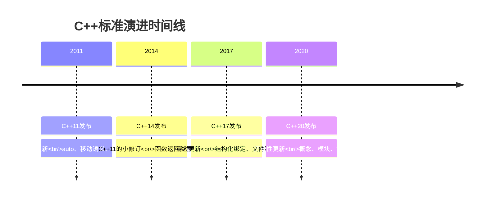
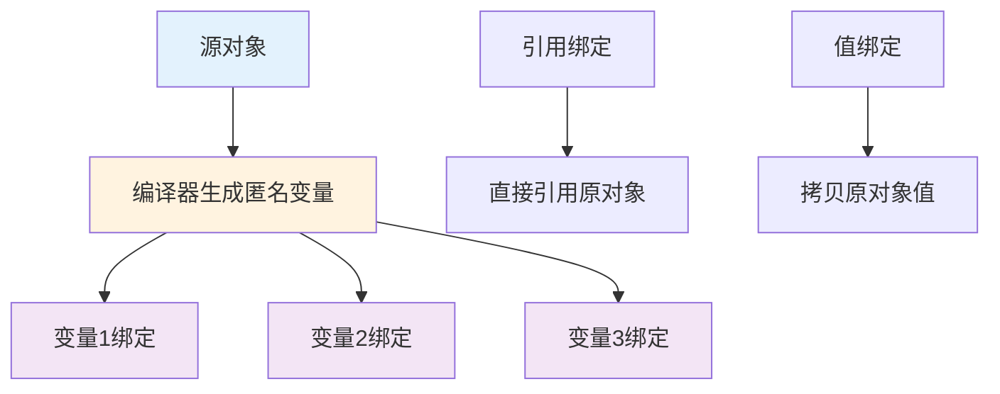
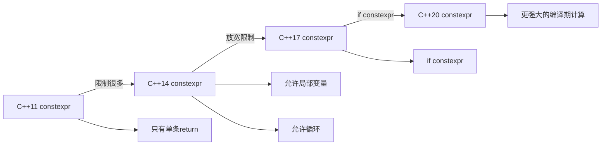
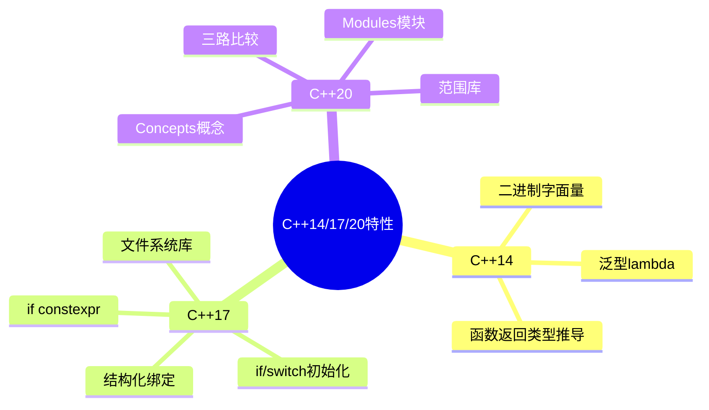
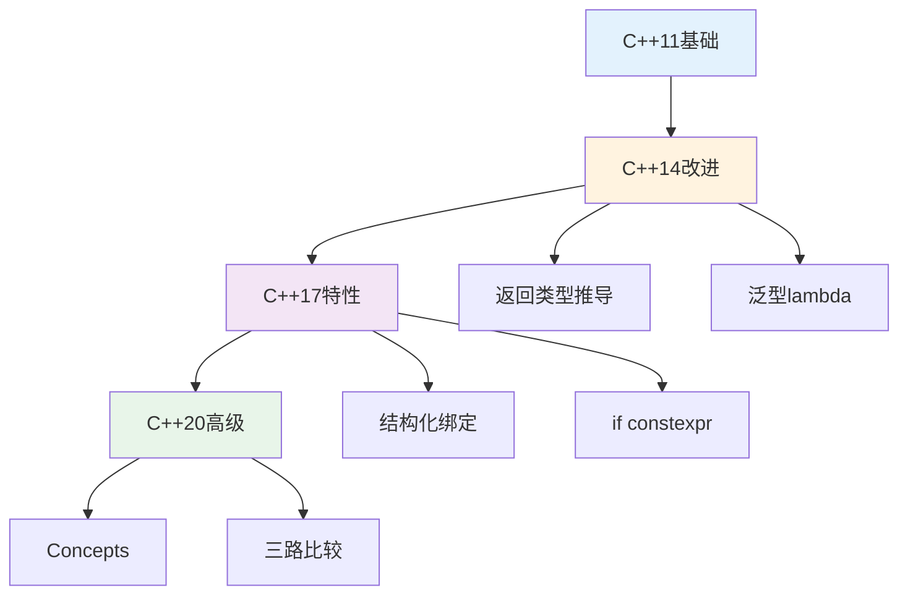

# 8.2 C++14/17/20重要特性

> C++标准持续演进，C++14/17/20每个版本都带来强大的新特性

## 目录

- [C++14/17/20概述](#c141720概述)
- [结构化绑定（C++17）](#结构化绑定c17)
- [if/switch初始化语句（C++17）](#ifswitch初始化语句c17)
- [constexpr扩展（C++14/17/20）](#constexpr扩展c141720)
- [概念Concepts（C++20）](#概念conceptsc20)
- [范围for扩展](#范围for扩展)
- [三路比较运算符（C++20）](#三路比较运算符c20)
- [本节小结](#本节小结)

---

## C++14/17/20概述

C++11之后的版本继续演进，每个版本都带来了实用的改进和新特性。

### C++14/17/20时间线



### 各版本核心特性对比

| 特性类别 | C++14 | C++17 | C++20 |
|---------|-------|-------|-------|
| **类型推导** | 函数返回类型推导 | 构造函数推导 | Concepts概念约束 |
| **控制流** | | if/switch初始化 | if constexpr增强 |
| **函数特性** | 通用lambda | inline变量 | consteval函数 |
| **语言特性** | 二进制字面量 | 结构化绑定 | 模块（部分支持） |
| **标准库** | shared_timed_mutex | 文件系统 | 范围库 |
| **模板** | 变量模板 | 类模板参数推导 | 简化的模板语法 |
| **并发** | | shared_mutex | std::jthread |

### 版本采用建议

| 使用场景 | 推荐版本 | 理由 |
|---------|---------|------|
| **新项目** | C++20 | 最新特性，现代化编程 |
| **生产环境** | C++17 | 稳定性好，编译器支持完善 |
| **遗留系统** | C++14 | 向后兼容，渐进升级 |
| **嵌入式** | C++17 | 平衡特性与性能 |

---

## 结构化绑定（C++17）

结构化绑定（Structured Binding）是C++17引入的语法糖，用于将复合类型（数组、结构体、元组）解包到多个变量中。

### 为什么需要结构化绑定

在C++17之前，访问结构体或元组的多个成员需要冗长的代码：

```cpp
// C++17之前：繁琐的访问方式
std::tuple<std::string, int, double> person = getPerson();
std::string name = std::get<0>(person);
int age = std::get<1>(person);
double salary = std::get<2>(person);

// C++17：简洁的结构化绑定
auto [name2, age2, salary2] = getPerson();
```

**结构化绑定的优势：**
- ✅ 代码更简洁，可读性更强
- ✅ 减少临时变量命名
- ✅ 特别适合处理多返回值
- ✅ 简化范围for循环

### 基本语法

```cpp
#include <tuple>
#include <map>
#include <string>

void structuredBindingBasic() {
    // 1. 解包数组
    int arr[3] = {1, 2, 3};
    auto [x, y, z] = arr;
    std::cout << x << ", " << y << ", " << z << "\n";  // 1, 2, 3

    // 2. 解包结构体
    struct Point {
        double x, y;
    };

    Point p{3.0, 4.0};
    auto [px, py] = p;
    std::cout << "x: " << px << ", y: " << py << "\n";

    // 3. 解包元组
    std::tuple<int, std::string, double> t = std::make_tuple(42, "hello", 3.14);
    auto [id, name, value] = t;
    std::cout << id << ", " << name << ", " << value << "\n";

    // 4. 解包pair（map迭代）
    std::map<std::string, int> map = {{"one", 1}, {"two", 2}};
    for (const auto& [key, val] : map) {
        std::cout << key << " -> " << val << "\n";
    }
}
```

### 结构化绑定类型

结构化绑定支持三种类型的绑定方式：

```cpp
void bindingTypes() {
    int arr[2] = {10, 20};

    // 1. 按值绑定（拷贝）
    auto [a1, a2] = arr;
    a1 = 100;
    std::cout << arr[0] << "\n";  // 10（原数组不变）

    // 2. 按引用绑定
    auto& [r1, r2] = arr;
    r1 = 100;
    std::cout << arr[0] << "\n";  // 100（原数组被修改）

    // 3. 按const引用绑定（只读）
    const auto& [cr1, cr2] = arr;
    // cr1 = 200;  // ❌ 错误：不能修改
}
```

### 结构化绑定工作原理



**绑定方式对比：**

| 绑定方式 | 语法 | 效果 | 性能 | 使用场景 |
|---------|------|------|------|---------|
| **按值绑定** | `auto [a, b] = obj;` | 拷贝值 | 有拷贝开销 | 需要独立副本 |
| **按引用绑定** | `auto& [a, b] = obj;` | 引用原对象 | 无开销 | 需要修改原对象 |
| **按const引用** | `const auto& [a, b] = obj;` | 只读引用 | 无开销 | 只读访问 |

### 结构化绑定应用场景

```cpp
#include <unordered_map>
#include <complex>

void structuredBindingApplications() {
    // 1. 简化多返回值
    auto getPerson() {
        return std::make_tuple("Alice", 30, "Engineer");
    }

    auto [name, age, profession] = getPerson();
    std::cout << name << " is " << age << " years old\n";

    // 2. 遍历map
    std::unordered_map<std::string, int> scores = {
        {"Alice", 90},
        {"Bob", 85}
    };

    for (const auto& [student, score] : scores) {
        std::cout << student << ": " << score << "\n";
    }

    // 3. 访问结构化数据
    struct Employee {
        std::string name;
        int id;
        double salary;
    };

    std::vector<Employee> employees = {
        {"Alice", 1001, 50000.0},
        {"Bob", 1002, 60000.0}
    };

    for (const auto& [e_name, e_id, e_salary] : employees) {
        std::cout << e_id << ": " << e_name << "\n";
    }

    // 4. 解包复数
    std::complex<double> c(3.0, 4.0);
    auto [real, imag] = c;
    std::cout << "Real: " << real << ", Imag: " << imag << "\n";
}
```

### 结构化绑定限制

```cpp
void bindingLimitations() {
    // ❌ 不能在函数参数中使用
    // void func(auto [x, y]);  // 编译错误

    // ❌ 不能使用static_assert
    // auto [a, b] = arr;
    // static_assert(sizeof(a) == 4);  // 编译错误

    // ⚠️ 生命周期问题
    std::tuple<int, int> getTuple() {
        return {1, 2};
    }

    auto& [x, y] = getTuple();  // ❌ 错误：引用临时对象
    // 正确做法：使用auto而非auto&

    // ✅ 可以用于类成员（C++20）
    class MyClass {
        auto [first, second] = std::make_pair(1, 2);  // C++20
    };
}
```

### 结构化绑定最佳实践

```cpp
// ✅ 推荐做法

// 1. 用于多返回值
auto [min, max] = std::minmax({1, 2, 3, 4, 5});

// 2. 用于map遍历
for (const auto& [key, value] : myMap) {
    std::cout << key << ": " << value << "\n";
}

// 3. 使用const引用避免拷贝
for (const auto& [x, y, z] : points) {
    // 只读访问
}

// 4. 使用引用修改原对象
for (auto& [key, value] : mutableMap) {
    value *= 2;  // 修改map中的值
}

// ❌ 避免

// 1. 命名不清晰
auto [a, b, c] = getPerson();  // a, b, c含义不明

// 2. 滥用导致可读性下降
// 在复杂表达式中使用结构化绑定

// 3. 忽略生命周期
const auto& [x, y] = getTemporary();  // 危险！
```

---

## if/switch初始化语句（C++17）

### 传统方式的问题

在C++17之前，变量的作用域控制不够灵活：

```cpp
// C++17之前：变量作用域过大
void traditionalWay() {
    std::map<int, std::string> m = {{1, "one"}, {2, "two"}};
    auto it = m.find(1);  // it的作用域从这里开始

    if (it != m.end()) {
        std::cout << it->second << "\n";
    }

    // it仍然可用，但已经不需要了
    // 可能误用it变量
}
```

### if初始化语句

C++17允许在if语句中初始化变量，变量作用域仅限于if语句块。

```cpp
void ifInitialization() {
    std::map<int, std::string> m = {{1, "one"}, {2, "two"}};

    // C++17：if初始化语句
    if (auto it = m.find(1); it != m.end()) {
        std::cout << it->second << "\n";
    }  // it的作用域在此结束

    // it不再可用，避免误用

    // 使用结构化绑定
    if (auto [it, success] = m.insert({3, "three"}); success) {
        std::cout << "插入成功\n";
    } else {
        std::cout << "插入失败\n";
    }

    // 锁管理示例
    std::mutex mtx;
    if (std::lock_guard<std::mutex> lock(mtx); true) {
        // 临界区：lock自动管理锁的生命周期
    }  // lock自动释放

    // 智能指针示例
    if (auto ptr = std::make_unique<int>(42); ptr != nullptr) {
        std::cout << *ptr << "\n";
    }  // ptr自动释放
}
```

### if初始化的优势

| 优势 | 说明 | 示例 |
|------|------|------|
| **作用域控制** | 变量仅在需要时存在 | `if (auto it = map.find(key); ...)` |
| **资源管理** | RAII自动释放资源 | `if (std::lock_guard lock(mtx); ...)` |
| **代码简洁** | 减少变量名冲突 | 不需要担心it名称被占用 |
| **可读性** | 变量定义和使用更近 | 查看代码时更清晰 |

### switch初始化语句

```cpp
void switchInitialization() {
    // C++17：switch初始化
    switch (int x = getValue(); x) {
        case 1:
            std::cout << "一\n";
            break;
        case 2:
            std::cout << "二\n";
            break;
        default:
            std::cout << "其他\n";
    }  // x的作用域仅限于switch

    // 实际应用：处理状态
    enum class State { Idle, Running, Paused };

    switch (State state = getCurrentState(); state) {
        case State::Idle:
            handleIdle();
            break;
        case State::Running:
            handleRunning();
            break;
        case State::Paused:
            handlePaused();
            break;
    }
}
```

### 实际应用场景

```cpp
#include <fstream>
#include <vector>

void initializationApplications() {
    // 1. 文件处理
    if (std::ifstream file("data.txt"); file.is_open()) {
        std::string line;
        while (std::getline(file, line)) {
            std::cout << line << "\n";
        }
    } else {
        std::cerr << "文件打开失败\n";
    }
    // file自动关闭

    // 2. 动态分配
    if (auto arr = std::make_unique<int[]>(10); arr != nullptr) {
        // 使用arr
    }  // arr自动释放

    // 3. 类型转换
    std::string str = "123";
    if (int num; std::istringstream(str) >> num) {
        std::cout << "转换成功: " << num << "\n";
    }

    // 4. 组合条件
    std::map<std::string, int> ages = {{"Alice", 30}, {"Bob", 25}};
    if (auto it = ages.find("Alice"); it != ages.end() && it->second > 20) {
        std::cout << it->first << "年龄大于20\n";
    }

    // 5. 多条件检查
    if (int fd = open("/dev/null", O_RDONLY); fd != -1) {
        // 使用fd
        close(fd);
    }  // 确保fd被关闭
}
```

### if初始化vs传统方式对比

```cpp
// ❌ 传统方式：作用域过大
void traditionalStyle() {
    std::lock_guard<std::mutex> lock(mtx);
    if (condition) {
        // 使用lock
    }
    // lock仍然有效，但可能已经不需要
}

// ✅ C++17：作用域精确
void modernStyle() {
    if (std::lock_guard<std::mutex> lock(mtx); condition) {
        // 使用lock
    }  // lock立即释放
}
```

---

## constexpr扩展（C++14/17/20）

### constexpr演进

`constexpr`（常量表达式）的功能在各版本中不断增强：



### C++11的限制

```cpp
// C++11：constexpr函数限制很多
constexpr int factorialC11(int n) {
    // ❌ 不能有局部变量
    // int result = 1;

    // ❌ 不能有循环
    // for (int i = 2; i <= n; ++i) {
    //     result *= i;
    // }

    // ✅ 只能用递归
    return n <= 1 ? 1 : n * factorialC11(n - 1);
}

void c11Limitations() {
    constexpr int f5 = factorialC11(5);  // 120（编译期计算）
    int n = 5;
    int result = factorialC11(n);        // 运行期计算
}
```

### C++14的改进

C++14大大放宽了constexpr的限制：

```cpp
// C++14：更灵活的constexpr
constexpr int factorialC14(int n) {
    int result = 1;           // ✅ 允许局部变量
    for (int i = 2; i <= n; ++i) {  // ✅ 允许循环
        result *= i;
    }
    return result;
}

constexpr bool isPrime(int n) {
    if (n <= 1) return false;
    for (int i = 2; i * i <= n; ++i) {  // ✅ 复杂逻辑
        if (n % i == 0) return false;
    }
    return true;
}

void c14Improvements() {
    // 编译期计算
    constexpr int f5 = factorialC14(5);
    static_assert(f5 == 120, "5!应该等于120");

    constexpr bool prime = isPrime(7);
    static_assert(prime, "7是素数");

    // 运行期计算
    int n = 10;
    int result = factorialC14(n);
}
```

### C++17：if constexpr

C++17引入了`if constexpr`，实现编译期条件分支：

```cpp
template<typename T>
constexpr auto get_value(T t) {
    if constexpr (std::is_pointer_v<T>) {
        // 如果T是指针类型，编译这段代码
        return *t;
    } else {
        // 否则编译这段代码
        return t;
    }
}

void ifConstexprDemo() {
    int x = 42;
    int* ptr = &x;

    auto val1 = get_value(x);    // int：使用else分支
    auto val2 = get_value(ptr);  // int：使用if分支

    // 编译期分支选择
    template<typename T>
    void process(T t) {
        if constexpr (std::is_integral_v<T>) {
            std::cout << "整数类型\n";
        } else if constexpr (std::is_floating_point_v<T>) {
            std::cout << "浮点类型\n";
        } else {
            std::cout << "其他类型\n";
        }
    }

    process(42);      // 整数类型
    process(3.14);    // 浮点类型
    process("hello"); // 其他类型
}
```

### constexpr功能对比

| 特性 | C++11 | C++14 | C++17 | C++20 |
|------|-------|-------|-------|-------|
| **局部变量** | ❌ | ✅ | ✅ | ✅ |
| **循环** | ❌ | ✅ | ✅ | ✅ |
| **条件语句** | 三元运算符 | ✅ | ✅ | ✅ |
| **if constexpr** | ❌ | ❌ | ✅ | ✅ |
| **动态分配** | ❌ | ❌ | ❌ | ✅ |
| **虚函数** | ❌ | ❌ | ❌ | ✅ |

### constexpr实际应用

```cpp
// 1. 编译期数学计算
constexpr int power(int base, int exp) {
    int result = 1;
    for (int i = 0; i < exp; ++i) {
        result *= base;
    }
    return result;
}

constexpr int pow2_10 = power(2, 10);  // 编译期计算：1024

// 2. 编译期字符串处理
constexpr int strLength(const char* str) {
    int len = 0;
    while (str[len] != '\0') {
        ++len;
    }
    return len;
}

constexpr int len = strLength("hello");  // 编译期：5

// 3. 编译期容器操作
constexpr int sumArray(const int arr[], size_t size) {
    int sum = 0;
    for (size_t i = 0; i < size; ++i) {
        sum += arr[i];
    }
    return sum;
}

constexpr int arr[] = {1, 2, 3, 4, 5};
constexpr int total = sumArray(arr, 5);  // 编译期：15

// 4. 编译期类型检查
template<typename T>
constexpr bool isSigned() {
    return T(-1) < T(0);
}

static_assert(isSigned<int>(), "int是有符号类型");
static_assert(!isSigned<unsigned>(), "unsigned是无符号类型");
```

---

## 概念Concepts（C++20）

### 为什么需要Concepts

在C++20之前，模板错误信息极其晦涩：

```cpp
// C++20之前：模板错误难以理解
template<typename T>
void process(T value) {
    value.sort();  // 如果T没有sort方法，错误信息非常冗长
}

process(42);  // 错误信息：几十行难以理解的模板实例化错误
```

**Concepts的好处：**
- ✅ 清晰的编译错误信息
- ✅ 编译期约束模板参数
- ✅ 提高代码可读性
- ✅ 重载函数模板

### Concept基础语法

```cpp
#include <concepts>
#include <type_traits>

// 定义Concept
template<typename T>
concept Integral = std::is_integral_v<T>;

// 使用Concept约束模板
template<Integral T>
T add(T a, T b) {
    return a + b;
}

void conceptDemo() {
    add(1, 2);         // ✅ OK：int是整数类型
    // add(1.0, 2.0);  // ❌ 错误：double不满足Integral概念
}
```

### 内置Concepts

C++20标准库提供了许多内置概念：

| Concept | 说明 | 示例类型 |
|---------|------|---------|
| **std::integral** | 整数类型 | int, long, char |
| **std::floating_point** | 浮点类型 | float, double |
| **std::signed_integral** | 有符号整数 | int, long |
| **std::unsigned_integral** | 无符号整数 | unsigned int |
| **std::default_initializable** | 可默认初始化 | 有默认构造函数的类型 |
| **std::copyable** | 可拷贝 | 值类型 |
| **std::semiregular** | 正则类型 | 可拷贝、可移动、可交换 |
| **std::regular** | 正则类型 | semiregular + 可默认初始化 |

```cpp
void builtinConcepts() {
    // 使用内置Concept
    template<std::integral T>
    T square(T x) {
        return x * x;
    }

    template<std::floating_point T>
    T squareRoot(T x) {
        return x * x;
    }

    square(5);       // ✅ int是integral
    // square(5.0);   // ❌ double不是integral

    squareRoot(5.0);  // ✅ double是floating_point
}
```

### 自定义Concept

```cpp
// 1. 简单Concept
template<typename T>
concept Numeric = std::integral<T> || std::floating_point<T>;

// 2. 复合Concept
template<typename T>
concept Sortable = requires(T a, T b) {
    a < b;      // 必须支持<
    a > b;      // 必须支持>
    a <= b;     // 必须支持<=
    a >= b;     // 必须支持>=
};

// 3. 容器Concept
template<typename T>
concept Container = requires(T t) {
    typename T::value_type;
    { t.size() } -> std::convertible_to<std::size_t>;
    { t.begin() } -> std::input_iterator;
    { t.end() } -> std::input_iterator;
};

void customConcepts() {
    // 使用自定义Concept
    template<Numeric T>
    T abs(T x) {
        return x < 0 ? -x : x;
    }

    abs(5);       // ✅ int是Numeric
    abs(3.14);    // ✅ double是Numeric
    // abs("hello"); // ❌ const char*不是Numeric
}
```

### requires表达式

`requires`表达式用于定义复杂的概念约束：

```cpp
template<typename T>
concept Addable = requires(T a, T b) {
    // 要求：a + b必须有效
    a + b;

    // 要求：结果必须可转换为int
    { a + b } -> std::convertible_to<int>;
};

template<typename T>
concept Container = requires(T t) {
    // 类型要求
    typename T::value_type;

    // 复合要求
    { t.size() } -> std::convertible_to<std::size_t>;

    // 简单要求
    t.empty();
    t.clear();

    // 嵌套要求
    requires std::same_as<decltype(t.size()), std::size_t>;
};

void requiresExpression() {
    // 使用requires表达式
    auto add = []<Addable T>(T a, T b) {
        return a + b;
    };

    add(1, 2);     // ✅ int满足Addable
    // add("a", "b"); // ❌ const char*不满足Addable
}
```

### Concept实际应用

```cpp
// 1. 约束算法
template<std::sortable Container>
void sortContainer(Container& c) {
    std::sort(c.begin(), c.end());
}

// 2. 重载函数模板
template<typename T>
requires std::is_integral_v<T>
void process(T value) {
    std::cout << "整数: " << value << "\n";
}

template<typename T>
requires std::is_floating_point_v<T>
void process(T value) {
    std::cout << "浮点数: " << value << "\n";
}

// 3. 缩写模板
void printNumber(std::integral auto x) {
    std::cout << "整数: " << x << "\n";
}

void printNumber(std::floating_point auto x) {
    std::cout << "浮点数: " << x << "\n";
}
```

### Concept vs 类型萃取对比

| 特性 | 类型萃取（SFINAE） | Concepts |
|------|-------------------|----------|
| **可读性** | 差 | 好 |
| **错误信息** | 冗长难懂 | 清晰简洁 |
| **语法复杂度** | 高 | 低 |
| **C++版本** | C++11/14 | C++20 |

```cpp
// SFINAE方式（复杂）
template<typename T,
         typename = std::enable_if_t<std::is_integral_v<T>>>
void processSFINAE(T t) {
    // 处理整数类型
}

// Concept方式（简洁）
template<std::integral T>
void processConcept(T t) {
    // 处理整数类型
}
```

---

## 范围for扩展

### C++11范围for回顾

```cpp
// C++11：范围for循环
void rangeForC11() {
    std::vector<int> vec = {1, 2, 3, 4, 5};

    // 只读访问
    for (const auto& elem : vec) {
        std::cout << elem << " ";
    }

    // 修改访问
    for (auto& elem : vec) {
        elem *= 2;
    }
}
```

### 范围for增强

```cpp
void rangeForEnhancements() {
    // 1. 初始化语句（C++20）
    std::map<int, std::string> m = {{1, "one"}, {2, "two"}};

    for (auto it = m.begin(); const auto& [key, value] : *it; ++it) {
        std::cout << key << ": " << value << "\n";
    }

    // 2. 更灵活的begin/end
    struct MyRange {
        int* data;
        size_t size;

        int* begin() { return data; }
        int* end() { return data + size; }
    };

    MyRange range{new int[3]{1, 2, 3}, 3};
    for (int val : range) {
        std::cout << val << " ";
    }
    delete[] range.data;

    // 3. 使用guard
    std::vector<int> getVector() {
        return {1, 2, 3};
    }

    for (std::vector vec = getVector(); auto& elem : vec) {
        elem *= 2;  // 修改临时vector
    }
}
```

---

## 三路比较运算符（C++20）

### 比较运算符的问题

在C++20之前，实现完整的比较运算符非常繁琐：

```cpp
// C++20之前：需要定义6个比较运算符
class Point {
private:
    int x, y;

public:
    Point(int x_, int y_) : x(x_), y(y_) {}

    bool operator==(const Point& other) const {
        return x == other.x && y == other.y;
    }

    bool operator!=(const Point& other) const {
        return !(*this == other);
    }

    bool operator<(const Point& other) const {
        if (x != other.x) return x < other.x;
        return y < other.y;
    }

    bool operator<=(const Point& other) const {
        return *this < other || *this == other;
    }

    bool operator>(const Point& other) const {
        return !(*this <= other);
    }

    bool operator>=(const Point& other) const {
        return !(*this < other);
    }
};
```

### 三路比较运算符

C++20引入了三路比较运算符`<=>`（spaceship operator），自动生成所有比较运算符。

```cpp
#include <compare>

class Point {
private:
    int x, y;

public:
    Point(int x_, int y_) : x(x_), y(y_) {}

    // 自动生成所有比较运算符
    auto operator<=>(const Point&) const = default;
};

void threeWayComparison() {
    Point p1{1, 2};
    Point p2{1, 2};
    Point p3{2, 3};

    std::cout << (p1 == p2) << "\n";  // true
    std::cout << (p1 < p3) << "\n";    // true
    std::cout << (p1 <= p2) << "\n";   // true
    std::cout << (p1 >= p3) << "\n";   // false
}
```

### 比较类别

三路比较运算符返回不同的比较类别：

| 比较类别 | 说明 | 类型 | 示例 |
|---------|------|------|------|
| **strong_ordering** | 完全有序 | 总是能比较 | int, 指针 |
| **weak_ordering** | 弱有序 | 允许等价但不相等 | 不区分大小写的字符串 |
| **partial_ordering** | 部分有序 | 可能无法比较 | float（NaN） |
| **weak_equality** | 弧相等 | 只能判断相等 | 浮点数近似比较 |

```cpp
void comparisonCategories() {
    // strong_ordering
    std::strong_ordering cmp1 = (1 <=> 2);
    if (cmp1 < 0) {
        std::cout << "小于\n";
    } else if (cmp1 > 0) {
        std::cout << "大于\n";
    } else {
        std::cout << "等于\n";
    }

    // partial_ordering
    std::partial_ordering cmp2 = (1.0 <=> 2.0);

    // 检查比较类别
    constexpr bool test = std::is_same_v<
        decltype(1 <=> 2),
        std::strong_ordering
    >;  // true
}
```

### 自定义三路比较

```cpp
struct Version {
    int major, minor, patch;

    // 自动生成所有比较运算符
    auto operator<=>(const Version&) const = default;

    // 如果需要自定义比较逻辑
    auto operator<=>(const Version& other) const {
        if (major != other.major)
            return major <=> other.major;
        if (minor != other.minor)
            return minor <=> other.minor;
        return patch <=> other.patch;
    }

    bool operator==(const Version&) const = default;
};

void customThreeWay() {
    Version v1{1, 2, 3};
    Version v2{1, 2, 4};

    std::cout << (v1 < v2) << "\n";  // true
    std::cout << (v1 == v2) << "\n"; // false
}
```

---

## 本节小结

### C++14/17/20核心特性回顾



### 版本特性速查表

| 特性 | C++14 | C++17 | C++20 | 实用度 |
|------|-------|-------|-------|--------|
| **结构化绑定** | | ✅ | ✅ | ⭐⭐⭐⭐⭐ |
| **if/switch初始化** | | ✅ | ✅ | ⭐⭐⭐⭐ |
| **if constexpr** | | ✅ | ✅ | ⭐⭐⭐⭐⭐ |
| **constexpr扩展** | ✅ | ✅ | ✅ | ⭐⭐⭐⭐⭐ |
| **Concepts** | | | ✅ | ⭐⭐⭐⭐⭐ |
| **三路比较** | | | ✅ | ⭐⭐⭐⭐ |
| **范围for扩展** | | ✅ | ✅ | ⭐⭐⭐ |

### 特性使用建议

| 场景 | 推荐特性 | 理由 |
|------|---------|------|
| **多返回值** | 结构化绑定 | 简洁清晰 |
| **条件编译** | if constexpr | 替代SFINAE |
| **作用域控制** | if初始化 | RAII资源管理 |
| **模板约束** | Concepts | 清晰的错误信息 |
| **比较运算** | 三路比较 | 减少代码量 |
| **编译期计算** | constexpr | 提高性能 |

### 最佳实践总结

```cpp
// ✅ C++14/17/20推荐做法

// 1. 使用结构化绑定简化代码
for (const auto& [key, value] : map) {
    std::cout << key << ": " << value << "\n";
}

// 2. 使用if初始化限制作用域
if (auto it = map.find(key); it != map.end()) {
    // 使用it
}

// 3. 使用if constexpr替代SFINAE
template<typename T>
void func() {
    if constexpr (std::is_integral_v<T>) {
        // 整数版本
    }
}

// 4. 使用Concepts约束模板
template<std::integral T>
void process(T value);

// 5. 使用三路比较简化类定义
auto operator<=>(const MyClass&) const = default;

// 6. 使用constexpr进行编译期计算
constexpr int result = compute(5);

// ❌ 避免

// 1. 过度使用新特性降低兼容性
// 如果需要支持旧编译器

// 2. Concepts定义过于复杂
// 保持概念简单明了

// 3. 结构化绑定命名不清晰
auto [a, b, c] = getData();  // 含义不明
```

### 学习路径建议



### 编译器支持情况

| 编译器 | C++14 | C++17 | C++20 | 建议 |
|-------|-------|-------|-------|------|
| **GCC** | 6.0+ | 7.0+ | 11.0+ | 使用GCC 11+ |
| **Clang** | 3.4+ | 5.0+ | 12.0+ | 使用Clang 12+ |
| **MSVC** | VS2015+ | VS2017+ | VS2022+ | 使用VS2022 |

### 练习建议

1. **基础练习**：
   - 使用结构化绑定重构代码
   - 使用if初始化优化资源管理
   - 编写constexpr函数

2. **进阶练习**：
   - 定义和使用Concepts
   - 实现三路比较运算符
   - 使用if constexpr替代SFINAE

3. **综合练习**：
   - 重构现有项目使用新特性
   - 编写跨版本的兼容代码
   - 实现编译期算法

---

**第八章完成！下一章：高级主题**
