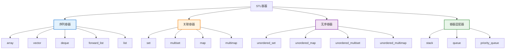
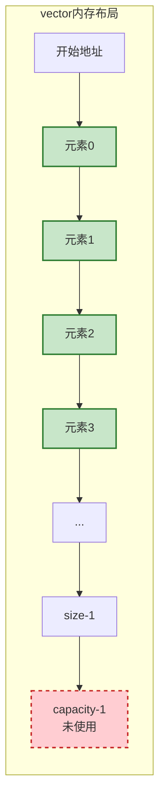
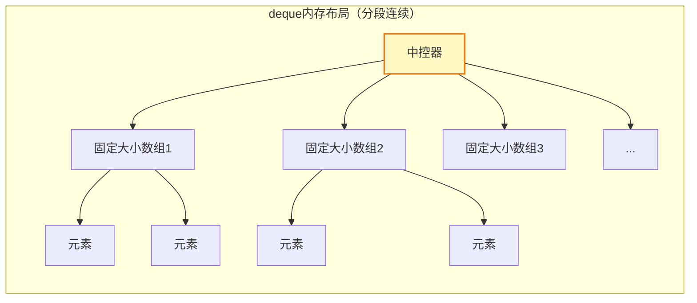
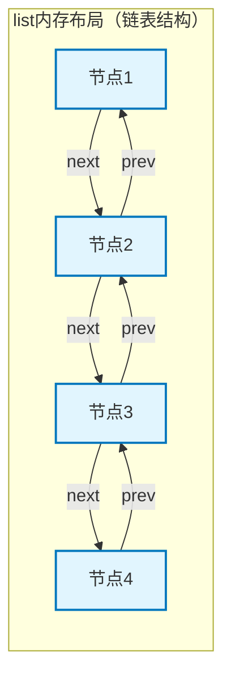
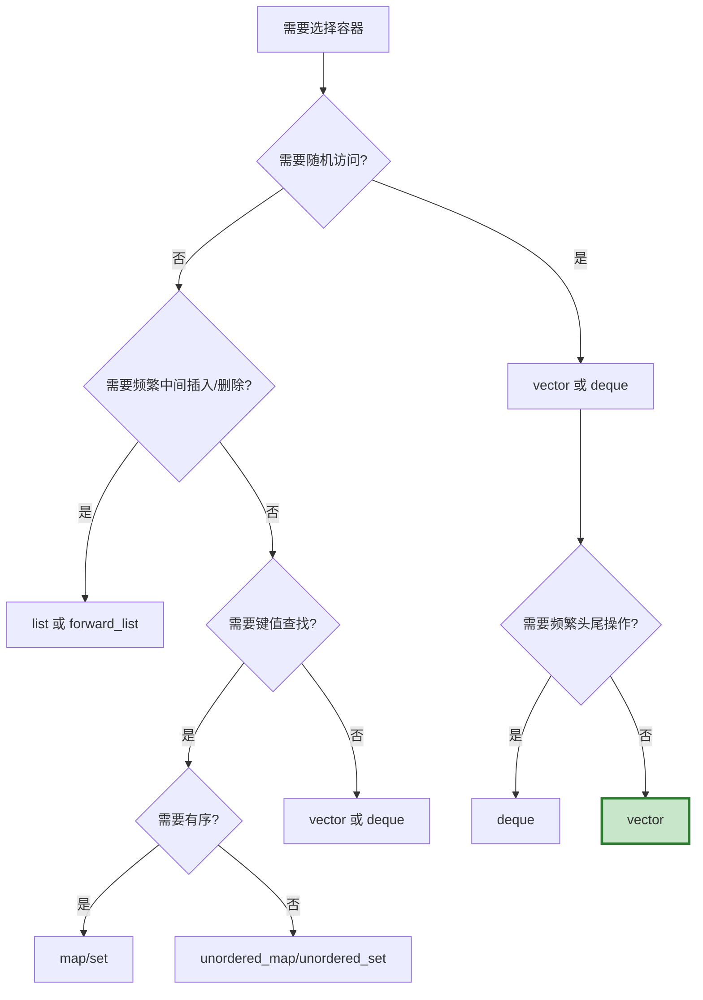

# 6.1 STL容器

> C++标准模板库（STL）提供的高效、类型安全的容器类

## 目录

- [容器概述](#容器概述)
- [序列容器](#序列容器)
- [关联容器](#关联容器)
- [无序容器](#无序容器)
- [容器适配器](#容器适配器)
- [容器共性操作](#容器共性操作)
- [选择合适的容器](#选择合适的容器)
- [本节小结](#本节小结)

---

## 容器概述

### 什么是STL容器

STL容器（Standard Template Library Containers）是C++标准库提供的一组通用数据结构，用于存储和管理对象。它们都是模板类，可以存储任意类型的元素。

**容器的核心特性：**
- **类型安全**：编译时类型检查，避免类型错误
- **内存管理**：自动管理内存，无需手动分配和释放
- **高效算法**：针对不同容器优化的操作
- **统一接口**：相似的命名规范和操作方式

### 容器分类



### 性能复杂度对比

| 容器 | 插入 | 删除 | 随机访问 | 查找 |
|------|------|------|----------|------|
| `vector` | 均摊O(1) | O(n) | O(1) | O(n) |
| `deque` | 均摊O(1) | O(n) | O(1) | O(n) |
| `list` | O(1) | O(1) | O(n) | O(n) |
| `set/map` | O(log n) | O(log n) | O(n) | O(log n) |
| `unordered_set/map` | 均摊O(1) | 均摊O(1) | O(n) | 均摊O(1) |

---

## 序列容器

序列容器（Sequence Containers）维护元素的插入顺序，元素按线性排列。

### vector：动态数组

`vector`是最常用的序列容器，提供连续内存存储和动态大小调整。

```cpp
#include <vector>
#include <iostream>

void vectorBasic() {
    // 创建vector
    std::vector<int> nums1;                    // 空
    std::vector<int> nums2(5);                 // 5个元素，默认值0
    std::vector<int> nums3(5, 10);             // 5个元素，值为10
    std::vector<int> nums4 = {1, 2, 3, 4, 5}; // 初始化列表
    std::vector<int> nums5(nums4);             // 拷贝构造

    // 添加元素
    nums1.push_back(10);   // 尾部添加
    nums1.push_back(20);
    nums1.emplace_back(30); // 就地构造（更高效）

    // 访问元素
    std::cout << nums1[0] << "\n";        // 下标访问（不检查边界）
    std::cout << nums1.at(0) << "\n";     // 带边界检查
    std::cout << nums1.front() << "\n";   // 第一个元素
    std::cout << nums1.back() << "\n";    // 最后一个元素

    // 迭代器访问
    for (auto it = nums1.begin(); it != nums1.end(); ++it) {
        std::cout << *it << " ";
    }
    std::cout << "\n";

    // 范围for循环
    for (const auto& num : nums1) {
        std::cout << num << " ";
    }
    std::cout << "\n";

    // 容量信息
    std::cout << "Size: " << nums1.size() << "\n";
    std::cout << "Capacity: " << nums1.capacity() << "\n";
    std::cout << "Empty: " << nums1.empty() << "\n";

    // 预留空间
    nums1.reserve(100);  // 预留容量，避免多次重新分配

    // 调整大小
    nums1.resize(10);    // 调整大小，新元素默认初始化
    nums1.resize(15, 99); // 调整大小，新元素初始化为99

    // 删除元素
    nums1.pop_back();        // 删除最后一个元素
    nums1.clear();           // 清空所有元素
}
```

**vector的内存模型：**



### deque：双端队列

`deque`（双端队列）支持在两端高效插入和删除。

```cpp
#include <deque>

void dequeBasic() {
    std::deque<int> dq;

    // 两端添加
    dq.push_back(10);   // 尾部
    dq.push_front(5);   // 头部
    dq.emplace_back(20);
    dq.emplace_front(1);

    // 两端删除
    dq.pop_back();
    dq.pop_front();

    // 随机访问
    std::cout << dq[0] << "\n";

    // 与vector相比，deque在中间插入删除也是O(n)
    // 但在两端的操作更高效
}
```

**deque的内存模型：**



### list：双向链表

`list`是双向链表，支持任意位置的快速插入和删除。

```cpp
#include <list>

void listBasic() {
    std::list<int> lst = {1, 2, 3, 4, 5};

    // 添加元素
    lst.push_front(0);   // 头部
    lst.push_back(6);    // 尾部

    // 在指定位置插入
    auto it = lst.begin();
    std::advance(it, 2); // 移动迭代器
    lst.insert(it, 99);  // 在位置2前插入99

    // 删除元素
    lst.pop_front();     // 删除头部
    lst.pop_back();      // 删除尾部
    lst.remove(99);      // 删除所有值为99的元素

    // 链表特有操作
    lst.sort();          // 排序（O(n log n)）
    lst.reverse();       // 反转
    lst.unique();        // 删除连续重复元素

    // splice：转移元素
    std::list<int> lst2 = {100, 200};
    lst.splice(lst.begin(), lst2); // 将lst2所有元素转移到lst

    // merge：合并有序链表
    lst.merge(lst2); // 要求两个链表都必须已排序
}
```

**list的内存模型：**



### forward_list：单向链表

`forward_list`是C++11引入的单向链表，比`list`更节省空间。

```cpp
#include <forward_list>

void forwardListBasic() {
    std::forward_list<int> flst = {1, 2, 3, 4, 5};

    // 只能操作头部
    flst.push_front(0);

    // 没有size()方法（需要遍历计算）
    // 没有push_back()（单向链表尾部操作低效）

    // 插入需要在位置之前
    auto it = flst.begin();
    flst.insert_after(it, 99); // 在it之后插入

    // 删除
    flst.pop_front();
    flst.erase_after(it); // 删除it之后的元素
}
```

### array：固定大小数组

`array`是C++11引入的固定大小数组，是对原生数组的封装。

```cpp
#include <array>

void arrayBasic() {
    std::array<int, 5> arr1 = {1, 2, 3, 4, 5};
    std::array<int, 5> arr2; // 未初始化

    // 与原生数组类似，但有更多功能
    arr1.fill(10);     // 用10填充所有元素
    arr1.swap(arr2);   // 交换内容

    // 支持边界检查
    int x = arr1.at(2); // 带边界检查

    // 支持迭代器
    for (auto& val : arr1) {
        std::cout << val << " ";
    }
}
```

---

## 关联容器

关联容器（Associative Containers）基于平衡树实现（通常是红黑树），元素有序存储，支持高效查找。

### set：唯一集合

`set`存储唯一元素，自动排序。

```cpp
#include <set>

void setBasic() {
    std::set<int> s;

    // 插入元素（自动排序，去重）
    s.insert(5);
    s.insert(1);
    s.insert(3);
    s.insert(5); // 重复值不会被插入

    // 查找
    auto it = s.find(3);
    if (it != s.end()) {
        std::cout << "Found: " << *it << "\n";
    }

    // 统计（set中只会返回0或1）
    size_t count = s.count(5);

    // 删除
    s.erase(3);

    // 范围查询
    auto lower = s.lower_bound(2); // >=2的第一个元素
    auto upper = s.upper_bound(4); // >4的第一个元素

    // 遍历（有序）
    for (const auto& val : s) {
        std::cout << val << " ";
    }
}

void setWithCustomComparator() {
    // 使用降序
    std::set<int, std::greater<int>> s = {1, 2, 3, 4, 5};

    // 使用自定义比较
    auto cmp = [](int a, int b) { return a > b; };
    std::set<int, decltype(cmp)> s2(cmp);
}
```

### map：键值对容器

`map`存储键值对，键唯一且有序。

```cpp
#include <map>

void mapBasic() {
    std::map<std::string, int> ages;

    // 插入
    ages["Alice"] = 25;
    ages["Bob"] = 30;
    ages.insert({"Charlie", 35});
    ages.emplace("David", 40); // 更高效

    // 访问
    std::cout << ages["Alice"] << "\n";     // 若不存在会创建默认值
    std::cout << ages.at("Bob") << "\n";    // 若不存在抛出异常

    // 查找
    auto it = ages.find("Bob");
    if (it != ages.end()) {
        std::cout << it->first << ": " << it->second << "\n";
    }

    // 修改值
    ages["Alice"] = 26;

    // 删除
    ages.erase("Charlie");

    // 遍历（按键排序）
    for (const auto& [name, age] : ages) {
        std::cout << name << ": " << age << "\n";
    }
}

void mapOperations() {
    std::map<std::string, int> m;

    // 检查是否存在
    if (m.contains("key")) { // C++20
        // ...
    }

    // 尝试插入（若已存在则失败）
    auto [it, success] = m.insert_or_assign("key", 42); // C++17

    // 获取或创建
    int& value = m["key"]; // 若不存在则创建默认值0

    // 使用try_emplace（C++17）
    m.try_emplace("key", 42); // 仅当key不存在时才构造
}
```

### multiset和multimap

允许重复键的关联容器。

```cpp
void multiContainers() {
    std::multiset<int> ms;
    ms.insert(1);
    ms.insert(1); // 允许重复
    ms.insert(2);

    // count可能返回大于1
    size_t c = ms.count(1); // 返回2

    // equal_range获取所有相等的元素
    auto [begin, end] = ms.equal_range(1);

    std::multimap<std::string, int> mm;
    mm.insert({"key", 1});
    mm.insert({"key", 2}); // 同一键可以关联多个值
}
```

---

## 无序容器

无序容器（Unordered Containers）基于哈希表实现，C++11引入，提供平均O(1)的查找。

### unordered_set和unordered_map

```cpp
#include <unordered_set>
#include <unordered_map>

void unorderedBasic() {
    // unordered_set
    std::unordered_set<int> us = {1, 2, 3, 4, 5};

    // 插入和查找
    us.insert(10);
    auto it = us.find(3);

    // unordered_map
    std::unordered_map<std::string, int> um;
    um["apple"] = 5;
    um["banana"] = 3;

    // 遍历（无序）
    for (const auto& [key, val] : um) {
        std::cout << key << ": " << val << "\n";
    }

    // 自定义哈希和相等函数
    struct Person {
        std::string name;
        int age;
    };

    auto hash = [](const Person& p) {
        return std::hash<std::string>()(p.name) ^
               std::hash<int>()(p.age);
    };

    auto equal = [](const Person& a, const Person& b) {
        return a.name == b.name && a.age == b.age;
    };

    std::unordered_map<Person, std::string,
                       decltype(hash), decltype(equal)> people(10, hash, equal);
}
```

**性能考虑：**
- 平均情况：O(1)插入、删除、查找
- 最坏情况：O(n)（哈希冲突严重时）
- 不支持范围查询（元素无序）
- 需要为键类型提供哈希函数

---

## 容器适配器

容器适配器（Container Adapters）是对其他容器的封装，提供特定的接口。

### stack：栈

后进先出（LIFO）数据结构。

```cpp
#include <stack>

void stackBasic() {
    std::stack<int> s;

    // 默认使用deque作为底层容器
    // std::stack<int, std::vector<int>> s; // 指定底层容器
    // std::stack<int, std::list<int>> s;

    s.push(10);
    s.push(20);
    s.push(30);

    // 访问栈顶
    std::cout << "Top: " << s.top() << "\n"; // 30

    // 出栈
    s.pop();

    std::cout << "Size: " << s.size() << "\n";
    std::cout << "Empty: " << s.empty() << "\n";
}
```

### queue：队列

先进先出（FIFO）数据结构。

```cpp
#include <queue>

void queueBasic() {
    std::queue<int> q;

    // 默认使用deque作为底层容器

    q.push(10);
    q.push(20);
    q.push(30);

    // 访问队首和队尾
    std::cout << "Front: " << q.front() << "\n"; // 10
    std::cout << "Back: " << q.back() << "\n";  // 30

    // 出队
    q.pop();

    std::cout << "Front after pop: " << q.front() << "\n"; // 20
}
```

### priority_queue：优先队列

元素按优先级排序的队列。

```cpp
#include <queue>

void priorityQueueBasic() {
    // 默认是大顶堆（最大值在队首）
    std::priority_queue<int> pq;

    pq.push(10);
    pq.push(30);
    pq.push(20);

    // 访问最高优先级元素
    std::cout << "Top: " << pq.top() << "\n"; // 30

    pq.pop();
    std::cout << "Top after pop: " << pq.top() << "\n"; // 20
}

void customComparator() {
    // 小顶堆（最小值在队首）
    std::priority_queue<int, std::vector<int>, std::greater<int>> pq;

    pq.push(10);
    pq.push(30);
    pq.push(20);

    std::cout << "Top: " << pq.top() << "\n"; // 10
}

void customObject() {
    struct Task {
        int priority;
        std::string name;

        bool operator<(const Task& other) const {
            return priority < other.priority; // 高优先级在前
        }
    };

    std::priority_queue<Task> tasks;
    tasks.push({5, "Low"});
    tasks.push({1, "High"});
    tasks.push({3, "Medium"});

    while (!tasks.empty()) {
        auto t = tasks.top();
        std::cout << t.priority << ": " << t.name << "\n";
        tasks.pop();
    }
}
```

---

## 容器共性操作

所有STL容器都支持一些通用操作。

### 类型别名

```cpp
template<typename T>
void commonTypes() {
    std::vector<T> vec;

    // 常用类型别名
    using value_type = typename std::vector<T>::value_type;        // T
    using reference = typename std::vector<T>::reference;          // T&
    using const_reference = typename std::vector<T>::const_reference; // const T&
    using iterator = typename std::vector<T>::iterator;           // 迭代器
    using size_type = typename std::vector<T>::size_type;         // size_t类型
    using difference_type = typename std::vector<T>::difference_type; // 迭代器差值类型
}
```

### 通用成员函数

```cpp
void commonOperations() {
    std::vector<int> vec = {1, 2, 3, 4, 5};

    // 大小相关
    vec.empty();      // 是否为空
    vec.size();       // 元素数量
    vec.max_size();   // 最大可能容量
    vec.capacity();   // 当前容量（仅vector、string、deque）

    // 迭代器
    vec.begin();      // 首迭代器
    vec.end();        // 尾后迭代器
    vec.cbegin();     // const首迭代器
    vec.cend();       // const尾后迭代器
    vec.rbegin();     // 反向首迭代器
    vec.rend();       // 反向尾后迭代器

    // 比较运算符
    std::vector<int> vec2 = vec;
    bool eq = (vec == vec2);   // 相等
    bool ne = (vec != vec2);   // 不等
    bool lt = (vec < vec2);    // 小于（字典序）

    // 交换
    vec.swap(vec2);    // 交换内容（O(1)）

    // 清空
    vec.clear();       // 删除所有元素
}
```

### 初始化和赋值

```cpp
void initAndAssign() {
    // 初始化列表
    std::vector<int> v1 = {1, 2, 3, 4, 5};

    // 拷贝构造
    std::vector<int> v2(v1);

    // 移动构造（C++11）
    std::vector<int> v3(std::move(v1)); // v1变为空

    // 指定范围构造
    std::vector<int> v4(v2.begin(), v2.end());

    // 大小构造
    std::vector<int> v5(10);        // 10个默认值
    std::vector<int> v6(10, 5);     // 10个值为5的元素

    // 赋值
    v1 = v2;                        // 拷贝赋值
    v1 = {1, 2, 3};                 // 初始化列表赋值
    v1 = std::move(v2);             // 移动赋值

    // assign
    v1.assign(5, 10);               // 5个值为10的元素
    v1.assign({1, 2, 3});           // 初始化列表
    v1.assign(v3.begin(), v3.end()); // 迭代器范围
}
```

---

## 选择合适的容器

### 决策树



### 选择建议

| 使用场景 | 推荐容器 | 原因 |
|---------|---------|------|
| 默认选择 | `vector` | 连续内存，缓存友好，随机访问快 |
| 需要在两端频繁插入/删除 | `deque` | 两端操作高效 |
| 需要在中间频繁插入/删除 | `list` | O(1)插入删除 |
| 需要保持元素有序且快速查找 | `set/map` | 自动排序，O(log n)查找 |
| 需要快速查找但不需要有序 | `unordered_set/map` | 平均O(1)查找 |
| 需要LIFO操作 | `stack` | 专门优化的栈接口 |
| 需要FIFO操作 | `queue` | 专门优化的队列接口 |
| 需要按优先级访问 | `priority_queue` | 自动维护优先级 |
| 固定大小数组 | `array` | 封装原生数组，更安全 |

### 性能优化建议

```cpp
void performanceTips() {
    // 1. 预分配空间
    std::vector<int> vec;
    vec.reserve(1000); // 避免多次重新分配

    // 2. 使用emplace代替push
    std::vector<std::pair<int, int>> pairs;
    pairs.emplace_back(1, 2); // 就地构造，避免临时对象
    // pairs.push_back({1, 2}); // 创建临时对象再移动

    // 3. 正确选择容器
    std::vector<int> v;  // 大多数情况的最佳选择
    std::list<int> l;   // 需要频繁中间插入/删除

    // 4. 避免频繁的size()调用
    size_t sz = vec.size();
    for (size_t i = 0; i < sz; ++i) {
        // 使用局部变量而不是每次调用size()
    }

    // 5. 使用const引用遍历
    for (const auto& item : vec) {
        // 避免拷贝
    }
}
```

---

## 本节小结

### 知识点回顾

1. **容器分类**：
   - 序列容器：vector、deque、list、forward_list、array
   - 关联容器：set、multiset、map、multimap
   - 无序容器：unordered_set、unordered_map及其multi版本
   - 容器适配器：stack、queue、priority_queue

2. **核心操作**：
   - 插入：push_back、push_front、insert、emplace
   - 删除：pop_back、pop_front、erase、clear
   - 访问：下标运算符、at、front、back
   - 迭代器：begin、end、rbegin、rend

3. **性能特性**：
   - vector：随机访问O(1)，中间插入删除O(n)
   - list：任意位置插入删除O(1)，随机访问O(n)
   - set/map：查找O(log n)，自动排序
   - unordered系列：查找平均O(1)，无序

### 最佳实践

```cpp
// ✅ 推荐做法
std::vector<int> vec;
vec.reserve(1000);        // 预分配空间
vec.emplace_back(42);     // 使用emplace

for (const auto& item : vec) { // 使用const引用
    // 处理item
}

// ❌ 避免
std::list<int> lst;      // 除非真的需要频繁中间插入删除
for (size_t i = 0; i < vec.size(); ++i) { // 频繁调用size()
    // ...
}
```

### 学习建议

1. **优先使用vector**：大多数情况下是最佳选择
2. **理解性能权衡**：知道何时选择其他容器
3. **善用迭代器**：使用统一接口遍历容器
4. **注意异常安全**：容器的操作保证强异常安全
5. **阅读文档**：熟悉每个容器的特定操作

### 练习

1. 实现一个简单的学生管理系统，使用map存储学生信息
2. 编写函数，合并两个有序vector
3. 使用priority_queue实现任务调度器
4. 对比不同容器在大数据量下的性能差异

---

**下一节：6.2-迭代器与算法** - 深入理解STL的迭代器和泛型算法