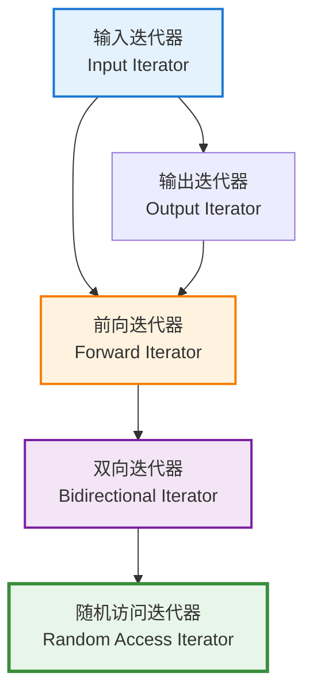
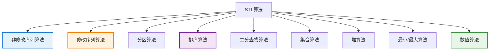

# 6.2 迭代器与算法

> 连接容器与算法的桥梁，实现泛型编程的核心机制

## 目录

- [迭代器基础](#迭代器基础)
- [迭代器类别](#迭代器类别)
- [迭代器适配器](#迭代器适配器)
- [标准算法概览](#标准算法概览)
- [常用算法详解](#常用算法详解)
- [函数对象与谓词](#函数对象与谓词)
- [本节小结](#本节小结)

---

## 迭代器基础

### 什么是迭代器

迭代器（Iterator）是STL的核心组件，提供统一的方式访问容器中的元素。它抽象了容器底层的实现细节，使算法能够以统一的方式操作不同的容器。

**迭代器的作用：**
- **统一接口**：不同容器使用相同的迭代器接口
- **算法解耦**：算法与容器实现分离
- **安全访问**：提供边界检查和类型安全的访问方式
- **范围表示**：用一对迭代器表示元素范围

### 基本使用

```cpp
#include <vector>
#include <iostream>

void iteratorBasic() {
    std::vector<int> vec = {1, 2, 3, 4, 5};

    // 使用迭代器遍历
    for (std::vector<int>::iterator it = vec.begin();
         it != vec.end(); ++it) {
        std::cout << *it << " ";
        *it *= 2; // 修改元素
    }
    std::cout << "\n";

    // 使用auto简化（C++11）
    for (auto it = vec.begin(); it != vec.end(); ++it) {
        std::cout << *it << " ";
    }
    std::cout << "\n";

    // const迭代器（只读）
    for (std::vector<int>::const_iterator cit = vec.cbegin();
         cit != vec.cend(); ++cit) {
        std::cout << *cit << " ";
        // *cit *= 2; // 错误：不能修改
    }
    std::cout << "\n";

    // 反向迭代器
    for (auto rit = vec.rbegin(); rit != vec.rend(); ++rit) {
        std::cout << *rit << " ";
    }
    std::cout << "\n";
}
```

### 迭代器操作

```cpp
void iteratorOperations() {
    std::vector<int> vec = {10, 20, 30, 40, 50};

    // 解引用
    auto it = vec.begin();
    int val = *it;      // 获取值
    *it = 100;          // 修改值

    // 成员访问（迭代器指向对象时）
    std::vector<std::string> words = {"hello", "world"};
    auto strIt = words.begin();
    std::string s = *strIt;
    size_t len = strIt->length(); // 等价于(*strIt).length()

    // 算术运算（随机访问迭代器）
    it = vec.begin();
    it += 2;            // 前进2个位置
    it = it + 1;        // 前进1个位置
    auto it2 = it - 1;  // 后退1个位置

    // 关系运算
    bool b1 = (it == it2); // 相等比较
    bool b2 = (it != it2); // 不等比较
    bool b3 = (it < it2);  // 小于比较（随机访问迭代器）

    // 自增自减
    ++it;   // 前置自增
    it++;   // 后置自增
    --it;   // 前置自减
    it--;   // 后置自减

    // distance：计算两个迭代器之间的距离
    auto diff = std::distance(vec.begin(), vec.end()); // 5

    // advance：前进n个位置
    std::advance(it, 2); // it前进2个位置

    // next/prev：获取前进/后退n个位置的迭代器副本（C++11）
    auto it3 = std::next(it, 2);
    auto it4 = std::prev(it, 1);
}
```

---

## 迭代器类别

C++迭代器分为5个类别，每个类别提供不同级别的功能。

### 迭代器类别层次



### 输入迭代器（Input Iterator）

只能读取元素，单向遍历。

```cpp
void inputIterator() {
    // istream_iterator是输入迭代器的典型例子
    std::istringstream iss("1 2 3 4 5");
    std::istream_iterator<int> it(iss);
    std::istream_iterator<int> end; // 默认构造表示结束

    while (it != end) {
        std::cout << *it << " ";
        ++it; // 只能前进，不能后退
    }
    std::cout << "\n";

    // 适用于单遍算法（如find、count）
}
```

### 输出迭代器（Output Iterator）

只能写入元素，单向遍历。

```cpp
void outputIterator() {
    // ostream_iterator是输出迭代器的典型例子
    std::vector<int> vec = {1, 2, 3, 4, 5};
    std::ostream_iterator<int> out_it(std::cout, " ");

    std::copy(vec.begin(), vec.end(), out_it);
    std::cout << "\n";

    // 适用于单遍写入算法（如copy）
}
```

### 前向迭代器（Forward Iterator）

可读写，支持多次遍历（如`forward_list`）。

```cpp
void forwardIterator() {
    std::forward_list<int> flst = {1, 2, 3, 4, 5};

    // 可以多次遍历
    for (auto it = flst.begin(); it != flst.end(); ++it) {
        *it *= 2; // 读写
    }

    for (const auto& val : flst) {
        std::cout << val << " "; // 再次遍历
    }
    std::cout << "\n";
}
```

### 双向迭代器（Bidirectional Iterator）

支持前进和后退（如`list`、`set`、`map`）。

```cpp
void bidirectionalIterator() {
    std::list<int> lst = {1, 2, 3, 4, 5};

    auto it = lst.begin();
    ++it;  // 前进
    --it;  // 后退

    // 反向遍历
    for (auto rit = lst.rbegin(); rit != lst.rend(); ++rit) {
        std::cout << *rit << " ";
    }
    std::cout << "\n";
}
```

### 随机访问迭代器（Random Access Iterator）

支持任意位置的跳跃访问（如`vector`、`deque`、数组）。

```cpp
void randomAccessIterator() {
    std::vector<int> vec = {1, 2, 3, 4, 5};

    auto it = vec.begin();

    // 算术运算
    it += 2;      // 前进2个位置
    it = it - 1;  // 后退1个位置
    it = it + 3;  // 前进3个位置

    // 关系运算
    bool b = (it < vec.end());    // 可以比较大小
    auto diff = vec.end() - it;   // 可以计算距离

    // 下标访问
    int val = it[2]; // 等价于 *(it + 2)

    // 快速排序需要随机访问迭代器
    std::sort(vec.begin(), vec.end());
}
```

### 迭代器标签

```cpp
#include <iterator>

void iteratorTags() {
    // 每个迭代器类别都有对应的标签类型
    std::vector<int>::iterator::iterator_category cat; // std::random_access_iterator_tag

    // 可以在编译时检查迭代器类别
    template<typename Iterator>
    void advance(Iterator& it, size_t n) {
        using Category = typename std::iterator_traits<Iterator>::iterator_category;

        if constexpr (std::is_same_v<Category, std::random_access_iterator_tag>) {
            it += n; // O(1)
        } else {
            for (size_t i = 0; i < n; ++i) {
                ++it; // O(n)
            }
        }
    }
}
```

---

## 迭代器适配器

迭代器适配器修改或增强迭代器的行为。

### 反向迭代器

```cpp
void reverseIterator() {
    std::vector<int> vec = {1, 2, 3, 4, 5};

    // rbegin/rend返回反向迭代器
    for (auto rit = vec.rbegin(); rit != vec.rend(); ++rit) {
        std::cout << *rit << " "; // 输出: 5 4 3 2 1
    }
    std::cout << "\n";

    // base()获取对应的正向迭代器
    auto rit = vec.rbegin();
    auto it = rit.base(); // rit.base()指向vec.end()

    // 注意：反向迭代器和正向迭代器的关系
    // *rit == *(rit.base() - 1)
}
```

### 插入迭代器

```cpp
#include <iterator>

void insertIterator() {
    std::vector<int> vec;

    // back_inserter：调用push_back
    std::copy_n(std::istream_iterator<int>(std::cin), 3,
                std::back_inserter(vec));

    // front_inserter：调用push_front（需要容器支持）
    std::deque<int> dq;
    std::copy(vec.begin(), vec.end(),
              std::front_inserter(dq)); // 逆序插入

    // inserter：在指定位置插入
    std::set<int> s;
    std::copy(vec.begin(), vec.end(),
              std::inserter(s, s.begin()));
}
```

### 流迭代器

```cpp
#include <sstream>
#include <iterator>

void streamIterator() {
    // istream_iterator：从输入流读取
    std::istringstream iss("10 20 30 40 50");
    std::istream_iterator<int> in_it(iss);
    std::istream_iterator<int> in_end; // 流结束迭代器

    std::vector<int> vec(in_it, in_end);

    // ostream_iterator：写入输出流
    std::ostream_iterator<int> out_it(std::cout, " ");
    std::copy(vec.begin(), vec.end(), out_it);
    std::cout << "\n";

    // 从cin读取直到EOF
    // std::vector<int> numbers(
    //     std::istream_iterator<int>(std::cin),
    //     std::istream_iterator<int>()
    // );
}
```

### 移动迭代器（C++11）

```cpp
#include <memory>
#include <utility>

void moveIterator() {
    std::vector<std::string> src = {"hello", "world", "foo"};
    std::vector<std::string> dst;

    // 使用移动迭代器避免拷贝
    std::move_iterator<std::vector<std::string>::iterator>
        move_it(src.begin());
    std::move_iterator<std::vector<std::string>::iterator>
        move_end(src.end());

    std::copy(move_it, move_end, std::back_inserter(dst));
    // src中的字符串现在处于移后状态（有效但未指定）

    // 更简洁的方式（C++11）
    // std::copy(std::make_move_iterator(src.begin()),
    //           std::make_move_iterator(src.end()),
    //           std::back_inserter(dst));
}
```

---

## 标准算法概览

STL提供大量泛型算法，大多定义在`<algorithm>`头文件中。

### 算法分类



### 算法命名约定

```cpp
void namingConventions() {
    std::vector<int> vec = {5, 2, 8, 1, 9};

    // 1. 带_if后缀：接受谓词
    auto it1 = std::find(vec.begin(), vec.end(), 5);
    auto it2 = std::find_if(vec.begin(), vec.end(),
                            [](int x) { return x > 5; });

    // 2. 带_copy后缀：不修改原序列，输出到新位置
    std::vector<int> result;
    std::copy(vec.begin(), vec.end(), std::back_inserter(result));
    std::copy_if(vec.begin(), vec.end(),
                 std::back_inserter(result),
                 [](int x) { return x > 5; });

    // 3. 带_n后缀：操作前n个元素
    std::copy_n(vec.begin(), 3, std::ostream_iterator<int>(std::cout, " "));

    // 4. 稳定版本：stable_xxx，保持相等元素的相对顺序
    std::vector<std::pair<int, std::string>> data = {
        {1, "one"}, {2, "two"}, {1, "uno"}
    };
    std::stable_sort(data.begin(), data.end());
    // 两个1的相对顺序保持不变
}
```

---

## 常用算法详解

### 查找算法

```cpp
#include <algorithm>
#include <vector>

void findAlgorithms() {
    std::vector<int> vec = {1, 2, 3, 4, 5, 3, 2, 1};

    // find：查找第一个等于给定值的元素
    auto it1 = std::find(vec.begin(), vec.end(), 3);

    // find_if：查找第一个满足条件的元素
    auto it2 = std::find_if(vec.begin(), vec.end(),
                           [](int x) { return x > 3; });

    // find_if_not：查找第一个不满足条件的元素（C++11）
    auto it3 = std::find_if_not(vec.begin(), vec.end(),
                                [](int x) { return x < 3; });

    // adjacent_find：查找相邻的重复元素
    auto it4 = std::adjacent_find(vec.begin(), vec.end());

    // find_end：查找最后一个子序列
    std::vector<int> sub = {2, 1};
    auto it5 = std::find_end(vec.begin(), vec.end(), sub.begin(), sub.end());

    // find_first_of：查找第一个在另一个集合中出现的元素
    std::vector<int> targets = {3, 5};
    auto it6 = std::find_first_of(vec.begin(), vec.end(),
                                  targets.begin(), targets.end());

    // search：查找子序列首次出现的位置
    auto it7 = std::search(vec.begin(), vec.end(), sub.begin(), sub.end());

    // search_n：查找连续n个等于给定值的元素
    auto it8 = std::search_n(vec.begin(), vec.end(), 2, 1);
}
```

### 计数算法

```cpp
void countAlgorithms() {
    std::vector<int> vec = {1, 2, 3, 2, 1, 2, 3, 2, 1};

    // count：等于给定值的元素个数
    size_t cnt1 = std::count(vec.begin(), vec.end(), 2); // 4

    // count_if：满足条件的元素个数
    size_t cnt2 = std::count_if(vec.begin(), vec.end(),
                               [](int x) { return x > 2; }); // 3
}
```

### 修改序列算法

```cpp
void modifyingAlgorithms() {
    std::vector<int> vec = {1, 2, 3, 4, 5};

    // for_each：对每个元素执行操作
    std::for_each(vec.begin(), vec.end(),
                  [](int& x) { x *= 2; });

    // transform：转换元素
    std::vector<int> result;
    std::transform(vec.begin(), vec.end(),
                   std::back_inserter(result),
                   [](int x) { return x * x; });

    // fill：填充值
    std::fill(vec.begin(), vec.end(), 0);

    // fill_n：填充前n个元素
    std::fill_n(vec.begin(), 3, 42);

    // generate：用生成函数填充
    std::generate(vec.begin(), vec.end(),
                  []() { return rand() % 100; });

    // generate_n：生成前n个元素
    int i = 0;
    std::generate_n(vec.begin(), 5,
                    [&i]() { return ++i; });

    // replace：替换等于给定值的元素
    std::replace(vec.begin(), vec.end(), 0, -1);

    // replace_if：替换满足条件的元素
    std::replace_if(vec.begin(), vec.end(),
                    [](int x) { return x < 0; },
                    0);

    // replace_copy：替换并复制到新位置
    std::vector<int> copy;
    std::replace_copy(vec.begin(), vec.end(),
                      std::back_inserter(copy),
                      1, 100);
}
```

### 移除算法

```cpp
void removingAlgorithms() {
    std::vector<int> vec = {1, 2, 3, 2, 1, 2, 3, 2, 1};

    // remove：移除等于给定值的元素（并不真正删除）
    auto new_end = std::remove(vec.begin(), vec.end(), 2);
    vec.erase(new_end, vec.end()); // 需要配合erase

    // remove_if：移除满足条件的元素
    new_end = std::remove_if(vec.begin(), vec.end(),
                             [](int x) { return x > 2; });
    vec.erase(new_end, vec.end());

    // unique：移除连续的重复元素
    vec = {1, 1, 2, 2, 2, 3, 3};
    new_end = std::unique(vec.begin(), vec.end());
    vec.erase(new_end, vec.end()); // 结果: {1, 2, 3}

    // 完全去重（先排序）
    std::sort(vec.begin(), vec.end());
    new_end = std::unique(vec.begin(), vec.end());
    vec.erase(new_end, vec.end());
}
```

### 排序算法

```cpp
void sortingAlgorithms() {
    std::vector<int> vec = {5, 2, 8, 1, 9, 3};

    // sort：排序（不保证相等元素的相对顺序）
    std::sort(vec.begin(), vec.end());

    // stable_sort：稳定排序
    std::stable_sort(vec.begin(), vec.end());

    // 使用自定义比较
    std::sort(vec.begin(), vec.end(), std::greater<int>()); // 降序

    // partial_sort：部分排序（使前n个元素有序）
    std::partial_sort(vec.begin(), vec.begin() + 3, vec.end());

    // nth_element：使第n个元素处于正确的排序位置
    std::nth_element(vec.begin(), vec.begin() + 2, vec.end());

    // is_sorted：检查是否已排序
    bool sorted = std::is_sorted(vec.begin(), vec.end());

    // is_sorted_until：找到第一个未排序的位置
    auto it = std::is_sorted_until(vec.begin(), vec.end());
}
```

### 二分查找算法

**注意：序列必须已排序！**

```cpp
void binarySearchAlgorithms() {
    std::vector<int> vec = {1, 3, 5, 7, 9, 11, 13};

    // lower_bound：第一个>=value的位置
    auto it1 = std::lower_bound(vec.begin(), vec.end(), 5);

    // upper_bound：第一个>value的位置
    auto it2 = std::upper_bound(vec.begin(), vec.end(), 5);

    // equal_range：等于value的范围
    auto range = std::equal_range(vec.begin(), vec.end(), 5);
    // range.first是lower_bound，range.second是upper_bound

    // binary_search：检查value是否存在
    bool found = std::binary_search(vec.begin(), vec.end(), 5);
}
```

### 集合算法

**要求序列都已排序！**

```cpp
void setAlgorithms() {
    std::vector<int> v1 = {1, 2, 3, 4, 5};
    std::vector<int> v2 = {3, 4, 5, 6, 7};
    std::vector<int> result;

    // set_union：并集
    std::set_union(v1.begin(), v1.end(),
                   v2.begin(), v2.end(),
                   std::back_inserter(result));
    // 结果: {1, 2, 3, 4, 5, 6, 7}

    // set_intersection：交集
    result.clear();
    std::set_intersection(v1.begin(), v1.end(),
                         v2.begin(), v2.end(),
                         std::back_inserter(result));
    // 结果: {3, 4, 5}

    // set_difference：差集（v1 - v2）
    result.clear();
    std::set_difference(v1.begin(), v1.end(),
                       v2.begin(), v2.end(),
                       std::back_inserter(result));
    // 结果: {1, 2}

    // set_symmetric_difference：对称差集
    result.clear();
    std::set_symmetric_difference(v1.begin(), v1.end(),
                                 v2.begin(), v2.end(),
                                 std::back_inserter(result));
    // 结果: {1, 2, 6, 7}

    // includes：检查v1是否包含v2
    bool includes = std::includes(v1.begin(), v1.end(),
                                 v2.begin(), v2.end());
    // merge：合并有序序列
    result.clear();
    std::merge(v1.begin(), v1.end(),
              v2.begin(), v2.end(),
              std::back_inserter(result));
}
```

### 堆算法

```cpp
void heapAlgorithms() {
    std::vector<int> vec = {3, 1, 4, 1, 5, 9};

    // make_heap：创建堆
    std::make_heap(vec.begin(), vec.end());

    // push_heap：添加元素到堆（前提：元素已在容器末尾）
    vec.push_back(2);
    std::push_heap(vec.begin(), vec.end());

    // pop_heap：移除堆顶元素到末尾
    std::pop_heap(vec.begin(), vec.end());
    vec.pop_back();

    // sort_heap：堆排序
    std::sort_heap(vec.begin(), vec.end());

    // is_heap：检查是否为堆
    bool is_heap = std::is_heap(vec.begin(), vec.end());

    // is_heap_until：找到第一个不满足堆性质的位置
    auto it = std::is_heap_until(vec.begin(), vec.end());
}
```

### 最小/最大算法

```cpp
void minMaxAlgorithms() {
    std::vector<int> vec = {3, 1, 4, 1, 5, 9};

    // min_element：最小元素
    auto min_it = std::min_element(vec.begin(), vec.end());

    // max_element：最大元素
    auto max_it = std::max_element(vec.begin(), vec.end());

    // minmax_element：同时获取最小和最大（C++11）
    auto [min, max] = std::minmax_element(vec.begin(), vec.end());

    // minmax：返回两个值中的较小和较大者（C++11）
    auto [mn, mx] = std::minmax(10, 20);

    // clamp：将值限制在范围内（C++17）
    int val = std::clamp(15, 10, 20); // 返回15
    val = std::clamp(5, 10, 20);   // 返回10
    val = std::clamp(25, 10, 20);  // 返回20
}
```

### 数值算法

```cpp
#include <numeric>

void numericAlgorithms() {
    std::vector<int> vec = {1, 2, 3, 4, 5};

    // accumulate：累加
    int sum = std::accumulate(vec.begin(), vec.end(), 0); // 15

    // 带自定义操作
    int product = std::accumulate(vec.begin(), vec.end(), 1,
                                  std::multiplies<int>()); // 120

    // inner_product：内积
    std::vector<int> vec2 = {2, 3, 4, 5, 6};
    int inner = std::inner_product(vec.begin(), vec.end(),
                                   vec2.begin(), 0);
    // 1*2 + 2*3 + 3*4 + 4*5 + 5*6 = 70

    // adjacent_difference：相邻元素差
    std::vector<int> diff;
    std::adjacent_difference(vec.begin(), vec.end(),
                            std::back_inserter(diff));
    // diff: {1, 1, 1, 1, 1}

    // partial_sum：部分和
    std::vector<int> partial;
    std::partial_sum(vec.begin(), vec.end(),
                    std::back_inserter(partial));
    // partial: {1, 3, 6, 10, 15}

    // reduce：并行版本的accumulate（C++17）
    #include <execution>
    int sum2 = std::reduce(std::execution::par,
                          vec.begin(), vec.end());

    // transform_reduce：先转换再累加（C++17）
    int result = std::transform_reduce(
        vec.begin(), vec.end(),
        0,
        std::plus<int>(),
        [](int x) { return x * x; }
    ); // 1 + 4 + 9 + 16 + 25 = 55
}
```

---

## 函数对象与谓词

### 什么是谓词

谓词（Predicate）是返回bool值的函数对象，用于算法中的条件判断。

```cpp
void predicateDemo() {
    std::vector<int> vec = {1, 2, 3, 4, 5, 6, 7, 8, 9, 10};

    // 一元谓词：接受一个参数
    auto is_even = [](int x) { return x % 2 == 0; };
    auto it = std::find_if(vec.begin(), vec.end(), is_even);

    // 二元谓词：接受两个参数
    auto cmp = [](int a, int b) { return a > b; };
    std::sort(vec.begin(), vec.end(), cmp);

    // 使用标准谓词
    size_t cnt = std::count_if(vec.begin(), vec.end(),
                               std::bind(std::greater<int>(),
                                       std::placeholders::_1,
                                       5));
}
```

### 函数对象

```cpp
#include <functional>

void functionObjects() {
    std::vector<int> vec = {5, 2, 8, 1, 9};

    // 标准函数对象
    std::sort(vec.begin(), vec.end(), std::greater<int>());

    // 自定义函数对象
    struct AbsGreater {
        bool operator()(int a, int b) const {
            return std::abs(a) > std::abs(b);
        }
    };

    std::sort(vec.begin(), vec.end(), AbsGreater());

    // lambda表达式（推荐）
    std::sort(vec.begin(), vec.end(),
              [](int a, int b) { return std::abs(a) > std::abs(b); });
}
```

### 绑定器

```cpp
void bindDemo() {
    // std::bind：绑定函数参数
    auto add = std::bind(std::plus<int>(),
                        std::placeholders::_1,
                        std::placeholders::_2);

    int result = add(10, 20); // 30

    // 绑定部分参数
    auto add_10 = std::bind(std::plus<int>(),
                            std::placeholders::_1,
                            10);

    result = add_10(5); // 15

    // 调整参数顺序
    auto subtract = std::bind(std::minus<int>(),
                             std::placeholders::_2,
                             std::placeholders::_1);

    result = subtract(20, 10); // 10 - 20 = -10

    // 绑定成员函数
    class Widget {
    public:
        void work(int x) { std::cout << "Working: " << x << "\n"; }
    };

    Widget w;
    auto func = std::bind(&Widget::work,
                         &w,
                         std::placeholders::_1);
    func(42);
}
```

---

## 本节小结

### 知识点回顾

1. **迭代器**：
   - 5个类别：输入、输出、前向、双向、随机访问
   - 统一接口访问容器元素
   - 迭代器适配器：反向、插入、流、移动迭代器

2. **标准算法**：
   - 非修改算法：find、count、search等
   - 修改算法：transform、replace、remove等
   - 排序算法：sort、stable_sort、partial_sort等
   - 查找算法：binary_search、lower_bound、upper_bound等
   - 集合算法：set_union、set_intersection等

3. **函数对象**：
   - 谓词：返回bool的函数对象
   - 标准函数对象：plus、minus、greater等
   - lambda表达式：简洁的函数对象定义
   - std::bind：绑定函数参数

### 最佳实践

```cpp
// ✅ 推荐做法
for (const auto& item : vec) { // 使用范围for
    // 处理item
}

auto it = std::find_if(vec.begin(), vec.end(),
                      [](int x) { return x > 5; }); // 使用lambda

std::sort(vec.begin(), vec.end()); // 使用标准算法

// ❌ 避免
for (size_t i = 0; i < vec.size(); ++i) { // 除非需要索引
    // ...
}

// 手动实现已存在的算法
```

### 学习建议

1. **优先使用算法**：比手写循环更简洁、更高效
2. **理解迭代器类别**：知道算法对迭代器的要求
3. **善用lambda**：使代码更清晰
4. **注意算法复杂度**：选择合适的算法
5. **阅读文档**：STL算法众多，需要经常查阅

### 练习

1. 实现一个函数，使用STL算法统计容器中满足条件的元素个数
2. 编写自定义比较函数，对复杂类型进行排序
3. 使用多种算法处理同一个容器，对比效率
4. 实现一个简单的过滤函数，返回满足条件的新容器

---

**下一节：6.3-字符串处理** - 深入理解std::string和正则表达式