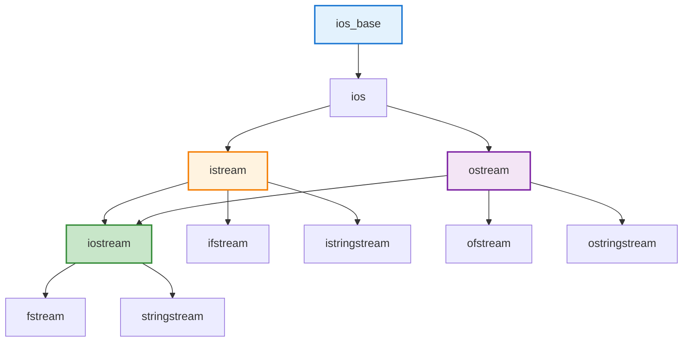

# 6.4 输入输出流

> C++的I/O系统，实现类型安全的输入输出

## 目录

- [I/O流概述](#io流概述)
- [标准I/O流](#标准io流)
- [文件流](#文件流)
- [字符串流](#字符串流)
- [流格式化](#流格式化)
- [本节小结](#本节小结)

---

## I/O流概述

### 流的概念

流（Stream）是C++ I/O系统的核心概念，表示数据源的抽象。流提供了统一的接口处理输入输出，无论数据来自键盘、文件还是内存。

**流的特点：**
- **类型安全**：编译时类型检查
- **可扩展**：可以对自定义类型重载<<和>>
- **缓冲**：提高I/O效率
- **层次结构**：基类派生类的设计

### 流的层次结构



---

## 标准I/O流

### iostream基础

```cpp
#include <iostream>

void iostreamBasic() {
    // 标准输出流
    std::cout << "Hello, World!" << std::endl;
    std::cout << "Value: " << 42 << "\n";

    // 标准输入流
    int value;
    std::cout << "Enter a number: ";
    std::cin >> value;

    // 标准错误流
    std::cerr << "Error message" << std::endl;

    // 标准日志流（C++11）
    std::clog << "Log message" << std::endl;
}
```

### 输入操作

```cpp
void inputOperations() {
    int i;
    double d;
    std::string s;

    // 链式输入
    std::cin >> i >> d >> s;

    // 读取整行
    std::string line;
    std::getline(std::cin, line);

    // 忽略字符
    std::cin.ignore(100, '\n'); // 忽略最多100个字符直到'\n'

    // 查看下一个字符
    int ch = std::cin.peek();

    // 输入状态检查
    if (std::cin) {
        std::cout << "Input OK\n";
    }

    if (std::cin.fail()) {
        std::cout << "Input failed\n";
        std::cin.clear(); // 清除错误状态
    }

    // 读取指定数量字符
    char buffer[10];
    std::cin.read(buffer, 9);
    buffer[9] = '\0';
}
```

### 输出操作

```cpp
void outputOperations() {
    // 链式输出
    std::cout << "Int: " << 42
              << ", Double: " << 3.14
              << std::endl;

    // 刷新缓冲区
    std::cout << "Immediate output" << std::flush;

    // 单元缓冲（每次输出后刷新）
    std::cout << std::unitbuf;
    std::cout << "Always flushed";
    std::cout << std::nounitbuf;

    // putchar和getchar（C风格，也可在C++中使用）
    std::putchar('A');
    int ch = std::getchar();
}
```

---

## 文件流

### 写文本文件

```cpp
#include <fstream>

void writeTextFile() {
    // 打开文件进行写入
    std::ofstream outfile("example.txt");

    if (outfile.is_open()) {
        outfile << "Hello, File!" << "\n";
        outfile << "Line 2" << "\n";
        outfile << 42 << " " << 3.14 << "\n";
        outfile.close();
        std::cout << "File written successfully\n";
    } else {
        std::cerr << "Failed to open file\n";
    }

    // 使用构造函数打开（RAII）
    std::ofstream outfile2("example2.txt");
    if (outfile2) {
        outfile2 << "Content";
    } // 文件在析构时自动关闭
}
```

### 读文本文件

```cpp
void readTextFile() {
    std::ifstream infile("example.txt");

    if (infile.is_open()) {
        std::string line;
        // 逐行读取
        while (std::getline(infile, line)) {
            std::cout << line << "\n";
        }
        infile.close();
    }

    // 检查文件是否存在
    std::ifstream file("data.txt");
    if (!file.good()) {
        std::cerr << "File does not exist\n";
    }
}
```

### 二进制文件

```cpp
void binaryFile() {
    // 写二进制
    {
        std::ofstream outfile("data.bin",
                             std::ios::binary);
        if (outfile) {
            int arr[] = {1, 2, 3, 4, 5};
            outfile.write(reinterpret_cast<char*>(arr),
                          sizeof(arr));
        }
    }

    // 读二进制
    {
        std::ifstream infile("data.bin",
                            std::ios::binary);
        if (infile) {
            int arr[5];
            infile.read(reinterpret_cast<char*>(arr),
                       sizeof(arr));

            // 检查读取是否成功
            if (infile.good()) {
                std::cout << "Read "
                          << infile.gcount() << " bytes\n";
            }
        }
    }
}
```

### 文件模式

```cpp
void fileModes() {
    // 读取模式
    std::ifstream infile("data.txt",
                        std::ios::in);

    // 写入模式
    std::ofstream outfile("data.txt",
                         std::ios::out);

    // 追加模式
    std::ofstream append("data.txt",
                        std::ios::app);

    // 读写模式
    std::fstream file("data.txt",
                     std::ios::in | std::ios::out);

    // 二进制模式
    std::fstream binfile("data.bin",
                        std::ios::in | std::ios::out | std::ios::binary);

    // 截断模式（打开时清空）
    std::ofstream truncate("data.txt",
                          std::ios::out | std::ios::trunc);
}
```

### 文件位置操作

```cpp
void filePosition() {
    std::fstream file("data.txt",
                     std::ios::in | std::ios::out);

    // 获取位置
    auto read_pos = file.tellg();  // 读取位置
    auto write_pos = file.tellp(); // 写入位置

    // 跳到指定位置
    file.seekg(10, std::ios::beg);  // 从开头跳10字节
    file.seekg(-5, std::ios::cur);  // 从当前位置后退5字节
    file.seekg(0, std::ios::end);   // 跳到末尾

    // 获取文件大小
    file.seekg(0, std::ios::beg);
    auto begin = file.tellg();
    file.seekg(0, std::ios::end);
    auto end = file.tellg();
    size_t size = end - begin;
}
```

---

## 字符串流

### stringstream基础

字符串流用于内存中的I/O操作，常用于格式化和解析。

```cpp
#include <sstream>

void stringstreamBasic() {
    // ostringstream：写入字符串
    std::ostringstream oss;
    oss << "Value: " << 42
        << ", Pi: " << 3.14
        << ", Name: " << "Alice";
    std::string result = oss.str();
    std::cout << result << "\n";

    // istringstream：从字符串读取
    std::string data = "10 20 30";
    std::istringstream iss(data);
    int a, b, c;
    iss >> a >> b >> c;
    std::cout << a << " " << b << " " << c << "\n";

    // stringstream：读写
    std::stringstream ss;
    ss << "Count: " << 5;
    std::string word;
    int count;
    ss >> word >> count;
}
```

### 字符串流应用

```cpp
#include <vector>

void stringstreamApplications() {
    // 1. 类型转换
    std::string num_str = "3.14159";
    double num;
    std::istringstream(num_str) >> num;

    std::ostringstream oss;
    oss << 42;
    std::string s = oss.str();

    // 2. 分割字符串
    std::string text = "apple,banana,cherry";
    std::istringstream iss(text);
    std::string token;
    std::vector<std::string> tokens;

    while (std::getline(iss, token, ',')) {
        tokens.push_back(token);
    }

    // 3. 格式化输出
    std::ostringstream formatted;
    formatted << "Name: " << std::left << std::setw(20) << "Alice"
              << "Age: " << std::setw(3) << 25;
    std::cout << formatted.str() << "\n";
}
```

---

## 流格式化

### 格式标志

```cpp
#include <iomanip>

void formatFlags() {
    // 布尔值
    std::cout << std::boolalpha
              << true << ", " << false << "\n";  // true, false
    std::cout << std::noboolalpha
              << true << ", " << false << "\n";  // 1, 0

    // 整数进制
    int n = 42;
    std::cout << std::dec << n << "\n";   // 十进制: 42
    std::cout << std::hex << n << "\n";   // 十六进制: 2a
    std::cout << std::oct << n << "\n";   // 八进制: 52

    // 显示进制前缀
    std::cout << std::showbase
              << std::hex << n << "\n";    // 0x2a

    // 浮点数格式
    double d = 3.14159;
    std::cout << std::fixed << d << "\n";         // 3.141590
    std::cout << std::scientific << d << "\n";    // 3.141590e+00
    std::cout << std::defaultfloat << d << "\n";  // 3.14159

    // 精度
    std::cout << std::setprecision(4)
              << std::fixed << d << "\n";          // 3.1416

    // 正号
    std::cout << std::showpos << 42 << "\n";      // +42
    std::cout << std::noshowpos << 42 << "\n";     // 42
}
```

### 对齐和填充

```cpp
void alignmentAndFill() {
    // 宽度
    std::cout << std::setw(10) << "Hello" << "\n";   // "     Hello"

    // 对齐
    std::cout << std::left << std::setw(10) << "Hello" << "\n";   // "Hello     "
    std::cout << std::right << std::setw(10) << "Hello" << "\n";  // "     Hello"

    // 填充字符
    std::cout << std::setfill('*')
              << std::setw(10) << 42 << "\n";          // ********42

    // 内部对齐（C++20）
    // std::cout << "Left" << std::format("{:<10}", "Right") << "\n";
}
```

### 宽字符流

```cpp
#include <locale>
#include <cwchar>

void wideCharStream() {
    // 宽字符输出
    std::wcout << L"宽字符输出" << std::endl;

    // 宽字符文件
    std::wofstream outfile(L"unicode.txt");
    outfile << L"Unicode内容: 你好世界" << std::endl;

    // 设置locale
    std::locale::global(std::locale(""));
    std::wcout.imbue(std::locale());
}
```

---

## 本节小结

### 知识点回顾

1. **I/O流层次**：
   - ios_base基类
   - iostream输入输出
   - ifstream/ofstream文件流
   - stringstream字符串流

2. **标准I/O**：
   - cout/cin/cerr/clog
   - 类型安全的I/O
   - 输入输出操作

3. **文件流**：
   - 文本文件读写
   - 二进制文件读写
   - 文件模式和位置操作

4. **格式化**：
   - 格式标志
   - 操纵符
   - 对齐和填充

### 最佳实践

```cpp
// ✅ 推荐做法
std::ofstream file("data.txt");
if (file.is_open()) {  // 检查文件状态
    file << data;
}

// 使用RAII自动关闭文件
{
    std::ofstream file("data.txt");
    file << data;
} // 自动关闭

// 检查输入状态
if (std::cin >> value) {
    // 输入成功
}

// ❌ 避免
// 不检查文件状态
std::ifstream file("data.txt");
file >> value;  // 可能失败

// C风格I/O
printf("%s", str.c_str());  // 使用流操作符
```

### 学习建议

1. **检查流状态**：始终检查文件是否成功打开
2. **使用RAII**：利用析构自动关闭文件
3. **理解缓冲**：注意刷新时机
4. **二进制模式**：处理二进制数据时记得指定
5. **异常处理**：文件操作可能失败

### 练习

1. 实现一个日志系统，支持不同级别输出
2. 编写配置文件读写器，支持键值对格式
3. 实现CSV文件读写功能
4. 创建二进制文件备份程序

---

**第六章完成！下一章：异常处理与调试**
