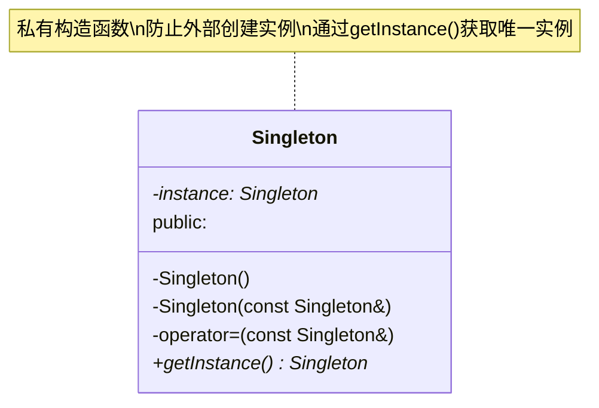
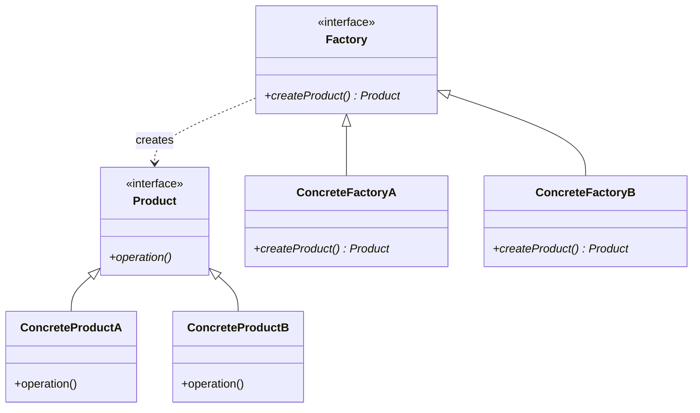
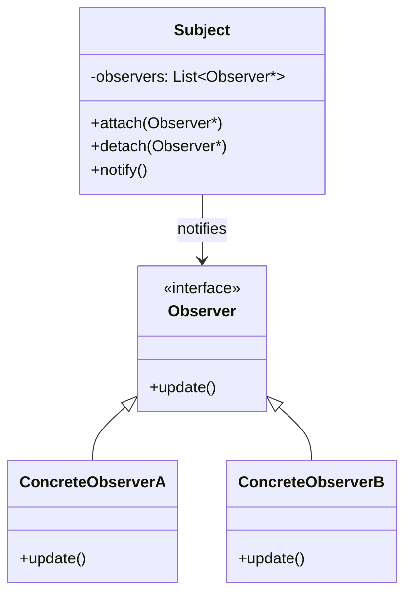
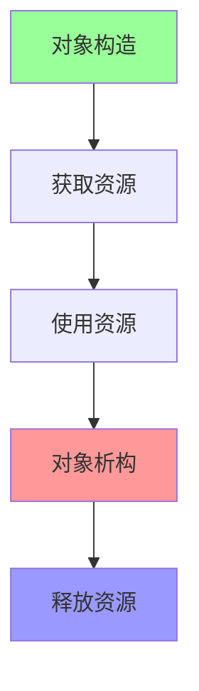

# 10.1 常用设计模式

> 设计模式是经过验证的软件设计解决方案,提高代码的可复用性和可维护性

## 目录

- [单例模式](#单例模式)
- [工厂模式](#工厂模式)
- [观察者模式](#观察者模式)
- [RAII模式](#raii模式)
- [本节小结](#本节小结)

---

## 单例模式

### 什么是单例模式?

单例模式确保一个类只有一个实例,并提供全局访问点。



### 懒汉式实现

```cpp
class Singleton {
private:
    static Singleton* instance;
    Singleton() {
        std::cout << "Singleton created\n";
    }

    // 禁止拷贝和赋值
    Singleton(const Singleton&) = delete;
    Singleton& operator=(const Singleton&) = delete;

public:
    static Singleton* getInstance() {
        if (instance == nullptr) {
            instance = new Singleton();
        }
        return instance;
    }

    void doSomething() {
        std::cout << "Singleton is working\n";
    }
};

// 初始化静态成员
Singleton* Singleton::instance = nullptr;

void lazySingletonDemo() {
    Singleton* s1 = Singleton::getInstance();
    Singleton* s2 = Singleton::getInstance();

    std::cout << "s1 address: " << s1 << "\n";
    std::cout << "s2 address: " << s2 << "\n";
    std::cout << "Same instance: " << (s1 == s2) << "\n";

    s1->doSomething();
}
```

### 线程安全的懒汉式

```cpp
#include <mutex>

class ThreadSafeSingleton {
private:
    static ThreadSafeSingleton* instance;
    static std::mutex mtx;
    ThreadSafeSingleton() {}

public:
    static ThreadSafeSingleton* getInstance() {
        if (instance == nullptr) {  // 第一次检查
            std::lock_guard<std::mutex> lock(mtx);
            if (instance == nullptr) {  // 第二次检查
                instance = new ThreadSafeSingleton();
            }
        }
        return instance;
    }
};

ThreadSafeSingleton* ThreadSafeSingleton::instance = nullptr;
std::mutex ThreadSafeSingleton::mtx;
```

### 饿汉式实现

```cpp
class EagerSingleton {
private:
    static EagerSingleton instance;
    EagerSingleton() {
        std::cout << "EagerSingleton created\n";
    }

public:
    static EagerSingleton& getInstance() {
        return instance;
    }

    void doSomething() {
        std::cout << "EagerSingleton is working\n";
    }
};

// 程序启动时就创建实例
EagerSingleton EagerSingleton::instance;

void eagerSingletonDemo() {
    EagerSingleton& s1 = EagerSingleton::getInstance();
    EagerSingleton& s2 = EagerSingleton::getInstance();

    std::cout << "Same instance: " << (&s1 == &s2) << "\n";
}
```

### Meyer's Singleton(C++11推荐)

```cpp
class MeyerSingleton {
private:
    MeyerSingleton() {
        std::cout << "MeyerSingleton created\n";
    }

public:
    static MeyerSingleton& getInstance() {
        // C++11保证局部静态变量的线程安全初始化
        static MeyerSingleton instance;
        return instance;
    }

    void doSomething() {
        std::cout << "MeyerSingleton is working\n";
    }

    // 删除拷贝操作
    MeyerSingleton(const MeyerSingleton&) = delete;
    MeyerSingleton& operator=(const MeyerSingleton&) = delete;
};

void meyerSingletonDemo() {
    auto& s1 = MeyerSingleton::getInstance();
    auto& s2 = MeyerSingleton::getInstance();

    std::cout << "Same instance: " << (&s1 == &s2) << "\n";
    s1.doSomething();
}
```

### 单例模式实现对比

| 实现方式 | 线程安全 | 懒加载 | 推荐度 | 复杂度 |
|---------|---------|--------|--------|--------|
| 懒汉式 | ❌ | ✅ | ⭐ | 低 |
| 线程安全懒汉式 | ✅ | ✅ | ⭐⭐⭐ | 中 |
| 饿汉式 | ✅ | ❌ | ⭐⭐ | 低 |
| Meyer's Singleton | ✅ | ✅ | ⭐⭐⭐⭐⭐ | 低 |

### 单例模式应用场景

```cpp
// 1. 配置管理器
class ConfigManager {
public:
    static ConfigManager& getInstance() {
        static ConfigManager instance;
        return instance;
    }

    void loadConfig(const std::string& filename) {
        // 加载配置...
    }

    std::string getValue(const std::string& key) {
        return config[key];
    }

private:
    ConfigManager() = default;
    std::map<std::string, std::string> config;
};

// 2. 日志管理器
class LogManager {
public:
    static LogManager& getInstance() {
        static LogManager instance;
        return instance;
    }

    void log(const std::string& message) {
        std::cout << "[LOG] " << message << "\n";
    }

private:
    LogManager() = default;
};

// 3. 数据库连接池
class DatabasePool {
public:
    static DatabasePool& getInstance() {
        static DatabasePool instance;
        return instance;
    }

    Connection* getConnection() {
        // 获取连接...
    }

    void releaseConnection(Connection* conn) {
        // 释放连接...
    }

private:
    DatabasePool() = default;
    std::queue<Connection*> availableConnections;
};
```

### 单例模式最佳实践

```cpp
// ✅ 推荐做法

// 1. 使用Meyer's Singleton
class Singleton {
public:
    static Singleton& getInstance() {
        static Singleton instance;
        return instance;
    }

private:
    Singleton() = default;
    ~Singleton() = default;
};

// 2. 删除拷贝操作
Singleton(const Singleton&) = delete;
Singleton& operator=(const Singleton&) = delete;

// 3. 考虑依赖注入而非单例
// 单例难以测试,依赖注入更灵活

// ❌ 避免

// 1. 在析构函数中有复杂逻辑
// ~Singleton() { /* 复杂清理 */ }  // 析构顺序问题

// 2. 全局变量伪装成单例
// Singleton instance;  // 不是单例模式

// 3. 过度使用单例
// 不是所有全局访问都需要单例
```

---

## 工厂模式

### 什么是工厂模式?

工厂模式提供创建对象的接口,由子类决定实例化哪个类。



### 简单工厂

```cpp
// 产品接口
class Product {
public:
    virtual void operation() = 0;
    virtual ~Product() = default;
};

// 具体产品A
class ConcreteProductA : public Product {
public:
    void operation() override {
        std::cout << "Product A operation\n";
    }
};

// 具体产品B
class ConcreteProductB : public Product {
public:
    void operation() override {
        std::cout << "Product B operation\n";
    }
};

// 简单工厂
enum class ProductType { A, B };

class SimpleFactory {
public:
    static std::unique_ptr<Product> createProduct(ProductType type) {
        switch (type) {
            case ProductType::A:
                return std::make_unique<ConcreteProductA>();
            case ProductType::B:
                return std::make_unique<ConcreteProductB>();
            default:
                return nullptr;
        }
    }
};

void simpleFactoryDemo() {
    auto productA = SimpleFactory::createProduct(ProductType::A);
    auto productB = SimpleFactory::createProduct(ProductType::B);

    productA->operation();
    productB->operation();
}
```

### 工厂方法

```cpp
// 工厂接口
class Factory {
public:
    virtual std::unique_ptr<Product> createProduct() = 0;
    virtual ~Factory() = default;
};

// 具体工厂A
class ConcreteFactoryA : public Factory {
public:
    std::unique_ptr<Product> createProduct() override {
        return std::make_unique<ConcreteProductA>();
    }
};

// 具体工厂B
class ConcreteFactoryB : public Factory {
public:
    std::unique_ptr<Product> createProduct() override {
        return std::make_unique<ConcreteProductB>();
    }
};

void factoryMethodDemo() {
    ConcreteFactoryA factoryA;
    ConcreteFactoryB factoryB;

    auto productA = factoryA.createProduct();
    auto productB = factoryB.createProduct();

    productA->operation();
    productB->operation();
}
```

### 抽象工厂

```cpp
// 抽象产品族
class Button {
public:
    virtual void paint() = 0;
    virtual ~Button() = default;
};

class Checkbox {
public:
    virtual void paint() = 0;
    virtual ~Checkbox() = default;
};

// Windows风格产品
class WindowsButton : public Button {
public:
    void paint() override {
        std::cout << "Windows button\n";
    }
};

class WindowsCheckbox : public Checkbox {
public:
    void paint() override {
        std::cout << "Windows checkbox\n";
    }
};

// MacOS风格产品
class MacButton : public Button {
public:
    void paint() override {
        std::cout << "Mac button\n";
    }
};

class MacCheckbox : public Checkbox {
public:
    void paint() override {
        std::cout << "Mac checkbox\n";
    }
};

// 抽象工厂接口
class GUIFactory {
public:
    virtual std::unique_ptr<Button> createButton() = 0;
    virtual std::unique_ptr<Checkbox> createCheckbox() = 0;
    virtual ~GUIFactory() = default;
};

// Windows工厂
class WindowsFactory : public GUIFactory {
public:
    std::unique_ptr<Button> createButton() override {
        return std::make_unique<WindowsButton>();
    }

    std::unique_ptr<Checkbox> createCheckbox() override {
        return std::make_unique<WindowsCheckbox>();
    }
};

// MacOS工厂
class MacFactory : public GUIFactory {
public:
    std::unique_ptr<Button> createButton() override {
        return std::make_unique<MacButton>();
    }

    std::unique_ptr<Checkbox> createCheckbox() override {
        return std::make_unique<MacCheckbox>();
    }
};

void abstractFactoryDemo() {
    std::unique_ptr<GUIFactory> factory;

    // 根据配置选择工厂
    std::string os = "Windows";
    if (os == "Windows") {
        factory = std::make_unique<WindowsFactory>();
    } else {
        factory = std::make_unique<MacFactory>();
    }

    auto button = factory->createButton();
    auto checkbox = factory->createCheckbox();

    button->paint();
    checkbox->paint();
}
```

### 工厂模式对比

| 模式 | 优点 | 缺点 | 适用场景 |
|------|------|------|----------|
| 简单工厂 | 简单易用 | 违反开闭原则 | 产品种类少且固定 |
| 工厂方法 | 符合开闭原则 | 类数量增加 | 产品需要扩展 |
| 抽象工厂 | 产品族一致 | 复杂度高 | 多系列产品 |

### 工厂模式应用示例

```cpp
// 数据库工厂示例
class Database {
public:
    virtual void connect() = 0;
    virtual void query(const std::string& sql) = 0;
    virtual ~Database() = default;
};

class MySQLDatabase : public Database {
public:
    void connect() override {
        std::cout << "Connecting to MySQL\n";
    }

    void query(const std::string& sql) override {
        std::cout << "MySQL query: " << sql << "\n";
    }
};

class PostgreSQLDatabase : public Database {
public:
    void connect() override {
        std::cout << "Connecting to PostgreSQL\n";
    }

    void query(const std::string& sql) override {
        std::cout << "PostgreSQL query: " << sql << "\n";
    }
};

class DatabaseFactory {
public:
    enum class Type { MySQL, PostgreSQL };

    static std::unique_ptr<Database> create(Type type) {
        switch (type) {
            case Type::MySQL:
                return std::make_unique<MySQLDatabase>();
            case Type::PostgreSQL:
                return std::make_unique<PostgreSQLDatabase>();
            default:
                return nullptr;
        }
    }
};

void databaseFactoryDemo() {
    auto db = DatabaseFactory::create(DatabaseFactory::Type::MySQL);
    db->connect();
    db->query("SELECT * FROM users");
}
```

---

## 观察者模式

### 什么是观察者模式?

观察者模式定义对象间的一对多依赖关系,当一个对象状态改变时,所有依赖它的对象都会收到通知。



### 观察者模式实现

```cpp
#include <list>
#include <functional>

// 观察者接口
class Observer {
public:
    virtual void update(const std::string& message) = 0;
    virtual ~Observer() = default;
};

// 被观察者(Subject)
class Subject {
private:
    std::list<Observer*> observers;

public:
    void attach(Observer* observer) {
        observers.push_back(observer);
    }

    void detach(Observer* observer) {
        observers.remove(observer);
    }

    void notify(const std::string& message) {
        for (auto* observer : observers) {
            observer->update(message);
        }
    }
};

// 具体观察者A
class ConcreteObserverA : public Observer {
public:
    void update(const std::string& message) override {
        std::cout << "ObserverA received: " << message << "\n";
    }
};

// 具体观察者B
class ConcreteObserverB : public Observer {
public:
    void update(const std::string& message) override {
        std::cout << "ObserverB received: " << message << "\n";
    }
};

void observerPatternDemo() {
    Subject subject;

    ConcreteObserverA observerA;
    ConcreteObserverB observerB;

    subject.attach(&observerA);
    subject.attach(&observerB);

    subject.notify("Hello, observers!");

    subject.detach(&observerA);
    subject.notify("ObserverA detached");
}
```

### 现代C++实现(std::function)

```cpp
#include <functional>

class ModernSubject {
private:
    std::vector<std::function<void(const std::string&)>> observers;

public:
    // 使用lambda或函数指针作为观察者
    void attach(std::function<void(const std::string&)> observer) {
        observers.push_back(observer);
    }

    void notify(const std::string& message) {
        for (auto& observer : observers) {
            observer(message);
        }
    }
};

void modernObserverDemo() {
    ModernSubject subject;

    // Lambda观察者
    subject.attach([](const std::string& msg) {
        std::cout << "Lambda observer: " << msg << "\n";
    });

    // 函数观察者
    auto funcObserver = [](const std::string& msg) {
        std::cout << "Function observer: " << msg << "\n";
    };
    subject.attach(funcObserver);

    subject.notify("Modern observers!");
}
```

### 观察者模式应用示例

```cpp
// 新闻发布系统
class NewsPublisher {
private:
    std::string latestNews;
    std::vector<std::function<void(const std::string&)>> subscribers;

public:
    void publishNews(const std::string& news) {
        latestNews = news;
        notifySubscribers(news);
    }

    void subscribe(std::function<void(const std::string&)> callback) {
        subscribers.push_back(callback);
    }

private:
    void notifySubscribers(const std::string& news) {
        for (auto& callback : subscribers) {
            callback(news);
        }
    }
};

void newsPublisherDemo() {
    NewsPublisher publisher;

    // 订阅者1:邮件通知
    publisher.subscribe([](const std::string& news) {
        std::cout << "Sending email: " << news << "\n";
    });

    // 订阅者2:短信通知
    publisher.subscribe([](const std::string& news) {
        std::cout << "Sending SMS: " << news << "\n";
    });

    // 订阅者3:推送通知
    publisher.subscribe([](const std::string& news) {
        std::cout << "Sending push: " << news << "\n";
    });

    publisher.publishNews("Breaking: C++20 released!");
}
```

### 观察者模式最佳实践

```cpp
// ✅ 推荐做法

// 1. 使用智能指针管理观察者生命周期
class SmartSubject {
private:
    std::vector<std::weak_ptr<Observer>> observers;

public:
    void attach(std::shared_ptr<Observer> observer) {
        observers.push_back(observer);
    }

    void notify(const std::string& message) {
        // 移除失效的观察者
        observers.erase(
            std::remove_if(observers.begin(), observers.end(),
                [](const auto& weakObs) {
                    return weakObs.expired();
                }),
            observers.end()
        );

        for (auto& weakObs : observers) {
            if (auto obs = weakObs.lock()) {
                obs->update(message);
            }
        }
    }
};

// 2. 使用std::function增加灵活性

// 3. 考虑线程安全
// 使用mutex保护观察者列表

// ❌ 避免

// 1. 在通知时修改观察者列表
// 会导致迭代器失效

// 2. 忘记分离观察者
// 导致悬空指针

// 3. 观察者中抛出异常
// 影响其他观察者接收通知
```

---

## RAII模式

### 什么是RAII?

RAII(Resource Acquisition Is Initialization)资源获取即初始化,是C++中管理资源的核心思想。



### RAII基础原理

```cpp
// ❌ 不使用RAII:容易出错
void withoutRAII() {
    int* data = new int[100];

    // 使用数据...
    data[0] = 42;

    // 如果发生异常或提前返回
    // 可能忘记delete
    delete[] data;
}

// ✅ 使用RAII:自动管理
void withRAII() {
    std::vector<int> data(100);

    // 使用数据...
    data[0] = 42;

    // 自动释放,无需手动管理
}
```

### RAII应用示例

```cpp
// 1. 文件管理
class FileWrapper {
private:
    std::FILE* file;

public:
    FileWrapper(const std::string& filename, const std::string& mode) {
        file = std::fopen(filename.c_str(), mode.c_str());
        if (!file) {
            throw std::runtime_error("Failed to open file");
        }
    }

    ~FileWrapper() {
        if (file) {
            std::fclose(file);
        }
    }

    // 禁止拷贝
    FileWrapper(const FileWrapper&) = delete;
    FileWrapper& operator=(const FileWrapper&) = delete;

    // 允许移动
    FileWrapper(FileWrapper&& other) noexcept : file(other.file) {
        other.file = nullptr;
    }

    void write(const std::string& data) {
        if (file) {
            std::fputs(data.c_str(), file);
        }
    }
};

// 2. 锁管理(标准库已提供)
void raiiLockDemo() {
    std::mutex mtx;

    // 自动加锁和解锁
    std::lock_guard<std::mutex> lock(mtx);

    // 临界区代码...

    // 自动释放锁
}

// 3. 内存管理
class Buffer {
private:
    std::unique_ptr<char[]> data;
    size_t size;

public:
    Buffer(size_t size) : size(size), data(new char[size]) {}

    // 自动释放内存(unique_ptr管理)

    char* get() { return data.get(); }
    size_t getSize() const { return size; }
};
```

### 自定义RAII包装器

```cpp
// 通用RAII包装器
template<typename T>
class RAIIWrapper {
private:
    T resource;
    std::function<void(T)> cleanup;

public:
    RAIIWrapper(T res, std::function<void(T)> clean)
        : resource(res), cleanup(clean) {}

    ~RAIIWrapper() {
        if (cleanup) {
            cleanup(resource);
        }
    }

    // 禁止拷贝
    RAIIWrapper(const RAIIWrapper&) = delete;
    RAIIWrapper& operator=(const RAIIWrapper&) = delete;

    // 允许移动
    RAIIWrapper(RAIIWrapper&& other) noexcept
        : resource(std::move(other.resource)),
          cleanup(std::move(other.cleanup)) {
        other.cleanup = nullptr;
    }

    T& get() { return resource; }
    const T& get() const { return resource; }
};

void customRAIIDemo() {
    // 管理动态数组
    auto buffer = RAIIWrapper<int*>(
        new int[100],
        [](int* p) { delete[] p; }
    );

    buffer.get()[0] = 42;

    // 自动删除
}
```

### RAII与异常安全

```cpp
// RAII确保异常安全
void exceptionSafeDemo() {
    std::ofstream file("output.txt");

    // 即使抛出异常,file也会正确关闭
    file << "Hello, World!";

    throw std::runtime_error("Error occurred");

    // file的析构函数仍会被调用
}

// 多资源管理
void multipleResourcesDemo() {
    // 资源1:文件
    std::ofstream file("output.txt");

    // 资源2:锁
    std::mutex mtx;
    std::lock_guard<std::mutex> lock(mtx);

    // 资源3:动态内存
    std::vector<int> data(1000);

    // 所有资源都会自动释放
    // 即使抛出异常
}
```

### RAII最佳实践

```cpp
// ✅ 推荐做法

// 1. 优先使用标准库RAII类型
std::vector<int> data;
std::unique_ptr<MyClass> ptr;
std::lock_guard<std::mutex> lock(mtx);
std::fstream file("data.txt");

// 2. 自定义资源类遵循RAII
class Resource {
public:
    Resource() { /* 获取资源 */ }
    ~Resource() { /* 释放资源 */ }

    // 禁止拷贝,允许移动
    Resource(const Resource&) = delete;
    Resource& operator=(const Resource&) = delete;
};

// 3. 使用RAII包装器管理C风格资源
// 如文件句柄、网络连接等

// ❌ 避免

// 1. 手动管理资源
// int* p = new int;
// delete p;

// 2. 使用裸指针new/delete
// 使用智能指针代替

// 3. 裸异常抛出
// 不保证资源释放
```

### 常用RAII类型

| 资源类型 | RAII包装器 | 说明 |
|---------|-----------|------|
| 动态内存 | `std::unique_ptr`, `std::shared_ptr` | 自动内存管理 |
| 数组 | `std::vector`, `std::array` | 动态/固定大小数组 |
| 文件 | `std::fstream`, `std::ofstream` | 自动关闭文件 |
| 线程 | `std::thread` | 自动join/detach |
| 锁 | `std::lock_guard`, `std::unique_lock` | 自动解锁 |
| 容器 | STL容器 | 自动清理元素 |

---

## 本节小结

### 知识点回顾

1. **单例模式**:
   - 确保类只有一个实例
   - Meyer's Singleton是推荐实现
   - 注意线程安全和析构问题

2. **工厂模式**:
   - 简单工厂、工厂方法、抽象工厂
   - 封装对象创建逻辑
   - 符合开闭原则

3. **观察者模式**:
   - 一对多依赖关系
   - 事件驱动系统
   - 使用std::function增加灵活性

4. **RAII模式**:
   - 资源获取即初始化
   - 自动资源管理
   - 异常安全的核心

### 设计模式选择指南

| 场景 | 推荐模式 | 替代方案 |
|------|---------|----------|
| 全局配置 | 单例模式 | 依赖注入 |
| 对象创建 | 工厂模式 | 构建器模式 |
| 事件通知 | 观察者模式 | 信号/槽 |
| 资源管理 | RAII | 智能指针 |

### 设计模式对比

| 模式 | 类型 | 难度 | 使用频率 | C++特性 |
|------|------|------|----------|---------|
| 单例 | 创建型 | ⭐ | ⭐⭐⭐⭐⭐ | 静态成员 |
| 工厂 | 创建型 | ⭐⭐ | ⭐⭐⭐⭐ | 虚函数 |
| 观察者 | 行为型 | ⭐⭐ | ⭐⭐⭐⭐ | 回调函数 |
| RAII | 惯用法 | ⭐ | ⭐⭐⭐⭐⭐ | 析构函数 |

### 最佳实践总结

```cpp
// ✅ 推荐做法

// 1. 优先使用标准库和惯用法
std::unique_ptr<Resource> ptr = std::make_unique<Resource>();

// 2. 设计模式不是银弹
// 根据实际需求选择

// 3. 保持简单
// 不要过度设计

// 4. 考虑现代C++替代方案
// lambda、std::function等

// ❌ 避免

// 1. 为了模式而模式
// 滥用设计模式

// 2. 忽视简单解决方案
// 不是所有问题都需要设计模式

// 3. 过度抽象
// 增加不必要的复杂性

// 4. 忽视性能影响
// 虚函数调用、间接访问等
```

### 学习建议

1. **理解原则**:设计原则 > 设计模式
2. **实践应用**:在实际项目中练习
3. **识别场景**:知道何时使用何种模式
4. **重构思维**:通过重构引入模式
5. **保持简单**:KISS原则优先

### 相关资源

1. **经典书籍**:
   - 《设计模式:可复用面向对象软件的基础》
   - 《Effective C++》
   - 《Modern C++ Design》

2. **在线资源**:
   - Refactoring Guru
   - Source Making

### 练习

1. 实现线程安全的单例配置管理器
2. 使用工厂模式创建不同类型的数据库连接
3. 实现一个简单的事件系统(观察者模式)
4. 编写RAII包装器管理C库资源

---

**下一节:10.2-编码规范** - 提高代码质量
