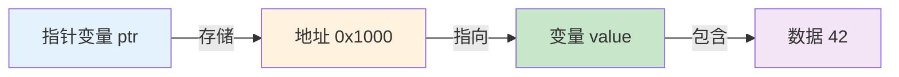
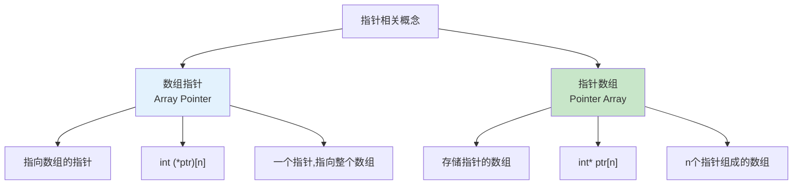
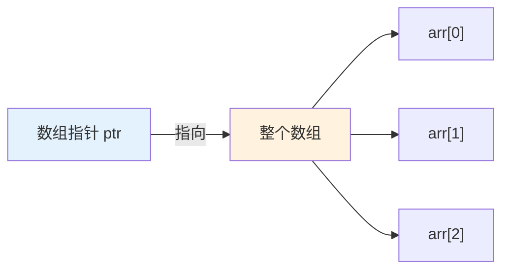
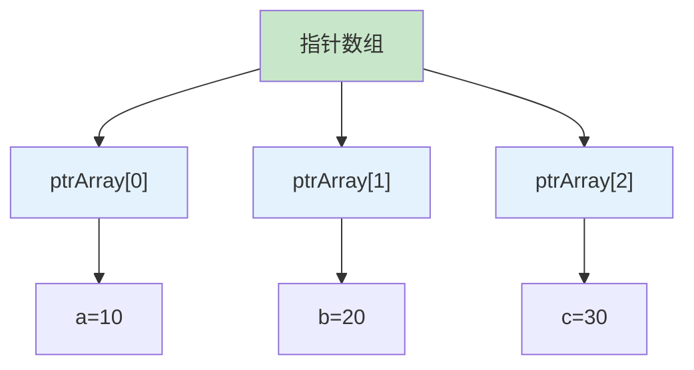
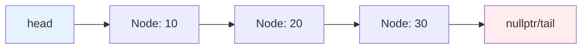

# 4.1 指针基础

## 目录
- [指针概念回顾](#指针概念回顾)
- [指针运算](#指针运算)
- [指针与数组](#指针与数组)
- [数组指针与指针数组](#数组指针与指针数组)
- [指针与函数](#指针与函数)
- [空指针与野指针](#空指针与野指针)
- [函数指针与指针函数](#函数指针与指针函数)

---

## 指针概念回顾

### 指针的本质

指针是一个变量，其值为另一个变量的地址。



### 基本指针操作回顾

```cpp
#include <iostream>

int main() {
    int value = 42;

    // 声明并初始化指针
    int* ptr = &value;

    // 解引用
    std::cout << "value的值: " << value << "\n";        // 42
    std::cout << "value的地址: " << &value << "\n";     // 例如: 0x7ffc...
    std::cout << "ptr存储的地址: " << ptr << "\n";      // 与&value相同
    std::cout << "*ptr的值: " << *ptr << "\n";          // 42

    // 通过指针修改值
    *ptr = 100;
    std::cout << "修改后value: " << value << "\n";      // 100

    return 0;
}
```

### 指针的大小

```cpp
#include <iostream>

int main() {
    int i = 10;
    double d = 3.14;
    char c = 'A';

    int* intPtr = &i;
    double* doublePtr = &d;
    char* charPtr = &c;

    // 所有指针的大小相同（在64位系统上是8字节）
    std::cout << "int* 大小: " << sizeof(intPtr) << " 字节\n";
    std::cout << "double* 大小: " << sizeof(doublePtr) << " 字节\n";
    std::cout << "char* 大小: " << sizeof(charPtr) << " 字节\n";

    // void* 可以指向任何类型
    void* voidPtr = &i;
    voidPtr = &d;
    voidPtr = &c;

    return 0;
}
```

---

## 指针运算

### 指针算术运算

```cpp
#include <iostream>

int main() {
    int arr[5] = {10, 20, 30, 40, 50};
    int* ptr = arr;  // 指向数组首元素

    std::cout << "初始位置: " << *ptr << "\n";     // 10

    // 指针加法
    ptr++;  // 移动到下一个int（4字节）
    std::cout << "ptr++后: " << *ptr << "\n";      // 20

    // 指针减法
    ptr--;
    std::cout << "ptr--后: " << *ptr << "\n";      // 10

    // 指针与整数相加
    ptr = ptr + 2;  // 前进2个int
    std::cout << "ptr + 2: " << *ptr << "\n";      // 30

    // 指针之间的差值
    int* ptr1 = &arr[0];
    int* ptr2 = &arr[4];
    std::cout << "指针差值: " << (ptr2 - ptr1) << "\n";  // 4

    return 0;
}
```

**指针运算示意图：**

```mermaid
graph LR
    A[arr[0]=10] -->|+1| B[arr[1]=20]
    B -->|+1| C[arr[2]=30]
    C -->|+1| D[arr[3]=40]
    D -->|+1| E[arr[4]=50]

    ptr1 -->|ptr2-ptr1=4| ptr2

    style A fill:#c8e6c9
    style E fill:#c8e6c9
```

### 指针比较

```cpp
#include <iostream>

int main() {
    int arr[5] = {10, 20, 30, 40, 50};
    int* ptr1 = &arr[0];
    int* ptr2 = &arr[4];

    // 指针比较
    std::cout << std::boolalpha;
    std::cout << "ptr1 < ptr2: " << (ptr1 < ptr2) << "\n";   // true
    std::cout << "ptr1 <= ptr2: " << (ptr1 <= ptr2) << "\n"; // true
    std::cout << "ptr1 == ptr2: " << (ptr1 == ptr2) << "\n"; // false
    std::cout << "ptr1 != ptr2: " << (ptr1 != ptr2) << "\n"; // true

    // 指针与nullptr比较
    int* nullPtr = nullptr;
    std::cout << "nullPtr == nullptr: " << (nullPtr == nullptr) << "\n"; // true

    return 0;
}
```

### 指针运算的实际应用

```cpp
#include <iostream>

void reverseArray(int* arr, size_t size) {
    int* start = arr;
    int* end = arr + size - 1;

    while (start < end) {
        // 交换
        int temp = *start;
        *start = *end;
        *end = temp;

        // 移动指针
        start++;
        end--;
    }
}

int main() {
    int arr[] = {1, 2, 3, 4, 5};
    size_t size = sizeof(arr) / sizeof(arr[0]);

    std::cout << "反转前:\n";
    for (size_t i = 0; i < size; i++) {
        std::cout << arr[i] << " ";
    }
    std::cout << "\n";

    reverseArray(arr, size);

    std::cout << "反转后:\n";
    for (size_t i = 0; i < size; i++) {
        std::cout << arr[i] << " ";
    }
    std::cout << "\n";

    return 0;
}
```

---

## 指针与数组

### 数组名与指针

```cpp
#include <iostream>

int main() {
    int arr[5] = {10, 20, 30, 40, 50};

    // 数组名在很多情况下退化为指向首元素的指针
    int* ptr = arr;

    std::cout << "arr[0]: " << arr[0] << "\n";    // 10
    std::cout << "*arr: " << *arr << "\n";          // 10
    std::cout << "*ptr: " << *ptr << "\n";          // 10

    // 但数组名不是指针
    std::cout << "sizeof(arr): " << sizeof(arr) << "\n";    // 20 (5 * 4)
    std::cout << "sizeof(ptr): " << sizeof(ptr) << "\n";    // 8 (指针大小)

    // arr++;  // ❌ 错误：数组名不能修改
    ptr++;     // ✅ 正确：指针可以修改
    std::cout << "ptr++后: " << *ptr << "\n";      // 20

    return 0;
}
```

### 遍历数组的不同方式

```cpp
#include <iostream>

int main() {
    int arr[5] = {10, 20, 30, 40, 50};

    // 方式1：数组下标
    std::cout << "数组下标:\n";
    for (int i = 0; i < 5; i++) {
        std::cout << arr[i] << " ";
    }
    std::cout << "\n";

    // 方式2：指针算术
    std::cout << "指针算术:\n";
    for (int* ptr = arr; ptr < arr + 5; ptr++) {
        std::cout << *ptr << " ";
    }
    std::cout << "\n";

    // 方式3：数组名作为指针
    std::cout << "数组名遍历:\n";
    for (int* p = arr; p != arr + 5; ++p) {
        std::cout << *p << " ";
    }
    std::cout << "\n";

    return 0;
}
```

### 多维数组与指针

```cpp
#include <iostream>

int main() {
    // 二维数组
    int matrix[2][3] = {
        {1, 2, 3},
        {4, 5, 6}
    };

    // 第一种理解：array of arrays
    std::cout << "matrix[0][1] = " << matrix[0][1] << "\n";  // 2

    // 指针视角
    int(*ptr1)[3] = matrix;  // 指向包含3个int的数组的指针
    std::cout << "*ptr1[1] = " << *(*ptr1 + 1) << "\n";    // 2

    // 扁平化视角
    int* ptr2 = &matrix[0][0];  // 指向第一个元素
    std::cout << "ptr2[1] = " << ptr2[1] << "\n";          // 2
    std::cout << "ptr2[4] = " << ptr2[4] << "\n";          // 5

    return 0;
}
```

## 数组指针与指针数组

这是一个非常重要且容易混淆的概念！



#### 数组指针（指向数组的指针）

```cpp
#include <iostream>

int main() {
    int arr[5] = {10, 20, 30, 40, 50};

    // 数组指针：指向包含5个int的数组的指针
    int (*ptrToArray)[5] = &arr;

    // 使用方式
    std::cout << "(*ptrToArray)[0] = " << (*ptrToArray)[0] << "\n";  // 10
    std::cout << "(*ptrToArray)[2] = " << (*ptrToArray)[2] << "\n";  // 30

    // 也可以这样访问
    std::cout << "*(*ptrToArray + 1) = " << *(*ptrToArray + 1) << "\n";  // 20

    // 常用于二维数组
    int matrix[2][3] = {
        {1, 2, 3},
        {4, 5, 6}
    };

    int (*ptrToRow)[3] = matrix;  // 指向第一行
    std::cout << "第一行第2个元素: " << (*ptrToRow)[1] << "\n";  // 2

    ptrToRow++;  // 移动到下一行
    std::cout << "第二行第3个元素: " << (*ptrToRow)[2] << "\n";  // 6

    return 0;
}
```

**数组指针示意图：**



#### 指针数组（存储指针的数组）

```cpp
#include <iostream>

int main() {
    int a = 10, b = 20, c = 30, d = 40, e = 50;

    // 指针数组：包含5个int指针的数组
    int* ptrArray[5];

    // 初始化指针数组
    ptrArray[0] = &a;
    ptrArray[1] = &b;
    ptrArray[2] = &c;
    ptrArray[3] = &d;
    ptrArray[4] = &e;

    // 访问
    std::cout << "*ptrArray[0] = " << *ptrArray[0] << "\n";  // 10
    std::cout << "*ptrArray[2] = " << *ptrArray[2] << "\n";  // 30

    // 遍历指针数组
    std::cout << "遍历指针数组:\n";
    for (int i = 0; i < 5; i++) {
        std::cout << "ptrArray[" << i << "] 指向的值: " << *ptrArray[i] << "\n";
    }

    return 0;
}
```

**指针数组示意图：**



#### 如何区分语法

```cpp
#include <iostream>

int main() {
    int arr[5] = {1, 2, 3, 4, 5};

    // 1. 数组指针
    // 声明：int (*ptr)[n]
    // 含义：ptr是一个指针，指向包含n个int的数组
    int (*arrayPointer)[5] = &arr;

    std::cout << "数组指针:\n";
    std::cout << "sizeof(arrayPointer) = " << sizeof(arrayPointer) << "\n";  // 8（指针大小）
    std::cout << "(*arrayPointer)[2] = " << (*arrayPointer)[2] << "\n";  // 3

    // 2. 指针数组
    // 声明：int *ptr[n]
    // 含义：ptr是一个数组，包含n个int指针
    int* pointerArray[5];

    int x = 10, y = 20, z = 30, w = 40, v = 50;
    pointerArray[0] = &x;
    pointerArray[1] = &y;
    pointerArray[2] = &z;
    pointerArray[3] = &w;
    pointerArray[4] = &v;

    std::cout << "\n指针数组:\n";
    std::cout << "sizeof(pointerArray) = " << sizeof(pointerArray) << "\n";  // 40（5个指针 * 8字节）

    // 3. 复杂示例对比
    int(*ptr1)[5];      // 数组指针
    int* ptr2[5];       // 指针数组
    int* (*ptr3)[5];     // 指向指针数组的指针

    std::cout << "\n大小对比:\n";
    std::cout << "数组指针大小: " << sizeof(ptr1) << "\n";       // 8
    std::cout << "指针数组大小: " << sizeof(ptr2) << "\n";       // 40

    return 0;
}
```

#### 辨别技巧：优先级规则

```cpp
#include <iostream>

int main() {
    // 规则：[] 的优先级高于 *
    // 所以：int *ptr[n] 会被解析为 (int *ptr)[n]

    // 想要改变优先级，使用括号
    // int (*ptr)[n]  * 先结合，表示指针

    std::cout << "声明解析:\n\n";

    // 情况1：数组指针
    int (*arrayPtr)[5];
    // 解析步骤：
    // 1. (*arrayPtr) - arrayPtr是指针
    // 2. [5] - 指向包含5个元素的数组
    // 3. int - 数组元素类型是int
    std::cout << "int (*arrayPtr)[5] -> 指向包含5个int的数组的指针\n";

    // 情况2：指针数组
    int* pointerArray[5];
    // 解析步骤：
    // 1. pointerArray[5] - 包含5个元素的数组
    // 2. int* - 每个元素是int指针
    std::cout << "int* pointerArray[5] -> 包含5个int指针的数组\n";

    // 情况3：函数指针数组
    int (*funcPtrArray[5])(int, int);
    // 解析步骤：
    // 1. funcPtrArray[5] - 包含5个元素的数组
    // 2. (*) - 每个元素是指针
    // 3. (int, int) - 指向的函数接受两个int参数
    // 4. int - 返回int类型
    std::cout << "int (*funcPtrArray[5])(int, int) -> 函数指针数组\n";

    return 0;
}
```

#### 实际应用示例

```cpp
#include <iostream>

// 应用1：指针数组 - 字符串列表
int main() {
    const char* fruitNames[5] = {
        "Apple",
        "Banana",
        "Orange",
        "Grape",
        "Mango"
    };

    std::cout << "水果列表:\n";
    for (int i = 0; i < 5; i++) {
        std::cout << fruitNames[i] << "\n";
    }

    return 0;
}

// 应用2：数组指针 - 处理矩阵行
void processRow(int (*rowPtr)[3], int cols) {
    for (int j = 0; j < cols; j++) {
        std::cout << (*rowPtr)[j] << " ";
    }
    std::cout << "\n";
}

int main2() {
    int matrix[2][3] = {
        {1, 2, 3},
        {4, 5, 6}
    };

    for (int i = 0; i < 2; i++) {
        std::cout << "第" << i << "行: ";
        processRow(&matrix[i], 3);
    }

    return 0;
}
```

### 对比总结表

| 特性 | 数组指针 | 指针数组 |
|------|----------|----------|
| 声明 | `int (*ptr)[n]` | `int *ptr[n]` |
| 本质 | 指针（指向数组） | 数组（存储指针） |
| 大小 | 指针大小（8字节） | n × 指针大小 |
| 用途 | 二维数组、矩阵行 | 字符串列表、动态对象 |
| 优先级 | `()`改变优先级 | `[]`优先级高 |

---

## 指针与函数

### 指针作为函数参数

```cpp
#include <iostream>

// 值传递：不修改原值
void passByValue(int x) {
    x = 100;
    std::cout << "函数内: x = " << x << "\n";
}

// 指针传递：可以修改原值
void passByPointer(int* x) {
    if (x != nullptr) {
        *x = 100;
        std::cout << "函数内: *x = " << *x << "\n";
    }
}

int main() {
    int value = 10;

    std::cout << "调用前: value = " << value << "\n";  // 10

    passByValue(value);
    std::cout << "passByValue后: value = " << value << "\n";  // 10

    passByPointer(&value);
    std::cout << "passByPointer后: value = " << value << "\n";  // 100

    return 0;
}
```

### 返回指针

```cpp
#include <iostream>

int* createInt(int value) {
    int* ptr = new int(value);
    return ptr;  // 返回动态分配的指针
}

int* getBadPointer() {
    int local = 100;
    return &local;  // ❌ 危险：返回局部变量的地址
}

int* getArrayElement(int* arr, size_t index) {
    return &arr[index];  // ✅ 安全：返回数组元素的地址
}

int main() {
    // 动态分配
    int* ptr = createInt(42);
    std::cout << "*ptr = " << *ptr << "\n";
    delete ptr;

    // 数组元素
    int arr[5] = {1, 2, 3, 4, 5};
    int* elem = getArrayElement(arr, 2);
    std::cout << "*elem = " << *elem << "\n";  // 3

    return 0;
}
```

### 函数指针（回顾）

```cpp
#include <iostream>

int add(int a, int b) {
    return a + b;
}

int subtract(int a, int b) {
    return a - b;
}

// 接受函数指针的函数
int compute(int (*operation)(int, int), int x, int y) {
    return operation(x, y);
}

int main() {
    // 函数指针
    int (*funcPtr)(int, int) = add;

    std::cout << "funcPtr(3, 5) = " << funcPtr(3, 5) << "\n";  // 8

    // 作为参数传递
    std::cout << "compute(add, 10, 20) = " << compute(add, 10, 20) << "\n";  // 30
    std::cout << "compute(subtract, 10, 20) = " << compute(subtract, 10, 20) << "\n";  // -10

    return 0;
}
```

---

## 空指针与野指针

### 空指针

```cpp
#include <iostream>

int main() {
    // C++11推荐的方式
    int* ptr1 = nullptr;

    // C风格（不推荐）
    int* ptr2 = NULL;
    int* ptr3 = 0;

    // 使用前检查
    if (ptr1 != nullptr) {
        *ptr1 = 10;
    } else {
        std::cout << "ptr1是空指针\n";
    }

    // 安全删除
    int* ptr4 = new int(100);
    delete ptr4;
    ptr4 = nullptr;  // 删除后置空

    // delete ptr4;  // 再次删除是安全的（nullptr）
    // delete ptr4;

    return 0;
}
```

### 野指针

```cpp
#include <iostream>

int main() {
    // 情况1：未初始化的指针
    int* wildPtr1;  // ⚠️ 危险：包含随机地址
    // *wildPtr1 = 10;  // 未定义行为

    // 情况2：已释放的指针
    int* ptr = new int(100);
    delete ptr;
    // ptr现在是野指针
    // *ptr = 200;  // ⚠️ 未定义行为

    // 情况3：指向已释放的栈变量
    int* wildPtr2;
    {
        int local = 50;
        wildPtr2 = &local;
    }
    // local已被销毁
    // *wildPtr2 = 30;  // ⚠️ 未定义行为

    // 正确做法：始终初始化指针
    int* safePtr = nullptr;

    safePtr = new int(42);
    if (safePtr != nullptr) {
        *safePtr = 100;
    }
    delete safePtr;
    safePtr = nullptr;

    return 0;
}
```

### 避免野指针的最佳实践

```cpp
#include <iostream>

class SafePointer {
private:
    int* ptr;

public:
    SafePointer(int* p = nullptr) : ptr(p) {
        std::cout << "构造\n";
    }

    ~SafePointer() {
        std::cout << "析构\n";
        delete ptr;
    }

    // 禁用拷贝
    SafePointer(const SafePointer&) = delete;
    SafePointer& operator=(const SafePointer&) = delete;

    int& operator*() {
        if (ptr == nullptr) {
            throw std::runtime_error("解引用空指针");
        }
        return *ptr;
    }

    int* operator->() {
        return ptr;
    }

    explicit operator bool() const {
        return ptr != nullptr;
    }
};

int main() {
    SafePointer sp(new int(42));

    if (sp) {
        *sp = 100;
        std::cout << "*sp = " << *sp << "\n";
    }

    return 0;
}
```

---

## 函数指针与指针函数

### 函数指针

```cpp
#include <iostream>

int add(int a, int b) {
    return a + b;
}

int main() {
    // 声明函数指针
    int (*funcPtr)(int, int);

    // 指向函数
    funcPtr = add;

    // 调用
    int result = funcPtr(10, 20);
    std::cout << "10 + 20 = " << result << "\n";

    // 函数指针数组
    int (*operations[2])(int, int);
    operations[0] = add;
    operations[1] = [](int a, int b) { return a - b; };  // lambda

    std::cout << "operations[0](5, 3) = " << operations[0](5, 3) << "\n";  // 8
    std::cout << "operations[1](5, 3) = " << operations[1](5, 3) << "\n";  // 2

    return 0;
}
```

### 指针函数（返回指针的函数）

```cpp
#include <iostream>

// 指针函数：返回指针的函数
int* createInt(int value) {
    int* ptr = new int(value);
    return ptr;
}

const int* findMax(const int* arr, size_t size) {
    if (size == 0) return nullptr;

    const int* maxPtr = &arr[0];
    for (size_t i = 1; i < size; i++) {
        if (arr[i] > *maxPtr) {
            maxPtr = &arr[i];
        }
    }
    return maxPtr;
}

int main() {
    // 使用指针函数
    int* ptr = createInt(42);
    std::cout << "*ptr = " << *ptr << "\n";

    // 查找最大值
    int arr[] = {3, 1, 4, 1, 5, 9};
    const int* maxPtr = findMax(arr, 6);
    if (maxPtr != nullptr) {
        std::cout << "最大值: " << *maxPtr << "\n";
    }

    delete ptr;

    return 0;
}
```

### 指针的指针

```cpp
#include <iostream>

void allocateMemory(int** ptr, int value) {
    *ptr = new int(value);
}

int main() {
    int* ptr = nullptr;

    // 传递指针的地址
    allocateMemory(&ptr, 42);

    std::cout << "*ptr = " << *ptr << "\n";

    delete ptr;

    return 0;
}
```

---

## 指针基础综合示例

### 示例：链表节点

```cpp
#include <iostream>

struct Node {
    int data;
    Node* next;

    Node(int value) : data(value), next(nullptr) {}
};

class LinkedList {
private:
    Node* head;
    Node* tail;

public:
    LinkedList() : head(nullptr), tail(nullptr) {}

    ~LinkedList() {
        Node* current = head;
        while (current != nullptr) {
            Node* next = current->next;
            delete current;
            current = next;
        }
    }

    void append(int value) {
        Node* newNode = new Node(value);

        if (head == nullptr) {
            head = tail = newNode;
        } else {
            tail->next = newNode;
            tail = newNode;
        }
    }

    void display() const {
        Node* current = head;
        while (current != nullptr) {
            std::cout << current->data << " -> ";
            current = current->next;
        }
        std::cout << "nullptr\n";
    }

    bool find(int value) const {
        Node* current = head;
        while (current != nullptr) {
            if (current->data == value) {
                return true;
            }
            current = current->next;
        }
        return false;
    }
};

int main() {
    LinkedList list;

    list.append(10);
    list.append(20);
    list.append(30);

    std::cout << "链表内容: ";
    list.display();

    std::cout << "查找20: " << (list.find(20) ? "找到" : "未找到") << "\n";
    std::cout << "查找40: " << (list.find(40) ? "找到" : "未找到") << "\n";

    return 0;
}
```

**链表结构示意图：**



---

## 小结

本节深入介绍了C++指针的基础知识：

1. **指针概念回顾**：
   - 指针存储地址
   - 解引用操作
   - 指针大小

2. **指针运算**：
   - 指针算术（++、--、+、-）
   - 指针比较
   - 实际应用（数组反转等）

3. **指针与数组**：
   - 数组名退化为指针
   - 多维数组与指针
   - 不同遍历方式

4. **数组指针与指针数组**：
   - 数组指针：`int (*ptr)[n]` 指向数组
   - 指针数组：`int* ptr[n]` 存储指针
   - 优先级规则和辨别技巧
   - 实际应用场景

5. **指针与函数**：
   - 指针作为参数
   - 返回指针
   - 函数指针

6. **空指针与野指针**：
   - nullptr的使用
   - 野指针的来源和避免
   - 安全的指针管理

7. **函数指针与指针函数**：
   - 函数指针的声明和使用
   - 返回指针的函数
   - 指针的指针

## 最佳实践

1. ✅ 始终初始化指针（推荐nullptr）
2. ✅ 使用前检查空指针
3. ✅ delete后置空指针
4. ✅ 避免返回局部变量的地址
5. ✅ 使用智能指针（下一节）

## 练习

1. ✅ 使用指针实现字符串反转
2. ✅ 编写安全的指针包装类
3. ✅ 实现链表的插入和删除
4. ✅ 使用函数指针实现回调机制

---

## 下一节
[4.2 动态内存管理](./4.2-动态内存管理.md) → 学习new/delete运算符和RAII原则。
