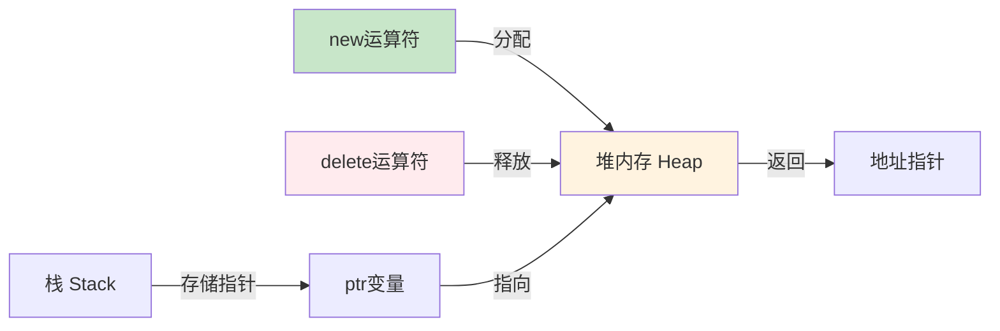
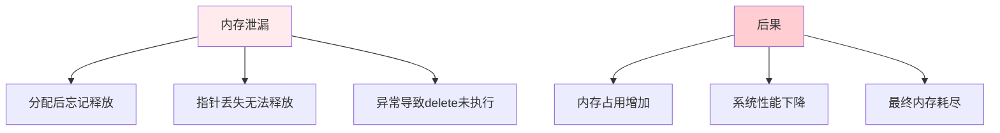
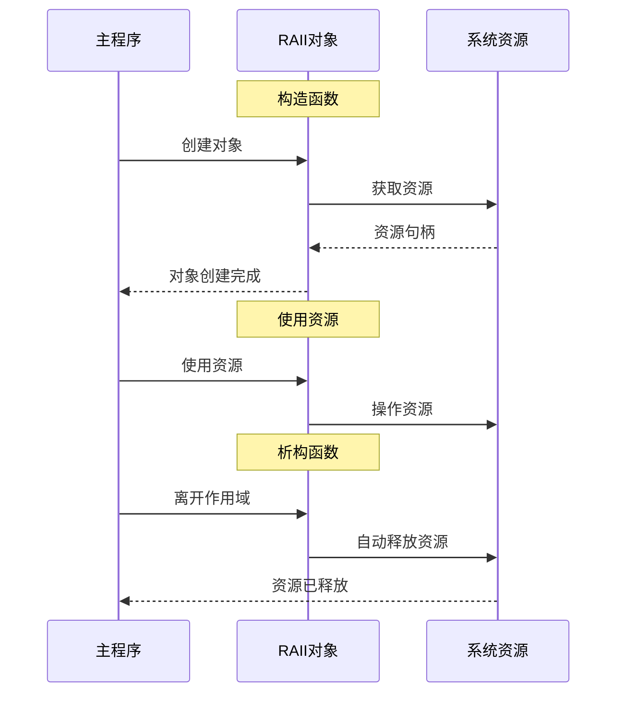

# 4.2 动态内存管理

## 目录
- [new与delete运算符](#new与delete运算符)
- [动态数组](#动态数组)
- [内存泄漏与检测](#内存泄漏与检测)
- [RAII原则](#raii原则)

---

## new与delete运算符

### 基本用法

```cpp
#include <iostream>

int main() {
    // 动态分配单个变量
    int* ptr = new int;        // 分配内存
    *ptr = 100;               // 使用
    std::cout << "*ptr = " << *ptr << "\n";
    delete ptr;                // 释放内存
    ptr = nullptr;             // 置空，避免野指针

    // 分配并初始化
    int* ptr2 = new int(200);  // C++11: 初始化为200
    std::cout << "*ptr2 = " << *ptr2 << "\n";
    delete ptr2;

    // C++11列表初始化
    int* ptr3 = new int{300};
    std::cout << "*ptr3 = " << *ptr3 << "\n";
    delete ptr3;

    return 0;
}
```

**动态内存分配示意图：**



### new/delete vs malloc/free

```cpp
#include <iostream>
#include <cstdlib>

class MyClass {
private:
    int value;

public:
    MyClass(int v) : value(v) {
        std::cout << "构造函数调用\n";
    }

    ~MyClass() {
        std::cout << "析构函数调用\n";
    }

    void display() {
        std::cout << "value = " << value << "\n";
    }
};

int main() {
    std::cout << "=== C++方式 (new/delete) ===\n";
    MyClass* obj1 = new MyClass(100);  // 调用构造函数
    obj1->display();
    delete obj1;                     // 调用析构函数

    std::cout << "\n=== C方式 (malloc/free) ===\n";
    MyClass* obj2 = (MyClass*)malloc(sizeof(MyClass));
    // 不调用构造函数
    new(obj2) MyClass(200);           // placement new
    obj2->display();
    obj2->~MyClass();                 // 手动调用析构函数
    free(obj2);

    return 0;
}
```

**对比表：**

| 特性 | new/delete | malloc/free |
|------|-----------|-------------|
| 类型安全 | ✅ 是 | ❌ 否 |
| 构造/析构 | ✅ 自动调用 | ❌ 手动处理 |
| 大小计算 | ✅ 自动 | ❌ 手动sizeof |
| 头文件 | ✅ 不需要 | ❌ 需要cstdlib |
| 内存初始化 | ✅ 可以初始化 | ❌ 内容不确定 |
| 失败处理 | ✅ 抛出bad_alloc | ❌ 返回nullptr |
| 重载 | ✅ 可重载 | ❌ 不可重载 |

### new的异常处理

```cpp
#include <iostream>
#include <new>      // std::bad_alloc
#include <stdexcept>

int main() {
    try {
        // 尝试分配非常大的内存
        int* ptr = new int[1000000000000];
        delete[] ptr;
    }
    catch (const std::bad_alloc& e) {
        std::cout << "内存分配失败: " << e.what() << "\n";
    }

    //nothrow版本：失败返回nullptr
    int* ptr2 = new (std::nothrow) int[1000000000000];
    if (ptr2 == nullptr) {
        std::cout << "内存分配失败（nothrow）\n";
    }

    return 0;
}
```

---

## 动态数组

### 一维动态数组

```cpp
#include <iostream>

int main() {
    // 动态分配数组
    size_t size = 5;
    int* arr = new int[size];

    // 初始化
    for (size_t i = 0; i < size; i++) {
        arr[i] = static_cast<int>(i * 10);
    }

    // 访问
    std::cout << "数组元素:\n";
    for (size_t i = 0; i < size; i++) {
        std::cout << "arr[" << i << "] = " << arr[i] << "\n";
    }

    // 释放
    delete[] arr;  // 注意使用delete[]
    arr = nullptr;

    return 0;
}
```

### 动态数组的封装

```cpp
#include <iostream>
#include <stdexcept>

class DynamicArray {
private:
    int* data;
    size_t size;

public:
    // 构造函数
    DynamicArray(size_t s) : size(s) {
        if (s > 0) {
            data = new int[s];
        } else {
            data = nullptr;
        }
        std::cout << "构造: 分配" << size << "个int\n";
    }

    // 析构函数
    ~DynamicArray() {
        delete[] data;
        std::cout << "析构: 释放内存\n";
    }

    // 禁用拷贝（避免浅拷贝问题）
    DynamicArray(const DynamicArray&) = delete;
    DynamicArray& operator=(const DynamicArray&) = delete;

    // 访问元素（带边界检查）
    int& at(size_t index) {
        if (index >= size) {
            throw std::out_of_range("索引越界");
        }
        return data[index];
    }

    const int& at(size_t index) const {
        if (index >= size) {
            throw std::out_of_range("索引越界");
        }
        return data[index];
    }

    // 下标运算符
    int& operator[](size_t index) {
        return data[index];
    }

    const int& operator[](size_t index) const {
        return data[index];
    }

    size_t getSize() const {
        return size;
    }

    void display() const {
        for (size_t i = 0; i < size; i++) {
            std::cout << data[i] << " ";
        }
        std::cout << "\n";
    }
};

int main() {
    DynamicArray arr(5);

    for (size_t i = 0; i < arr.getSize(); i++) {
        arr[i] = static_cast<int>(i * 10);
    }

    arr.display();

    try {
        arr.at(10);  // 越界检查
    } catch (const std::exception& e) {
        std::cout << "错误: " << e.what() << "\n";
    }

    return 0;
}
```

### 二维动态数组

```cpp
#include <iostream>

int main() {
    // 方法1：指针数组（不连续）
    size_t rows = 3, cols = 4;

    // 分配行指针
    int** matrix = new int*[rows];

    // 为每行分配列
    for (size_t i = 0; i < rows; i++) {
        matrix[i] = new int[cols];
    }

    // 初始化
    int count = 1;
    for (size_t i = 0; i < rows; i++) {
        for (size_t j = 0; j < cols; j++) {
            matrix[i][j] = count++;
        }
    }

    // 访问
    std::cout << "matrix[1][2] = " << matrix[1][2] << "\n";

    // 释放（先释放列，再释放行）
    for (size_t i = 0; i < rows; i++) {
        delete[] matrix[i];
    }
    delete[] matrix;

    // 方法2：一维数组模拟（连续内存）
    int* matrix2 = new int[rows * cols];

    // 访问matrix2[i][j] 等价于 matrix2[i * cols + j]
    matrix2[1 * cols + 2] = 100;  // matrix2[1][2] = 100
    std::cout << "matrix2[1][2] = " << matrix2[1 * cols + 2] << "\n";

    delete[] matrix2;

    return 0;
}
```

**二维数组内存布局：**

```mermaid
graph TD
    subgraph 指针数组方式
    A1[matrix[0]] --> B1[列0<br/>列1<br/>列2<br/>列3]
    A2[matrix[1]] --> B2[列0<br/>列1<br/>列2<br/>列3]
    A3[matrix[2]] --> B3[列0<br/>列1<br/>列2<br/>列3]
    end

    subgraph 连续内存方式
    C[matrix2<br/>连续内存]
    C --> D["行0: 0,1,2,3"]
    C --> E["行1: 4,5,6,7"]
    C --> F["行2: 8,9,10,11"]
    end

    style A1 fill:#e3f2fd
    style A2 fill:#e3f2fd
    style A3 fill:#e3f2fd
    style C fill:#c8e6c9
```

---

## 内存泄漏与检测

### 什么是内存泄漏

```cpp
#include <iostream>

// ❌ 内存泄漏示例
void memoryLeak() {
    int* ptr = new int(100);
    // 忘记delete，导致内存泄漏
    // 当函数返回时，ptr销毁，但堆内存未释放
}

// ✅ 正确做法
void noLeak() {
    int* ptr = new int(100);
    delete ptr;  // 释放内存
    ptr = nullptr;
}

int main() {
    noLeak();
    return 0;
}
```

**内存泄漏示意图：**



### 常见内存泄漏场景

```cpp
#include <iostream>

class LeakyClass {
private:
    int* data;

public:
    LeakyClass(int size) {
        data = new int[size];  // 分配内存
    }

    // ❌ 忘记释放内存
    /*
    ~LeakyClass() {
        delete[] data;
    }
    */
};

class SafeClass {
private:
    int* data;

public:
    SafeClass(int size) : data(new int[size]) {
        std::cout << "SafeClass构造\n";
    }

    // ✅ 正确释放
    ~SafeClass() {
        delete[] data;
        std::cout << "SafeClass析构\n";
    }
};

void leakExample() {
    LeakyClass obj(100);  // 泄漏！析构函数未释放data
}

int main() {
    SafeClass obj(100);  // 安全
    return 0;
}
```

### 检测内存泄漏

```cpp
#include <iostream>

class ResourceTracker {
private:
    static int allocationCount;
    int id;

public:
    ResourceTracker() : id(++allocationCount) {
        std::cout << "分配资源 #" << id << "\n";
    }

    ~ResourceTracker() {
        std::cout << "释放资源 #" << id << "\n";
    }

    static int getCount() {
        return allocationCount;
    }
};

int ResourceTracker::allocationCount = 0;

int main() {
    std::cout << "开始: " << ResourceTracker::getCount() << " 个资源\n";

    {
        ResourceTracker r1;
        ResourceTracker r2;
        ResourceTracker* r3 = new ResourceTracker();

        std::cout << "中间: " << ResourceTracker::getCount() << " 个资源\n";

        delete r3;  // 手动释放
    }

    std::cout << "结束: " << ResourceTracker::getCount() << " 个资源\n";

    return 0;
}
```

---

## RAII原则

### RAII的概念

RAII (Resource Acquisition Is Initialization) 资源获取即初始化：资源的生命周期与对象的生命周期绑定。



### RAII实现示例

```cpp
#include <iostream>
#include <fstream>
#include <stdexcept>

class FileHandler {
private:
    std::ofstream file;
    std::string filename;

public:
    // 构造函数：获取资源（打开文件）
    FileHandler(const std::string& name) : filename(name) {
        file.open(filename);
        if (!file.is_open()) {
            throw std::runtime_error("无法打开文件: " + filename);
        }
        std::cout << "文件打开: " << filename << "\n";
    }

    // 析构函数：自动释放资源（关闭文件）
    ~FileHandler() {
        if (file.is_open()) {
            file.close();
            std::cout << "文件关闭: " << filename << "\n";
        }
    }

    // 写入
    void write(const std::string& content) {
        file << content << "\n";
    }

    // 禁用拷贝
    FileHandler(const FileHandler&) = delete;
    FileHandler& operator=(const FileHandler&) = delete;
};

void processData() {
    // 即使发生异常，文件也会正确关闭
    FileHandler fh("output.txt");

    fh.write("数据行1");
    fh.write("数据行2");

    // 模拟异常
    // throw std::runtime_error("处理错误");

    // 离开作用域时自动调用析构函数
}

int main() {
    try {
        processData();
    } catch (const std::exception& e) {
        std::cout << "错误: " << e.what() << "\n";
    }

    return 0;
}
```

### RAII封装动态数组

```cpp
#include <iostream>
#include <stdexcept>

class SafeArray {
private:
    int* data;
    size_t size;

public:
    // 构造函数：获取资源
    explicit SafeArray(size_t s) : size(s) {
        if (s == 0) {
            throw std::invalid_argument("数组大小不能为0");
        }
        data = new int[s];
        std::cout << "分配 " << s << " 个int\n";
    }

    // 析构函数：释放资源
    ~SafeArray() {
        delete[] data;
        std::cout << "释放内存\n";
    }

    // 拷贝构造函数（深拷贝）
    SafeArray(const SafeArray& other) : size(other.size) {
        data = new int[size];
        for (size_t i = 0; i < size; i++) {
            data[i] = other.data[i];
        }
        std::cout << "拷贝构造\n";
    }

    // 拷贝赋值运算符
    SafeArray& operator=(const SafeArray& other) {
        if (this != &other) {
            delete[] data;  // 释放旧资源

            size = other.size;
            data = new int[size];  // 获取新资源
            for (size_t i = 0; i < size; i++) {
                data[i] = other.data[i];
            }
        }
        return *this;
    }

    // 移动构造函数（C++11）
    SafeArray(SafeArray&& other) noexcept
        : data(other.data), size(other.size) {
        other.data = nullptr;
        other.size = 0;
        std::cout << "移动构造\n";
    }

    // 移动赋值运算符（C++11）
    SafeArray& operator=(SafeArray&& other) noexcept {
        if (this != &other) {
            delete[] data;

            data = other.data;
            size = other.size;

            other.data = nullptr;
            other.size = 0;
        }
        return *this;
    }

    int& operator[](size_t index) {
        if (index >= size) {
            throw std::out_of_range("索引越界");
        }
        return data[index];
    }

    void display() const {
        for (size_t i = 0; i < size; i++) {
            std::cout << data[i] << " ";
        }
        std::cout << "\n";
    }
};

SafeArray createArray() {
    SafeArray arr(5);
    for (size_t i = 0; i < 5; i++) {
        arr[i] = static_cast<int>(i * 10);
    }
    return arr;  // 移动语义，无拷贝
}

int main() {
    // RAII：自动管理内存
    SafeArray arr1(5);
    for (size_t i = 0; i < 5; i++) {
        arr1[i] = static_cast<int>(i * 10);
    }

    std::cout << "arr1: ";
    arr1.display();

    // 移动语义
    SafeArray arr2 = createArray();  // 高效移动
    std::cout << "arr2: ";
    arr2.display();

    return 0;
}
```

### RAII的优势

```cpp
#include <iostream>
#include <exception>

// ❌ 传统方式：容易出错
void traditionalWay() {
    int* ptr = new int(100);

    try {
        // 做一些可能抛出异常的操作
        if (true) {
            throw std::runtime_error("发生错误");
        }
        delete ptr;  // 可能不会执行
    }
    catch (...) {
        delete ptr;  // 需要手动清理
        throw;
    }
}

// ✅ RAII方式：自动管理
class IntWrapper {
private:
    int* ptr;

public:
    IntWrapper(int value) : ptr(new int(value)) {
        std::cout << "分配内存\n";
    }

    ~IntWrapper() {
        delete ptr;
        std::cout << "释放内存\n";
    }

    int& get() {
        return *ptr;
    }
};

void raiiWay() {
    IntWrapper wrapper(100);

    // 做一些可能抛出异常的操作
    if (true) {
        throw std::runtime_error("发生错误");
    }

    // 离开作用域时自动释放
}

int main() {
    std::cout << "=== 传统方式 ===\n";
    try {
        traditionalWay();
    } catch (...) {
        std::cout << "捕获异常\n";
    }

    std::cout << "\n=== RAII方式 ===\n";
    try {
        raiiWay();
    } catch (...) {
        std::cout << "捕获异常，内存已自动释放\n";
    }

    return 0;
}
```

**RAII vs 传统方式对比：**

| 特性 | 传统方式 | RAII方式 |
|------|----------|----------|
| 资源释放 | 手动delete | 析构函数自动 |
| 异常安全 | 容易忘记 | 保证释放 |
| 代码清晰 | 需要try-catch | 代码简洁 |
| 拷贝语义 | 需要深拷贝 | 可用移动语义 |
| 推荐程度 | ⚠️ 不推荐 | ✅ 强烈推荐 |

---

## 动态内存管理综合示例

### 示例：智能的字符串类

```cpp
#include <iostream>
#include <cstring>
#include <algorithm>

class MyString {
private:
    char* data;
    size_t length;

public:
    // 构造函数
    MyString(const char* str = "") {
        if (str) {
            length = strlen(str);
            data = new char[length + 1];
            strcpy(data, str);
        } else {
            length = 0;
            data = new char[1];
            data[0] = '\0';
        }
        std::cout << "构造: \"" << data << "\"\n";
    }

    // 拷贝构造（深拷贝）
    MyString(const MyString& other) : length(other.length) {
        data = new char[length + 1];
        strcpy(data, other.data);
        std::cout << "拷贝构造: \"" << data << "\"\n";
    }

    // 拷贝赋值
    MyString& operator=(const MyString& other) {
        if (this != &other) {
            delete[] data;  // 释放旧内存

            length = other.length;
            data = new char[length + 1];
            strcpy(data, other.data);

            std::cout << "拷贝赋值: \"" << data << "\"\n";
        }
        return *this;
    }

    // 移动构造（C++11）
    MyString(MyString&& other) noexcept
        : data(other.data), length(other.length) {
        other.data = nullptr;
        other.length = 0;
        std::cout << "移动构造\n";
    }

    // 移动赋值（C++11）
    MyString& operator=(MyString&& other) noexcept {
        if (this != &other) {
            delete[] data;

            data = other.data;
            length = other.length;

            other.data = nullptr;
            other.length = 0;
            std::cout << "移动赋值\n";
        }
        return *this;
    }

    // 析构函数
    ~MyString() {
        if (data) {
            std::cout << "析构: \"" << data << "\"\n";
        } else {
            std::cout << "析构: 空字符串\n";
        }
        delete[] data;
    }

    // 追加
    void append(const char* str) {
        size_t newLength = length + strlen(str);
        char* newData = new char[newLength + 1];
        strcpy(newData, data);
        strcat(newData, str);

        delete[] data;
        data = newData;
        length = newLength;
    }

    void display() const {
        std::cout << "字符串: \"" << data << "\" (长度: " << length << ")\n";
    }
};

MyString createString() {
    MyString temp("临时字符串");
    return temp;  // 移动语义
}

int main() {
    std::cout << "=== 创建s1 ===\n";
    MyString s1("Hello");
    s1.display();

    std::cout << "\n=== 拷贝s2 ===\n";
    MyString s2 = s1;  // 拷贝构造
    s2.display();

    std::cout << "\n=== 移动s3 ===\n";
    MyString s3 = createString();  // 移动构造
    s3.display();

    std::cout << "\n=== 程序结束 ===\n";
    return 0;
}
```

---

## 小结

本节介绍了C++的动态内存管理：

1. **new与delete运算符**：
   - 基本用法
   - 与malloc/free的区别
   - 异常处理

2. **动态数组**：
   - 一维动态数组
   - 二维动态数组
   - 封装动态数组类

3. **内存泄漏与检测**：
   - 内存泄漏的原因
   - 常见泄漏场景
   - 检测方法

4. **RAII原则**：
   - 资源获取即初始化
   - 自动管理资源生命周期
   - 异常安全
   - 智能指针的基础

## 最佳实践

1. ✅ 使用new/delete而非malloc/free
2. ✅ 配对使用new和delete
3. ✅ 使用RAII管理资源
4. ✅ 遵循三/五法则
5. ✅ 优先使用智能指针（下一节）

## 练习

1. ✅ 实现一个动态数组类
2. ✅ 使用RAII封装文件操作
3. ✅ 编写内存泄漏检测代码
4. ✅ 实现移动语义优化性能

---

## 下一节
[4.3 智能指针（C++11）](./4.3-智能指针（C++11）.md) → 学习unique_ptr、shared_ptr和weak_ptr。
