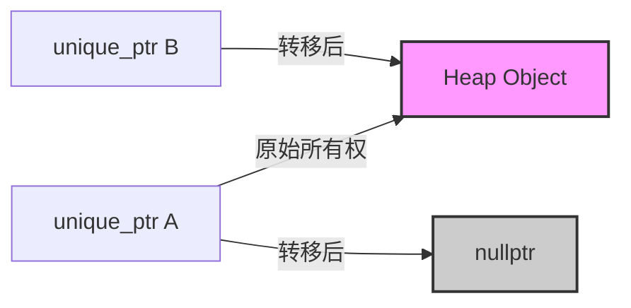
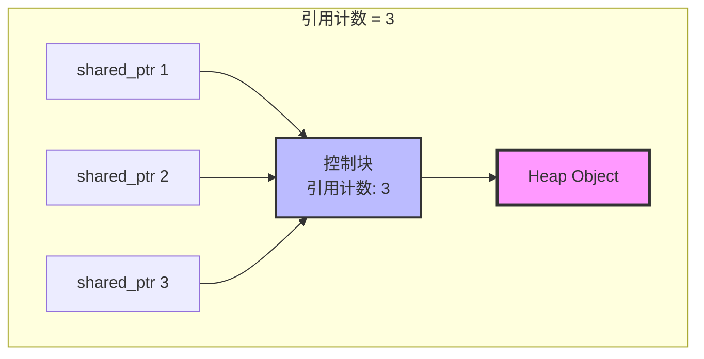
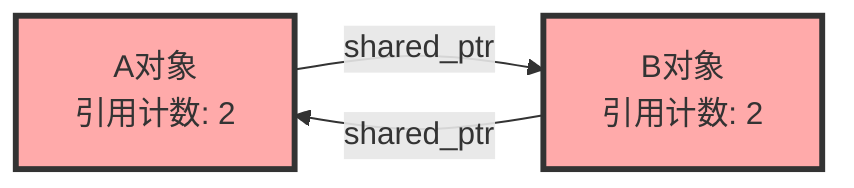
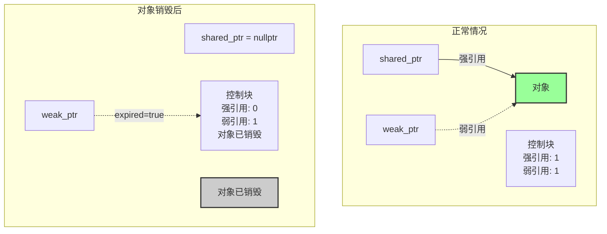
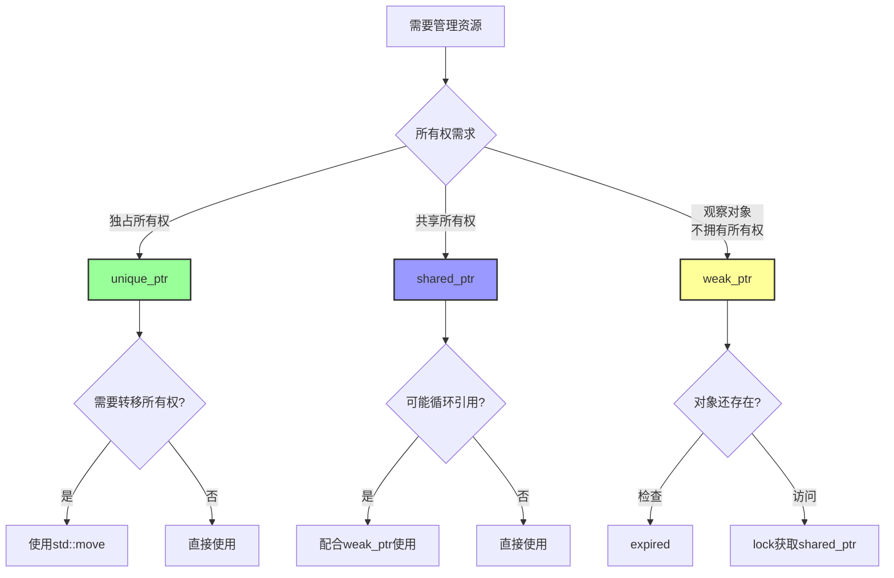

# 4.3 智能指针（C++11）

> 现代C++的内存管理利器，让资源管理自动化、安全化

## 目录

- [unique_ptr：独占所有权](#unique_ptr独占所有权)
- [shared_ptr：共享所有权](#shared_ptr共享所有权)
- [weak_ptr：弱引用](#weak_ptr弱引用)
- [自定义删除器](#自定义删除器)
- [智能指针最佳实践](#智能指针最佳实践)
- [常见陷阱与注意事项](#常见陷阱与注意事项)
- [本节小结](#本节小结)

---

## unique_ptr：独占所有权

### 基本概念

`unique_ptr` 独占所管理对象的所有权，同一时间只能有一个 `unique_ptr` 指向对象。当 `unique_ptr` 被销毁时，它所指向的对象也会被自动删除。

```cpp
#include <memory>
#include <iostream>

class Widget {
public:
    Widget() { std::cout << "Widget构造\n"; }
    ~Widget() { std::cout << "Widget析构\n"; }
    void doSomething() { std::cout << "Widget工作\n"; }
};

void uniquePtrBasic() {
    // 创建unique_ptr
    std::unique_ptr<Widget> ptr1(new Widget());
    ptr1->doSomething();

    // 使用make_unique（C++14推荐）
    auto ptr2 = std::make_unique<Widget>();
    ptr2->doSomething();

    // 所有权转移
    std::unique_ptr<Widget> ptr3 = std::move(ptr1);
    // ptr1现在为nullptr

} // ptr2, ptr3在此处自动析构，释放Widget对象
```

### 所有权转移机制



```cpp
void ownershipTransfer() {
    std::unique_ptr<int> ptr1 = std::make_unique<int>(42);
    std::cout << "ptr1: " << *ptr1 << "\n";

    // 转移所有权
    std::unique_ptr<int> ptr2 = std::move(ptr1);

    // ptr1现在为空，不能再使用
    if (!ptr1) {
        std::cout << "ptr1已释放所有权\n";
    }

    std::cout << "ptr2: " << *ptr2 << "\n";

    // 函数返回unique_ptr
    auto ptr3 = createUnique();
    std::cout << "ptr3: " << *ptr3 << "\n";
}

std::unique_ptr<int> createUnique() {
    return std::make_unique<int>(100);
}
```

### unique_ptr与数组

```cpp
void uniquePtrWithArray() {
    // 管理动态数组
    std::unique_ptr<int[]> arr(new int[5]{1, 2, 3, 4, 5});

    for (int i = 0; i < 5; ++i) {
        std::cout << arr[i] << " ";
    }
    std::cout << "\n";

    // 使用vector替代（推荐）
    std::vector<int> vec = {1, 2, 3, 4, 5};

    // make_unique创建数组（C++20）
    #if __cplusplus >= 202002L
        auto arr2 = std::make_unique<int[]>(5);
    #endif
}
```

### 实际应用示例

```cpp
#include <fstream>
#include <memory>

class FileHandler {
private:
    std::unique_ptr<std::ofstream> file;

public:
    explicit FileHandler(const std::string& filename)
        : file(std::make_unique<std::ofstream>(filename)) {
        if (!file->is_open()) {
            throw std::runtime_error("无法打开文件");
        }
    }

    void write(const std::string& content) {
        *file << content;
    }

    // 析构函数自动关闭文件
    ~FileHandler() = default;

    // 禁止拷贝
    FileHandler(const FileHandler&) = delete;
    FileHandler& operator=(const FileHandler&) = delete;

    // 允许移动
    FileHandler(FileHandler&&) = default;
    FileHandler& operator=(FileHandler&&) = default;
};

void processFile() {
    FileHandler handler("output.txt");
    handler.write("Hello, Smart Pointer!\n");
} // 文件自动关闭
```

---

## shared_ptr：共享所有权

### 基本概念

`shared_ptr` 采用引用计数机制，多个 `shared_ptr` 可以共同管理同一个对象。只有当最后一个 `shared_ptr` 被销毁时，对象才会被删除。

```cpp
#include <memory>
#include <iostream>

class SharedWidget {
public:
    SharedWidget() { std::cout << "SharedWidget构造\n"; }
    ~SharedWidget() { std::cout << "SharedWidget析构\n"; }
    void work() { std::cout << "SharedWidget工作\n"; }
};

void sharedPtrBasic() {
    // 创建shared_ptr
    std::shared_ptr<SharedWidget> ptr1 = std::make_shared<SharedWidget>();

    {
        std::shared_ptr<SharedWidget> ptr2 = ptr1; // 引用计数+1
        std::shared_ptr<SharedWidget> ptr3 = ptr1; // 引用计数+1

        std::cout << "引用计数: " << ptr1.use_count() << "\n"; // 输出: 3
        ptr3->work();

    } // ptr2, ptr3离开作用域，引用计数-2

    std::cout << "引用计数: " << ptr1.use_count() << "\n"; // 输出: 1

} // ptr1离开作用域，对象被析构
```

### 引用计数机制



```cpp
void referenceCountDemo() {
    auto ptr = std::make_shared<int>(42);

    std::cout << "初始引用计数: " << ptr.use_count() << "\n"; // 1

    {
        std::shared_ptr<int> ptr2 = ptr;
        std::cout << "复制后引用计数: " << ptr.use_count() << "\n"; // 2

        {
            std::shared_ptr<int> ptr3 = ptr;
            std::cout << "再次复制后: " << ptr.use_count() << "\n"; // 3
        }

        std::cout << "ptr3离开作用域: " << ptr.use_count() << "\n"; // 2
    }

    std::cout << "ptr2离开作用域: " << ptr.use_count() << "\n"; // 1

    // 检查是否唯一拥有者
    if (ptr.unique()) {
        std::cout << "ptr是唯一的拥有者\n";
    }
}
```

### shared_ptr与自定义删除器

```cpp
void customDeleterDemo() {
    // 使用lambda作为删除器
    auto deleter = [](int* p) {
        std::cout << "自定义删除器调用\n";
        delete p;
    };

    std::shared_ptr<int> ptr(new int(42), deleter);

    // 也可以用于管理其他资源
    std::shared_ptr<FILE> filePtr(
        fopen("data.txt", "w"),
        [](FILE* f) {
            std::cout << "关闭文件\n";
            if (f) fclose(f);
        }
    );

    if (filePtr) {
        fprintf(filePtr.get(), "Hello, World!\n");
    }
} // 文件自动关闭
```

### 循环引用问题

```cpp
#include <memory>

class B; // 前向声明

class A {
public:
    std::shared_ptr<B> ptrB;
    ~A() { std::cout << "A析构\n"; }
};

class B {
public:
    std::shared_ptr<A> ptrA;
    ~B() { std::cout << "B析构\n"; }
};

void circularReference() {
    auto a = std::make_shared<A>();
    auto b = std::make_shared<B>();

    // 创建循环引用
    a->ptrB = b;
    b->ptrA = a;

    std::cout << "a引用计数: " << a.use_count() << "\n"; // 2
    std::cout << "b引用计数: " << b.use_count() << "\n"; // 2

} // 内存泄漏！a和b都不会被析构
```



### 实际应用示例

```cpp
#include <vector>
#include <string>

class GameObject {
private:
    std::string name;

public:
    explicit GameObject(const std::string& n) : name(n) {
        std::cout << name << " 创建\n";
    }

    ~GameObject() {
        std::cout << name << " 销毁\n";
    }

    void update() {
        std::cout << name << " 更新中\n";
    }
};

class GameEngine {
private:
    std::vector<std::shared_ptr<GameObject>> objects;

public:
    void addObject(const std::shared_ptr<GameObject>& obj) {
        objects.push_back(obj);
    }

    void updateAll() {
        for (auto& obj : objects) {
            obj->update();
        }
    }

    void removeObject(const std::shared_ptr<GameObject>& obj) {
        objects.erase(
            std::remove(objects.begin(), objects.end(), obj),
            objects.end()
        );
    }
};

void gameDemo() {
    GameEngine engine;

    auto player = std::make_shared<GameObject>("玩家");
    auto enemy1 = std::make_shared<GameObject>("敌人1");
    auto enemy2 = std::make_shared<GameObject>("敌人2");

    engine.addObject(player);
    engine.addObject(enemy1);
    engine.addObject(enemy2);

    engine.updateAll();

    // 移除敌人1
    engine.removeObject(enemy1);
    std::cout << "--- 移除敌人1后 ---\n";
    engine.updateAll();

} // 所有对象自动销毁
```

---

## weak_ptr：弱引用

### 基本概念

`weak_ptr` 是一种不控制对象生命周期的智能指针，它指向由 `shared_ptr` 管理的对象，但不影响引用计数。主要用于解决 `shared_ptr` 的循环引用问题。

```cpp
#include <memory>
#include <iostream>

class B;

class A {
public:
    std::shared_ptr<B> ptrB;
    ~A() { std::cout << "A析构\n"; }
};

class B {
public:
    std::weak_ptr<A> ptrA; // 使用weak_ptr打破循环
    ~B() { std::cout << "B析构\n"; }
};

void weakPtrBasic() {
    auto a = std::make_shared<A>();
    auto b = std::make_shared<B>();

    a->ptrB = b;
    b->ptrA = a;

    std::cout << "a引用计数: " << a.use_count() << "\n"; // 1
    std::cout << "b引用计数: " << b.use_count() << "\n"; // 1

} // 正常析构！循环被打破
```

### weak_ptr的使用

```cpp
void weakPtrOperations() {
    auto sp = std::make_shared<int>(42);
    std::weak_ptr<int> wp = sp;

    // 检查引用计数（weak_ptr不影响计数）
    std::cout << "shared_ptr引用计数: " << sp.use_count() << "\n"; // 1

    // 检查weak_ptr是否过期
    if (!wp.expired()) {
        std::cout << "对象仍然存在\n";
    }

    // lock()获取shared_ptr，如果对象已存在
    if (auto locked = wp.lock()) {
        std::cout << "通过weak_ptr访问: " << *locked << "\n";
    } else {
        std::cout << "对象已被销毁\n";
    }

    sp.reset();

    // 现在weak_ptr过期了
    if (wp.expired()) {
        std::cout << "weak_ptr已过期\n";
    }

    if (auto locked = wp.lock()) {
        std::cout << "不应该执行到这里\n";
    } else {
        std::cout << "无法获取shared_ptr\n";
    }
}
```

### weak_ptr工作原理



### 实际应用：观察者模式

```cpp
#include <vector>
#include <functional>

class Subject;

// 观察者基类
class Observer {
protected:
    std::vector<std::weak_ptr<Subject>> subjects;

public:
    virtual ~Observer() = default;
    virtual void update() = 0;

    void observe(const std::shared_ptr<Subject>& subject);
};

// 被观察者
class Subject {
private:
    std::vector<std::weak_ptr<Observer>> observers;

public:
    void addObserver(const std::shared_ptr<Observer>& observer) {
        observers.push_back(observer);
    }

    void notify() {
        // 清理过期的观察者
        observers.erase(
            std::remove_if(observers.begin(), observers.end(),
                [](const auto& weakObs) {
                    return weakObs.expired();
                }),
            observers.end()
        );

        // 通知所有有效的观察者
        for (auto& weakObs : observers) {
            if (auto obs = weakObs.lock()) {
                obs->update();
            }
        }
    }
};

// 具体观察者
class ConcreteObserver : public Observer {
private:
    std::string name;

public:
    explicit ConcreteObserver(const std::string& n) : name(n) {}

    void update() override {
        std::cout << name << " 收到通知\n";
    }
};

void observerDemo() {
    auto subject1 = std::make_shared<Subject>();
    auto subject2 = std::make_shared<Subject>();

    auto obs1 = std::make_shared<ConcreteObserver>("观察者1");
    auto obs2 = std::make_shared<ConcreteObserver>("观察者2");

    subject1->addObserver(obs1);
    subject1->addObserver(obs2);
    subject2->addObserver(obs1);

    std::cout << "=== Subject1通知 ===\n";
    subject1->notify();

    std::cout << "\n=== Subject2通知 ===\n";
    subject2->notify();

    std::cout << "\n=== obs1被销毁 ===\n";
    obs1.reset();

    std::cout << "\n=== Subject1再次通知 ===\n";
    subject1->notify(); // obs1自动被清理
}
```

---

## 自定义删除器

### 为什么需要自定义删除器

默认情况下，智能指针使用 `delete` 释放内存。但对于以下情况，需要自定义删除器：
- 管理数组对象
- 管理非堆内存资源（文件、网络连接等）
- 使用特殊的内存分配方式

```cpp
#include <memory>
#include <cstdio>

// 管理FILE*
void fileWithCustomDeleter() {
    auto fileCloser = [](FILE* f) {
        if (f) {
            std::cout << "关闭文件\n";
            std::fclose(f);
        }
    };

    std::unique_ptr<FILE, decltype(fileCloser)> file(
        std::fopen("data.txt", "w"),
        fileCloser
    );

    if (file) {
        std::fprintf(file.get(), "Hello, Custom Deleter!\n");
    }
} // 文件自动关闭
```

### unique_ptr的自定义删除器

```cpp
#include <windows.h>
#include <memory>

// Windows句柄管理
struct HandleDeleter {
    void operator()(HANDLE h) const {
        if (h != INVALID_HANDLE_VALUE) {
            std::cout << "关闭句柄\n";
            CloseHandle(h);
        }
    }
};

using UniqueHandle = std::unique_ptr<void, HandleDeleter>;

void handleDemo() {
    // 创建一个互斥体
    UniqueHandle mutex(CreateMutex(nullptr, FALSE, nullptr));

    if (mutex) {
        std::cout << "互斥体创建成功\n";
        // 使用互斥体...
    }
} // 句柄自动关闭
```

### shared_ptr的自定义删除器

```cpp
// shared_ptr删除器不影响类型，可以混用
void sharedPtrWithDeleter() {
    auto deleter1 = [](int* p) {
        std::cout << "删除器1\n";
        delete p;
    };

    auto deleter2 = [](int* p) {
        std::cout << "删除器2\n";
        delete p;
    };

    std::shared_ptr<int> ptr1(new int(42), deleter1);
    std::shared_ptr<int> ptr2(new int(100), deleter2);

    // 即使删除器不同，类型也相同
    std::shared_ptr<int> ptr3 = ptr1; // OK！

    std::cout << "引用计数: " << ptr1.use_count() << "\n";
}
```

### 数组删除器

```cpp
template<typename T>
struct ArrayDeleter {
    void operator()(T* ptr) const {
        std::cout << "删除数组\n";
        delete[] ptr;
    }
};

void arrayWithCustomDeleter() {
    // 方法1：使用默认数组支持
    std::unique_ptr<int[]> arr1(new int[5]{1, 2, 3, 4, 5});

    // 方法2：自定义删除器
    std::unique_ptr<int, ArrayDeleter<int>> arr2(new int[5]{1, 2, 3, 4, 5});

    // 方法3：使用shared_ptr管理数组
    std::shared_ptr<int> arr3(new int[5], std::default_delete<int[]>());

} // 数组自动删除
```

---

## 智能指针最佳实践

### 选择指南



### 性能对比

| 特性 | unique_ptr | shared_ptr | weak_ptr |
|------|-----------|-----------|----------|
| 大小 | 与原始指针相同 | 原始指针 + 引用计数指针 | 原始指针 + 控制块指针 |
| 性能开销 | 零开销 | 引用计数原子操作 | lock()检查开销 |
| 线程安全 | 否 | 引用计数操作是线程安全的 | 否 |
| 所有权 | 独占 | 共享 | 无所有权 |
| 适用场景 | 默认选择 | 需要共享所有权时 | 打破循环引用 |

### 使用原则

```cpp
#include <memory>

// ✅ 好的实践
void goodPractices() {
    // 1. 优先使用make_unique和make_shared
    auto ptr1 = std::make_unique<int>(42);
    auto ptr2 = std::make_shared<int>(42);

    // 2. 使用auto减少类型重复
    auto ptr3 = std::make_unique<std::string>("Hello");

    // 3. 函数参数优先使用引用或指针
    void func1(std::unique_ptr<MyClass> ptr); // ❌ 转移语义
    void func2(MyClass* ptr);                  // ✅ 可以为空
    void func3(MyClass& obj);                  // ✅ 不能为空

    // 4. 返回智能指针时使用移动语义
    return std::make_unique<MyClass>();
}

// ❌ 不好的实践
void badPractices() {
    // 1. 不要混用原始指针和智能指针
    int* raw = new int(42);
    std::unique_ptr<int> ptr(raw); // 危险！

    // 2. 不要创建同一个对象的多个智能指针
    int* p = new int(42);
    std::unique_ptr<int> ptr1(p);
    std::unique_ptr<int> ptr2(p); // ❌ double free!

    // 3. 不要使用this初始化智能指针（使用enable_shared_from_this）
    // 4. 不必要的shared_ptr（能用unique_ptr就用unique_ptr）
}
```

### 工厂函数模式

```cpp
class MyClass {
public:
    static std::unique_ptr<MyClass> create() {
        return std::make_unique<MyClass>();
    }

    static std::shared_ptr<MyClass> createShared() {
        return std::make_shared<MyClass>();
    }
};

// 使用
auto obj1 = MyClass::create();
auto obj2 = MyClass::createShared();
```

---

## 常见陷阱与注意事项

### 1. 不要用同一指针初始化多个智能指针

```cpp
// ❌ 错误！
void mistake1() {
    int* raw = new int(42);
    std::shared_ptr<int> ptr1(raw);
    std::shared_ptr<int> ptr2(raw); // double free!
}

// ✅ 正确！
void correct1() {
    auto ptr1 = std::make_shared<int>(42);
    auto ptr2 = ptr1; // 共享所有权
}
```

### 2. this指针与智能指针

```cpp
// ❌ 危险！
class BadClass {
public:
    std::shared_ptr<BadClass> getShared() {
        return std::shared_ptr<BadClass>(this); // 错误！
    }
};

// ✅ 使用enable_shared_from_this
class GoodClass : public std::enable_shared_from_this<GoodClass {
public:
    std::shared_ptr<GoodClass> getShared() {
        return shared_from_this();
    }
};

void demo() {
    auto obj = std::make_shared<GoodClass>();
    auto ptr = obj->getShared(); // OK
}
```

### 3. 智能指针作为函数参数

```cpp
// ❌ 不推荐：转移所有权，调用后无法再使用
void process1(std::unique_ptr<MyClass> ptr);

// ❌ 不推荐：引入不必要的共享
void process2(std::shared_ptr<MyClass> ptr);

// ✅ 推荐：只需要访问对象
void process3(MyClass* ptr);
void process4(MyClass& obj);

// ✅ 如果需要共享所有权，传递引用
void process5(const std::shared_ptr<MyClass>& ptr);
```

### 4. 循环引用

```cpp
// ❌ 循环引用导致内存泄漏
class Node {
public:
    std::shared_ptr<Node> next;
};

// ✅ 使用weak_ptr打破循环
class NodeCorrect {
public:
    std::shared_ptr<NodeCorrect> next;
    std::weak_ptr<NodeCorrect> prev; // 使用weak_ptr
};
```

### 5. 异常安全

```cpp
// ❌ 不安全：可能泄漏
void unsafeFunction() {
    MyClass* obj = new MyClass();
    riskyOperation(); // 如果抛异常，obj泄漏
    delete obj;
}

// ✅ 安全：自动清理
void safeFunction() {
    auto obj = std::make_unique<MyClass>();
    riskyOperation(); // 即使抛异常，obj也会被正确删除
}
```

### 6. 智能指针与STL容器

```cpp
// ✅ 智能指针在容器中的使用
void containerDemo() {
    std::vector<std::unique_ptr<MyClass>> vec;

    // 添加元素
    vec.push_back(std::make_unique<MyClass>());

    // ❌ 不能复制unique_ptr
    // auto vec2 = vec; // 编译错误

    // ✅ 可以移动
    auto vec2 = std::move(vec);

    // shared_ptr可以复制
    std::vector<std::shared_ptr<MyClass>> sharedVec;
    sharedVec.push_back(std::make_shared<MyClass>());
    auto sharedVec2 = sharedVec; // OK
}
```

---

## 本节小结

### 知识点回顾

1. **unique_ptr**：
   - 独占所有权，零开销
   - 通过 `std::move` 转移所有权
   - 优先使用 `make_unique()`

2. **shared_ptr**：
   - 共享所有权，引用计数
   - 使用 `make_shared()` 优化性能
   - 注意循环引用问题

3. **weak_ptr**：
   - 弱引用，不影响引用计数
   - 用于打破循环引用
   - 使用 `lock()` 访问对象

4. **自定义删除器**：
   - 管理非堆资源
   - 支持不同的清理策略

### 最佳实践

```cpp
// 现代C++资源管理范式
class ResourceManager {
public:
    void addObject(const std::shared_ptr<Resource>& obj) {
        objects.push_back(obj);
    }

    std::shared_ptr<Resource> findObject(const std::string& name) {
        for (auto& obj : objects) {
            if (obj->getName() == name) {
                return obj; // 返回副本，增加引用计数
            }
        }
        return nullptr;
    }

private:
    std::vector<std::shared_ptr<Resource>> objects;
};
```

### 学习建议

1. **优先级**：`unique_ptr` > `shared_ptr` > `weak_ptr`
2. **默认使用** `make_unique()` 和 `make_shared()`
3. **避免混用**原始指针和智能指针
4. **注意循环引用**，必要时使用 `weak_ptr`
5. **理解所有权语义**，正确选择智能指针类型

### 练习

1. 实现一个简单的对象池，使用 `shared_ptr` 和自定义删除器
2. 使用 `weak_ptr` 实现一个缓存系统
3. 重写之前的项目，将所有原始指针替换为智能指针
4. 实现一个观察者模式，使用 `weak_ptr` 避免循环引用

---

**下一节：5.1-函数模板** - 模板编程的基础，实现泛型算法和数据结构